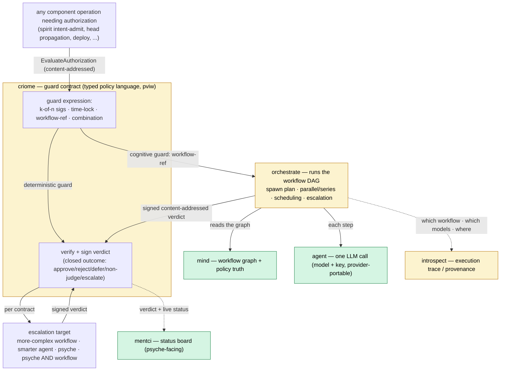

# 723 — Vision: criome as the universal guard substrate; LLM-workflow guards executed by orchestrate

Research + shared-understanding pass on the psyche's vision: *the guardian we
have in spirit should live in criome; criome approvals will be driven by LLM
flows defined as criome contracts; orchestrate executes those workflows
(parallel/series/escalation); every guard can escalate to a more complex
workflow, to the psyche, or to a combination; and the contract carries a
reference to the workflow + which models ran + where, logged somewhere.*

Per the psyche's instruction — *"first, both of you come back to me with your
most important questions after you do some research… explain to me how you see
this so that we're both on the same page"* — this report is the understanding and
the forks. **No intent recorded yet**; I capture once we're aligned (most of this
is already in the log — see §1).

A parse note first, since everything rests on it: I read **"crayon" / "the
Creol"** as **criome** (the contract/authorization component — the psyche calls
it "a contract language… that's what the crayon is for"), and **"Crayon OS"** as
**CriomOS** (the operating system). Confirm in §5.

## 1 — Most of this is already captured

The striking finding: the intent log already holds the core of this vision. The
load-bearing record is `pviw`:

> Per Spirit `pviw` (Decision Medium): [criome is Telos's agreement-and-authorization
> organ (universal agreement machine for authorization)… criome's internal
> language is a limited typed policy language over public-key identity atoms (not
> a general VM; discipline from Ethereum/Tezos/Solana VMs), composing identity
> contracts from k-of-n signature quorums and time-locks with time-varying
> thresholds… Verdicts come from gathered BLS quorum signatures, a connected
> approver over criome's meta socket (mentci is that client), or configured
> auto-approve policy; **contracts escalate to a named adjudicator (mechanical
> quorum, LLM panel, smarter agent, or psyche) whose signed content-addressed
> verdict criome only verifies.** Verdicts are closed typed outcomes
> (approve/reject/defer/non-judge/escalate)… non-judgment is first-class, default
> LLM judge leans abstain+escalate, **psyche is highest-authority lowest-availability**.]

Mapping the psyche's sentences to what's already recorded:

| Psyche's vision (this prompt) | Already captured |
|---|---|
| criome is a contract language; guards bind to signatures / LLM workflows / combinations | `pviw` — typed policy language composing k-of-n quorums + time-locks; verdicts from quorum sigs / connected approver / auto-approve |
| escalate to a more complex LLM workflow, to psyche, or a combination (both must say yes) | `pviw` — "contracts escalate to a named adjudicator (mechanical quorum, **LLM panel**, smarter agent, or **psyche**)"; closed outcomes include `escalate`; psyche highest-authority |
| criome only references/verifies; doesn't itself run the model | `pviw` — "whose signed content-addressed verdict criome only verifies" |
| LLM calls as the execution units, provider-portable | `l0w8` — "LLM calls are computation units… default provider plus ordered fallback chain… authorization that can escalate to Criome"; `f8k7` — agent models providers as config |
| mentci is the psyche-facing approval/status surface | `7x5z` — mentci is the state-bearing programmable UI daemon, the criome-facing approval client |
| deterministic guards are mechanism, LLM-judgment guards are cognition | `w312` — anything with a deterministic answer is mechanism; agents are the cognitive layer for decisions code cannot make |
| the guard runs a strong model; judgment is too important to under-resource | `7mvx` — Spirit's intent guardian runs a strong model |

So the vision is ~70% already-decided intent. What follows is the genuinely-new
or sharpened part.

## 2 — What's genuinely new or sharpened

**(A) The spirit guardian generalizes INTO criome.** Today the guardian — the
LLM admission gate that vets every intent record (`kasm`, `7xnx`, `i59i`,
`7mvx`) — is spirit's own machinery. The psyche's move: *"make everything, the
guardian be the Creol, and start specifying these guards in the Creol."* The
guardian stops being a spirit-specific component and becomes **the first instance
of a general pattern**: a criome contract whose verdict is produced by an LLM
workflow. Spirit's "admit this intent record?" becomes a criome-gated operation
whose contract references a guardian workflow. This is the unifying step `pviw`
doesn't state — `pviw` has criome *verify* an external adjudicator's verdict; (A)
says the guardian pattern itself **is** a criome contract, applicable to every
component's guarded operations, not just spirit's intent gate.

**(B) criome contracts INVOKE LLM workflows, executed by orchestrate — not only
verify externally-produced verdicts.** `pviw` frames the LLM as an external
adjudicator criome merely checks. The psyche sharpens *who runs it*: the criome
contract carries a workflow reference; **criome (or its escalation) hands that
workflow to orchestrate**, which runs it — agents in parallel, series, or a
combination — and returns a signed content-addressed verdict criome verifies. The
research nails down the executor the psyche was unsure about (*"the agent daemon
also needs to execute complex workflows. Or maybe that's orchestrate… it's more
like orchestrate"*):

- **agent** is *one* LLM call — `Call(Prompt)` → one provider HTTPS call → reply. Not a workflow engine. (agent/ARCHITECTURE)
- **orchestrate** already owns, conceptually, "agent-run lifecycle, spawn plans, executor capacity, scheduling, **escalation**" (orchestrate/ARCHITECTURE TL;DR) — it is the natural workflow driver, though today's implemented slice is claims/roles/repos/activities, not a workflow DAG engine.
- **mind** owns "the work graph… durable policy truth" — the natural home for the workflow *definition*.

So the clean decomposition: **mind defines the workflow graph, orchestrate runs
it (dispatching agent steps, parallel/series, handling escalation), agent
executes each LLM step, criome holds the guard contract and verifies the signed
verdict.** This is mostly *assembling existing component roles*, with the net-new
build being orchestrate's workflow-execution engine.

**(C) Provenance is part of the contract.** The psyche: *"that gives us a
reference to the LLM workflow that was used and which models were used… It'll have
a log somewhere in one of the components… that's where the status board should
belong, where it most naturally fits."* New requirement: the verdict carries
**which workflow, which models, where they ran**, and there is a status board.
Location is explicitly left to us (§4 fork 3).

**(D) Process: spirit production pinned by tag, not by tracking main.** *"If
you're working with spirit, then it has a production. So production should be
tagged. Operator can put a tag on things that are actually in production in Crayon
OS and use the tags instead of the main branch, so it can move the main branch
more safely."* This sharpens `88eq` ("a release tags the whole dependency surface
it uses") into: **CriomOS pins spirit production by an operator-applied tag so
main can advance freely; designers demonstrate on feature branches.** This was
addressed primarily to operator — I'll gap-check operator's capture rather than
pre-record (one-capturer rule).

## 3 — How I see it: the proposed shape

The spirit guardian is then **the first guard contract instantiated** on this
substrate — "admit this intent record" is an operation whose criome contract
references the guardian workflow. Everything `kasm`/`7xnx`/`i59i` say about the
guardian (atomic accept/reject, justification-read dimensions, closed rejection
set) becomes the spec for *one* workflow on a general mechanism.

## 4 — The forks (my lean on each)

1. **Does the guardian *move into* criome, or does criome become the guard
   *layer* spirit's guardian plugs into?** My lean: criome owns the guard
   *contracts* and the verify; LLM execution is delegated to orchestrate; the
   spirit guardian becomes one such contract. This matches *"make everything, the
   guardian be the Creol"* while keeping criome auth-only (it verifies, doesn't
   run models — preserving `pviw` and `lt44` "criome auth-only").

2. **Is orchestrate the workflow executor (with mind=graph, agent=step)?** My
   lean: yes — orchestrate drives, agent is the step, mind holds the graph. This
   resolves the psyche's own uncertainty and reuses existing component roles;
   net-new is orchestrate's DAG engine.

3. **Where does provenance + the status board live?** My lean: split by
   ownership — **criome** holds the verdict + contract-reference (the signed
   fact), **introspect** holds the execution trace/provenance (which models,
   where — it is literally a trace; this rides the trace→introspect plane from
   report 716/722), and **mentci** renders the psyche-facing status board (`7x5z`
   — it is the programmable UI daemon). Alternative: one component owns all three.

4. **Scope of the first build.** My lean: re-cast the spirit intent guardian as
   the first criome-contract LLM-workflow guard end-to-end (spirit op → criome
   guard contract → orchestrate runs the guardian workflow via agent → signed
   verdict → criome verifies → mentci shows it), as the concrete pilot. It proves
   the whole substrate on the operation the workspace already trusts most.

## 5 — Questions for the psyche

1. **Parse confirm:** "crayon / the Creol" = criome (the component), "Crayon OS" =
   CriomOS? Everything above assumes this.
2. **Fork 1** above — guardian *into* criome vs criome as the guard *layer*.
3. **Fork 3** above — provenance/status-board home (split criome/introspect/mentci
   vs one owner).
4. **Guardian relocation depth:** does spirit keep running its own guardian until
   the criome substrate exists (guardian-as-criome-contract is the end state we
   migrate toward), or is spirit's guardian retired in favor of the criome path
   in one step? (Pre-production, so one-step is allowed — but the guardian is
   load-bearing for all intent capture, so I'd stage it.)

## 6 — Lane + process notes

- This is designer research; no code yet, per the psyche's converge-first
  instruction. When we align, I demonstrate on a feature branch (mentci/criome/
  orchestrate as needed); operator owns main + the spirit-production tag.
- I'll gap-check operator's Spirit capture of (D) the tagging process rather than
  pre-record it.
- The orchestrate workflow-execution engine is the one substantial net-new build;
  the rest is assembling roles that already exist in intent (`pviw`, `7x5z`,
  `l0w8`, `w312`, orchestrate/agent/mind component shapes).
