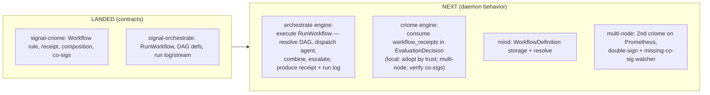

# 725 — Comparison: my `724` design vs operator's landed guard-substrate contracts

The parallel-lane model ran cleanly: I designed the substrate (`724`), operator
carried it to production depth on `signal-criome` main (`9d7a785`/`a7b2f3d`/`7b3d5b2`)
and `signal-orchestrate` main (`4f1e3ff`) — built, `clippy -D warnings` clean,
round-trip tested, pushed — in ~21 minutes. This compares what landed against the
design.

## Verdict

**High fidelity, with three genuine operator improvements and no losses.** Every
type from `724` landed, named as designed; operator completed the parts I left as
sketches (subscription lifecycle, typed step outcomes) and *factored out one
redundancy in my design*. There is nothing to reconcile or push back on. I will
**not** build duplicate feature branches — the contracts are done; my next move is
the daemon-behavior phase (§5).

## signal-criome — fidelity table

| `724` design | Landed on main | Assessment |
|---|---|---|
| `(Workflow WorkflowGuard)` rule | `(Workflow WorkflowGuard)` | exact |
| `WorkflowGuard { workflow executor.Identity }` | identical | exact |
| `Composition [AllOf AnyOf Threshold Escalate WorkflowStep Signature]` | identical | exact |
| (Composition only as verdict-composition) | **also `(Composition Composition)` as a first-class `Rule` variant** | **improvement** — a contract can *be* a composition tree |
| `EvaluationDecision` + Deferred/NonJudgement/Escalate | identical | exact |
| `EscalationTarget [Psyche Workflow SmarterAgent **All Any**]` | `[Psyche (Workflow ...) (SmarterAgent ...)]` — **All/Any dropped** | **improvement** — see §4 |
| `WorkflowReceipt { workflow operation outcome provenance }` (no signature) | identical | exact (two-planes receipt) |
| `ObjectCoSignature`, `CoSignatureExpectation` | identical | exact |
| Evidence carries receipts + co-signatures | `workflow_receipts`, `object_co_signatures` added to `Evidence` | exact |

Plus `a7b2f3d` modernized field wrappers to lowercase (`members`, `authorities`,
`time_signatures`) — cosmetic consistency, not a design change.

## signal-orchestrate — fidelity table

| `724` design | Landed on main | Assessment |
|---|---|---|
| `(RunWorkflow WorkflowRunRequest)` | identical | exact |
| `(ObserveWorkflowRun … opens WorkflowRunStream)` | identical, **+ `WorkflowRunObservationRetraction`** | improvement — full sub lifecycle |
| `WorkflowRunRequest { workflow operation contract }` | identical | exact |
| `WorkflowRunHandle`, `WorkflowRunLog`, `StepLog` | identical | exact |
| `ModelAttestation { provider model host call }` | identical | exact — "where it ran" preserved |
| `WorkflowDefinition { steps combination escalation }` | identical | exact |
| `WorkflowStep { name prompt provider dependencies }` | identical (`prompt.ObjectDigest` vs my `PromptTemplateDigest`) | exact (naming nit) |
| `CombinationRule [(Threshold …) Unanimous AnyApprove]` | identical | exact |
| vague `StepOutcome` | `[(Produced EvaluationDecision) (Failed ScopeReason)]` | **improvement** — typed |
| (sketch) "opens WorkflowRunStream" | full `WorkflowRunSnapshot`/`Opened`/`Closed`/`Update`/`Event`/`Stream` | improvement — complete stream contract |
| "cross-imported from signal-criome" | mirrors signal-criome nouns with a "source of truth remains signal-criome" note | exact, well-documented |

## The one design call worth noting (§4)

My `724` put combination operators in **two** places: `Composition [AllOf AnyOf …]`
*and* `EscalationTarget [… All Any]`. Operator removed `All`/`Any` from
`EscalationTarget`, leaving it as pure leaf adjudicators `[Psyche Workflow
SmarterAgent]`, and kept all combination in `Composition`. **This is better** — it
removes the redundancy. Nothing is lost: "psyche AND a bigger workflow" is still
expressible as a `Composition (AllOf [c1 c2])` whose members are
`(Escalate Psyche)` and `(Escalate (Workflow w))`. One algebra for combination,
one set of leaves for adjudication. I'd have caught this in review; operator caught
it in the build. Worth absorbing as a design lesson: don't duplicate a combinator
across two enums when one can reference the other.

## What is designed but NOT yet built (§5 — the next phase)

Operator correctly flagged the boundary: **the contracts are done; the daemon
behavior is not.** From the `724` build plan, the runtime work remaining:

| Piece | Owner | Size |
|---|---|---|
| orchestrate engine executes `RunWorkflow` (the DAG runner) | operator (depth) / designer (shape) | large |
| criome engine consumes `WorkflowReceipt` in evaluation | operator | medium |
| mind stores/resolves `WorkflowDefinition` | operator | medium |
| second criome on Prometheus + double-sign + watcher | system-operator / cluster-operator | medium (deploy) |
| agent | — (unchanged) | none |
| introspect trace events + mentci status board | designer shape / operator | small |

## Designer next step

The contracts being landed, the highest-value designer artifact next is the
**orchestrate workflow-execution engine shape** — the nexus/sema plane design for
the DAG runner (resolve definition → topological agent dispatch → combine via
`CombinationRule` → escalate → sign receipt), since that is the large greenfield
piece. The criome receipt-consumption and the multi-node watcher follow. The
local plane (real grants/verdicts, non-blocking, traced) lands before spirit is
flipped to blocking Gating (per the agreed staging).
