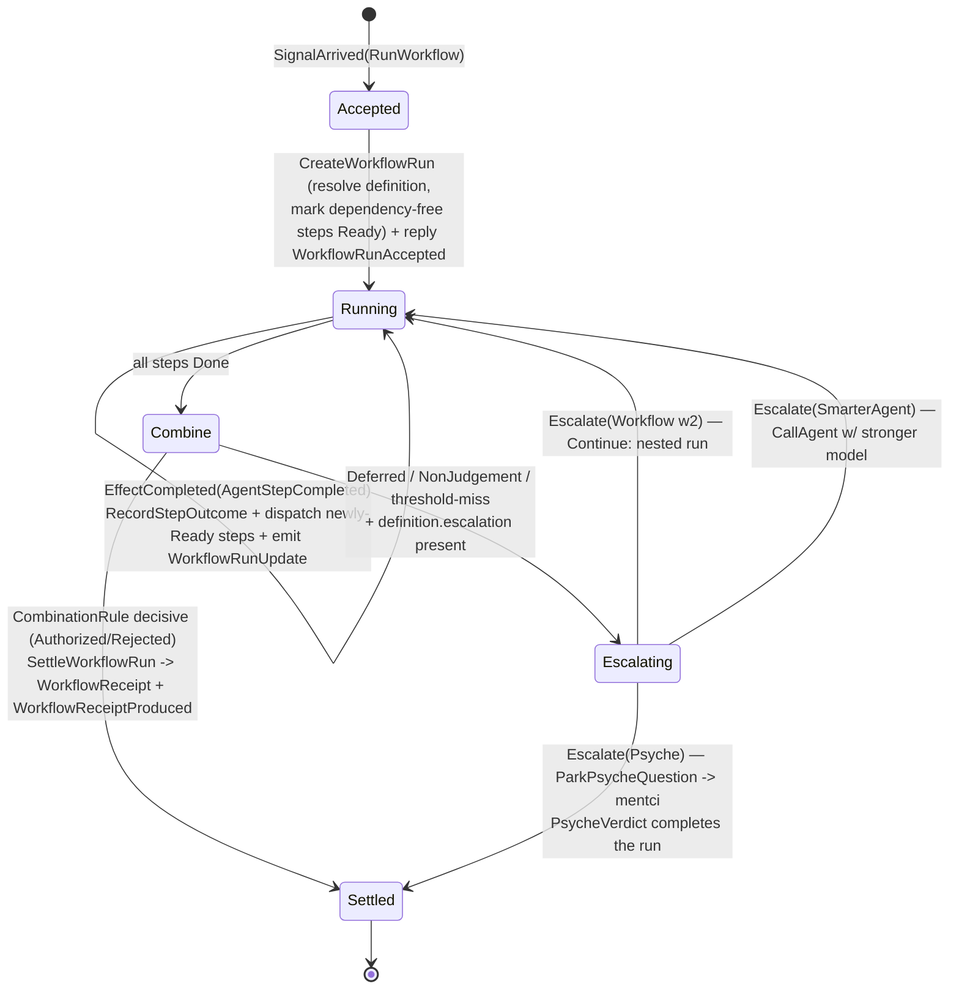

# 726 — Design: the orchestrate workflow-execution engine

The large greenfield runtime piece behind the guard substrate (`m3ms`, contracts
landed per `724`/`725`). This is the designer shape — the nexus/sema plane design
and the engine loop — for operator to carry to production depth. It ends with the
thin end-to-end proof recipe (the agreed first integration, `725` addendum Q4).

## The one enabling change: orchestrate gains an effect plane

orchestrate's current nexus is **state-only** — `NexusAction [CommandSemaRead
CommandSemaWrite ReplyToSignal Continue]`, `NexusWork [SignalArrived
SemaReadCompleted SemaWriteCompleted]`. There is **no `CommandEffect`**. To run a
workflow, orchestrate must call *out* to the agent component (and later mind and
mentci) — an async cross-component Signal call. So the enabling change mirrors
agent's own pattern exactly (agent has `CommandEffect(CallProvider)`):

```nota
;; orchestrate/schema/nexus.schema — ADD
NexusWork   [ ... (EffectCompleted EffectCompleted) ]
NexusAction [ ... (CommandEffect CommandEffect) ]

CommandEffect   EffectInput
EffectCompleted EffectOutput

EffectInput [
  (CallAgent AgentStepCall)              ;; -> signal-agent Call(Prompt)
  (ResolveDefinition WorkflowDigest)     ;; -> mind (bootstrap: local fixture)
  (ParkPsycheQuestion PsycheEscalation)  ;; -> mentci (psyche escalation)
]
EffectOutput [
  (AgentStepCompleted AgentStepResult)
  (DefinitionResolved WorkflowDefinition)
  (PsycheVerdict EvaluationDecision)
]
AgentStepCall   { step.WorkflowStepName prompt.signal-agent:lib:Prompt }
AgentStepResult { step.WorkflowStepName outcome.StepOutcome attestation.ModelAttestation }
```

This makes orchestrate a **client of agent** — exactly `zjmc`'s "cross-component
invocation via Signal contracts" and the `Interact` trait (async outbound query).
The agent HTTPS call stays inside agent (its `CallProvider` effect); orchestrate's
effect is the agent *Signal* call, awaited off the mailbox — no blocking in the
handler (`actor-systems.md`).

agent's contract is already built for this: `Prompt.PromptOptions` carries
`OutputMode::Nota` (the model emits one typed NOTA expression — a guard step
returns an `EvaluationDecision` directly, validated + retried by agent),
`ReasoningEffort::High`, and `ThinkingMode::Enabled`. signal-agent's own comment
names the consumer: *"A deliberate judge — the Spirit guardian — asks for thinking
enabled at high effort."* So a guard step = `agent::Call` with `OutputMode::Nota`,
high effort, thinking on; the completion parses to the step's `EvaluationDecision`.

## The run state (SEMA)

The workflow run is durable orchestrate state (so it self-resumes on restart —
the daemon hard-override):

```nota
;; orchestrate/schema/sema.schema — ADD
SemaWriteInput [ ... (CreateWorkflowRun CreateWorkflowRun)
                     (RecordStepOutcome RecordStepOutcome)
                     (SettleWorkflowRun SettleWorkflowRun) ]
SemaReadInput  [ ... (ReadWorkflowRun WorkflowRunDigest) ]

StepState        [ Pending Ready Dispatched (Done StepOutcome) ]
WorkflowRunStatus [ Running (Escalating EscalationTarget) (Settled WorkflowReceipt) ]
WorkflowRunRecord {
  handle.WorkflowRunHandle
  definition.WorkflowDefinition
  operation.AuthorizedObjectReference
  contract.ContractDigest
  StepStates.(Vector StepStateEntry)   ;; per-step state
  StepLogs.(Vector StepLog)            ;; the LLM logs (ModelAttestation per step)
  status.WorkflowRunStatus
}
```

## The engine loop

`OrchestrateNexusEngine::decide` (a method on the data-bearing engine, per the
method-only rule) drives a SEMA-state machine off `EffectCompleted` events:



Step transitions in words:

- **SignalArrived(RunWorkflow):** `CommandSemaWrite(CreateWorkflowRun)` (resolve
  `WorkflowDefinition`, mark dependency-free steps `Ready`); `ReplyToSignal(
  WorkflowRunAccepted(handle))` immediately — the run is async, observers watch
  `WorkflowRunStream`; then `CommandEffect(CallAgent)` per `Ready` step (independent
  steps fan out in parallel; dependents wait — the DAG = `WorkflowStep.dependencies`).
- **EffectCompleted(AgentStepCompleted S):** parse the step's `StepOutcome`
  (`OutputMode::Nota` → `(Produced EvaluationDecision)`, or `(Failed …)`);
  `CommandSemaWrite(RecordStepOutcome)` with the `StepLog` (`ModelAttestation`:
  provider/model/host/call); emit `WorkflowRunUpdate`; `CommandEffect(CallAgent)`
  for steps whose deps are now all `Done`.
- **All steps Done:** apply `CombinationRule` (`Threshold`/`Unanimous`/`AnyApprove`)
  over the step outcomes → the workflow `EvaluationDecision`.
  - decisive → `SettleWorkflowRun` builds the `WorkflowReceipt` (see below) and
    emits `WorkflowReceiptProduced`.
  - `Deferred`/`NonJudgement`/threshold-miss with `definition.escalation` →
    `Escalating`: `Escalate(Workflow w2)` recurses (`Continue` → a nested run),
    `Escalate(SmarterAgent)` re-dispatches with a stronger model/effort,
    `Escalate(Psyche)` parks a question on mentci and settles when the
    `PsycheVerdict` returns (the run is long-lived).

## The receipt (local plane — unsigned, trusted)

On settle, orchestrate builds the **local-plane** artifact from `725`/`ic4o`:

```nota
WorkflowReceipt {
  workflow.WorkflowDigest
  operation.OperationDigest
  outcome.EvaluationDecision
  provenance.WorkflowProvenanceDigest   ;; digest of the persisted WorkflowRunLog
}
```

No signature — the local execution chamber is trusted (`ic4o`). The provenance
digest addresses the run log (which models, where), held in orchestrate. criome
adopts the receipt's `outcome` by trust when it appears in `Evidence`. The
multi-node co-signature (`ObjectCoSignature`) is the separate quorum plane,
deferred.

## Definition resolution

Target: `CommandEffect(ResolveDefinition w)` → mind (source of truth, `725` Q3).
Bootstrap (no mind slice yet): the definition is carried in the run request or a
local fixture; `ResolveDefinition` returns it from orchestrate-local storage. The
effect variant exists from day one so the mind cutover is a backend swap, not a
contract change.

## The thin end-to-end proof (first integration — `725` Q4)

Offline, non-blocking, one step:

1. A one-step `WorkflowDefinition` — step `guardian`, `CombinationRule::Unanimous`,
   no escalation.
2. agent runs with its `FixtureProvider` (built-in, no network, no key) returning
   a `Nota` completion that parses to `Authorized`.
3. `orchestrate RunWorkflow(def, operation, contract)` → `CallAgent(guardian)` →
   `AgentStepCompleted(Produced Authorized)` → `CombinationRule` → `WorkflowReceipt(
   Authorized)` + run log.
4. Feed the receipt as `Evidence.workflow_receipts` to criome
   `EvaluateAuthorization` on a `(Workflow w)` contract → criome adopts → `Authorized`.
5. Negative path: same evaluation with no receipt → criome returns
   `(Escalate (Workflow w))`.

This proves produce → adopt and escalate-when-absent across the whole local seam
with no live provider and no blocking — the foundation before spirit is flipped to
blocking Gating.

## Build order for operator

1. orchestrate nexus effect plane (`CommandEffect`/`EffectCompleted` + `CallAgent`)
   — the enabling change; agent client wiring.
2. orchestrate SEMA run record + the `decide` state machine (single-step first).
3. The thin end-to-end proof (fixture agent → receipt → criome eval) as the
   integration witness.
4. Multi-step DAG (parallel/series via `dependencies`), `CombinationRule`,
   escalation (workflow/agent/psyche).
5. mind cutover for `ResolveDefinition`; criome receipt-consumption in its real
   evaluation; then the multi-node co-signature plane.

## Discipline notes

- The agent call is an **async effect** off the engine mailbox, never a blocking
  await in a handler (`actor-systems.md`; mirrors agent's `CallProvider`).
- `decide`/`run_effect` are methods on the data-bearing `OrchestrateNexusEngine`
  (method-only rule); step-outcome parsing is `impl TryFrom<Completion> for
  StepOutcome`, not a free helper.
- The run is durable SEMA → the daemon self-resumes mid-run on restart (the
  hard-override the `722` audit found mentci/criome violating — build it right here
  from the start).
