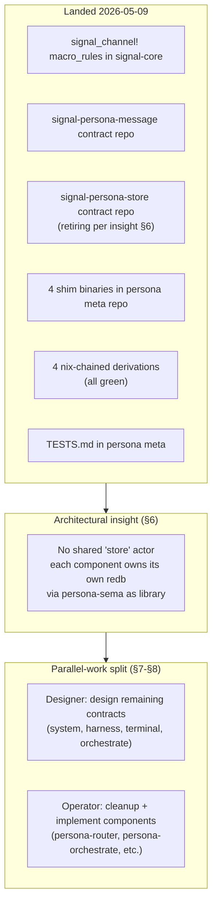
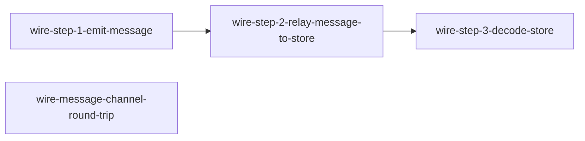
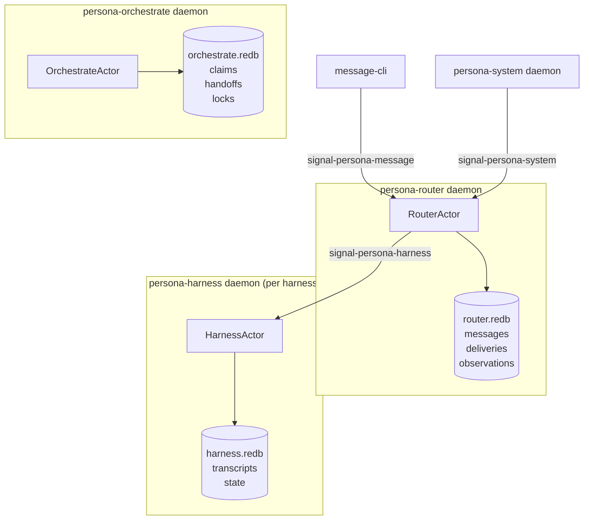

# 76 · `signal_channel!` macro implementation + parallel-work proposal

> **STATUS as of 2026-05-08:** Snapshot — superseded.
> The macro shipped and earns its place; `signal-persona-store`
> retired (per operator/77 + designer/78). Parallel plan
> superseded by:
> - `reports/designer/78-convergence-with-operator-77.md`
> - `reports/designer/81-three-agent-orchestration-with-assistant-role.md`
> - `reports/designer/86-handoff-from-context-reset-2026-05-08.md` (current index)
>
> Note: this report records 3 commit-bundling races that
> bit me — load-bearing lesson preserved here.

Status: detailed exposé of the work that landed
2026-05-09 (the `signal_channel!` macro_rules!, two
contract repos, four wire-test shim binaries, four
nix-chained derivations) plus the choreography proposal
for designer + operator to start working in parallel on
the messaging stack.

This report is the trigger for both: (1) operator's
counter-proposal (which work to take first), and
(2) designer's continued contract-design work in parallel.

Author: Claude (designer)

---

## 0 · TL;DR



| | Count |
|---|---:|
| New repos created on GitHub | 2 (`signal-persona-message`, `signal-persona-store`) |
| Macro tests passing | 6 in signal-core |
| Round-trip tests passing | 7 + 6 in the contract repos |
| Nix-chained derivations passing | 4 in persona meta |
| Total architectural-truth witnesses landed | 23 |
| Channel inventory (post-§6) | 4 (was 5) |

---

## 1 · The `signal_channel!` macro

### 1.1 · Where it lives

**`signal-core/src/channel.rs`** — declarative
(`macro_rules!`), `#[macro_export]`-ed, importable as
`signal_core::signal_channel`.

### 1.2 · The shape

```rust
signal_channel! {
    request MessageRequest {
        Submit(SubmitMessage),
        Inbox(InboxQuery),
    }
    reply MessageReply {
        SubmitOk(SubmitReceipt),
        SubmitFailed(SubmitFailed),
        InboxResult(InboxResult),
    }
}
```

That single block is the entire channel declaration. The
macro emits:

| Emission | Kind |
|---|---|
| `pub enum MessageRequest { … }` | request enum with rkyv `Archive`/`Serialize`/`Deserialize` + `Debug + Clone + PartialEq + Eq` |
| `pub enum MessageReply { … }` | reply enum, same derives |
| `pub type Frame = signal_core::Frame<MessageRequest, MessageReply>` | channel-specific Frame alias |
| `pub type FrameBody = signal_core::FrameBody<MessageRequest, MessageReply>` | body alias |
| `impl From<SubmitMessage> for MessageRequest` per request variant | idiomatic conversions |
| `impl From<SubmitReceipt> for MessageReply` per reply variant | same for replies |

### 1.3 · Why declarative not procedural

The `signal-derive` crate (proc-macro) was considered first
(per `~/primary/reports/designer/73-signal-derive-research.md`).
Verdict: the per-channel boilerplate is small enough that
a `macro_rules!` declarative form (~60 LoC of macro) is
sufficient and easier to evolve. Procedural macros add
`syn`/`quote`/error-reporting overhead with little payoff
when the boilerplate has well-understood shape.

The user's pushback (the "wait for 3 uses" rule applies to
proc-macros + external APIs, not to internal
`macro_rules!`) was correct — the macro landed at channel 1,
not channel 3.

### 1.4 · `FrameEnvelopable` was attempted + dropped

The audit in designer/73 §3.2 proposed a `FrameEnvelopable`
marker trait + blanket impl to collapse the rkyv bound
chain at function signatures. **It doesn't work in stable
Rust.** Trait `where`-clauses on associated types
(`Self::Archived: Bound`) are not propagated as implied
bounds at use sites; consumers still have to repeat the
bounds. Removed honestly rather than ship a non-functional
API. Documented in the commit message + the test file
header.

What this means in practice: when consumers write a
function that takes a generic `Frame<R, P>` and calls
`encode_length_prefixed`/`decode_length_prefixed`, they
still repeat the rkyv bound chain. Rare in practice
(consumers usually have concrete types), but worth knowing.

### 1.5 · Tests

`signal-core/tests/channel_macro.rs` — 6 tests:

```text
macro_emits_request_enum_with_variants
macro_emits_reply_enum_with_variants
macro_emits_frame_type_alias
macro_emits_from_impls_for_request_variants
macro_emits_from_impls_for_reply_variants
channel_frame_round_trips_through_length_prefix
```

All pass. The macro-emitted types satisfy rkyv's bound
chain (the channel-frame round-trip test is the witness:
encode_length_prefixed → bytes → decode_length_prefixed →
typed value, with assert_eq).

---

## 2 · The two contract repos

### 2.1 · `signal-persona-message`

| Property | Value |
|---|---|
| Channel | `message-cli` → `persona-router` |
| Records (request) | `Submit(SubmitMessage)`, `Inbox(InboxQuery)` |
| Records (reply) | `SubmitOk(SubmitReceipt)`, `SubmitFailed`, `InboxResult` |
| Round-trip tests | 7 |
| Nix flake checks | 7 (build, test, test-round-trip, test-doc, doc, fmt, clippy) |

The lib.rs shows the macro invocation as the public
interface. Reading it tells you exactly what messages flow
through this channel.

### 2.2 · `signal-persona-store` — RETIRING per §6

| Property | Value |
|---|---|
| Created | yes, on GitHub |
| Status | **retire** — per the user's challenge in §6 |

Created in the same session, then revealed as
over-specification when the user asked "what store
operations?" and I had to admit there's no coherent "store"
abstraction. See §6 for the insight + the cleanup task.

### 2.3 · Repo structure (template for future contracts)

Each contract repo has the same shape:

```
signal-persona-<channel>/
├── AGENTS.md              shim → @~/primary/AGENTS.md
├── ARCHITECTURE.md        channel role + boundaries
├── CLAUDE.md              shim → @AGENTS.md
├── Cargo.toml             deps: signal-core, rkyv, thiserror
├── README.md              quick reference + see-also
├── flake.nix              elaborate (7 nix checks)
├── flake.lock
├── rust-toolchain.toml    stable + clippy + rustfmt + rust-src
├── skills.md              per-repo agent guide w/ checkpoint-read
├── src/
│   └── lib.rs             payload types + signal_channel! invocation
└── tests/
    └── round_trip.rs      per-variant wire-form round trips
```

This is the canonical shape future channel contracts
follow. ~80 LoC across the boilerplate; the macro keeps
lib.rs short.

### 2.4 · The 7-check elaborate flake

Each contract repo's `nix flake check` runs:

| Check | What |
|---|---|
| `build` | Library compiles |
| `test` | `cargo test` (all targets) |
| `test-round-trip` | `cargo test --test round_trip` (named) |
| `test-doc` | `cargo test --doc` |
| `doc` | `cargo doc` with `RUSTDOCFLAGS=-D warnings` (broken intra-doc links fail) |
| `fmt` | `cargo fmt --check` |
| `clippy` | `cargo clippy --all-targets -- -D warnings` |

Per `~/primary/skills/nix-discipline.md` §"`nix flake check`
is the canonical pre-commit runner".

---

## 3 · The wire-test shim binaries

In `persona/src/bin/`:

| Binary | Job |
|---|---|
| `wire-emit-message` | Construct `Frame::Request(Submit(SubmitMessage { recipient, body }))`; encode length-prefixed; write to stdout |
| `wire-decode-message` | Read length-prefixed bytes from stdin; decode as `Frame`; assert recipient + body match `--expect-*` args |
| `wire-relay-message-to-store` | Read message Frame from stdin; transform inner `SubmitMessage` to `signal-persona-store::CommitMessage` adding `--sender`; emit new Frame on stdout |
| `wire-decode-store` | Read store Frame from stdin; assert recipient + sender + body match |

Each shim is tight (~30-70 LoC). They do one
encode-or-decode and exit. The architectural-truth
witnesses come from the chaining, not from inside the shim.

The `wire-relay-message-to-store` shim is the
*router-shaped* step — it represents what the router does
when it receives a message-channel frame. **It's a
stand-in.** The real router is a ractor actor with state;
the relay shim is stateless. Per §5 (gaps), the actual
router doesn't exist yet.

---

## 4 · The four nix-chained derivations

In `persona/flake.nix#checks`:



Each step is an isolated Nix derivation. The output of step
1 is the *only* path to step 2; the output of step 2 is the
*only* path to step 3. Per `skills/architectural-truth-tests.md`
§"Nix-chained tests — the strongest witness":

- The writer's output is content-addressed
  (`/nix/store/<hash>-wire-step-1-emit-message`); any byte
  change shifts the hash, surfacing drift as a hash
  mismatch rather than a flaky equality test.
- The reader is a separate binary; can't be tricked by the
  writer's mock.
- No shared memory; no shared `tmpfs` collusion.

What each derivation specifically proves:

| Derivation | Witness |
|---|---|
| `wire-step-1-emit-message` | The macro-emitted `MessageRequest::Submit` constructor exists; `Frame::encode_length_prefixed` produces real (non-empty) bytes |
| `wire-step-2-relay-message-to-store` | Two Signal channels can be bridged: decode a frame from channel A, transform, encode a new frame for channel B. Both channels' macros work. |
| `wire-step-3-decode-store` | The 3-step chain preserves the user's intent (recipient + body) and adds the router-supplied sender. End-to-end Signal wire integrity. |
| `wire-message-channel-round-trip` | Single-channel sanity (independent of the relay): emit + decode round-trips on one channel. |

`nix flake check` runs all 4 (plus the 4 standard checks
on the other persona-* components, totaling 8 checks).
**All 8 green.**

`persona/TESTS.md` documents this fixture — the
test-architecture document the user requested.

---

## 5 · Gaps + future-crazier extensions

What the current wire-test does NOT do (honest list):

### 5.1 · Doesn't exercise real components

- **No `persona-router` daemon.** The relay shim is a
  stand-in for what the router will do. The router is
  unimplemented (`primary-186` for ractor refactor;
  `primary-2w6` for off-polling).
- **No `persona-sema` write.** The chain is wire-only;
  bytes flow but no redb file gets touched. Adding a
  `persona-sema-write-shim` derivation that takes the store
  Frame and commits to a redb (output: `state.redb`) would
  prove the storage path. Then a `persona-sema-read-shim`
  derivation reads the redb and asserts content. **THIS IS
  THE STRONGEST EXTENSION** — it's the database witness
  the architectural-truth-tests skill specifically calls
  out (§"Nix-chained tests").
- **No `persona-orchestrate` involvement.** Once
  persona-orchestrate is the state actor (per §6), the
  chain extends through it.

### 5.2 · Doesn't test failure paths

- **Corrupted bytes.** What happens if the wire bytes are
  flipped/truncated? bytecheck should catch it; the test
  doesn't fire that path. A `wire-corrupt-message` derivation
  that writes garbage bytes + an updated decoder shim that
  asserts the failure mode is `Err(FrameError::ArchiveValidation)`.
- **Schema-version mismatch.** Per
  `signal-core/src/version.rs`, the kernel has a protocol
  version. If a test channel encodes one version + decoder
  expects another, what happens? Untested.
- **Wrong variant.** `wire-decode-message --expect-recipient
  X` works for a `Submit(...)`; what about a `Inbox(...)`?
  The decoder panics with "wrong variant", which is fine
  but untested as the deliberate failure path.

### 5.3 · Doesn't test concurrency

- **Multiple concurrent senders.** Real router handles many
  Submit frames in parallel. The chain is sequential. A
  `wire-concurrent-senders` derivation could spawn N
  emitter shims in parallel + verify all bytes are well-
  formed.
- **Out-of-order delivery.** If frames arrive in shuffled
  order, the receiver should still process them by frame
  contents not by socket order. Untested.
- **Stream cutoff.** What if the writer terminates
  mid-frame? Reader should error cleanly. Untested.

### 5.4 · Doesn't test real transport

- **TCP/UDS sockets.** All chaining is via shell pipes
  (stdout → stdin). Real persona-router uses UDS. A
  `wire-uds-round-trip` derivation could spawn a small UDS
  server in one nix step + a client in another. (Trickier
  in nix's pure environment but doable with `nixos-test`
  framework.)
- **Cross-machine.** `signal-network` (`primary-uea`) is the
  design task; no implementation. The bytes are
  network-passable per `encode_length_prefixed`'s shape;
  what's untested is handshake + auth + back-pressure
  across machines.
- **Length-prefix edge cases.** What if the length prefix
  says 1000 bytes but only 500 arrive? Untested.

### 5.5 · Doesn't test the macro's edge cases

- **Generic payloads.** `signal_channel! { request Foo {
  Submit(SubmitMessage<T>) } reply ... }` — does the macro
  handle generics in payload types? Untested. Likely
  doesn't (declarative macros are limited here).
- **Doc comments on variants.** Do `/// docs` on variants
  survive the macro emission? My current macro doesn't
  preserve attributes; needs `$( $(#[$attr:meta])* )*`
  patterns. Untested.
- **Empty channels.** `signal_channel! { request Foo { }
  reply Bar { } }` — does the macro emit valid empty
  enums? Untested; would emit `pub enum Foo {}` (empty
  enum, never-instantiable). Behavior unverified.
- **Single-variant channels.** Common case of "one
  request, one reply" — verified (the message channel is
  multi-variant).

### 5.6 · Doesn't test handshake or auth

- The kernel has `HandshakeRequest` / `HandshakeReply` /
  `AuthProof` / `LocalOperatorProof` types. None of the
  shims emit handshake frames. The first thing a real
  client does is send a `FrameBody::HandshakeRequest`;
  the test skips this entirely.
- A `wire-handshake-then-operation` derivation would emit
  handshake-then-Submit and verify both decode in order.

### 5.7 · Doesn't test the no-polling discipline

- Per `~/primary/skills/push-not-pull.md`, the router
  shouldn't poll — it should react to pushed events. A
  `tokio-test`-clock-paused test would prove "zero work
  during paused time." The shims are non-async; can't
  exercise this. The real router (when it lands) needs
  this witness.

### 5.8 · Things I haven't thought about

- **What happens to bytes if compiled with different rkyv
  feature flags?** Per `~/primary/repos/lore/rust/rkyv.md`,
  rkyv silently produces incompatible archives across
  feature variations. The contract repos pin the canonical
  set in their Cargo.toml; the test doesn't verify compile-
  time enforcement of this across the consumer chain.
- **Endianness.** Length prefix is `to_be_bytes` (big-
  endian per `signal-core/src/frame.rs:75`). What if the
  reader machine is little-endian? Should work because
  rkyv's `little_endian` feature is the canonical set, and
  length is BE explicitly. Untested across machines.
- **Macro hygiene.** My macro emits names like `Frame` and
  `FrameBody` in the consumer's namespace. If the consumer
  has its own `Frame`, that's a collision (already noted
  in the macro tests). I haven't tested what error message
  the user sees when this happens.

---

## 6 · The architectural insight — each component owns its state

The user's question — *"do we need a separate persona-store?
wouldnt that just be the database used in persona-orchestrate?"*
— surfaced a real over-specification.

### 6.1 · The wrong mental model I was using

I had drawn:

```
persona-router → signal-persona-store → persona-store-actor → persona-sema (library) → redb file
```

…with `persona-store-actor` as a separate component owning
the redb. Three problems:

1. **Why is "store" a coherent concept?** Per the user's
   follow-up: what ARE store operations? Looking at the
   actual contract content: `CommitMessage`, `ReadInbox`.
   Those are message-write and message-read, not abstract
   store ops.
2. **Why a separate actor?** Per `~/primary/skills/rust-discipline.md`
   §"One redb file per component", each stateful component
   owns ITS OWN redb. Not a shared one. Splitting "store"
   into a separate component violates this.
3. **What's the actual ownership?** Each daemon IS a
   meta-actor (per the user's framing — "lasting state
   machine, essentially a meta actor, a process actor
   which has internal actors of its own"). It owns its
   state because it IS the process. No shared store.

### 6.2 · The right mental model

Each Persona component is one daemon = one process = one
meta-actor with its own redb file:



- Each daemon owns its redb via `persona-sema` as a library
- No `persona-store-actor`; no `signal-persona-store`
- Inter-daemon communication is per-domain channels:
  message ops, system observations, harness delivery —
  each its own contract
- `persona-orchestrate` is the most important state-bearer
  because workspace-coordination state is the most
  cross-cutting; but it's not "the store" — it's just
  another daemon with its own redb

### 6.3 · Implications for the contract count

`~/primary/reports/designer/72-harmonized-implementation-plan.md`
§2.1 listed 5 channels including `signal-persona-store`.
Updated count: **4 channels**:

| Contract | Producer → Consumer |
|---|---|
| `signal-persona-message` | message-cli → persona-router |
| `signal-persona-system` | persona-system → persona-router |
| `signal-persona-harness` | persona-router ↔ persona-harness |
| `signal-persona-terminal` | persona-harness → persona-wezterm |
| ~~`signal-persona-store`~~ | retired |

Future fifth: **`signal-persona-orchestrate`** (agents →
persona-orchestrate for claim/release ops). That one
genuinely needs a contract because multiple agent processes
talk to one orchestrate daemon.

### 6.4 · Why `persona-orchestrate` is the most important store

Workspace coordination state outlives any single daemon
restart. Other daemons (router, harness) can be torn down
and rebuilt; their state is restorable from upstream
sources. But workspace-claim state — *who is editing what
right now* — is authoritative; if it's lost, parallel
agents collide.

So persona-orchestrate gets the "load-bearing redb" — but
that doesn't make it "the store." It's just one component
with particularly important state.

---

## 7 · Choreography proposal — designer + operator in parallel

### 7.1 · Designer's lane (me)

I'm best positioned to design contracts because of context
breadth — I can survey signal-persona, the existing
records, the channel-pair shape, and propose contracts
that compose cleanly.

**Designer's first batch:**

1. **Update `designer/72` §2** with the 4-channel shape
   (drop signal-persona-store; note signal-persona-orchestrate
   as eventual fifth).
2. **Design + ship `signal-persona-system`** — focus +
   prompt buffer observations from persona-system to
   persona-router. This drives the safety property
   operator/67 cares about.
3. **Design + ship `signal-persona-harness`** — router ↔
   harness delivery + observation events. The bidirectional
   case; tests our macro on a back-and-forth pattern.
4. **Design + ship `signal-persona-orchestrate`** — agents →
   orchestrate for claim/release ops. The first contract
   for the load-bearing state daemon.
5. **Update wire-test in persona meta** as new contracts
   land — extend the nix-chained chain.

### 7.2 · Operator's lane

Operator is best positioned to **implement** because of
familiarity with the persona-* runtime crates, ractor,
sema, and the actual workflow.

**Operator's first batch (proposed):**

#### Task 1 — cleanup of signal-persona-store (1-2 hours)

The user offered this as operator's first task:
> "Maybe you can give this as the first task to the
> operator while you're gonna be working on, I guess,
> developing the contracts."

Concrete steps:

a. `gh repo delete LiGoldragon/signal-persona-store --yes`
b. Remove `signal-persona-store` from
   `persona/Cargo.toml` deps + `[[bin]]` entries for
   `wire-relay-message-to-store` + `wire-decode-store`
c. `rm persona/src/bin/wire_relay_message_to_store.rs`
   `persona/src/bin/wire_decode_store.rs`
d. Remove the 3 nix derivations from
   `persona/flake.nix#checks`
   (`wire-step-1-emit-message`,
   `wire-step-2-relay-message-to-store`,
   `wire-step-3-decode-store`) — keep only
   `wire-message-channel-round-trip`
e. Update `persona/TESTS.md` to reflect the simplification
f. `nix flake check` passes
g. Commit + push

Status report: `reports/operator/<N>-signal-persona-store-cleanup.md`

#### Task 2 — implement persona-router as ractor + persona-sema-backed (2-3 days)

Per `~/primary/reports/designer/72-harmonized-implementation-plan.md`
Phases 3a + 5; primary-186 + primary-2w6.

a. Refactor `persona-router/src/router.rs::RouterActor`
   from plain struct to `ractor::Actor`
b. Add `persona-router/src/store.rs` that uses
   `persona-sema` library to manage router-owned redb
   (messages, deliveries tables)
c. Replace `persona-message/src/store.rs`'s 200ms polling
   tail with push delivery from the router
d. Rewrite `persona-message`'s CLI to emit Signal frames
   via `signal-persona-message`
e. Architectural-truth tests per `skills/architectural-truth-tests.md`:
   - `router_cannot_deliver_without_store_commit`
   - `message_cli_cannot_write_private_message_log`
   - `router_cannot_import_terminal_adapter`

Status report: `reports/operator/<N>-persona-router-ractor.md`

#### Task 3 — implement persona-orchestrate's first slice (1-2 days)

Per `designer/64` §4 — atomic claim-and-overlap-check.

a. Add `persona-orchestrate/src/store.rs` using
   `persona-sema` library
b. Define typed Tables for claims, claim_log, tasks
c. Implement `claim`, `release`, `current` operations
d. Architectural-truth: `claim_overlap_atomic_or_rejected`
   (typed event trace witness)

Status report: `reports/operator/<N>-persona-orchestrate-first-slice.md`

### 7.3 · The choreography mechanism

```mermaid
sequenceDiagram
    participant D as Designer
    participant C as Contract repo
    participant O as Operator
    participant R as reports/

    D->>C: design + push contract
    D->>R: file designer/<N>-channel-N-design.md
    O->>R: read designer's report
    O->>C: pull contract; implement consumer side
    O->>R: file operator/<N>-channel-N-implementation.md
    D->>R: read operator's report
    D->>C: refine contract if implementation surfaced gaps
```

The reports + the contract repos + the BEADS inventory
are the shared state. The orchestration claim flow keeps
us non-overlapping.

### 7.4 · Counter-proposal mechanism

After this report lands, **operator files
`reports/operator/<N>-counter-plan.md`** with their take:
- Which task they want first
- Disagreements with the lane split
- Additional tasks I missed
- Adjustments to the contract priority order

We converge in chat or via a follow-up designer report.
**Phase 0 of the contract work begins after we agree.**

### 7.5 · Why this ordering

- **Designer goes first on signal-persona-system** because
  the safety property is the highest-pain-point work
  operator/67 surfaced. Operator can start implementing
  the message channel (task 2) while designer designs the
  system channel.
- **Operator's task 1 is mechanical** — cleanup. Frees them
  immediately to start task 2.
- **Operator's task 2 (router) is the longest** — 2-3 days.
  Designer ships 2-3 contracts in that window.
- **Operator's task 3 (orchestrate) follows** — gives a
  second consumer of persona-sema, which validates the
  kernel.
- **Both converge** on the wire test in persona meta repo:
  designer adds nix derivations as new channels land;
  operator extends them with real-daemon involvement.

---

## 8 · Concrete next steps

### 8.1 · After this report lands

| Step | Owner | Effort |
|---|---|---|
| Operator files counter-plan | operator | 1-2 hr |
| Designer + operator converge in chat | both | 30 min |
| Operator starts cleanup (Task 1) | operator | 1-2 hr |
| Designer starts signal-persona-system contract | designer | 4-8 hr |
| Operator starts persona-router refactor (Task 2) | operator | 2-3 days |
| Designer ships signal-persona-system + signal-persona-harness | designer | 1-2 days |
| Operator finishes Task 2 + starts Task 3 | operator | 1-2 days |
| Joint review: end-to-end message stack works | both | 0.5 day |

Total to first end-to-end-real messaging: **~5-7 days**
with parallelism.

### 8.2 · What stays open after this batch

- `signal-persona-orchestrate` design (designer follow-up)
- `signal-persona-terminal` design (designer; depends on harness boundary text language decision per `primary-kxb`)
- Crazier nix tests (per §5.1 — persona-sema writer/reader chain)
- The persona-system daemon's real implementation (operator follow-up)
- The persona-harness real actor (operator follow-up)
- persona-wezterm rewiring as harness adapter (operator follow-up)

---

## 9 · Implications for the architecture

### 9.1 · Contract-repo + macro = composable components

Reading a `signal-persona-<channel>` repo is now reading
the public interface of one channel. Two enums; the
variants ARE the messages; the payloads ARE the wire
vocabulary. Agents understand the channel without reading
the runtime daemons.

### 9.2 · Channels are per-domain, not per-tier

There's no "wire layer / store layer / runtime layer"
hierarchy. There are:
- DOMAIN channels (message ops, system observations,
  claim/release, harness delivery, terminal projection)
- Each channel pairs two components
- Each component owns its own state via persona-sema as a
  library

This is much cleaner than the "router → store-actor →
sema" chain I had originally drawn.

### 9.3 · Multiple contracts per component is fine

`persona-router` consumes `signal-persona-message` (from
CLI) AND `signal-persona-system` (from system) AND emits
`signal-persona-harness` (to harness). Three contracts on
one component.

The architecture document for `persona-router` lists each
inbound + outbound channel. Per the operator/71 §2 skeleton,
this is the standard ARCHITECTURE.md structure.

### 9.4 · The macro makes contracts cheap

When a new channel is needed, the contract repo cost is:
- One `gh repo create` + `ghq get`
- ~80 LoC of boilerplate (Cargo.toml, flake.nix, AGENTS, README, skills, ARCHITECTURE)
- ~30 LoC of payloads + signal_channel! invocation in lib.rs
- ~50 LoC of round-trip tests

Total: ~160 LoC for a new channel. The macro prevents the
boilerplate from growing per-variant.

---

## 10 · See also

- `~/primary/reports/designer/72-harmonized-implementation-plan.md`
  — needs §2 update for the 4-channel shape
- `~/primary/reports/designer/73-signal-derive-research.md`
  — the macro design decision
- `~/primary/reports/designer/64-sema-architecture.md`
  — sema kernel + per-component layer
- `~/primary/reports/designer/4-persona-messaging-design.md`
  — apex design ("Persona daemon as state engine" framing
  reinforced by §6 here)
- `~/primary/reports/operator/67-signal-actor-messaging-gap-audit.md`
  — operator's gap audit; safety property is what
  signal-persona-system enables
- `~/primary/reports/operator/69-architectural-truth-tests.md`
  — the test discipline the wire chain follows
- `~/primary/skills/architectural-truth-tests.md` — the
  skill version
- `~/primary/skills/contract-repo.md` — contract-repo
  discipline
- `~/primary/skills/rust-discipline.md` §"redb + rkyv"
  §"One redb file per component" — the rule §6 reinforces

---

*End report. Awaiting operator's counter-plan before
designer starts contract work.*
