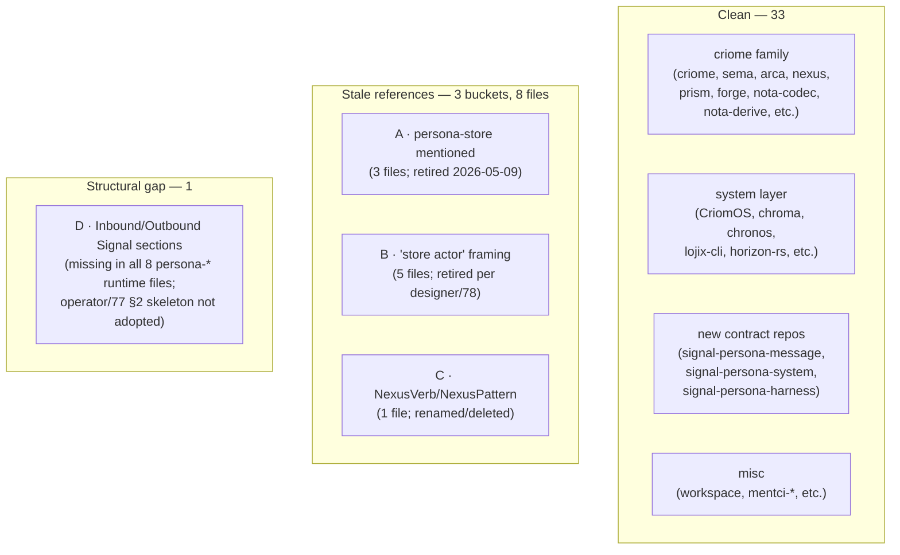

# 79 · ARCHITECTURE.md audit — workspace-wide

Status: pass over all 41 `ARCHITECTURE.md` files in
`/git/github.com/LiGoldragon/` against current design state
(post-2026-05-09 channel-first pattern + persona-store
retirement). Three stale-reference buckets, one structural
gap (operator/77 §2 skeleton not adopted), specific fixes
named.

Author: Claude (designer)

---

## 0 · TL;DR



| Outcome | Count |
|---|---:|
| Files inventoried | 41 |
| Files clean (no flagged drift) | 33 |
| Files with stale references | 8 |
| Files missing operator/77 §2 skeleton (persona-* runtime) | 8 |
| New contract repos (signal-persona-{message,system,harness}) — fully compliant | 3 |
| Apex `persona/ARCHITECTURE.md` — post-cleanup, correct | 1 |

---

## 1 · Inventory by family

### 1.1 · sema-family (5)
`sema`, `persona-sema`, future `forge-sema`, future
`chronos-sema`, future `<other>-sema`. Today: 2 exist.

### 1.2 · signal-family (8)
- Kernel: `signal-core`
- Per-ecosystem: `signal`, `signal-forge`, `signal-arca`,
  `signal-persona`
- Per-channel (NEW): `signal-persona-message`,
  `signal-persona-system`, `signal-persona-harness`
- Plus: `signal-derive` (proc-macro; status under review)

### 1.3 · persona-* runtime (8)
`persona` (apex), `persona-router`, `persona-message`,
`persona-system`, `persona-harness`, `persona-wezterm`,
`persona-orchestrate`. Plus `persona-sema` (counted above).

### 1.4 · criome-family (8)
`criome` (engine), `arca` (artifact store), `nexus`
(text), `nexus-cli` (CLI), `nexus-spec-archive`, `prism`
(projector), `forge` (executor), `hexis` (host config).

### 1.5 · system layer (10)
`CriomOS`, `CriomOS-emacs`, `CriomOS-home`, `chroma`,
`chronos`, `lojix-cli`, `lojix-archive`, `horizon-rs`,
`orchestrator`, `mentci-egui`, `mentci-lib`, plus
`workspace` and `AnaSeahawk-website`.

---

## 2 · Stale references — concrete fixes

### 2.1 · Bucket A — `persona-store` references (3 files; retired 2026-05-09)

Persona-store was renamed to `persona-sema` in this
session's commit `f94a67f0`. These ARCHITECTURE.md files
still cite the old name:

| File | Lines | Fix |
|---|---|---|
| `persona-harness/ARCHITECTURE.md` | 4 occurrences | Update mermaid edge `"persona-store"` → `"persona-sema"` (or `"persona-router"` if the edge is about durable commits — per designer/78 the router owns its messages redb) |
| `persona-orchestrate/ARCHITECTURE.md` | 2 occurrences | Update mermaid edge + the "does not own" bullet to reference `persona-sema` (library) rather than `persona-store` (repo) |
| `persona-system/ARCHITECTURE.md` | 3 occurrences | Same — `persona-store` → `persona-sema`; possibly drop the "via store" framing entirely per designer/78 §3 (each component owns its state) |

**Owner:** operator (touches the persona-* runtime
crates). Could be bundled with operator's Task A cleanup
or done as a hygiene sweep alongside Task 2 (router
refactor).

### 2.2 · Bucket B — "store actor" framing (5 files; retired per designer/78)

Per `designer/78` §1.1 (adopting operator/77's "domain-owned
state" framing): there is no shared "store actor." Each
component owns its own state via persona-sema as a library.
References to "the store actor" generically misframe.

| File | Lines | What it currently says | Fix |
|---|---|---|---|
| `signal-persona/ARCHITECTURE.md` | "store actors, reducers, subscriptions, or redb tables" (in non-ownership list) | Acceptable AS A NON-OWNERSHIP DISCLAIMER — the contract crate doesn't own these; the framing is correct in this context. Consider rewording to "consumer-side actors and tables" for consistency with designer/78 |
| `persona-message/ARCHITECTURE.md` | "behind `persona-sema` and its store actor" | Update — `persona-sema` is a library; the receiving daemon (router) owns the actor. Reword as "behind the router's persona-sema-backed state." |
| `persona-router/ARCHITECTURE.md` | "commits delivery transitions through the `persona-sema` store actor" | Same fix — drop "store actor"; say "router-owned persona-sema state" |
| `persona-sema/ARCHITECTURE.md` | (likely also has framing inherited from earlier work) | Verify; align with designer/78 |
| `sema/ARCHITECTURE.md` | "store actor owns the mailbox" | The user/linter recently added this paragraph; it implies "consumer's store actor" generically. Could keep (it's accurate IF interpreted as "the consumer's daemon's actor"); could clarify to "the consumer daemon's actor" to avoid implying a separate store-actor component |

**Owner:** designer (the contract repos + sema kernel) +
operator (the persona-* runtime). Mostly mechanical
rewording.

### 2.3 · Bucket C — `NexusVerb` / `NexusPattern` derive names (1 file)

Per designer/46 §6: `NexusVerb` derive renamed to
`NotaSum`; `NexusPattern` derive deleted (codec dispatches
on record-head ident at PatternField positions).

| File | Lines | Fix |
|---|---|---|
| `nexus-cli/ARCHITECTURE.md` | "(`NotaRecord` / `NotaEnum` / `NotaTransparent` / `NotaTryTransparent` / `NexusPattern` / `NexusVerb`)" | Drop `NexusPattern`; rename `NexusVerb` → `NotaSum`. Final list: `NotaRecord`, `NotaEnum`, `NotaSum`, `NotaTransparent`, `NotaTryTransparent` |

**Owner:** operator (nexus-cli is in operator's lane).
Trivial 1-line edit.

### 2.4 · Bucket D — `chroma`'s darkman/nightshift (NOT stale)

`chroma/ARCHITECTURE.md` mentions darkman + nightshift as
*the services chroma replaces*. This is correct
supersession context, not stale. **No fix.**

---

## 3 · Structural gap — operator/77 §2 skeleton not adopted

`reports/operator/71-parallel-signal-contract-architecture-plan.md`
§2 (lifted into `designer/72` §5.1) proposes that every
Persona **runtime** component's ARCHITECTURE.md answers:

| Section | Required answer |
|---|---|
| Role | what this repo owns and does not own |
| **Inbound Signal** | **which contract repo messages it receives** |
| **Outbound Signal** | **which contract repo messages it emits** |
| State | whether it owns state, and through which actor/table |
| Actor boundary | which data-bearing actor owns long-lived behavior |
| Text boundary | whether NOTA/Nexus is allowed here |
| Forbidden shortcuts | what future agents are likely to bypass |
| Truth tests | which witnesses prove the architecture is obeyed |

**Zero** persona-* runtime ARCHITECTURE.md files have the
**Inbound Signal** / **Outbound Signal** sections.

| File | Has Inbound Signal? | Has Outbound Signal? | Has Truth tests? |
|---|---|---|---|
| `persona/ARCHITECTURE.md` | no | no | no (apex, may not need per-channel sections) |
| `persona-router/ARCHITECTURE.md` | no | no | no |
| `persona-message/ARCHITECTURE.md` | no | no | no |
| `persona-system/ARCHITECTURE.md` | no | no | no |
| `persona-harness/ARCHITECTURE.md` | no | no | no |
| `persona-wezterm/ARCHITECTURE.md` | no | no | no |
| `persona-orchestrate/ARCHITECTURE.md` | no | no | no |
| `persona-sema/ARCHITECTURE.md` | no | no | no |

**This is the load-bearing structural fix.** With the new
contract-first pattern, every runtime component's
ARCHITECTURE.md should explicitly list its **Inbound** +
**Outbound** signal contracts. Without it, an agent has to
read across the contract repos to figure out what a
runtime component speaks.

For the message stack specifically, after operator's Task 2
lands, persona-router's ARCHITECTURE.md should say:

```markdown
## Inbound Signal
- `signal-persona-message` (from message-cli)
- `signal-persona-system` (from persona-system; subscriptions)

## Outbound Signal
- `signal-persona-message` reply side (back to message-cli)
- `signal-persona-system` request side (subscribe + observe)
- `signal-persona-harness` (delivery to harness)
```

**Owner:** operator (per-runtime), as the components are
implemented. Each runtime's ARCHITECTURE.md gets the
sections filled in when its implementation lands.

---

## 4 · The new contract repos — fully compliant

The three contract ARCHITECTURE.md files I shipped this
session follow the operator/77 §2 second-table skeleton
(for *contract* repos):

| File | Channel | Record source | Messages | Versioning | Examples | Round trips | Non-ownership |
|---|---|---|---|---|---|---|---|
| `signal-persona-message/ARCHITECTURE.md` | ✓ | ✓ | ✓ | ✓ | ✓ | ✓ | ✓ |
| `signal-persona-system/ARCHITECTURE.md` | ✓ | ✓ | ✓ | ✓ | ✓ | ✓ | ✓ |
| `signal-persona-harness/ARCHITECTURE.md` | ✓ | ✓ | ✓ | ✓ | ✓ | ✓ | ✓ |

Use these as the template for `signal-persona-terminal`
and `signal-persona-orchestrate` when those land.

---

## 5 · Apex `persona/ARCHITECTURE.md` — post-cleanup, correct

The apex ARCHITECTURE.md was updated (per the linter
notification earlier this session) to reflect the
channel-first pattern + each component owns its own state.
The TL;DR explicitly says:

> The architecture is channel-first. Each pair of
> components that communicates over a wire shares a
> dedicated `signal-persona-*` contract repo. That
> contract repo is the synchronization point for parallel
> development.

No stale references. **No fix needed for apex.**

---

## 6 · Per-family findings (summary)

### 6.1 · criome-family — clean

`criome`, `sema`, `arca`, `nexus`, `prism`, `forge`,
`nota`, `nota-codec`, `nota-derive` ARCHITECTURE.md files
all surveyed as clean. The criome-family is mature; no
churn in this audit window.

(`nexus-cli` has the NexusVerb/NexusPattern lag from
designer/46 — bucket C above. Trivial fix.)

(`sema` has the "store actor" framing in the recent
linter-added paragraph — bucket B above; clarification
recommended.)

### 6.2 · system layer — clean

`CriomOS`, `CriomOS-home`, `chroma`, `chronos`,
`lojix-cli`, `horizon-rs`, `orchestrator` — all correct
for their domain. `chroma` mentions darkman/nightshift as
supersession context (correct).

### 6.3 · signal-family — mostly clean

`signal-core`, `signal-persona-{message,system,harness}`
clean (the new ones I shipped follow the proper skeleton).

`signal`, `signal-forge`, `signal-arca` — surveyed as clean
(criome's wire vocabulary; mature).

`signal-persona/ARCHITECTURE.md` — borderline-stale
"store actors" wording in the non-ownership list; can stay
(non-ownership context) or reword.

`signal-derive/` — its lib.rs says "role under review";
ARCHITECTURE.md status not deeply audited.

### 6.4 · persona-* runtime — needs work

This is where the audit findings concentrate:

| Repo | Stale persona-store | Stale "store actor" | Missing Inbound/Outbound Signal |
|---|---|---|---|
| `persona` (apex) | (n/a; cleaned) | (n/a) | (apex; sections not strictly needed) |
| `persona-router` | — | yes | yes |
| `persona-message` | — | yes | yes |
| `persona-system` | yes (3) | — | yes |
| `persona-harness` | yes (4) | — | yes |
| `persona-orchestrate` | yes (2) | — | yes |
| `persona-sema` | — | maybe | yes |
| `persona-wezterm` | — | — | yes |

**8 files** need the operator/77 §2 sections added; **3
files** need the persona-store rename; **3 files** need
the "store actor" framing rewording.

These all overlap — operator can do them as one
hygiene pass when implementing each runtime crate (Tasks 2
+ 3 of designer/78 §3.2).

---

## 7 · Recommendations — punch list

### 7.1 · Mechanical fixes (all-bundle, ~1 hour)

| # | Action | Owner | Where |
|---|---|---|---|
| 1 | `persona-harness/ARCHITECTURE.md`: replace 4 `persona-store` mentions | operator | bundle with Task 2 or hygiene |
| 2 | `persona-orchestrate/ARCHITECTURE.md`: replace 2 `persona-store` mentions | operator | bundle with Task 3 |
| 3 | `persona-system/ARCHITECTURE.md`: replace 3 `persona-store` mentions | operator | hygiene |
| 4 | `nexus-cli/ARCHITECTURE.md`: drop NexusPattern, rename NexusVerb→NotaSum | operator | trivial |
| 5 | `persona-message`, `persona-router` ARCHITECTURE.md: rephrase "store actor" → "router-owned persona-sema state" | operator | bundle with Task 2 |

### 7.2 · Structural fix (load-bearing; per-runtime)

| # | Action | Owner | When |
|---|---|---|---|
| 6 | Add Inbound Signal / Outbound Signal sections to each persona-* runtime's ARCHITECTURE.md | operator | as each component is implemented (Phase 5 of designer/72; Tasks 2-3 of designer/78) |

The right pattern: **as soon as a persona-* runtime starts
consuming a contract**, its ARCHITECTURE.md gets the
Inbound/Outbound section update in the same commit.

### 7.3 · Optional cleanup

| # | Action | Owner |
|---|---|---|
| 7 | `signal-persona/ARCHITECTURE.md`: reword "store actors" in non-ownership list (clarity, not correctness) | designer |
| 8 | `sema/ARCHITECTURE.md`: clarify "store actor" wording — is it the consumer's daemon's actor or a generic component? | designer |

---

## 8 · See also

- `~/primary/reports/operator/77-first-stack-channel-boundary-audit.md`
  §2 — the architecture-doc skeleton this audit measures
  against
- `~/primary/reports/designer/72-harmonized-implementation-plan.md`
  §5.1 — the same skeleton lifted into the harmonized plan
- `~/primary/reports/designer/78-convergence-with-operator-77.md`
  — the convergence + work-split that drives the
  per-component arch updates
- `~/primary/reports/designer/76-signal-channel-macro-implementation-and-parallel-plan.md`
  §6 — the architectural insight that retired persona-store
- `~/primary/skills/architecture-editor.md` — the
  ARCHITECTURE.md conventions
- `~/primary/skills/contract-repo.md` — contract-repo
  discipline (used as the contract-side skeleton)
- `~/primary/reports/designer/46-bind-and-wildcard-as-typed-records.md`
  — the source of NexusVerb→NotaSum + NexusPattern
  deletion (drives bucket C)

---

*End report.*
