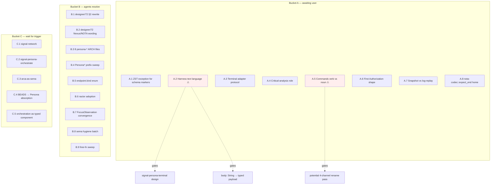

# 80 · Open questions inventory

Status: comprehensive sweep of every unresolved question
hanging across reports / skills / protocols / BEADS as of
2026-05-08. Organised by who can resolve and how blocking
the answer is.

Author: Claude (designer)

---

## 0 · TL;DR

23 open questions surfaced. Buckets:

| Bucket | Count | Who resolves |
|---|---:|---|
| **A. Awaiting user** — design judgments only the user can make | 8 | user |
| **B. Designer/operator can resolve** — mechanical or in-scope | 9 | agent |
| **C. Deferred-by-design** — questions that resolve themselves when triggered | 6 | (event) |

Two questions are **load-bearing for the next 1-2 weeks of
work** and should be answered first:

1. **Bucket A #3** — harness boundary text language (Nexus /
   NOTA / projection). Gates `signal-persona-terminal` design
   and the `body: String` typing in `signal-persona-message`.
2. **Bucket A #5** — Commands naming (verb-form vs noun-form).
   Touches every persona-* contract before they harden.

Everything else can wait or proceed in parallel.

---

## 1 · Bucket A — awaiting user decision

These can't be resolved by an agent alone — they're either
design judgments with no clearly-better answer, or they
depend on user intent the agent doesn't have.

### 1.1 · ZST exception for schema marker records

**Question:** Are `Bind`, `Wildcard`, `Tail`, `Agents`,
`Flush`, `Status` allowed to remain ZSTs, or must they be
promoted to data-bearing records?

**Conflict:** `skills/rust-discipline.md` says "ZST only for
actor markers." Current design has typed marker records that
are not actors.

**Affected types** (per operator/67 §10.1):
- `signal_core::Bind`, `signal_core::Wildcard`
- `persona-message::Tail`, `persona-message::Agents`,
  `persona-message::Flush`
- `persona-router::Status`

**Designer lean** (designer/70 §5.2): keep ZST, name the
exception. Operator's reframe: rule should say "actor
behavior markers and schema marker records," not "only
actors."

**Source:** `primary-kxb` #1 / operator/67 §10.1, §12 #1 /
designer/68 §8 #5 / designer/70 §5.2.

**Blocking:** soft. Doesn't block messaging stack work; does
block the next skill-rule cleanup pass.

---

### 1.2 · Harness boundary text language

**Question:** When the harness delivers a message body to a
human, what is the typed text payload? Nexus, NOTA, a named
"PersonaText" projection, or plain `String`?

**Today:** `body: String` in
`signal-persona-message::SubmitMessage` (operator/77 §7
flagged this as first-stack scaffolding).

**Source:** `primary-kxb` #3 / operator/67 §12 #3 /
designer/70 §4 / designer/72 §14 #1 / designer/78 §4 / 
designer/68 §8 #3.

**Blocking:** **load-bearing**. Gates:
- `signal-persona-terminal` design (designer/72 Phase 7)
- `body: String` → typed payload migration in
  `signal-persona-message`
- `recipient: String` and `sender: String` → domain
  newtypes from `signal-persona`

**Recommendation:** the user picks one of three:
- (a) NOTA payload — full Nota record in body, terminal
  renders the projection
- (b) Nexus payload — Nexus request/message surface
  (Nexus is a NOTA-using request surface, not a separate
  syntax — per `primary-gl6`)
- (c) Named "PersonaText" projection — a typed
  Persona-domain text record (smaller surface than full
  Nexus)

Designer can write a comparison report once the user gives
a direction.

---

### 1.3 · Terminal adapter protocol

**Question:** Does `persona-wezterm` speak Signal at the
harness actor boundary, or does it stay an internal PTY
adapter inside `persona-harness`?

**Designer lean** (designer/70 §5.2): internal PTY for now;
Signal at the harness actor boundary. This makes
`signal-persona-terminal` a real channel.

**Source:** `primary-kxb` #4 / operator/67 §12 #5 /
designer/68 §8 #4 / designer/70 §5.2.

**Blocking:** soft. `persona-wezterm` works today; the
question is how the next-layer-up boundary is shaped.

---

### 1.4 · Critical-analysis role

**Question:** Does the workspace get a fifth role
focused on critical-analysis / fault-finding, or is this a
designer sub-mode?

**Sub-questions** (per `primary-9h2`):
- (a) separate role or designer sub-mode?
- (b) lock file shape?
- (c) what verb does it own that designer/operator don't?
- (d) predates design (review designs) or post-dates
  (audit implementations) or both?

**Source:** `primary-9h2` (P2) / user request 2026-05-08 /
designer/68 §8 #1.

**Blocking:** none. Designer can write the role-design
report once the user signals intent.

---

### 1.5 · Commands naming — verb-form vs noun-form

**Question:** Should commands be `DeclareHarness`
(verb-form) or `HarnessDeclaration` (noun-form)?

**Designer lean** (designer/4 #4): noun-form. Matches
`lojix-cli`'s `FullOs`/`OsOnly`, matches verb-belongs-to-
noun discipline. Operator's current scaffold uses verb-form.

**Today:** mixed. `signal-persona-system` uses
`SubscribeFocus` (verb), `signal-persona-harness` uses
`DeliverMessage` (verb), `signal-persona-message` uses
`SubmitMessage` (verb). The scaffold has settled toward
verb-form.

**Source:** designer/4 §12 #4.

**Blocking:** **load-bearing**. Should be answered before
more channels harden. If noun-form wins, we have a 4-channel
rename pass coming.

---

### 1.6 · First Authorization shape

**Question:** Is the minimum viable Authorization a
principal-pair table with `Allow`/`Deny`/`Hold` per
`(from, to)`, or do we want capability tokens / signed
envelopes / per-message policy from day one?

**Designer lean** (designer/4 #6): "explicit but tiny" —
principal-pair table, layer the rest later.

**Source:** designer/4 §12 #6.

**Blocking:** none today. Becomes blocking when the message
plane needs the Authorization gate (after Task 1).

---

### 1.7 · Snapshot vs log-replay

**Question:** Does recovery on persona-router restart
replay the log over an empty snapshot, or trust the
snapshot? What's the policy when they drift?

**Designer lean** (designer/4 #7): write both, recover by
log-replay over empty snapshot. Don't trust the snapshot
blindly.

**Source:** designer/4 §12 #7.

**Blocking:** none today. Becomes relevant once
`persona-router` actually persists messages via persona-sema
(operator's Task 1).

---

### 1.8 · Where does `nota-codec::expect_end()` live?

**Question:** Manual end-of-input check is duplicated
between `Request::from_nota` and `Document::from_nota` —
should this be a missing nota-codec primitive?

**Source:** designer/4 §12 #8.

**Blocking:** none. Cleanup item; would clean up two
existing call sites. No new bead filed.

---

## 2 · Bucket B — designer / operator can resolve

These have an obvious answer or a designated owner; the
work just needs to happen.

### 2.1 · designer/72 §2 — 4-channel shape rewrite

**What:** Update designer/72 §2 to reflect 4 active +
1 next channels (per designer/78 decision #2). The
old text talks about 5 channels-as-implementation-layers.

**Owner:** designer (me, next batch after this report).

**Source:** designer/78 §2 decision #2 / operator/77 §9 #2.

---

### 2.2 · designer/72 — Nexus/NOTA-as-alternatives wording

**What:** Rewrite designer/72's "whether NOTA/Nexus is
allowed here" and "canonical Nexus/NOTA text projection" —
NOTA is the syntax, Nexus is a NOTA-using request surface,
not an alternative.

**Owner:** designer.

**Source:** `primary-gl6` (P2) / designer/68 §9.

---

### 2.3 · 8 persona-* runtime ARCHITECTURE.md files missing
Inbound/Outbound Signal sections

**What:** Per operator/77 §2 skeleton, persona-* runtime
crate ARCHITECTURE.md files should declare their typed
inbound and outbound Signal surfaces. 8 files don't.

**Owner:** designer (per designer/79 architecture audit).

**Source:** designer/79 §"Structural gap."

---

### 2.4 · `primary-tlu` — Persona* prefix sweep

**What:** `PersonaRequest`, `PersonaReply`,
`PersonaSignalError`, `PersonaSystemError`,
`PersonaRouterError`, `PersonaMessage` violate the
no-crate-prefix rule. Mechanical rename pass.

**Owner:** operator.

**Source:** `primary-tlu` (P2) / designer/60 issues F+G /
designer/68 §3.3.

**Blast radius unknown** — designer/68 §10 Phase 4 flagged
this as a question to ask. Operator should run `git grep`
before starting.

---

### 2.5 · `primary-0cd` — `endpoint.kind` closed enum

**What:** `persona-message/src/delivery.rs:74-79` dispatches
on `endpoint.kind.as_str()` against literal strings with
`_ => unreachable`. Replace `EndpointKind` with
`enum { Human, PtySocket, WezTermPane }`.

**Owner:** operator.

**Source:** `primary-0cd` (P2) / designer/60 issue H.

---

### 2.6 · `primary-186` — Persona daemons adopt ractor

**What:** `RouterActor` is plain `struct` with
`apply(&mut self, ...)`, not `ractor::Actor`. Same for
persona-system, persona-message daemons.

**Owner:** operator (this is part of Task 1 in designer/78).

**Source:** `primary-186` (P2) / operator/67 §4.

---

### 2.7 · `primary-3fa` — FocusObservation contract
convergence

**Question (designer/operator):** Two `FocusObservation`
types exist (signal-persona keyed by `PrincipalName`;
persona-system keyed by `SystemTarget`). Persona-router
uses the persona-system flavor, not the contract.

**Two answers possible:**
- (a) contract wins — router consumes the
  `signal-persona` (now `signal-persona-system`) type
- (b) system owns the OS-layer fact, contract owns the
  wire vocabulary, router translates at the boundary

**Lean** (per designer/79 audit): (a). The whole point of
the per-channel contract repo split is that the contract is
the truth. `signal-persona-system` already declares
`FocusObservation` keyed by `NiriWindowId` /
`SystemTarget`; the old `signal-persona` flavor predates
the split.

**Owner:** designer to write the convergence note;
operator to do the rename pass.

**Source:** `primary-3fa` (P2) / designer/60 issues A+B /
operator/67 §3.

---

### 2.8 · `primary-4zr` — sema kernel hygiene batch

**What:** Four-part cleanup:
1. Split `sema/src/lib.rs` (~360 LoC > 300 threshold)
2. Namespace internal table names with `__sema_` prefix
3. Move `reader_count` + `DEFAULT_READER_COUNT` out of
   sema into criome
4. Make slot-store init opt-in via `OpenMode`

**Owner:** operator.

**Source:** `primary-4zr` (P2) / designer/66 issues D, E,
H, K.

---

### 2.9 · `primary-0ty` — free-fn examples sweep

**What:** Sweep remaining free-fn examples per
`skills/skill-editor.md` §"Examples never show free
functions."

**Owner:** designer.

**Source:** `primary-0ty` (P2) / user correction
2026-05-09.

---

## 3 · Bucket C — deferred-by-design

These have answers that *should not* be decided now.
Listed so they're not forgotten.

### 3.1 · `primary-uea` — When does signal-network design
begin?

**Trigger:** when a second machine actually needs cross-
machine messaging. Today persona is single-machine. Don't
design until the need is real.

**Source:** `primary-uea` (P3) / designer/68 §3.5 / 
designer/70 §5.2 #6.

---

### 3.2 · `signal-persona-orchestrate` exists when?

**Trigger:** when `persona-orchestrate`'s claim / release /
handoff / task-visibility operations are named (likely
during operator's Task 2 — first persona-orchestrate slice).

**Source:** designer/78 §2 decision #4 / operator/77 §9 #4.

---

### 3.3 · `arca`'s content-addressed object store as
sema-equivalent

**Question:** For the `signal-arca` layer specifically,
does arca's content-addressed object store *itself*
play the sema-equivalent role, rather than layering atop
sema? TBD.

**Trigger:** when arca's typed-storage requirements
crystallise. Don't pre-design — wait for the second
concrete consumer (per `skills/contract-repo.md` kernel-
extraction trigger).

**Source:** designer/63 §3 (TBD note).

---

### 3.4 · BEADS replacement by Persona

**Question:** What replaces BEADS in the final shape?
**Persona does** (per designer/4 §12 #5 — already
answered). The open piece is the *naming* of the typed
records: `Task` / `Coordination` / `Memory` kinds, naming
TBD.

**Trigger:** when the persona record set needs to absorb
bd-tracked items. Don't design the absorption until
persona-router commits messages and persona-orchestrate
ships claim/release.

**Source:** designer/4 §12 #5 / `AGENTS.md` "BEADS is
transitional" / designer/4 §"Persona is the destination
fabric."

---

### 3.5 · `primary-jwi` — orchestration helper into typed
Persona component

**Trigger:** once the harness messaging layer is ready.
Replaces the current shell `tools/orchestrate` with a typed
component speaking Persona records.

**Source:** `primary-jwi` (P3) / designer/68 §8 #7.

---

### 3.6 · `primary-uea` (recurring) + `primary-jwi`
(recurring)

These two are listed in both deferred and "open question
awaiting user" buckets across reports. Properly classified
they belong here — both have clear *triggers*; neither
needs a user decision now.

---

## 4 · The decision-flow visualization

`⚠` marks the two load-bearing questions that should be
answered first.

---

## 5 · Recommended user-decision order

If the user wants to clear the most blocking questions
fast, the order is:

| Order | Question | Why first |
|---|---|---|
| 1 | A.5 Commands verb vs noun | Touches every channel before they harden — cheap to fix now, expensive after 4 contracts ship |
| 2 | A.2 Harness text language | Gates signal-persona-terminal + typed body migration |
| 3 | A.1 ZST exception | Unblocks skill-rule cleanup; soft impact on code |
| 4 | A.3 Terminal adapter protocol | Shape decision for signal-persona-terminal |
| 5 | A.4 Critical-analysis role | New work; no pressure |
| 6 | A.6 First Authorization shape | Becomes blocking after operator's Task 1 |
| 7 | A.7 Snapshot vs log-replay | Becomes blocking after operator's Task 1 |
| 8 | A.8 nota-codec::expect_end | Cleanup; lowest priority |

---

## 6 · Designer's next batch (independent of user)

While the user mulls bucket A, designer can land:

- B.1 — designer/72 §2 rewrite (4-channel shape)
- B.2 — designer/72 Nexus/NOTA-as-alternatives wording
  (`primary-gl6`)
- B.3 — 8 persona-* ARCHITECTURE.md Inbound/Outbound
  sections (per designer/79)
- B.7 — FocusObservation convergence note (designer half)
- B.9 — free-fn sweep (`primary-0ty`)

Operator's parallel work (per designer/78 §3.2) covers
B.4-B.6 + B.8.

---

## 7 · Updates to existing reports

After this inventory lands, two reports should be updated:

| Report | Update |
|---|---|
| `designer/68` §8 | Note that `primary-kxb` #2 (channel granularity) is **resolved** — 4 active + 1 next |
| `designer/72` §14 | Same; remove channel-count row from "still open" table |

These updates are designer's; can land in the same batch
as B.1 + B.2.

---

## 8 · Source references

- `~/primary/reports/operator/67-signal-actor-messaging-gap-audit.md`
  §10.1, §12, §13 — origin of `primary-kxb`
- `~/primary/reports/designer/4-persona-messaging-design.md`
  §12 — eight design questions, items #4-#8 still open
- `~/primary/reports/designer/63-sema-as-workspace-database-library.md`
  §3 — arca-as-sema TBD
- `~/primary/reports/designer/68-architecture-amalgamation-and-review-plan.md`
  §8 — open questions awaiting user; §9 — drift register
- `~/primary/reports/designer/70-code-stack-amalgamation-and-messaging-vision.md`
  §5.2 — `primary-kxb` aggregates
- `~/primary/reports/designer/72-harmonized-implementation-plan.md`
  §14 — still-open `primary-kxb` rows
- `~/primary/reports/designer/76-signal-channel-macro-implementation-and-parallel-plan.md`
  + `78-convergence-with-operator-77.md` — channel
  granularity resolution + Task A/B assignment
- `~/primary/reports/designer/79-architecture-files-audit.md`
  — 8 missing Inbound/Outbound sections
- `~/primary/reports/operator/77-first-stack-channel-boundary-audit.md`
  §7 — `body: String` typed-payload gating
- BEADS: `primary-kxb`, `primary-9h2`, `primary-uea`,
  `primary-jwi`, `primary-tlu`, `primary-0cd`,
  `primary-186`, `primary-3fa`, `primary-4zr`,
  `primary-gl6`, `primary-0ty`

---

*End report. 8 user decisions surfaced; 9 agent-resolvable
items inventoried with owners; 6 deferred-by-design items
parked. Designer's next batch (B.1, B.2, B.3, B.7, B.9)
runs in parallel with operator's Task A cleanup +
persona-system/-message/-router consumption work
already in flight.*
