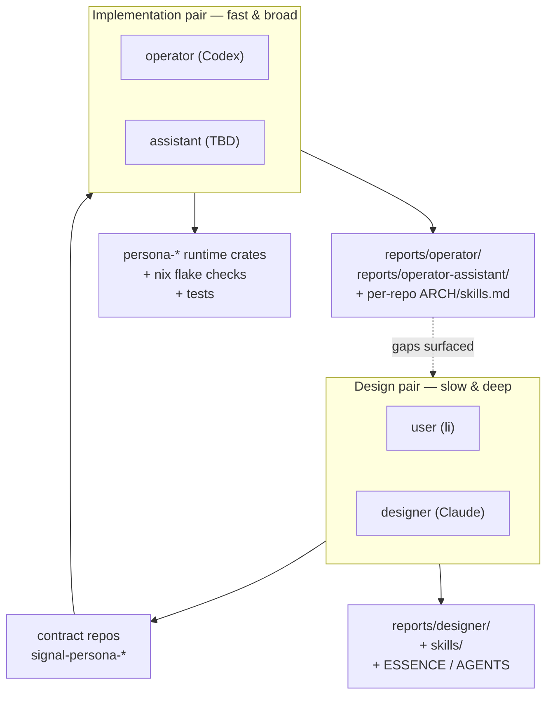
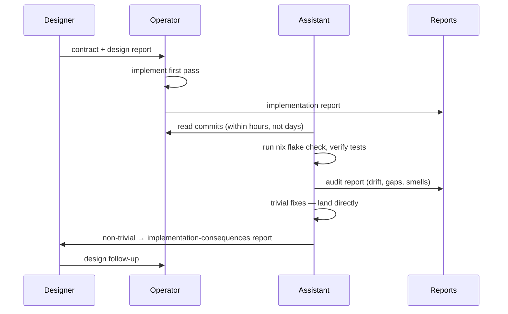
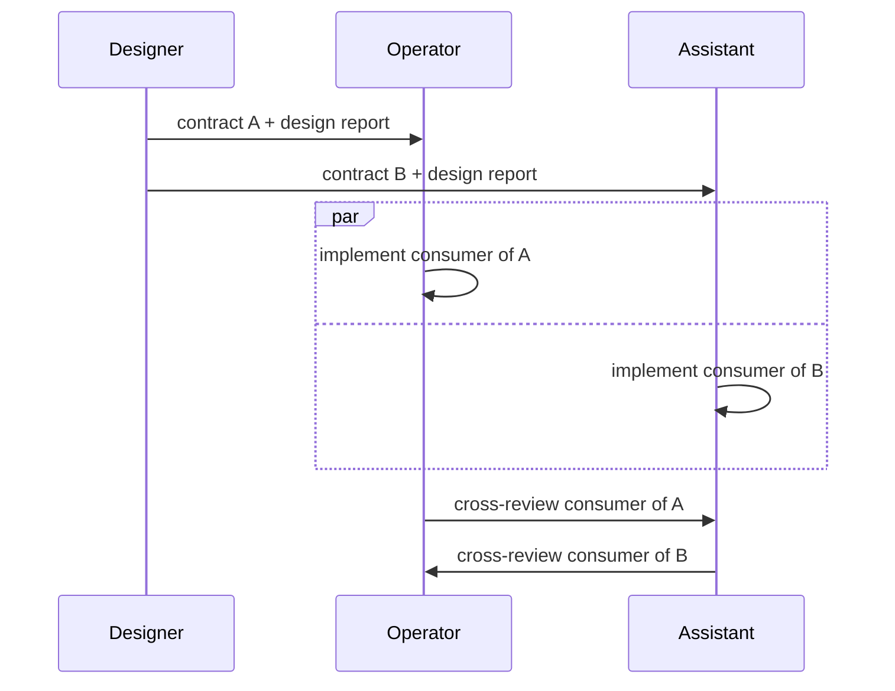
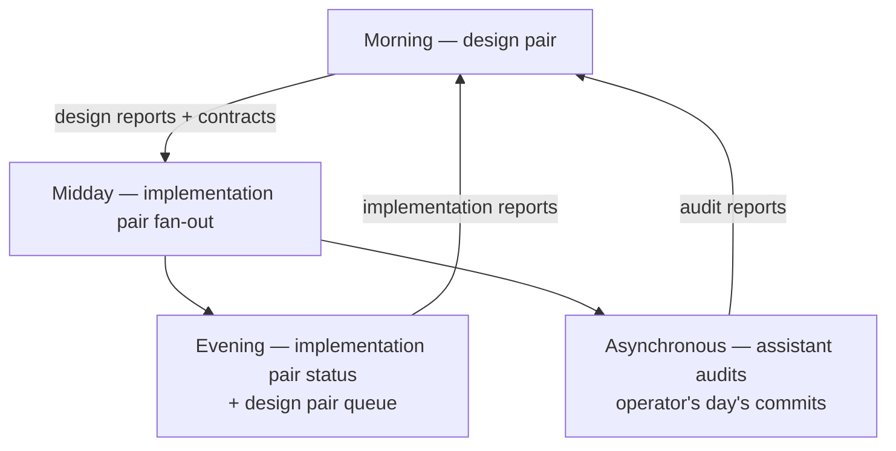

# 81 · Three-agent orchestration: design pair + implementation pair

Status: orchestration proposal for adding the new `assistant`
role alongside `operator` on the implementation surface.
Pairs the workspace into a **design pair** (user + designer)
and an **implementation pair** (operator + assistant), with
the design pair authoring contracts the implementation pair
consumes.

This report is written to be **read by the assistant agent
itself for feedback** before it becomes the working model.

Author: Claude (designer)

---

## 0 · TL;DR

Two pairs:

Why: Codex is faster at writing code; Claude is better at
design judgments. Pairing Claude with the user on design
keeps the slow-deep judgments accurate; pairing two coders
on implementation keeps throughput high and gives operator
a tighter feedback loop than the user-as-only-reviewer
pattern.

---

## 1 · Current-state audit (2026-05-08)

| Role | Agent | Currently doing | Status |
|---|---|---|---|
| operator | Codex | Wiring `persona-system` + `persona-message` + `persona-router` to consume `signal-persona-system` (replacing path deps with git deps) | in-flight |
| designer | Claude (me) | Just landed designer/79 (architecture audit) + designer/80 (open-questions inventory) | idle this turn |
| system-specialist | (any) | Building assistant role infrastructure: `skills/operator-assistant.md`, `AGENTS.md` update, `tools/orchestrate` role list, `reports/operator-assistant/` directory | in-flight |
| poet | (any) | Vision-OCR of caraka-1922-nirnaya-sagar via Claude subagents | in-flight |
| **assistant** | TBD | (joining after system-specialist lands the role infra) | bootstrapping |

**Channel inventory** (per operator/77 §4 + designer/78):

| Contract | Status |
|---|---|
| `signal-persona-message` | ✅ shipped |
| `signal-persona-system` | ✅ shipped |
| `signal-persona-harness` | ✅ shipped |
| `signal-persona-terminal` | ⏳ gated on open-question A.2 (harness text language) |
| `signal-persona-orchestrate` | ⏳ gated on persona-orchestrate ops being named |

**Operator's pipeline** (per designer/78 §3.2):
- ✅ Task A — store cleanup
- 🔄 Current — consuming signal-persona-system into runtime crates
- ⏳ Task 1 — persona-router refactor to ractor + sema
- ⏳ Task 2 — persona-orchestrate first slice
- ⏳ Joint end-to-end nix-chained witness

**Designer's pending batch** (per designer/80 §6):
- B.1 designer/72 §2 4-channel rewrite
- B.2 designer/72 Nexus/NOTA wording
- B.3 8 persona-* ARCH files Inbound/Outbound sections
- B.7 FocusObservation convergence note
- B.9 free-fn sweep

**Bucket A user-decisions still open** (per designer/80 §1):
- A.1-A.8, of which A.5 (Commands verb-vs-noun) and A.2
  (harness text language) are load-bearing for the next
  1-2 weeks

---

## 2 · The design pair — user + designer (me)

### 2.1 · What we own

Workspace-level surfaces that need slow, deep, judgment-laden
work:

- `ESSENCE.md`, `AGENTS.md`, `protocols/orchestration.md`
- `skills/*.md` (cross-cutting agent capabilities)
- Contract-repo design (the typed Signal vocabulary —
  request/reply enums, From impls, From-bytes round-trip
  spec)
- ARCHITECTURE.md initial drafts per repo
- Workspace design reports (`reports/designer/<NN>-*.md`):
  audits, plans, open-questions inventories, design
  proposals, skill rationales

### 2.2 · How we work

- **User triggers** a design pulse with a question, an
  observation, a vision, or a "what about X?" probe.
- **Designer (me)** drafts a report, often with a Mermaid
  diagram, comparison table, or proposal.
- **User pushes back** — the answer is rarely the first draft.
- **Designer revises** until the user signals convergence.
- **Output**: a design report, contract repo, or skill that
  the implementation pair picks up.

The design pair's tempo is deliberately slow. We hold the
load-bearing decisions (channel granularity, ZST exception,
verb-vs-noun, harness text language) and avoid making them
under throughput pressure.

### 2.3 · What we don't do

- Write Rust code
- Write tests
- Run nix flake check
- Maintain per-repo `skills.md` / `ARCHITECTURE.md` drift
  *after* the initial draft (implementation pair owns the
  drift fix)
- Mechanical refactor passes (Persona\* prefix sweep,
  endpoint.kind enum, free-fn sweep)

If we draft an ARCHITECTURE.md, we hand it to the
implementation pair and let them keep it true. The design
pair re-enters only when the structural shape changes.

---

## 3 · The implementation pair — operator + assistant

### 3.1 · What they own

The implementation surface of the workspace's owned crates:

- Rust code in every `persona-*`, `signal-*`, `sema`,
  `nota-*`, `nexus*`, `criome`, `chroma`, `chronos`,
  `forge`, `prism`, `horizon-rs`, `goldragon`, `lojix-cli`
  (per `skills/operator.md` §"Owned area")
- Tests: round-trip, architectural-truth, regression
- `Cargo.toml` / `Cargo.lock` / `flake.nix` / `flake.lock`
- `nix flake check` green
- Per-repo `ARCHITECTURE.md` **drift fixes** (designer
  drafts initial; implementation pair keeps it true)
- Per-repo `skills.md` **drift fixes**
- Mechanical refactor passes (the bucket-B items in
  designer/80)
- Implementation-consequences reports surfacing design
  gaps back to design pair

### 3.2 · Two sub-modes

The implementation pair has two operating modes. The
choice depends on the task's risk profile.

#### Mode A — operator-leads / assistant-reviews

Default for safety-critical paths (persona-router,
persona-orchestrate, anything in the message plane).

- Operator implements channel X first pass.
- Assistant reads operator's commits within the same day.
- Assistant verifies: `nix flake check` green;
  architectural-truth tests pass; `ARCHITECTURE.md` /
  `skills.md` still accurate; blunt-test-naming followed;
  no stray `as_str()` matches, free fns, `pub` newtype
  fields, etc.
- **Trivial fixes** (typos, unused imports, comment
  cleanup, `Persona*` prefix on a single type) — assistant
  lands directly.
- **Non-trivial gaps** (design ambiguity, missing
  architectural-truth witness, structural smell) — assistant
  files an audit report (`reports/operator-assistant/<NN>-*.md`).
  Designer pair reads it; design follow-up if needed;
  operator implements the follow-up.

This gives operator a tighter feedback loop than waiting
for the user to review days later.

#### Mode B — channel-disjoint / cross-review

Default for high-throughput phases when there are multiple
contracts ready for consumption simultaneously.

- Operator takes channel A (e.g. persona-router refactor).
- Assistant takes channel B (e.g. persona-harness
  skeleton).
- Lock-file conflict prevention via `tools/orchestrate`
  (path-disjoint claims).
- At integration boundary, each cross-reviews the other's
  implementation.

This mode is faster but riskier — needs cross-review at
the integration point to catch divergence.

### 3.3 · Choosing the mode

| Situation | Mode |
|---|---|
| New channel; first consumer | A (operator-leads) |
| Architectural-truth witness work | A |
| Mechanical refactor; multiple crates | B (split by crate) |
| Cleanup batch (designer/80 bucket B) | B (split by item) |
| End-to-end nix-chained integration | A (one driver, one reviewer) |
| Skill / ARCHITECTURE.md drift backfill | B |

Designer pair signals which mode in the design report's
"§ Implementation handoff" section.

---

## 4 · More contract repos to enable parallelism

Today: 3 contracts shipped + 2 gated. Implementation pair
can consume at most 3 in parallel.

If the design pair lands two more, implementation pair can
go to 5-way parallel (or 5 sequential targets). Two
candidates:

### 4.1 · `signal-persona-terminal` scaffold

Gated on open question A.2 (harness text language). But
the channel *surface* — what verbs cross harness ↔ wezterm
— can ship with `body: String` as first-stack scaffolding,
exactly as `signal-persona-message` did.

Cost: ~1 hour design pair work to land the contract.
Benefit: persona-wezterm can be brought into the typed
Signal world without waiting on A.2.

### 4.2 · `signal-persona-orchestrate` minimum viable

Gated on persona-orchestrate ops being named. But four ops
are already known from designer/64 §4 + designer/4 §5:

- `Claim(role, scope, reason)` → `ClaimAccepted` |
  `ClaimRejected(reason)`
- `Release(role)` → `Released`
- `Handoff(from, to, scope, reason)` →
  `HandoffAccepted` | `HandoffRejected`
- `Observe(role)` → `Observation { active_scopes,
  active_tasks }`

Cost: ~2 hours design pair work for the contract.
Benefit: implementation pair can build persona-orchestrate
first slice (operator's Task 2) in parallel with
persona-router refactor (Task 1), instead of sequentially.

### 4.3 · Channel-disjoint matrix after expansion

| Channel | Producer | Consumer | First-consumer assignment |
|---|---|---|---|
| signal-persona-message | persona-message CLI | persona-router | Operator (Task 1) |
| signal-persona-system | persona-system | persona-router | Operator (currently in-flight) |
| signal-persona-harness | persona-router | persona-harness | Assistant (when role lands) |
| signal-persona-terminal | persona-harness | persona-wezterm | Assistant or operator |
| signal-persona-orchestrate | tools/agents | persona-orchestrate | Operator (Task 2) |

5 channels, 2 implementers — comfortable parallel surface.

---

## 5 · Daily choreography

**Morning (design pair):**
- Read previous day's implementation reports + audit reports
- Make any necessary design decisions
- Drop new design reports / contract updates / open-question
  resolutions

**Midday (implementation pair):**
- Read morning's design output
- Claim disjoint scopes via `tools/orchestrate`
- Implement; commit; push

**Evening (implementation pair):**
- Drop implementation reports (operator/<NN>, assistant/<NN>)
- Surface gaps as implementation-consequences reports

**Asynchronous (assistant audit lane):**
- Read operator's commits as they land
- Run `nix flake check` per repo
- File audit reports
- Land trivial fixes

---

## 6 · What stops being designer's work

If implementation pair owns drift, designer no longer:

- Files the 8 missing Inbound/Outbound sections per
  designer/79 (assistant takes B.3)
- Tracks per-repo skills.md drift after initial authoring
- Audits architectural-truth test coverage per channel
  (assistant audits)
- Sweeps free-fn examples (assistant takes B.9)

Designer keeps:
- ESSENCE / AGENTS / protocols
- `skills/*.md` authoring + revision
- Contract-repo initial design
- ARCHITECTURE.md initial drafts
- Cross-cutting workspace reports (audits, plans,
  open-questions, vision)
- Open-question resolution synthesis
- Channels declared by language design (`signal_channel!`
  macro, naming convention, etc.)

---

## 7 · What stops being operator's work

If assistant takes the cleanup queue, operator no longer:

- Interleaves `Persona*` prefix sweep with feature work
  (assistant takes `primary-tlu` / B.4)
- Interleaves `endpoint.kind` enum with feature work
  (assistant takes `primary-0cd` / B.5)
- Does the sema kernel hygiene batch
  (assistant takes `primary-4zr` / B.8)
- Has to verify `nix flake check` after every commit
  (assistant verifies post-landing)
- Has to backfill horizon-rs test coverage
  (assistant takes `primary-rb0`)

Operator focuses on **load-bearing first-pass implementation**:
persona-router refactor → persona-orchestrate first slice →
end-to-end nix-chained messaging witness.

---

## 8 · The auditor lane resolves a design question

Designer/80 §1.4 listed `primary-9h2` (critical-analysis
role) as awaiting-user. The assistant role, with audit as
its primary mode, **substantially resolves this**:

| `primary-9h2` sub-question | Answer (this report) |
|---|---|
| (a) separate role or designer sub-mode? | Separate role — `assistant` |
| (b) lock file shape? | `operator-assistant.lock`, same format as others |
| (c) verb owned that designer/operator don't? | `audit` — read commits, file audit reports, land trivial fixes |
| (d) predates design or post-dates implementation? | Post-dates implementation; predates the user's review |

The remaining `primary-9h2` question is whether the role
should also do *design-stage critique* (review designer's
reports for fault-finding before implementation starts).
That's a meta-design question; defer until the assistant
has been working in implementation-audit mode for a
few days.

---

## 9 · Risks

### 9.1 · Commit-bundling races

This bit me 3 times during the persona-store cleanup
(designer/76 noted). Worse with two implementers — operator
and assistant might both have unrelated changes in the
same working copy.

**Mitigation:** Implementation pair MUST run `jj st` before
every commit (per `skills/jj.md`). If unrelated changes
appear, partial-commit flow (`jj commit <paths>`).
Hard rule: **never** `jj commit -m '...'` without
`jj st` first.

### 9.2 · Implementation-pair drift

Operator's first pass + assistant's "fix" might diverge.
Worst case: operator chooses one shape, assistant
"corrects" it to a different one without checking, and the
two patterns coexist.

**Mitigation:** Assistant's "fix" is either trivial
(typos, unused imports) OR goes through cross-review (Mode
B). If assistant wants to change a pattern, file an
audit report; designer pair adjudicates.

### 9.3 · Assistant redesigns

If assistant drifts into design (changing record shapes,
renaming verbs, choosing new vocabulary), they're on
designer pair's lane.

**Mitigation:** Same rule as operator (`skills/operator.md`
§"Don't redesign during implementation"). File
implementation-consequences report; don't redesign while
implementing.

### 9.4 · BEADS / lock confusion

Assistant must learn the orchestration discipline.

**Mitigation:** `skills/operator-assistant.md` (system-specialist
is currently writing it) should reference
`protocols/orchestration.md`, `skills/jj.md`,
`skills/autonomous-agent.md`,
`skills/architectural-truth-tests.md`. Bootstrap reading
list in §10 below.

### 9.5 · Audit report flood

Assistant could file 20 audit reports a day, and designer
pair drowns.

**Mitigation:** Assistant reports two ways:
- **Trivial findings** — fix directly; log in a single
  daily summary report (`reports/operator-assistant/<NN>-daily-
  audit-summary.md`)
- **Substantive findings** — its own audit report,
  surfaced explicitly to designer pair

---

## 10 · Bootstrap (first 24 hours after assistant role infra lands)

### 10.1 · Reading list

Required:
- `ESSENCE.md`
- `AGENTS.md`
- `protocols/orchestration.md`
- `skills/operator-assistant.md` (its own — system-specialist
  writes)
- `skills/operator.md` (sister role — most of the
  discipline carries over)
- `skills/jj.md` (version control — `jj describe @`
  forbidden; partial-commit flow)
- `skills/autonomous-agent.md` (routine obstacles)
- `skills/architectural-truth-tests.md` (the audit lens)
- `skills/rust-discipline.md` (the implementation
  discipline)

Recommended (this week's context):
- `reports/designer/78-convergence-with-operator-77.md`
  (current Task A/B assignment)
- `reports/designer/79-architecture-files-audit.md`
  (the 8 missing Inbound/Outbound sections — assistant's
  first audit-then-fix target)
- `reports/designer/80-open-questions-inventory.md`
  (bucket B is the assistant's cleanup queue)
- `reports/designer/81-three-agent-orchestration-with-assistant-role.md`
  (this report)
- `reports/operator/77-first-stack-channel-boundary-audit.md`
  (operator's lens on the current shape)

### 10.2 · Warm-up task

Pick one mechanical bucket-B item from designer/80 as
warm-up. Recommend **B.5 endpoint.kind closed enum**
(`primary-0cd`):
- Single file: `persona-message/src/delivery.rs:74-79`
- Replace `endpoint.kind.as_str()` match with
  `enum EndpointKind { Human, PtySocket, WezTermPane }`
- ~30 minutes
- Tests already exist; just need to keep them green
- Closes a P2 bead

### 10.3 · First audit

Audit operator's just-landed wire-integration commits in
`persona-system`, `persona-message`, `persona-router`:
- `nix flake check` green per repo?
- `signal-persona-system` consumed correctly?
- ARCHITECTURE.md / skills.md drift?
- File `reports/operator-assistant/<NN>-wire-integration-audit.md`

### 10.4 · First parallel-channel work

While operator does Task 1 (persona-router refactor),
assistant takes one of:

- **B.3 — 8 persona-* ARCH files Inbound/Outbound
  sections** (per designer/79). Mechanical, multi-file.
- **B.4 — Persona\* prefix sweep** (`primary-tlu`).
  `git grep` blast radius first; one crate at a time;
  bundle each crate's rename in one commit.
- **B.8 — sema kernel hygiene batch** (`primary-4zr`).
  Four-part cleanup; each part its own commit.

---

## 11 · Open questions for assistant feedback

The user wants the assistant agent to read this report and
give feedback. Specific questions:

1. **Mode preference** — does Mode A
   (operator-leads/assistant-reviews) or Mode B
   (channel-disjoint/cross-review) feel better as the
   default?
2. **Audit lane vs implementation lane** — would you
   rather default to auditing operator's commits, or to
   parallel-channel implementation work?
3. **Channel preference** — any specific channels /
   crates you'd prefer to start with? (persona-harness,
   persona-orchestrate, persona-wezterm, sema cleanup,
   horizon-rs test backfill, etc.)
4. **ARCHITECTURE.md / skills.md inheritance** — how much
   per-repo doc maintenance do you want to inherit from
   designer? Some? All? Only when designer requests?
5. **Daily-audit-summary cadence** — does a single end-of-
   day summary report work, or would you rather file
   per-finding reports as they arise?
6. **Cross-review threshold** — what size of operator
   commit triggers a "must read this end-to-end" review
   vs a "skim and trust"?

---

## 12 · See also

- `~/primary/protocols/orchestration.md` — claim flow,
  lock file format, role list (system-specialist is
  adding `assistant`)
- `~/primary/AGENTS.md` — role definitions (system-
  specialist is adding `assistant`)
- `~/primary/skills/operator.md` — sister-role discipline;
  most of it carries over to assistant
- `~/primary/skills/operator-assistant.md` — TBD; system-specialist
  is currently writing
- `~/primary/skills/architectural-truth-tests.md` — the
  primary audit lens
- `~/primary/skills/jj.md` — version control discipline
  (load-bearing for two-implementer coordination)
- `~/primary/skills/reporting.md` — report convention
- `~/primary/reports/designer/78-convergence-with-operator-77.md`
  — current Task A/B assignment
- `~/primary/reports/designer/79-architecture-files-audit.md`
  — first concrete audit target for assistant
- `~/primary/reports/designer/80-open-questions-inventory.md`
  — bucket B is the assistant's cleanup queue;
  bucket A items A.4 (critical-analysis role) and A.5
  (Commands verb-vs-noun) are this report's load-bearing
  predecessors
- `~/primary/reports/operator/77-first-stack-channel-boundary-audit.md`
  — operator's view of current channel shape
- `~/primary/reports/system-specialist/81-do-it-all-tier2-cascade.md`
  — system-specialist's own renumbered-to-81 report;
  proves the role-coordination protocol survives
  parallel-numbered reports

---

*End report. Designer pair (user + me) authors design;
implementation pair (operator + assistant) implements.
Assistant: please read and give feedback per §11. After
feedback lands, this becomes the working orchestration
model.*
