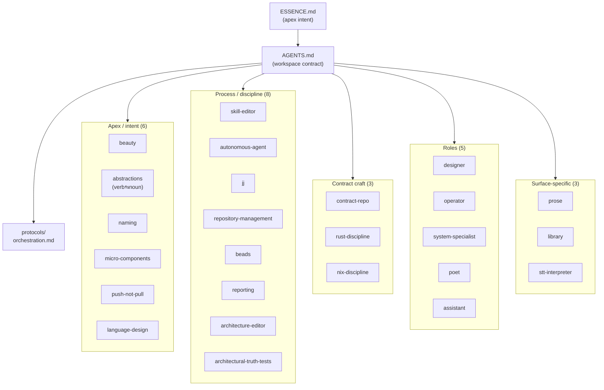
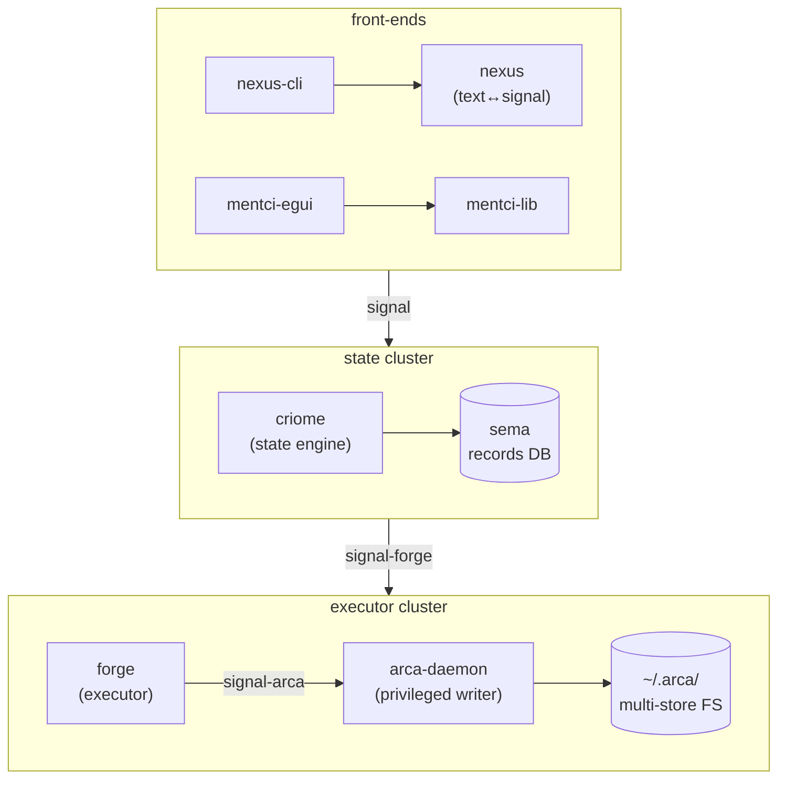
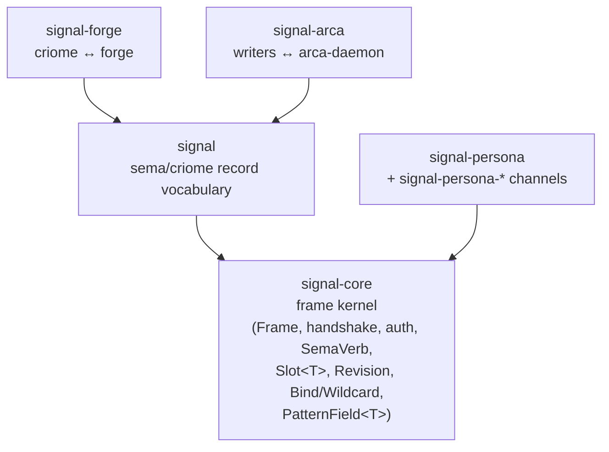
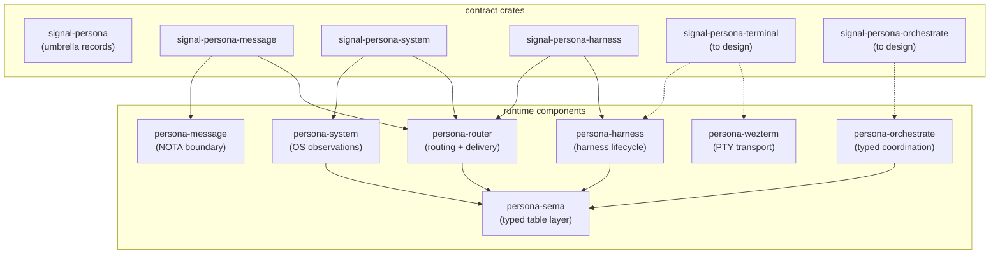

# 91 · Workspace snapshot — skills + architecture, 2026-05-09

Status: descriptive snapshot. Not a redesign, not a proposal —
"what currently exists" after reading every workspace skill, every
per-repo `skills.md`, and every per-repo `ARCHITECTURE.md` across
the LiGoldragon checkouts. Read this when you want the layout
without re-reading 87 files.

Author: Claude (designer)

Date: 2026-05-09

---

## 0 · TL;DR

Workspace = `ESSENCE.md` + `AGENTS.md` + 25 cross-cutting skills +
1 protocol, applied across **~45 active repos** clustered into
four ecosystems:

| Ecosystem | Working | Skeleton-as-design | Total repos |
|---|---|---|---|
| Sema (apex + records substrate) | nota-codec, nota-derive, sema, signal-core, signal, signal-derive, nexus, nexus-cli | forge, arca, prism, mentci-egui, mentci-lib, signal-forge | ~14 |
| Persona (interactive AI harnesses) | persona, persona-sema, persona-message (transitional), persona-router (partial), persona-system, persona-wezterm, signal-persona, signal-persona-{message,system,harness} | persona-harness, persona-orchestrate, signal-persona-{terminal,orchestrate} (to design) | ~13 |
| CriomOS / deploy | CriomOS, CriomOS-home, CriomOS-emacs, horizon-rs, lojix-cli | chroma, chronos | ~9 (incl. lojix-archive, hexis) |
| Orbital | AnaSeahawk-website, orchestrator (Gas-City), TheBookOfSol, substack-cli | — | ~5+ |

Discipline body is coherent. Drift register is small — 7 items
(§3), each with an owner. Active locks are idle. The implementation
pair's next slice is **message-Frame end-to-end** through
`persona-sema` (per assistant/88); the design pair's next slice is
the **convergence report** (was /86 §6.1).

---

## 1 · The discipline layer

### 1.1 · Apex — `ESSENCE.md`

Intent: **eventually impossible to improve** in a bounded domain.
Priority order: clarity → correctness → introspection → beauty.

Load-bearing rules at the apex:

- **verb belongs to noun** — every reusable verb attaches to a
  type; free functions are incorrectly-specified verbs.
- **perfect specificity** — every typed boundary names exactly
  what flows through it; no `Unknown` variants, no
  string-tagged dispatch, no generic-record fallbacks.
- **infrastructure mints identity, time, and sender** — the
  agent supplies content; the system supplies context.
- **polling is forbidden** — producers push, consumers
  subscribe; three named carve-outs (reachability probes,
  backpressure-aware pacing, deadline timers).
- **micro-components** — one capability, one crate, one repo;
  components fit in a single LLM context window;
  cross-crate `path = "../"` is forbidden.
- **content-addressing** — identity is the hash of canonical
  bytes; mutable handles ("slots") sit on top.
- **naming** — full English words; no crate-name prefix on
  types; `messageId` only when no `Message` namespace.
- **language-design instincts** — delimiter-first, no
  keywords, position defines meaning, every value is
  structured, delimiters earn their place.
- **NOTA is the only text format. Ever.** (`skills/language-design.md` §0
  bold-letter rule, landed 2026-05-08.)
- **beauty is the criterion** — if it isn't beautiful, it
  isn't done. Ugliness is diagnostic.

### 1.2 · Skills tree



25 cross-cutting skills + 1 protocol + 5 role skills. Most-recent
addition: **`assistant` role** infrastructure (commit `651413a7`,
2026-05-08).

### 1.3 · Recent discipline-layer changes

- 2026-05-08: `skills/operator-assistant.md` + AGENTS.md role list +
  `tools/orchestrate` role list + `reports/operator-assistant/`. The
  five-role coordination model is now `operator | designer |
  system-specialist | poet | assistant`.
- 2026-05-08: `skills/language-design.md` §0 — **"No new text
  formats. Ever."** Bold-letter rule. Refuses any
  "PersonaText" / "HarnessText" / "MessageLang" / etc. on
  sight.
- 2026-05-08: A.2 (harness boundary text = Nexus) + A.5
  (Commands = noun-form) locked in.

---

## 2 · The architecture layer

### 2.1 · Sema-ecosystem (apex; long-term direction)

Apex doc: `~/primary/repos/criome/ARCHITECTURE.md` (the
read-this-first across every sema-ecosystem repo).

Three runtime clusters speak via typed protocols:



Layered protocol family:



Per-repo state:

| Repo | Role | Status |
|---|---|---|
| `nota` | text format spec | spec, stable |
| `nota-codec` | Lexer + Decoder + Encoder + traits | working core |
| `nota-derive` | proc-macros for Nota | working |
| `signal-core` | shared kernel: Frame, handshake, twelve verbs, Slot, Revision, pattern markers | working |
| `signal` | sema/criome record vocabulary atop signal-core | working with drift (§3.1) |
| `signal-derive` | `#[derive(Schema)]` proc-macro | skeleton |
| `signal-forge` | criome ↔ forge verbs | skeleton-as-design |
| `signal-arca` | not yet a repo; named in criome ARCH §11 as needed | not yet created |
| `nexus` | text translator daemon | renovating to Tier 0 |
| `nexus-cli` | thin text shuttle | M0 working |
| `nexus-spec-archive` | retired delimiter-family-matrix spec | archive |
| `sema` | typed-database kernel (redb + rkyv) | kernel working |
| `criome` | state engine | skeleton; apex doc canonical |
| `forge` | build/deploy executor | skeleton-as-design |
| `arca` | content-addressed FS + arca-daemon | day-one skeleton |
| `prism` | records → Rust source projector | stub |
| `mentci-lib` | application-logic library for GUI shells | skeleton-as-design |
| `mentci-egui` | first egui shell over mentci-lib | skeleton-as-design |

The twelve sema verbs are: `Assert · Subscribe · Constrain · Mutate
· Match · Infer · Retract · Aggregate · Project · Atomic · Validate
· Recurse`. Closed enum on `signal_core::SemaVerb`.

### 2.2 · Persona-ecosystem (active build)

Apex doc: `~/primary/repos/persona/ARCHITECTURE.md`. Channel-first
choreography: each pair of components that signals across a wire
shares a dedicated `signal-persona-*` contract repo. Each
state-bearing component owns its own redb file via `persona-sema`
as a library.



Per-repo state:

| Repo | Role | Status |
|---|---|---|
| `persona` | apex composition + flake + e2e tests | active |
| `signal-persona` | umbrella domain records (Message, Delivery, Authorization, Binding, Harness, Observation, Lock, StreamFrame, Deadline, Transition) | shipped |
| `signal-persona-message` | message-cli → persona-router | shipped (verb-form names; §3.3) |
| `signal-persona-system` | persona-system → persona-router | shipped (verb-form names; §3.3) |
| `signal-persona-harness` | persona-router ↔ persona-harness | shipped (verb-form names; `body: String` provisional, §3.4) |
| `signal-persona-terminal` | persona-harness → persona-wezterm | to design (gating cleared by A.2) |
| `signal-persona-orchestrate` | agents/tools → persona-orchestrate | to design |
| `persona-message` | NOTA boundary, message CLI, transitional ledger | working transitional |
| `persona-router` | delivery routing + gate state | partial: `DeliveryGate` consumes signal-persona-system; `RouterActor` still on old paths (per assistant/85) |
| `persona-system` | Niri focus + input-buffer adapter | working |
| `persona-harness` | harness identity + lifecycle | skel + working seam |
| `persona-wezterm` | durable PTY + viewer transport | working |
| `persona-orchestrate` | typed coordination state (future of `tools/orchestrate`) | skeleton |
| `persona-sema` | typed Persona tables over sema kernel | working library; runtime adoption pending |

Per assistant/88, the next implementation slice is the **message-Frame
end-to-end witness**:

```text
signal-persona-message frame
  → persona-router actor
  → router-owned state actor
  → persona-sema typed table
  → router.redb
  → signal-persona-message reply frame
```

Until that test exists, behavior tests can pass while the runtime
secretly uses the old text-file or in-memory paths.

### 2.3 · CriomOS / deploy ecosystem

The platform underneath everything. Active and shipping; lojix-cli
is the operator's deploy entry point (Nota-native, no flags).

| Repo | Role | Status |
|---|---|---|
| `CriomOS` | NixOS host platform + cluster meta-repo | CANON, active |
| `CriomOS-home` | Home Manager profile | CANON, active |
| `CriomOS-emacs` | Emacs config as flake module | CANON, active |
| `horizon-rs` | Cluster proposal projection (typed Rust + small CLI) | CANON, active |
| `lojix-cli` | Nota-native deploy CLI | TRANSITIONAL, active (will fold into `forge` post-CriomOS-cluster) |
| `lojix-archive` | First-generation archive | ARCHIVED |
| `chroma` | Visual-state daemon (theme + warmth + brightness) | skeleton-as-design |
| `chronos` | Time-and-sky daemon (DE440 ephemeris + zodiacal time) | skeleton-as-design |

Cluster Nix signing is the active sharp edge per
`skills/system-specialist.md` §"Cluster Nix signing" — only cache
nodes have daemon-attached signing today; deploys must route
through a builder cache to produce signed paths.

### 2.4 · Orbital

Outside the four-ecosystem trunk:

| Repo | Role | Note |
|---|---|---|
| `AnaSeahawk-website` | Public archive (Foundations / Living-Year / Dreamwork / Relationship) | Public/private split with sibling `the-vessel` |
| `hexis` | Declarative config reconciler (declared/snapshot/live × once/ensure/always) | Independent project; ractor-based; integrates with home-manager |
| `orchestrator` | Criopolis cascade dispatcher (Gas City beads → `gc sling`) | Tied to `GOALS.md` "Recreate a Better Gas City" target |
| `TheBookOfSol` | Poet's writing project | (no `ARCHITECTURE.md`/`skills.md` in the scan; per `skills/poet.md` §"Owned area") |
| `substack-cli` | Poet's publish tool | (skills.md lists as poet-owned; no ARCH in scan) |
| `goldragon` | Cluster proposal data | (consumed by horizon-rs / lojix-cli) |
| `nexus` (LiGoldragon org) | older retired language-spec repo | (the active translator daemon is the LiGoldragon-org `nexus`; the orbital `nexus` describes the older delimiter-family-matrix spec — see §3.6) |

---

## 3 · Drift register

Items where the docs and the current shape disagree. Each has a
named owner.

### 3.1 · `signal` ARCH still claims kernel ownership

`signal/ARCHITECTURE.md` §"Boundaries" still lists `Frame`,
`Body`, `Request`, `Reply`, `OutcomeMessage`, `HandshakeRequest`,
`HandshakeReply`, `ProtocolVersion`, `AuthProof`,
`PatternField<T>`, `Slot`, `Revision`, AND the verb set as owned.
But `signal-core/ARCHITECTURE.md` §1 says **signal-core** owns all
of those.

Concretely: the kernel extraction landed in `signal-core` (per
contract-repo skill §"Kernel extraction trigger") but
`signal/ARCHITECTURE.md` hasn't been rescoped to "sema/criome
record vocabulary atop signal-core."

Owner: **designer** — the rescope is a doc edit, not a code
change. The actual code already correctly imports kernel pieces
from `signal-core`.

### 3.2 · `persona-orchestrate/skills.md` references retired `persona-store`

Says: *"Keep the main assembled database write boundary in
`persona-store`."* `persona-store` was retired per designer/78 §
convergence. Should reference each component's own
`persona-sema`-backed state actor.

Owner: **operator/assistant** — mechanical drift fix during a
touch on persona-orchestrate.

### 3.3 · Verb-form names across `signal-persona-*` channels

A.5 = noun-form; the shipped channels still carry verb-form. Per
`primary-28v`:

| Contract | Current (verb-form) | Target (noun-form) |
|---|---|---|
| signal-persona-message | `Submit`, `Inbox` (req); `SubmitOk`, `SubmitFailed`, `InboxResult` (rep) | `MessageSubmission`, `InboxQuery`; `SubmissionAcceptance`, `SubmissionRejection`, `InboxResult` |
| signal-persona-system | `SubscribeFocus`, `UnsubscribeFocus`, `ObserveFocus`, `SubscribeInputBuffer`, `UnsubscribeInputBuffer`, `ObserveInputBuffer` | `FocusSubscription`, `FocusUnsubscription`, `FocusObservation`, … |
| signal-persona-harness | `DeliverMessage`, `SurfaceInteraction`, `CancelDelivery` | `MessageDelivery`, `InteractionSurfacing`, `DeliveryCancellation` |

Owner: **operator/assistant** rename pass. `primary-28v` is the
tracking bead.

### 3.4 · `body: String` provisional in two channels

`signal-persona-message::SubmitMessage` and
`signal-persona-harness::DeliverMessage` carry `body: String`. Per
A.2 = Nexus + the bold-letter rule, this becomes a typed Nexus
record. Tracked: `primary-b7i`.

Owner: **designer** (designs the typed record shape) →
**operator/assistant** (lands the migration).

### 3.5 · Inbound/Outbound sections missing in 8 ARCH files

Per designer/79 (architecture audit), 8 `persona-*` runtime repos
lack the operator/77 §2 Inbound/Outbound skeleton. Operator/87's
truth pass corrected `persona-store` / store-actor / `NexusVerb` /
`NexusPattern` references but didn't add Inbound/Outbound sections.

Owner: **operator/assistant** — Mode B mechanical pass per the
designer/81 + operator/83 + assistant/82 working model.

### 3.6 · Two `nexus` ARCH files exist

The active translator daemon repo
(`/git/github.com/LiGoldragon/nexus`) carries the Tier-0-renovating
ARCH. A second repo (`/git/github.com/LiGoldragon/nexus-spec-archive`)
correctly retains the retired delimiter-family-matrix spec; the
heading inside it still says `# ARCHITECTURE — nexus`. Cosmetic.

Owner: **operator** — heading rename to `# ARCHITECTURE —
nexus-spec-archive` if the next architecture-truth pass touches
the file.

### 3.7 · `FocusObservation` contract convergence

`primary-3fa` — `signal-persona-system::FocusObservation` (the
shipped contract) and `persona-system::FocusObservation` (the
producer-side, pre-contract) are duplicate types. The convergence
note from designer/80 is half-done; the rename pass on the
producer side is owed once `RouterActor` consumes the contract at
the gate boundary (the next implementation slice).

Owner: **operator/assistant** during the next router slice.

---

## 4 · Status table — every active repo

| Repo | Ecosystem | Sub-role | Status |
|---|---|---|---|
| `nota` | sema | text format spec | spec, stable |
| `nota-codec` | sema | runtime codec | working core |
| `nota-derive` | sema | proc-macros | working |
| `signal-core` | sema | wire kernel | working |
| `signal` | sema | sema/criome records | working with drift §3.1 |
| `signal-derive` | sema | schema introspection derive | skeleton |
| `signal-forge` | sema | criome↔forge | skeleton-as-design |
| `nexus` | sema | text translator daemon | renovating to Tier 0 |
| `nexus-cli` | sema | thin text shuttle | M0 working |
| `nexus-spec-archive` | sema | retired spec | archive |
| `sema` | sema | typed DB kernel | working kernel |
| `criome` | sema | state engine | skeleton; apex doc canonical |
| `forge` | sema | build/deploy executor | skeleton-as-design |
| `arca` | sema | content-addressed FS | day-one skeleton |
| `prism` | sema | records → Rust projector | stub |
| `mentci-lib` | sema | GUI lib | skeleton-as-design |
| `mentci-egui` | sema | first egui shell | skeleton-as-design |
| `persona` | persona | apex composition | active |
| `signal-persona` | persona | umbrella records | shipped |
| `signal-persona-message` | persona | message channel | shipped (renames pending) |
| `signal-persona-system` | persona | system channel | shipped (renames pending) |
| `signal-persona-harness` | persona | harness channel | shipped (renames pending) |
| `persona-message` | persona | NOTA boundary + transitional ledger | working transitional |
| `persona-router` | persona | routing + delivery | partial; next slice = full Frame |
| `persona-system` | persona | OS observations adapter | working |
| `persona-harness` | persona | harness identity + lifecycle | skel + working seam |
| `persona-wezterm` | persona | PTY transport | working |
| `persona-orchestrate` | persona | typed coordination | skeleton |
| `persona-sema` | persona | typed table layer | working library |
| `CriomOS` | deploy | NixOS host | CANON active |
| `CriomOS-home` | deploy | Home Manager profile | CANON active |
| `CriomOS-emacs` | deploy | Emacs config | CANON active |
| `horizon-rs` | deploy | proposal projection | CANON active |
| `lojix-cli` | deploy | Nota-native deploy CLI | TRANSITIONAL active |
| `lojix-archive` | deploy | first-gen archive | ARCHIVED |
| `chroma` | deploy | visual-state daemon | skeleton-as-design |
| `chronos` | deploy | time-and-sky daemon | skeleton-as-design |
| `goldragon` | deploy | cluster proposal data | active data repo |
| `AnaSeahawk-website` | orbital | public archive | archive shape |
| `hexis` | orbital | config reconciler | independent project |
| `orchestrator` | orbital | Criopolis cascade dispatcher | Gas City target |
| `TheBookOfSol` | orbital | writing project | poet's surface |
| `substack-cli` | orbital | publish tool | poet's tool |
| `workspace` | meta | meta-repo (Criome's pre-`primary` development env) | active dev env |

---

## 5 · Active state (snapshot 2026-05-09)

### 5.1 · Locks
All five role locks idle (`tools/orchestrate status`).

### 5.2 · Working copy
Clean; on top of `7aed2a22` (system-specialist: codex wezterm
contrast).

### 5.3 · Open BEADS (top items)
- **P1** `primary-2w6` — persona-message migrates off
  text-files+polling onto persona-sema.
- **P2** active: `primary-b7i` (body→Nexus migration),
  `primary-28v` (verb→noun naming sweep), `primary-0cd`
  (endpoint.kind closed enum), `primary-tlu` (Persona\* prefix
  sweep), `primary-3fa` (FocusObservation convergence),
  `primary-186` (ractor adoption for daemons), `primary-4zr`
  (sema kernel hygiene), `primary-kxb` (open architectural
  decisions — 2 of 4 resolved).
- **P3/P4**: deferred-by-design or low-priority (chronos Phase 1,
  whisrs gaps, signal-network design, lojix-cli .gitignore).

### 5.4 · Recent reports (since handoff /86)
- `operator/87` — architecture-truth pass; 11 ARCH files
  cleaned of `persona-store` / store-actor / `NexusVerb` /
  `NexusPattern` references.
- `assistant/88` — broader signal+sema audit; identifies
  message-Frame end-to-end as the next router slice;
  confirms macro + contracts + sema kernel + persona-sema
  all landed but runtime crates haven't adopted persona-sema.
- `system-specialist/89` — codex wezterm light-contrast
  diagnostic; orthogonal to design queue.

### 5.5 · Next slices (from /86 + above)

**Implementation pair (operator + assistant):**
1. `persona-router` — `RouterActor` consumes
   `signal-persona-system` `Frame`, uses `DeliveryGate` from
   the contract, drops the legacy `persona_system` import.
2. `persona-router` — message-Frame end-to-end witness through
   `persona-sema` (the architectural-truth test sketched in
   `persona/TESTS.md`).
3. `primary-0cd` — `endpoint.kind` typed enum (assistant
   warm-up).
4. Inbound/Outbound sections in 8 persona-* ARCH files
   (assistant Mode B).
5. Persona\* prefix sweep (`primary-tlu`).

**Design pair (user + me):**
1. **Convergence report** locking in operator/83 + assistant/82
   joint working model (next /92).
2. `signal-persona-orchestrate` MVP contract design.
3. `signal-persona-terminal` scaffold under Nexus discipline.
4. Bucket A items A.1 (ZST exception), A.3 (terminal adapter
   protocol), A.6 (Authorization shape), A.7 (snapshot vs
   log-replay), A.8 (`nota-codec::expect_end` home).

---

## 6 · Cross-ecosystem observations

### 6.1 · Discipline depth
The discipline-layer depth is striking: ESSENCE → AGENTS → 25
skills + 5 role skills + 1 protocol → per-repo `AGENTS.md` /
`skills.md` / `ARCHITECTURE.md` → `reports/<role>/`. Each layer
cites the next; rules live once. Per `ESSENCE.md`
§"Efficiency of instruction" — duplication is a smell.

### 6.2 · Channel-first choreography
Persona's "contract repo lands before runtime behavior" model is
the load-bearing innovation that lets the design pair and
implementation pair work in parallel without racing. `signal-core`'s
`signal_channel!` macro is the kernel that enables this; per
`reports/designer/76`, the macro intentionally stays small and
declarative (no transport, no dispatch, no actors).

### 6.3 · Storage substrate completeness
The sema kernel + per-consumer typed layer split (`sema` + `persona-sema`)
is shipped. The runtime components don't yet use persona-sema. This
is the load-bearing remaining gap between architecture and code per
`assistant/88`.

### 6.4 · Apex docs match each other
The two apex documents (`criome/ARCHITECTURE.md` for
sema-ecosystem; `persona/ARCHITECTURE.md` for Persona) reinforce
each other rather than overlap. Persona ARCH §3 explicitly defers
wire conventions to signal-core; criome ARCH §3 explicitly carves
out Persona channels as a parallel family. Clean.

### 6.5 · Lock-file discipline
`protocols/orchestration.md` has been updated with task locks
(`'[primary-f99]'` syntax) bridging BEADS lifecycle with in-flight
agent coordination. Each role's lock file is gitignored runtime
state. The protocol survives multi-agent parallel work because
locks are role-owned, not file-owned.

### 6.6 · GOALS.md context
`GOALS.md` names **Recreate a Better Gas City** as the workspace's
standing direction. The Persona work is the interactive-AI-harness
substrate that makes the Gas City rebuild tractable; the Sema
ecosystem is the typed state and language layer; CriomOS is the
host. The orbital `orchestrator` repo carries the transitional
Gas-City cascade dispatcher.

---

## 7 · See also

- `~/primary/ESSENCE.md` — workspace intent.
- `~/primary/AGENTS.md` — agent contract.
- `~/primary/protocols/orchestration.md` — role coordination.
- `~/primary/RECENT-REPOSITORIES.md` — repo cutoff list.
- `~/primary/GOALS.md` — Gas-City direction.
- `~/primary/repos/criome/ARCHITECTURE.md` — sema-ecosystem apex.
- `~/primary/repos/persona/ARCHITECTURE.md` — Persona apex.
- `~/primary/reports/designer/86-handoff-from-context-reset-2026-05-08.md` — handoff index.
- `~/primary/reports/operator/87-architecture-truth-pass.md` — recent ARCH cleanup.
- `~/primary/reports/operator-assistant/88-recent-code-signal-sema-audit.md` — current implementation gap analysis.

---

*End snapshot. Status as of 2026-05-09 evening.*
