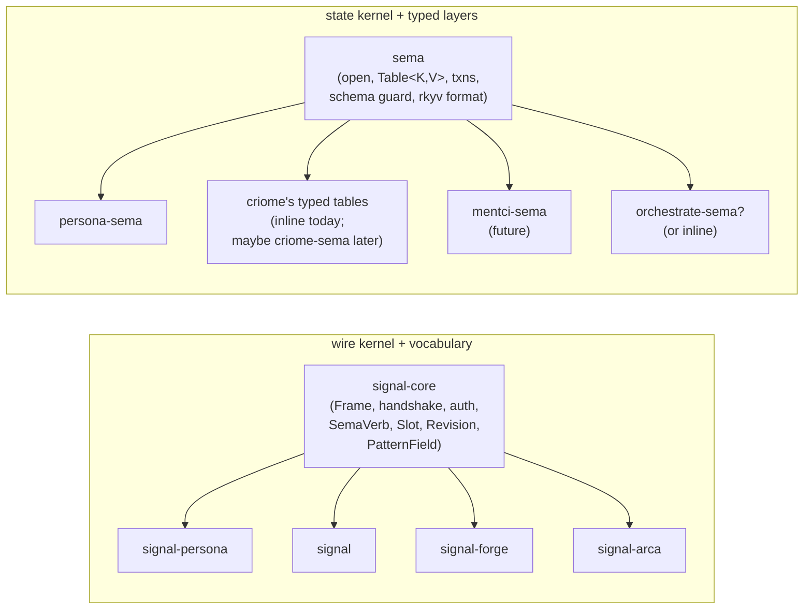
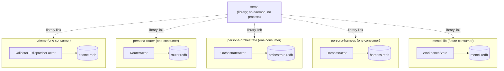
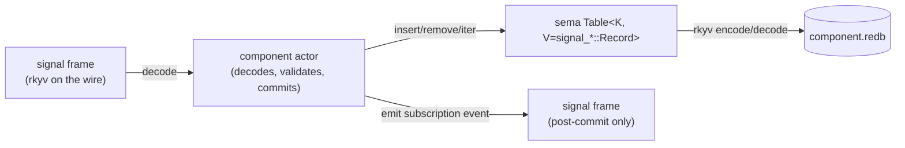

# 92 · Sema as the workspace's database library — architecture revamp

Status: design report. Reframes sema as a pure database
library and dissolves the older "criome IS sema's engine"
framing. Names the new model and cascades architecture
updates across the workspace.

Author: Claude (designer)

Date: 2026-05-09

---

## 0 · TL;DR

**Sema is the workspace's typed-database library.** Every
state-bearing component owns its own sema database — criome
owns one, persona-router owns one, persona-orchestrate owns
one, persona-harness owns one, mentci-lib will own one,
future components will own theirs.

This dissolves the older framing where criome was "sema's
engine" and sema was "the records DB criome owned." Sema is
no more "owned by" criome than `signal-core` is owned by
criome — both are kernel libraries. Criome is one consumer
of sema, on equal footing with every other state-bearing
component.

The shift makes the workspace's component shape symmetric
and matches the live code: persona-sema already follows
this pattern; sema's typed-kernel surface
(`Sema::open_with_schema`, `Table<K, V>`, closure-scoped
txn helpers) is the production API; criome's continued use
of the legacy slot-store path is a transitional detail,
not a definitional one.

The destination is **perfect specificity** — every value
typed, no opaque strings. We're not there today: `body:
String` on `signal_persona::Message`, `endpoint.kind:
String` on persona-message — these are tracked
(`primary-b7i`, `primary-0cd`) and will become typed Nexus
records. Strings are allowed for now where the typed shape
isn't yet known; the type system grows them into kinds as
the schema grows (per `skills/language-design.md` §6).

---

## 1 · The conceptual shift

### 1.1 · What sema was framed as

`criome/ARCHITECTURE.md` §0 said:

> **Sema is the database** — typed, content-addressed
> records.
> **Criome is the state-engine around sema** — validates,
> persists, communicates. Everything else orbits.

The "three runtime clusters" diagram put criome+sema
together in the **state cluster**, set apart from
**executor** (forge+arca) and **front-ends**
(nexus+mentci). Within that picture, criome owned sema in
the way a daemon owns its store; everyone else either
talked to criome (front-ends) or had bytes pushed at them
(executors).

That framing was correct when criome was the only
state-bearing daemon and sema was being designed as the
kind of database criome would use. It became less correct
as more components emerged that also needed durable typed
state — persona-router needs router-owned state,
persona-orchestrate needs orchestrate-owned state,
persona-harness needs harness-owned state, mentci-lib will
need shell-owned state — and sema's typed kernel was
generalized to serve them all.

The shift was already named in
`reports/designer/63-sema-as-workspace-database-library.md`
(sema is to state what `signal-core` is to wire — both are
kernels every consumer's typed layer depends on); this
report lifts that shift to the apex framing across the
whole architecture.

### 1.2 · What sema is now

Sema is the typed-database library. It owns:

- redb file lifecycle (open-or-create, parent mkdir,
  ensure_tables);
- `Table<K, V: Archive>` typed wrapper that hides rkyv
  encode/decode at the table boundary;
- closure-scoped read/write transaction helpers;
- the standard `Error` enum;
- the schema-version guard;
- the rkyv format-control choices (canonical pinned
  feature set: `std + bytecheck + little_endian +
  pointer_width_32 + unaligned`);
- `Slot(u64)` + slot counter as a utility for append-only
  stores.

Each consumer adds:

- its `Schema` constant (just the version number);
- its typed `Table<K, V>` constants binding stable redb
  names to key/value types — values are records from the
  matching `signal-*` contract crate;
- its open conventions (path discovery, schema
  registration);
- migration helpers when needed.

Each consumer's runtime actor adds:

- the mailbox into the database;
- transaction sequencing;
- commit-before-effect ordering;
- subscription events emitted after durable state changes.

This is the same shape as `signal-core` (kernel) →
`signal-persona` / `signal-forge` / `signal-arca` / `signal`
(consumer vocabulary). Two parallel kernel-libraries, each
serving every consumer:



### 1.3 · The picture across components



There is no "sema daemon." There is no process called sema.
Every component links sema as a library and owns its own
database file. Cross-component access is by signal frame,
not by shared database — per
`skills/rust-discipline.md` §"redb + rkyv" anti-pattern
"`Arc<Mutex<Database>>` shared across actors."

---

## 2 · Why this is the right shape

### 2.1 · Symmetry

The workspace already accepts that `signal-core` is a pure
library with no special owner. The same logic applies to
sema. A daemon owns its database; a library owns its types
and helpers. Conflating "owns the helpers" with "owns the
data" is the mistake the older framing made.

### 2.2 · Micro-components

Per `skills/micro-components.md` §"The rule":

> One capability, one crate, one repo.

Sema's capability is **typed durable state**. Criome's
capability is **validation + dispatch + record-engine
semantics**. Persona-router's capability is **delivery
routing**. Conflating sema with criome smeared a kernel
responsibility into a component.

### 2.3 · Production posture

Per `reports/operator-assistant/90-rkyv-redb-design-research.md`
§"Executive Summary" (rkyv+redb research, 2026-05-09), the
right shape is:

- **redb owns** persistence, ACID transactions, MVCC,
  B-tree ordering, table identity, crash recovery.
- **rkyv owns** typed value encoding, validation, optional
  zero-copy access.
- **sema owns** the integration contract: stable table
  constants, rkyv format choices, schema/version guard,
  typed errors, transaction scope, and the rule that redb
  keys are stable query keys while rkyv values are
  archived records.

That is a kernel-library responsibility, not a
daemon-of-records responsibility. Treating sema as a daemon
would force every state-bearing component to either
(a) bottleneck through it (bad: serializes all writers,
defeats redb's MVCC) or (b) re-implement the integration
locally (bad: drift across components, no shared rkyv
format guard).

### 2.4 · Avoiding shared-state failure modes

Two anti-patterns the old framing made plausible — both
already named in `skills/rust-discipline.md` §"redb + rkyv"
anti-pattern table:

- **Shared `Arc<Mutex<Database>>` across actors** — coarse
  lock around the whole DB; defeats redb's transaction
  model; serializes all writers.
- **Storage actor as namespace** — a single `StorageActor`
  that answers "store this" / "fetch that" for everyone;
  verb-shaped; the actor owns *storing*, not domain data.

Both are forbidden. The new shape — each domain actor
opens its own tables on a domain-owned `Sema` handle — is
the correct shape, and it requires that sema be a library,
not a centralized engine.

---

## 3 · The new sema interface (production)

The kernel surface that consumers depend on. Some pieces
are shipped today; others are landing as part of the
assistant's current `primary-nyc` (Table iterators) +
`primary-4zr` (kernel hygiene) work.

### 3.1 · Open

```rust
pub fn open_with_schema(path: &Path, schema: &Schema) -> Result<Self>
```

The kernel writes the consumer's schema version on first
open and hard-fails on any future mismatch. Mismatch is a
coordinated-upgrade signal, not a runtime recovery path.
Schema is just `{ version: SchemaVersion }` — table names
+ types live on typed `Table<K, V>` constants in the
consumer crate (per redb's requirement that table identity
is `(name, key_type, value_type)`).

Future strengthening (per assistant/90 §"Add a Database
Header Record"): a `DatabaseHeader` record persisting the
workspace's rkyv format identity (little-endian,
pointer-width-32, unaligned). The kernel hard-fails on
format mismatch the same way it does on schema mismatch.
This survives a future rkyv-feature change without silent
corruption.

### 3.2 · Tables

Typed wrapper around redb's `TableDefinition<'_, K, &[u8]>`:

| Method | Purpose |
|---|---|
| `Table::new(name)` | const constructor — declare at module top |
| `Table::name()` | the redb table name |
| `Table::ensure(txn)` | explicit table creation (planned: assistant `primary-nyc`) |
| `Table::get(txn, key)` | typed read; `Result<Option<V>>` — `None` if table missing or key absent |
| `Table::insert(txn, key, value)` | typed write |
| `Table::remove(txn, key)` | typed remove; returns `bool` |
| `Table::iter(txn)` | typed iteration (planned: assistant `primary-nyc`) |
| `Table::range(txn, range)` | typed range scan (planned: assistant `primary-nyc`) |

Values implement `Archive + Serialize<…> + Archived: Deserialize + CheckBytes`.
Keys implement `redb::Key`. Both bounds centralised inside
sema; consumers see typed Rust values in and out.

### 3.3 · Closure-scoped transactions

```rust
sema.read(|txn| MESSAGES.get(txn, 1))?
sema.write(|txn| {
    MESSAGES.insert(txn, 1, &message)?;
    OBSERVATIONS.insert(txn, 2, &observation)?;
    Ok(())
})?
```

Read transactions drop at end of scope. Write transactions
commit on `Ok`, drop (rollback) on `Err`. Read-modify-write
invariants belong inside one write transaction.

### 3.4 · Loud failures

Per assistant/90 §"Make Invalid Bytes Loud" (no `Default`
on decode failure; corruption is a typed error, not a
silent recovery):

- typed `Error::Rkyv` on invalid archive bytes;
- table-name + key in higher-level error messages where
  practical;
- corruption tests that write invalid bytes and assert
  hard failure;
- never synthesize `Default` values on decode failure.

Sema's current `Result<Option<V>>` shape correctly
surfaces decode failures as errors (not `None`). Sema does
**not** implement `redb::Value` for `Rkyv<T>` — that
pattern (used in some external projects) forfeits typed
errors because `redb::Value::from_bytes` cannot return a
typed error and falls back to `Default`.

### 3.5 · Async stays out

Sema is synchronous. Consumers using tokio wrap blocking
sema calls at the actor boundary
(`tokio::task::spawn_blocking` in the relevant ractor
handler, the pattern Overdrive's local observation store
follows). The kernel does not depend on tokio.

### 3.6 · Pairing with Signal contracts

The mechanical pairing across the wire-storage seam:



- **Signal contracts (`signal-persona`, `signal-persona-*`,
  `signal`)** own the typed record kinds — the values that
  travel both on the wire and in storage.
- **Consumer-sema crates (`persona-sema`, future
  `criome-sema` if extracted, etc.)** own typed
  `Table<K, V>` constants where `V` is a `signal-*` record
  type.
- **The component actor** moves frames in/out of memory
  and storage:
  - On Submit: decode signal frame → write through
    `MESSAGES.insert` → commit → emit subscription event
    (post-commit, never before).
  - On Match: read through `MESSAGES.iter` → encode signal
    records → respond.

A `signal_persona::Message` on the wire round-trips through
`MESSAGES.insert` to the same `Message` on disk. The
type-system identity is the same on both sides; the rkyv
format choices are pinned in sema; the round-trip is the
discipline `skills/contract-repo.md` §"Examples-first
round-trip discipline" extended across the
wire-and-storage seam.

The strings-allowed-for-now caveat applies: `Message::body:
String` until `primary-b7i` (typed Nexus record) lands. The
type system grows the strings into kinds as the schema
matures.

### 3.7 · What stays outside sema

Per assistant/90 §"Decide What Belongs Outside redb":

| Data shape | Home |
|---|---|
| Small to medium typed records, current-state tables, indexes | sema (redb + rkyv values) |
| Large blobs, build outputs, long binaries | arca (content-addressed FS) — sema records reference by hash |
| High-frequency append logs, transcript streams | append-only domain log + sema indexes |
| Sequential-replay-only data (KERI-style event chains) | append log + sema offset index, not redb-as-only-store |

For Persona, this means: `signal_persona::Message` records
go in sema; the bytes of large message attachments, when
they appear, go in arca with sema holding only the
content-hash reference. Transcript streams from
persona-harness, when persistence matters, go in an append
log with sema indexing the offsets.

---

## 4 · Strings remain provisional

The destination is perfect specificity: every value typed,
no opaque strings. We're not there today.

Currently allowed string fields:

| Field | Status | Tracked |
|---|---|---|
| `signal_persona::Message::body: MessageBody(String)` | provisional; will become typed Nexus record | `primary-b7i` |
| `endpoint.kind: String` (persona-message) | will become closed enum `EndpointKind { Human, PtySocket, WezTermPane }` | `primary-0cd` |
| `signal_persona::PrincipalName(String)` | semi-typed (newtype); inner string OK at the human-identifier boundary | (no bead — boundary type) |

Strings are **transitional placeholders for typed records
not yet specified**. The schema's job is to grow them into
types. Per `skills/language-design.md` §6:

> If a name or type is stored as a flat string, the
> ontology is incomplete. Names are typed domain variants;
> types are structured node trees. As the schema grows,
> strings collapse into typed records.

Today's posture:

- Strings allowed where they are tracked (BEADS) and where
  the typed shape isn't known yet.
- Don't add new untracked strings.
- Don't try to type-collapse every existing string in one
  pass — let the typed shape emerge from the work that
  needs it.

Sema's `Table<K, V>` does not care whether `V` carries a
`String` field; rkyv encodes strings just fine. The
discipline is at the schema-design level
(`signal-persona` and friends), not at the kernel level.

---

## 5 · Cascade of doc updates

This report names the canonical shape; the cascade lands
across architecture docs.

| Doc | Change | Owner | Status |
|---|---|---|---|
| `criome/ARCHITECTURE.md` | major rewrite — drop "sema's engine" framing; criome becomes "one consumer of sema among many"; §0 + §1 + §10 rebalanced; §10.4 responsibilities table reframed | designer | landing this pass |
| `sema/ARCHITECTURE.md` | refresh interface section (header record, `Table::ensure`, `Table::iter`/`range`, loud failures); drop deprecated `reader_count` framing | assistant (`primary-nyc` + `primary-4zr` in flight) | reference this report; coordinate with assistant |
| `signal/ARCHITECTURE.md` | drift fix per /91 §3.1 — rescope as "sema/criome record vocabulary atop signal-core"; drop ownership claims that moved to signal-core | designer | landing this pass |
| `signal-core/ARCHITECTURE.md` | clarify symmetry with sema (signal-core is wire kernel; sema is state kernel) | designer | landing this pass |
| `persona-sema/ARCHITECTURE.md` | minor — make production interface explicit; reference this report | designer | landing this pass |
| `persona/ARCHITECTURE.md` | minor — already mostly aligned; tighten | designer | landing this pass |
| `persona-router/ARCHITECTURE.md` | clarify "owns its own sema database; consumes signal-persona-* records" | operator (held now for `primary-tlu`) | post-rename pass |
| `persona-system/ARCHITECTURE.md` | clarify "may persist subscription state in its own sema database" | operator (held now for `primary-tlu`) | post-rename pass |
| `persona-harness/ARCHITECTURE.md` | clarify "owns its own sema database for harness lifecycle history" | designer | landing this pass |
| `persona-orchestrate/ARCHITECTURE.md` | clarify "owns its own sema database for orchestration state"; drop the retired persona-store reference (per /91 §3.2) | designer | landing this pass |
| `mentci-lib/ARCHITECTURE.md` | note future use of sema for shell-owned state (workbench history, transcripts) | designer | landing this pass |

---

## 6 · Open questions

### 6.1 · Should criome have a `criome-sema` crate?

Persona has `persona-sema` carrying its typed `Table`
constants. Criome currently keeps its (legacy) slot-store
usage inline; once it adopts the typed kernel, its tables
could either:

- (a) live inline in `criome/src/tables.rs`, or
- (b) split out into a `criome-sema` crate parallel to
  `persona-sema`.

Option (a) is simpler today; option (b) is the symmetric
shape. Recommendation: defer to whenever criome's
typed-kernel adoption lands. If criome's tables grow to a
substantial set, split into criome-sema; if they stay
compact (a few records), inline.

### 6.2 · Mentci's storage shape

Mentci-lib's `WorkbenchState` model owns shell-side state
today. Once persistence matters (recall last-opened
workbench, transcripts, layout preferences), it should
consume sema. Whether that's a `mentci-sema` crate or
inline `mentci/src/tables.rs` follows the same
dimensionality test as criome's case.

### 6.3 · What counts as "criome's domain" once it's no longer sema's engine?

Criome's remaining responsibilities (per the new framing):

- validates incoming signal requests (schema, refs,
  invariants, permissions);
- routes typed verbs (Assert/Mutate/Retract/etc.) to its
  own typed sema tables;
- forwards effect-bearing verbs to forge over signal-forge;
- signs capability tokens for arca writes;
- maintains the reachability view for arca GC.

These are still substantial; criome is still **the engine
of the sema-ecosystem** — but not **the engine of the sema
library**. Two different "engine" senses, only one of them
applicable.

### 6.4 · Per-component databases vs one criome database for ecosystem state

A subtle question: when persona-router commits a Message
through its own router.redb, is that "router state"
(component-local) or "criome's records" (ecosystem state)?

Today the answer is: it's **router state**. Persona-router
is its own component with its own state-bearing actor;
its commits don't go through criome. Cross-component
queries happen through signal frames over the wire (e.g.,
the message CLI's Match request goes router→router or
through some future query coordinator).

The longer arc: when the workspace converges on
"everything is sema records, and criome is the
sema-record engine," the cross-component story becomes
"each component projects its state into criome's sema as
needed." That convergence is post-MVP work; for now,
per-component databases are correct.

---

## 7 · Implementation cascade summary

What lands as this revamp completes:

**This pass (designer):**

1. designer/92 (this report) — frames the shift.
2. `criome/ARCHITECTURE.md` — major rewrite to drop
   "sema's engine" framing.
3. `signal/ARCHITECTURE.md` — drift fix per /91 §3.1.
4. `signal-core/ARCHITECTURE.md` — clarify wire/state
   kernel symmetry.
5. `persona-sema/ARCHITECTURE.md` — production interface
   alignment.
6. `persona/ARCHITECTURE.md` — light alignment.
7. `persona-orchestrate/ARCHITECTURE.md` — sema integration
   explicit; drop persona-store reference.
8. `persona-harness/ARCHITECTURE.md` — sema integration
   explicit.
9. `mentci-lib/ARCHITECTURE.md` — note future sema use.

**Held by other roles, pending this report:**

10. `sema/ARCHITECTURE.md` — assistant's `primary-nyc`
    + `primary-4zr` work; my report names the new
    interface so assistant can land it cleanly.
11. `persona-router/ARCHITECTURE.md` — operator's
    `primary-tlu` rename pass; post-rename, owner updates
    for "owns its own sema database."
12. `persona-system/ARCHITECTURE.md` — same.

**Future work (post-cascade):**

- Persona's first runtime adoption of persona-sema (the
  message-Frame end-to-end witness per assistant/88 §
  "Next Implementation Order").
- Criome's typed-kernel migration (move off the legacy
  slot-store path; decision on inline vs `criome-sema`).
- Mentci-lib's persistence (when relevant).
- Forge's state shape (when forge-daemon scaffolds).

---

## 8 · See also

- `~/primary/reports/operator-assistant/90-rkyv-redb-design-research.md`
  — production interface research grounding this revamp;
  external project survey (Overdrive, Keriox, Korrosync,
  Kaizen, Lithos, Gather Step); concrete sema API
  recommendations (header record, `Table::ensure`,
  iteration, corruption tests).
- `~/primary/reports/designer/63-sema-as-workspace-database-library.md`
  — original sema-as-library design report (this revamp
  lifts the conceptual shift to the apex doc).
- `~/primary/reports/designer/91-workspace-snapshot-skills-and-architecture-2026-05-09.md`
  §3.1 — drift register entry naming the
  signal/signal-core overlap this revamp cleans up.
- `~/primary/reports/operator-assistant/88-recent-code-signal-sema-audit.md`
  — current implementation gap (runtime crates haven't
  adopted persona-sema yet); the next implementation
  slice (message-Frame end-to-end witness) is the first
  real consumer of sema-as-library in the new framing.
- `~/primary/skills/rust-discipline.md` §"redb + rkyv —
  durable state and binary wire" — the canonical
  anti-pattern + validated-pattern table this revamp
  depends on; especially the
  `Arc<Mutex<Database>>`-shared-across-actors and
  storage-actor-as-namespace anti-patterns.
- `~/primary/skills/contract-repo.md` §"Kernel extraction
  trigger" — the layered-effect-crate pattern that
  signal/sema both follow.
- `~/primary/skills/language-design.md` §6 — the
  strings-as-transitional rule.
- `~/primary/skills/micro-components.md` — the
  one-capability-per-crate rule that motivates separating
  sema from criome.

---

*End report. The cascade follows in this same commit
sequence; subsequent commits update each ARCH file named
in §5.*
