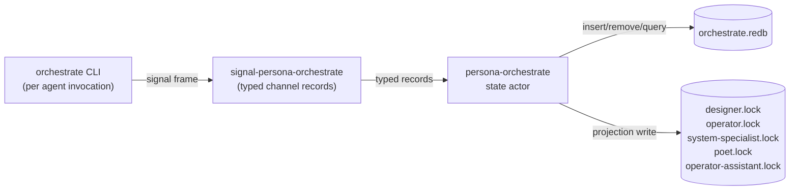

# 93 · Persona-orchestrate Rust rewrite + activity log + signal-persona-orchestrate contract

Status: design report, three coupled deliverables. Designer
creates the contract repo as part of this handoff; operator
or assistant implements `persona-orchestrate` against it.
Carries an architecture clarity audit (§1) as side product.

Author: Claude (designer)

Date: 2026-05-09

Contract repo: lands at
`/git/github.com/LiGoldragon/signal-persona-orchestrate` in
this same handoff sequence.

---

## 0 · TL;DR

Three coupled deliverables, plus an audit:

**A. Activity log** (§3). Every time an agent touches
something, a short typed record gets logged: who (role),
what (path or task token), why (short reason). Other agents
query "what's been touched recently" via CLI for situational
awareness. Records persist in persona-orchestrate's
sema-managed database; CLI is the primary surface; commit
time is infrastructure-stamped (not agent-supplied).

**B. Persona-orchestrate Rust component** (§4). Replaces
`tools/orchestrate` (a 200-line bash script) with a Rust
binary plus library. ractor-based, persona-sema-backed,
exposes the `orchestrate` CLI binary. Owns role claims,
releases, handoffs, scope queries, and the activity log.
Per-machine; concurrent invocations serialize cleanly through
redb's MVCC; lock files become projections regenerated on
commit (backward-compatible with current readers).

**C. signal-persona-orchestrate contract repo** (§5).
Designer creates the contract crate in this handoff; the
typed channel between `orchestrate` CLI clients and the
persona-orchestrate state actor. Six request kinds
(`RoleClaim`, `RoleRelease`, `RoleHandoff`,
`RoleObservation`, `ActivitySubmission`, `ActivityQuery`),
eight reply kinds. Round-trip tested.

**Side product: architecture clarity audit** (§1). Brief
sweep of meta-repos and active-development repos for
unclear or drifted parts. Most repos are clear after the
/91 + /92 pass; the gaps are small and named. The most
load-bearing finding is that the workspace lacks a
"recent-activity" surface — exactly the gap (A) closes.

---

## 1 · Architecture clarity audit

A focused designer-eye sweep of meta-repos and
actively-developed repos, looking for unclear or stale
parts. This is the audit-portion of the work; the design
deliverables in §3–§5 are independent.

### 1.1 · Meta-repos

| Doc | Status | Findings |
|---|---|---|
| `~/primary/AGENTS.md` | clear | Recent updates landed cleanly (assistant role, BEADS-as-transitional). The "no harness-dependent memory" framing carries weight. **Gap:** no mention of an activity-log discipline (this report addresses). |
| `~/primary/ESSENCE.md` | clear | Apex is stable. |
| `~/primary/protocols/orchestration.md` | clear | Describes today's bash-helper flow. **Gap:** doesn't yet name the migration to the Rust component (this report addresses). |
| `persona/ARCHITECTURE.md` | clear after /92 pass | Channel inventory still names `signal-persona-orchestrate` as "to design"; that becomes "shipped" when this contract lands. |
| `criome/ARCHITECTURE.md` | clear after /92 pass | §11 open questions list grew long; could be pruned periodically. **Out of scope here.** |
| `workspace/ARCHITECTURE.md` | clear | Older meta repo (criome's pre-`primary` dev environment). Doesn't yet name the `assistant` role. **Out of scope here**, but worth a touch later. |

### 1.2 · Persona active-development repos

| Repo | Status | Findings |
|---|---|---|
| `persona/` | clear | (See above.) |
| `persona-message/` | clear | Transitional ledger framing explicit. **Gap:** doesn't yet name the migration target table set in `persona-sema` — `MESSAGES` is named in persona-sema but its concrete migration plan isn't in persona-message's ARCH. **Tracked:** `primary-2w6`. |
| `persona-router/` | clear (held by operator) | The "router-owned state via persona-sema" framing is correct, but no concrete table list yet (since runtime adoption is pending). **Tracked:** `primary-186` (ractor adoption) + the message-Frame end-to-end witness named in assistant/88. |
| `persona-system/` | clear (held by operator) | Mostly clear; will get an own-sema framing touch when operator's prefix-rename pass completes (per /92 §5 cascade). |
| `persona-harness/` | clear after /92 pass | Lists durable-history-via-sema posture; no table list yet (pre-MVP, fine). |
| `persona-wezterm/` | clear | Scope-narrowed; doesn't try to absorb message semantics. |
| `persona-orchestrate/` | clear after /92 pass | About to become the home of the Rust impl this report designs. |
| `persona-sema/` | clear after /92 + operator's `primary-0q2` pass | `PersonaTables` materializer added 2026-05-09 (per primary-0q2). |

### 1.3 · Sema-ecosystem active repos

| Repo | Status | Findings |
|---|---|---|
| `sema/` | improving (held by assistant) | Kernel hygiene + `Table::iter`/`range` + `Table::ensure` landing (`primary-4zr` + `primary-nyc`). |
| `signal-core/` | clear after /92 pass | Wire-kernel symmetry with sema is named. |
| `signal/` | rescoping (per /92 pass) | Rescope to sema-ecosystem-vocabulary landed in ARCH; transitional duplicates of frame/handshake/auth/slot/pattern still in `src/` per /91 §3.1 drift register. |
| `nexus/` | renovating | Tier-0 grammar + twelve verbs being adopted; ARCH up-to-date. |
| `nota-codec/`, `nota-derive/` | clear | All-fields-explicit rule is load-bearing and named. |
| `nexus-cli/` | M0 working | Thin shuttle. |
| `forge/`, `arca/`, `prism/` | skeleton-as-design | Bodies land alongside criome scaffolding. |

### 1.4 · CriomOS / deploy

| Repo | Status | Findings |
|---|---|---|
| `CriomOS/`, `CriomOS-home/`, `CriomOS-emacs/` | active platform | Clear. System-specialist holding CriomOS-home now for blueprint-check fix. |
| `lojix-cli/` | TRANSITIONAL active | Nota-on-argv discipline is the model this report adopts. |
| `horizon-rs/` | active | Clear; pin pending (`primary-vtq`). |
| `chroma/`, `chronos/` | skeleton-as-design | Clear designs; bodies pending. |

### 1.5 · Cross-cutting findings

1. **No "recent-activity" surface anywhere.** Agents use
   `git log` and `bd list` and lock files for situational
   awareness, but none of those is the right shape for "what
   has each role touched in the last N hours, with reasons?"
   This report introduces it (§3).
2. **`tools/orchestrate` is the only piece of infrastructure
   in the workspace that is still bash.** Per micro-components
   discipline + the workspace's Rust posture, it earns a
   proper Rust component. This report designs it (§4).
3. **`signal-persona-orchestrate` was named in the channel
   inventory** (per /91 §2.2 / persona/ARCH §1) **as "to
   design."** This report ships it (§5).
4. **The orchestration story is split** across `AGENTS.md`,
   `protocols/orchestration.md`, `persona-orchestrate/ARCH`,
   `skills/operator.md` / `designer.md` / etc. That's natural
   layering (workspace contract → protocol → component
   architecture → role skill), but the typed-records story is
   absent from `protocols/orchestration.md` because it's only
   coming now. Update that protocol after the Rust component
   ships.

The audit's primary output is the next three sections —
the gaps named above are exactly the deliverables this
report addresses.

---

## 2 · Why this matters

The orchestration substrate is the load-bearing coordination
surface between agents. Five roles share the workspace; each
role can spawn multiple concurrent invocations; the tools
that prevent races (claim, release, handoff) need to be
reliable, fast to invoke, and trivially scriptable.

A bash helper got us through the bootstrap. As the workspace
grows past five roles' worth of activity, the gaps show up:

- No typed records — every state interaction is text-shaped.
- No history — the lock files are current state only;
  there's no record of what was claimed yesterday and why.
- No activity surface — agents have no way to learn "X
  changed in repo Y, here's why" without scanning git logs.
- No subscription path — agents can't be told "the
  orchestration state changed" except by re-running `status`.
- Hard to extend — every new verb is more bash.

A Rust component fixes those by construction. The activity
log specifically addresses the "no situational awareness"
gap. The signal contract gives every other component (and
future GUIs) a typed entry point.

---

## 3 · Activity log

### 3.1 · The shape

An **activity record** is a short typed entry: who, what,
why, when. Per ESSENCE infrastructure-mints rule, the
agent supplies content (role, scope, reason); the store
supplies time on commit.

```
Activity {
    role:        RoleName               (closed enum: Operator/Designer/SystemSpecialist/Poet/Assistant)
    scope:       ScopeReference         (Path or Task token)
    reason:      ScopeReason            (short text — provisional per /92 §4)
    stamped_at:  TimestampNanos         (commit-time, store-stamped)
}
```

Activity records are **append-only**; they accumulate as a
log. Slot-based identity (sequential u64); newest-first
queries are the common access pattern.

### 3.2 · CLI surface

```sh
# Submit an activity record
orchestrate '(ActivitySubmission
                (RoleName Designer)
                (Path "/git/github.com/LiGoldragon/signal/ARCHITECTURE.md")
                "rescope per /91 §3.1")'

# Query recent activity (default limit: 25)
orchestrate '(ActivityQuery 25)'

# Query filtered by role
orchestrate '(ActivityQuery 25 (RoleFilter Operator))'

# Query filtered by scope prefix
orchestrate '(ActivityQuery 50 (PathPrefix "/git/github.com/LiGoldragon/persona-router"))'
```

Reply: a `(ActivityList [...])` Nota record carrying the
matching activity records, ordered most-recent first.

### 3.3 · Auto-record on claim/release

Every `RoleClaim` / `RoleRelease` / `RoleHandoff` operation
**also** records an activity entry as part of the same
write transaction. Agents don't need to file a separate
`ActivitySubmission` for the start/end of a claim — those
are already in the log.

Manual `ActivitySubmission` is for granular touches *within*
a claim window: "edited file X with reason Y," "ran test Z."

### 3.4 · Persistence

Activity records live in `orchestrate.redb`'s
`ACTIVITIES` typed table:

```
const ACTIVITIES: Table<u64, Activity> = Table::new("activities");
```

Stored as rkyv-archived `Activity` values, slot-counter-keyed.
The store stamps `stamped_at` at insert time inside the
write transaction (per the rkyv+redb production patterns
in `~/primary/reports/operator-assistant/90-rkyv-redb-design-research.md`).

Retention is **no-op in v1**: the log accumulates without
auto-pruning. A future retention policy (e.g., last 1000
records, or last 30 days) is a separate design pass when
volume becomes a concern.

### 3.5 · NOTA file projection (post-MVP)

Optional projection: on every commit, the live activity log
is rewritten to `~/primary/activity.nota` (gitignored), one
record per line, newest-last. Agents can `tail -f
activity.nota` for live awareness without re-invoking the
CLI.

This is a **read-only projection** regenerated from the
typed records; the redb file is the source of truth. Agents
must never edit the NOTA file directly — same convention
as the lock-file projections (per
`~/primary/protocols/orchestration.md` §"Lock-file format").

The projection lands in v2; v1 is queryable only via CLI.

### 3.6 · What activity log is NOT

- **Not BEADS.** BEADS is for tracked items with
  definition-of-done; activity log is for granular touches
  with no notion of completion. Per
  `~/primary/skills/beads.md` §"What NOT to file a bead",
  durable-backlog beads are an anti-pattern; that anti-pattern
  is exactly what the activity log replaces for "what's
  been touched."
- **Not git log.** Git log captures commits; activity log
  captures intent and pre-commit work. Activity entries can
  reference uncommitted state; git log can't.
- **Not session history.** Activity records persist beyond a
  single agent session.
- **Not a chat transcript.** No verbatim thread; just typed
  entries.

---

## 4 · Persona-orchestrate Rust component

### 4.1 · Component shape

`persona-orchestrate` becomes a real Rust component:

- **Library crate** (`persona-orchestrate`) — the typed
  state model, the persona-sema integration, the operation
  semantics.
- **Binary crate** (`orchestrate`) — the CLI. One Nota record
  on argv (lojix-cli pattern); one Nota record on stdout.

No daemon. Each CLI invocation:

1. Opens `orchestrate.redb` through `persona-sema`'s schema
   guard.
2. Begins one read or write transaction.
3. Performs the operation.
4. Writes lock-file projections (for backward compatibility
   with the existing protocol).
5. Returns the typed reply.
6. Closes the database.

Concurrent invocations serialize cleanly through redb's
MVCC: multiple readers run in parallel; writers serialize at
the redb-file level. No agent process holds an open
database handle across invocations.

### 4.2 · Code map

```
persona-orchestrate/
├── ARCHITECTURE.md
├── AGENTS.md, CLAUDE.md (shim)
├── README.md
├── skills.md
├── Cargo.toml         (lib + bin)
├── flake.nix          (crane + fenix)
├── rust-toolchain.toml
├── src/
│   ├── lib.rs            — module entry + re-exports
│   ├── error.rs          — typed Error enum (thiserror)
│   ├── state.rs          — OrchestrateState handle (opens orchestrate.redb)
│   ├── tables.rs         — typed sema::Table<K, V> constants
│   ├── claim.rs          — RoleClaim / Release / Handoff handlers
│   ├── observation.rs    — RoleObservation handler (build snapshot)
│   ├── activity.rs       — ActivitySubmission / ActivityQuery handlers
│   ├── projection.rs     — write lock-file projections
│   ├── service.rs        — frame dispatch (request → handler → reply)
│   └── main.rs           — CLI entry: parse Nota argv, dispatch, print Nota reply
├── tests/
│   ├── claim_release_handoff.rs
│   ├── activity_log.rs
│   └── lock_projection.rs
```

### 4.3 · State model

Tables in `orchestrate.redb` (declared as
`sema::Table<K, V: Archive>` constants in
`persona-orchestrate/src/tables.rs`):

| Table | Key | Value | Purpose |
|---|---|---|---|
| `CLAIMS` | `(RoleName, ScopeReference)` | `ClaimEntry` | Active claims, one row per (role, scope) pair |
| `ACTIVITIES` | `u64` (slot) | `Activity` | Append-only activity log |
| `META` | `&str` | `u64` | Slot counter for activities; future schema-version meta |

Composite keys for `CLAIMS` are byte-encoded with explicit
ordering (per assistant/90 §"Do Not Store Arbitrary rkyv
Archives as redb Keys" — keys are designed, not rkyv-encoded).

### 4.4 · Operation semantics

| Verb | Reads | Writes |
|---|---|---|
| `RoleClaim` | every role's `CLAIMS` for overlap detection | new `CLAIMS` rows + auto-`Activity` entry |
| `RoleRelease` | the role's `CLAIMS` | clear the role's `CLAIMS` rows + auto-`Activity` entry |
| `RoleHandoff` | from-role's `CLAIMS`; to-role's `CLAIMS` for conflict | move ownership rows + auto-`Activity` entry |
| `RoleObservation` | every role's `CLAIMS`; recent `ACTIVITIES` | (read-only) |
| `ActivitySubmission` | (none) | new `ACTIVITIES` row |
| `ActivityQuery` | `ACTIVITIES` (filtered, limited) | (read-only) |

Overlap detection (for claim + handoff): a path scope
conflicts with another path scope iff one is a prefix of the
other (matches the existing bash helper's normalize +
prefix-match logic). A task scope conflicts with another
task scope iff they're exact-match.

Auto-`Activity` entries on claim/release/handoff use a
canonical reason format: `"claim: <user-supplied-reason>"`,
`"release"`, `"handoff to <to-role>: <user-reason>"`.

### 4.5 · CLI surface

The CLI takes **one Nota record on argv** (lojix-cli
pattern); per `~/primary/skills/system-specialist.md`
§"Operator interface — Nota only":

> The CLI takes no flags and no subcommands. New deploy
> behavior lands as a typed positional field on the request
> record, never as a flag, env-var dispatch, or custom argv
> parser.

```sh
orchestrate '(RoleClaim
                (RoleName Designer)
                [ "/git/.../signal/ARCHITECTURE.md" "/git/.../persona-orchestrate" ]
                "designer/93 cascade")'

orchestrate '(RoleRelease (RoleName Designer))'

orchestrate '(RoleHandoff
                (RoleName Designer)
                (RoleName Operator)
                [ "/git/.../persona-router" ]
                "router migration handoff")'

orchestrate '(RoleObservation)'

orchestrate '(ActivitySubmission
                (RoleName Designer)
                (Path "/git/.../signal/ARCHITECTURE.md")
                "rescope per /91 §3.1")'

orchestrate '(ActivityQuery 25)'
```

Reply on stdout: one Nota record. The CLI exits 0 on
acceptance, non-zero on rejection (with the rejection
record on stdout for inspection).

### 4.6 · Lock-file projections (backward compatibility)

The current bash helper writes `<role>.lock` files at the
workspace root, plain text, one scope per line. Existing
agents (and humans) read these via `cat <role>.lock`,
`tools/orchestrate status`, etc.

The Rust component **keeps writing those files** as
projections of the typed `CLAIMS` records, regenerated on
every claim/release/handoff. Format unchanged; readers
unaffected.

```
/home/li/primary/designer.lock      ← projection of CLAIMS where role=Designer
/home/li/primary/operator.lock      ← projection of CLAIMS where role=Operator
... etc.
```

Per `~/primary/protocols/orchestration.md`'s lock-file
format: one scope per line, optional `# reason`. The Rust
component writes commit-time-correct projections so a
human reading the file sees the live state.

### 4.7 · Migration from `tools/orchestrate`

Phased per the lojix-cli precedent (per
`lojix-cli/ARCHITECTURE.md` migration table):

| Phase | What lands |
|---|---|
| **A** (today) | `tools/orchestrate` is the bash helper; agents use it directly. |
| **B** (this design's first impl) | Rust binary `orchestrate` ships in `persona-orchestrate`. Bash helper becomes a 5-line shim that constructs a Nota record from positional argv and execs the Rust binary. Both call paths produce identical outcomes; agents continue using either form. |
| **C** | All workspace docs migrate to the Nota argv form; the bash shim is deprecated but kept. |
| **D** | Bash shim retires (its substance has migrated into the Rust binary's argv parser). `tools/orchestrate` is removed. |

The add-before-subtract rule applies: don't remove the bash
helper until the Rust binary is proven across every
documented use case + every script that depends on the
current shape.

---

## 5 · Signal-persona-orchestrate contract

The contract repo lands as part of this design pass.
Designer creates the skeleton; operator/assistant fills the
implementation handlers in persona-orchestrate against the
contract.

### 5.1 · Channel position



The contract is the **typed vocabulary** between the CLI
client and the state actor. Either side could be replaced
(a future GUI client could speak the same contract; a
future cross-machine state actor could replace the local
redb; the contract stays).

### 5.2 · Records

**Identity:**

```rust
pub enum RoleName {
    Operator,
    Designer,
    SystemSpecialist,
    Poet,
    Assistant,
}
```

Closed enum; new roles are coordinated schema changes.

**Scope reference:**

```rust
pub enum ScopeReference {
    Path(WirePath),
    Task(TaskToken),
}

pub struct WirePath(String);   // private newtype; absolute path string
pub struct TaskToken(String);  // private newtype; bracketed token w/o brackets, e.g. "primary-f99"
```

`WirePath` over `PathBuf` per
`~/primary/skills/rust-discipline.md` §"Newtype the wire
form" — `PathBuf` archives non-deterministically across
platforms.

**Reason:**

```rust
pub struct ScopeReason(String);
```

Provisional per /92 §4 — strings allowed here until typed
Nexus records grow into reasons.

**Time:**

```rust
pub struct TimestampNanos(u64);   // nanos since UNIX epoch
```

Local to this contract. (Could be lifted to `signal-core`
or `signal-persona` in a future pass if other channels need
it.)

**Claim verbs:**

```rust
pub struct RoleClaim {
    pub role: RoleName,
    pub scopes: Vec<ScopeReference>,
    pub reason: ScopeReason,
}

pub struct ClaimAcceptance {
    pub role: RoleName,
    pub scopes: Vec<ScopeReference>,
}

pub struct ClaimRejection {
    pub role: RoleName,
    pub conflicts: Vec<ScopeConflict>,
}

pub struct ScopeConflict {
    pub scope: ScopeReference,
    pub held_by: RoleName,
    pub held_reason: ScopeReason,
}
```

**Release verbs:**

```rust
pub struct RoleRelease {
    pub role: RoleName,
}

pub struct ReleaseAcknowledgment {
    pub role: RoleName,
    pub released_scopes: Vec<ScopeReference>,
}
```

**Handoff verbs:**

```rust
pub struct RoleHandoff {
    pub from: RoleName,
    pub to: RoleName,
    pub scopes: Vec<ScopeReference>,
    pub reason: ScopeReason,
}

pub struct HandoffAcceptance {
    pub from: RoleName,
    pub to: RoleName,
    pub scopes: Vec<ScopeReference>,
}

pub struct HandoffRejection {
    pub from: RoleName,
    pub to: RoleName,
    pub reason: HandoffRejectionReason,
}

pub enum HandoffRejectionReason {
    SourceRoleDoesNotHold,
    TargetRoleConflict(Vec<ScopeConflict>),
}
```

**Observation:**

```rust
pub struct RoleObservation;  // empty marker; the request is just "show me everything"

pub struct RoleSnapshot {
    pub roles: Vec<RoleStatus>,
    pub recent_activity: Vec<Activity>,
}

pub struct RoleStatus {
    pub role: RoleName,
    pub claims: Vec<ClaimEntry>,
}

pub struct ClaimEntry {
    pub scope: ScopeReference,
    pub reason: ScopeReason,
}
```

**Activity:**

```rust
pub struct Activity {
    pub role: RoleName,
    pub scope: ScopeReference,
    pub reason: ScopeReason,
    pub stamped_at: TimestampNanos,  // store-supplied; never agent-supplied
}

pub struct ActivitySubmission {
    pub role: RoleName,
    pub scope: ScopeReference,
    pub reason: ScopeReason,
    // stamped_at is added by the store on commit
}

pub struct ActivityAcknowledgment {
    pub slot: u64,  // assigned position in the activity log
}

pub struct ActivityQuery {
    pub limit: u32,
    pub filters: Vec<ActivityFilter>,
}

pub enum ActivityFilter {
    RoleFilter(RoleName),
    PathPrefix(WirePath),
    TaskToken(TaskToken),
}

pub struct ActivityList {
    pub records: Vec<Activity>,
}
```

### 5.3 · Channel declaration

```rust
signal_channel! {
    request OrchestrateRequest {
        RoleClaim(RoleClaim),
        RoleRelease(RoleRelease),
        RoleHandoff(RoleHandoff),
        RoleObservation(RoleObservation),
        ActivitySubmission(ActivitySubmission),
        ActivityQuery(ActivityQuery),
    }
    reply OrchestrateReply {
        ClaimAcceptance(ClaimAcceptance),
        ClaimRejection(ClaimRejection),
        ReleaseAcknowledgment(ReleaseAcknowledgment),
        HandoffAcceptance(HandoffAcceptance),
        HandoffRejection(HandoffRejection),
        RoleSnapshot(RoleSnapshot),
        ActivityAcknowledgment(ActivityAcknowledgment),
        ActivityList(ActivityList),
    }
}
```

Following the canonical signal-persona-system / -message /
-harness shape: variants named after their inner record;
closed enums; no `Unknown` variant.

### 5.4 · Round-trip discipline

Per `~/primary/skills/contract-repo.md` §"Examples-first
round-trip discipline", every record kind ships with a
round-trip test in `tests/round_trip.rs`:

- Construct an instance with representative field values.
- `rkyv::to_bytes` → length-prefix encode → bytes →
  length-prefix decode → `rkyv::access` → equality check.
- Assert the rkyv-archived bytes round-trip exactly.

The contract's tests are the falsifiable spec. The
implementation in persona-orchestrate is wrong if these
tests fail.

### 5.5 · Repo files (designer creates)

```
signal-persona-orchestrate/
├── ARCHITECTURE.md
├── AGENTS.md
├── CLAUDE.md             (shim → AGENTS.md)
├── README.md
├── skills.md
├── Cargo.toml
├── Cargo.lock
├── flake.nix
├── flake.lock
├── rust-toolchain.toml
├── src/
│   └── lib.rs            ← all records + signal_channel! invocation
└── tests/
    └── round_trip.rs     ← per-record + per-variant round trips
```

---

## 6 · Implementation cascade (handoff)

| Item | Lands in this handoff (designer) | Lands in implementation handoff (operator/assistant) |
|---|---|---|
| designer/93 (this report) | ✓ | — |
| `signal-persona-orchestrate` repo (skeleton + records + signal_channel! + tests) | ✓ | — |
| GitHub repo creation + initial push | ✓ | — |
| `persona/ARCHITECTURE.md` update (channel listed as shipped) | ✓ | — |
| `persona-orchestrate/ARCHITECTURE.md` update (consumes the contract; describes runtime shape) | ✓ | — |
| BEADS task: "Implement persona-orchestrate Rust component against signal-persona-orchestrate contract" | ✓ filed P1 | — |
| `persona-orchestrate` Cargo dependency on signal-persona-orchestrate | — | ✓ |
| `persona-orchestrate` state actor + handlers | — | ✓ |
| `orchestrate` CLI binary (Nota argv parser; Nota reply printer) | — | ✓ |
| Lock-file projection writer | — | ✓ |
| Tests: claim/release/handoff happy paths + conflict rejections | — | ✓ |
| Tests: activity log append + query + filter | — | ✓ |
| Tests: lock-file projection round-trip with current bash helper | — | ✓ |
| Bash shim migration (Phase B from §4.7) | — | ✓ |
| Update `~/primary/protocols/orchestration.md` to reference Rust component | — | ✓ (post-impl) |

---

## 7 · Open questions

### 7.1 · Where does `orchestrate.redb` live?

Two candidates:
- (a) `~/primary/.orchestrate/orchestrate.redb` — visible at
  the workspace root; gitignored.
- (b) `$XDG_STATE_HOME/persona-orchestrate/orchestrate.redb`
  — in user state directory; not visible at workspace root.

Recommendation: **(a)**. Lock files already live at the
workspace root (gitignored); the redb file co-locates
with them. Workspace-scoped state belongs at the workspace.

### 7.2 · Per-machine vs cross-machine

Today: each machine has its own lock files; no cross-machine
coordination. The Rust component preserves this (per-machine
redb file).

Later: a cross-machine orchestration story might use a
shared signal-persona-orchestrate consumer that arbitrates
across machines. **Out of scope here.** A future design
report (likely after Persona's first cross-machine signal
witness lands) handles this.

### 7.3 · Activity log retention

V1: no retention; the log accumulates indefinitely. Realistic
volume: a few hundred entries per agent-day; orchestrate.redb
stays small for months.

When volume becomes a concern, options:
- Retention by count (last N records).
- Retention by age (last N days).
- Retention by milestone (since last named tag).

Defer until the volume is real.

### 7.4 · Auth at the CLI boundary

The bash helper has no auth — anyone with workspace access
can write any role's lock. The Rust component preserves
this (per-machine, single-user assumption).

If future cross-machine orchestration adds untrusted callers,
auth happens at the signal-frame layer (per `signal-core`'s
`AuthProof` shell). **Out of scope today.**

### 7.5 · Subscription mode

The contract today is request/reply. A future enhancement:
agents subscribe to activity-log additions and get push
notifications. That maps cleanly to the existing
`SubscriptionAccepted` event pattern in signal-persona-system.
**Out of scope for v1**; mark as a contract-extension point.

### 7.6 · NOTA file projection

§3.5 named this as v2. The trigger to ship it is when
agents start tail -f-ing the activity log for live
awareness. Easy to add later without contract changes.

---

## 8 · See also

- `~/primary/ESSENCE.md` §"Infrastructure mints identity,
  time, and sender" — the rule that says `Activity::stamped_at`
  is store-supplied, not agent-supplied.
- `~/primary/AGENTS.md` §"Roles" — the five-role coordination
  set.
- `~/primary/protocols/orchestration.md` — the current
  protocol the bash helper implements; updated post-Rust-impl.
- `~/primary/skills/contract-repo.md` §"Examples-first
  round-trip discipline" — the contract repo testing
  discipline this report follows.
- `~/primary/skills/architectural-truth-tests.md` — the
  witness-test pattern the persona-orchestrate impl will
  follow.
- `~/primary/skills/beads.md` §"What NOT to file a bead" —
  the anti-pattern that motivates the activity log being a
  separate surface.
- `~/primary/skills/system-specialist.md` §"Operator
  interface — Nota only" — the CLI shape this report
  adopts.
- `~/primary/skills/jj.md` — version-control discipline this
  impl follows.
- `~/primary/reports/designer/4-persona-messaging-design.md`
  — the original Persona messaging design naming the
  orchestration ops.
- `~/primary/reports/designer/63-sema-as-workspace-database-library.md`
  — sema-as-library framing this implementation depends on.
- `~/primary/reports/designer/81-three-agent-orchestration-with-assistant-role.md`
  — the orchestration-pair model.
- `~/primary/reports/designer/91-workspace-snapshot-skills-and-architecture-2026-05-09.md`
  — the prior state-of-the-world snapshot that named the
  channel as "to design."
- `~/primary/reports/designer/92-sema-as-database-library-architecture-revamp.md`
  — the persona-sema-as-library framing this design uses.
- `~/primary/reports/operator-assistant/90-rkyv-redb-design-research.md`
  — the production sema-interface research informing the
  table-design choices.
- `signal-persona-system/ARCHITECTURE.md` — canonical
  channel-contract example that signal-persona-orchestrate
  matches in shape.
- `lojix-cli/ARCHITECTURE.md` — Nota-on-argv CLI discipline
  the new `orchestrate` binary follows.

---

*End report. Next commits land the contract repo + per-repo
ARCH updates + the BEADS task; operator/assistant picks up
the impl from there.*
