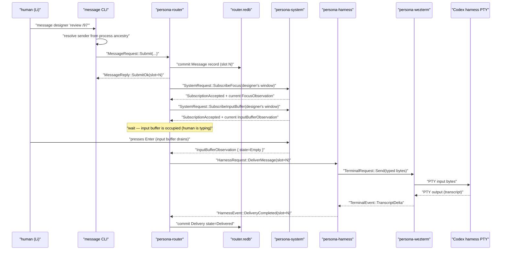
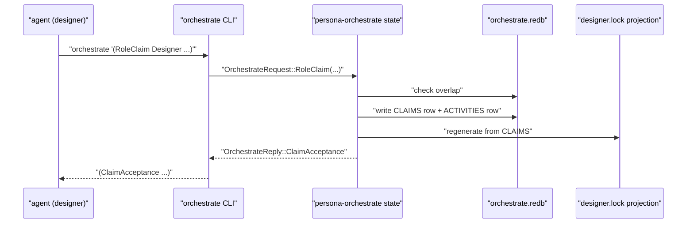
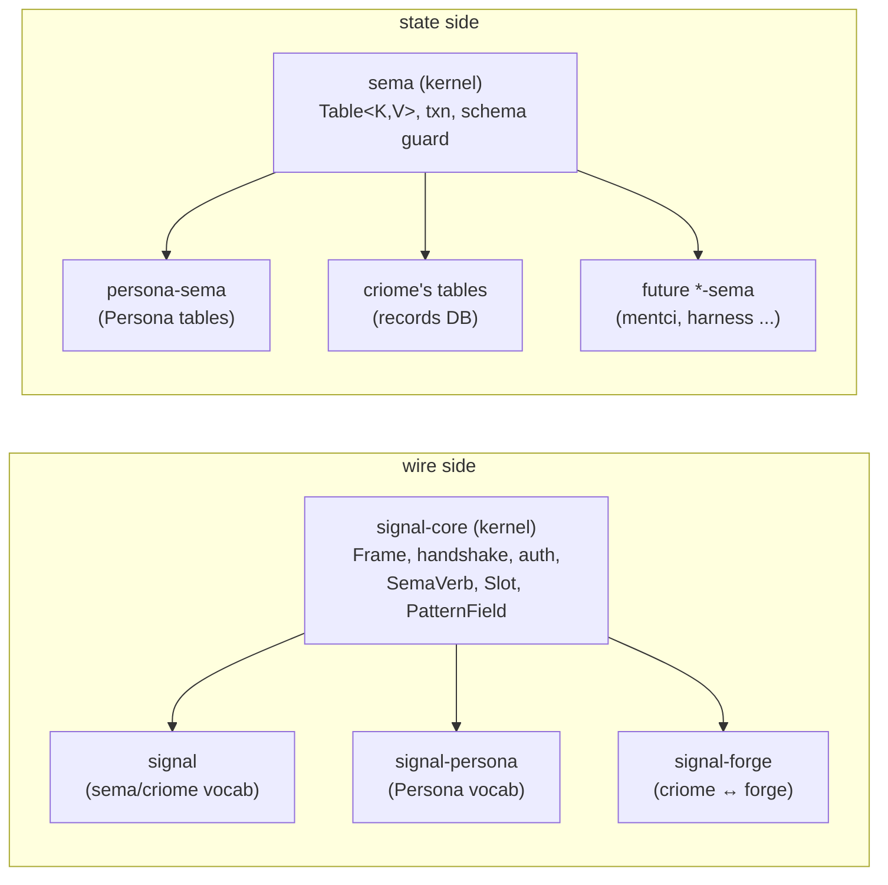
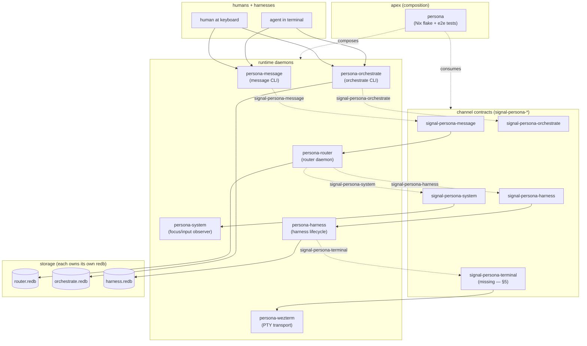
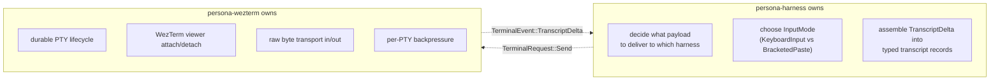
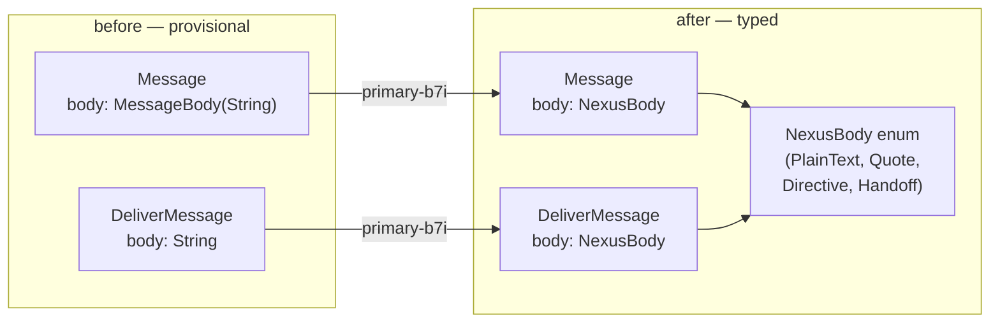
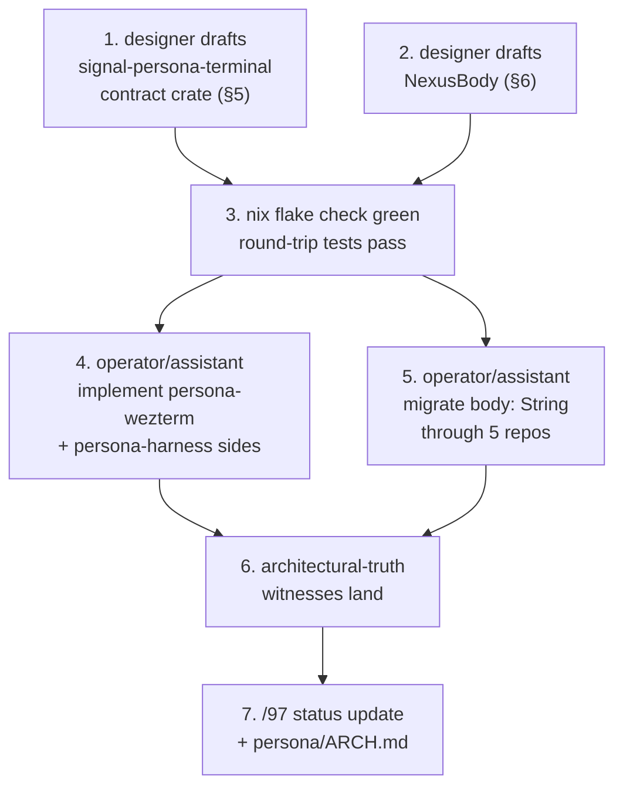

# 97 — Persona system vision + architecture development

*Designer report. Two parts: (1) the current Persona vision in
plain terms with diagrams; (2) two concrete architecture-
development moves — the missing `signal-persona-terminal`
channel and the typed-Nexus-body migration on `Message` /
`DeliverMessage`.*

---

## 0 · TL;DR

**Persona is the workspace's runtime ecosystem for human/harness
collaboration.** It treats interactive AI harnesses (Codex,
Claude, Pi) as *named, addressable, durable, observable* runtime
participants — first-class records, not hidden terminal sessions.
Humans message them by name; harnesses message each other; the
system pushes focus + input-buffer state so a delivery never
clobbers a draft a human is still typing.

The architecture is **two kernels + per-domain vocabularies +
per-component daemons over their own redb files**:

- `signal-core` is the **wire kernel** — `Frame`, handshake,
  auth, the closed twelve-verb spine, slots, pattern markers.
- `sema` is the **state kernel** — typed `Table<K, V>`, redb
  transactions, schema-version guard.
- `signal-persona` + `persona-sema` layer Persona's record
  vocabulary on top.
- Six runtime daemons (`persona-message`, `persona-router`,
  `persona-system`, `persona-harness`, `persona-wezterm`,
  `persona-orchestrate`) own one concern each, talk only over
  typed `signal-persona-*` channels, and each owns its own
  redb file.
- Five `signal-persona-*` channel contracts have shipped or are
  shipping: message, system, harness, orchestrate; **one is
  missing**: `signal-persona-terminal` (harness ↔ wezterm).

**Two concrete next moves:**

1. **§5 — `signal-persona-terminal`.** The wire between
   `persona-harness` (which decides *what* to deliver) and
   `persona-wezterm` (which moves bytes through PTYs) currently
   has no typed contract. Today the harness either dlls into
   wezterm directly or the bytes go through a third-party PTY
   transport with no schema. This is the largest remaining gap
   in the channel inventory. Proposed records and round-trip
   shape below.
2. **§6 — typed Nexus body for `Message` / `DeliverMessage`
   (primary-b7i).** Both records carry `body: String` today;
   the `String` is the placeholder for the typed Nexus payload
   that maps 1:1 to NOTA syntax. Migrating to `body: NexusBody`
   replaces opaque text with structure the router can inspect,
   the harness can render, and the audit log can introspect.

§7 names the architectural-truth witnesses that prove these
moves were followed (not bypassed) once they land. §8 names the
implementation cascade with role ownership.

This report supersedes nothing; it builds on:

- `~/primary/reports/designer/91-workspace-snapshot-skills-and-architecture-2026-05-09.md`
  (workspace state-of-the-world; drift register).
- `~/primary/reports/designer/92-sema-as-database-library-architecture-revamp.md`
  (sema-as-library framing; each component owns its own redb).
- `~/primary/reports/designer/93-persona-orchestrate-rust-rewrite-and-activity-log.md`
  (orchestrate Rust rewrite; activity log; signal-persona-orchestrate
  contract).

---

## 1 · What the Persona system is for — in plain terms

### The everyday picture

The user (Li) sits at one machine. Several AI harnesses run on
it: a designer Codex, a system-specialist Codex, a Claude doing
operator work, a Pi for off-axis questions. Each one has its own
WezTerm window, its own conversation, its own role.

The user wants to:

- send a one-line message to a specific harness (`message designer "review this report"`),
- have the harness see it like a typed-in prompt — only when it
  isn't actively waiting on the user's keyboard,
- let harnesses message each other and themselves with the same
  primitive,
- coordinate which harness owns which scope (claim/release roles
  and paths),
- inspect, after the fact, what each role touched and why.

The Persona system is everything that has to be true for the
above to *just work* across machine restarts, harness
detachments, focus changes, and concurrent agents.

### The end-to-end happy path — visual



The Persona system is what turns the user's one-line `message`
invocation into "the bytes hit the right harness's input
surface, only when safe, with a durable audit trail, and the
human's draft is never clobbered."

### The role-coordination picture

A second axis runs in parallel: **agents claim scopes** before
editing, **release** when done, **observe** what other roles
hold, and **submit** activity entries that survive in the
durable log:



The same channel covers `RoleRelease`, `RoleHandoff`,
`RoleObservation` (snapshot), `ActivitySubmission`, and
`ActivityQuery` — see
`~/primary/reports/designer/93-persona-orchestrate-rust-rewrite-and-activity-log.md`
§3-§5 for the activity-log design and the falsifiable spec
shipped as `signal-persona-orchestrate/tests/round_trip.rs`.

---

## 2 · The two kernels — and what's parallel about them

The whole architecture rests on a structural symmetry:



**The mental anchor:** `signal-core` is to *what travels between
processes* what `sema` is to *what persists inside one process*.
Both are pure libraries. Neither is owned by any daemon. Each
domain (sema-ecosystem, Persona, mentci) brings its own typed
vocabulary on top.

This symmetry is named in
`/git/github.com/LiGoldragon/signal-core/ARCHITECTURE.md` §0
(`signal-core` is to wire what `sema` is to state — both are
pure library kernels) and traced through
`~/primary/reports/designer/92-sema-as-database-library-architecture-revamp.md`
(the cascade that retired "criome IS sema's engine" and made
sema a workspace database library every state-bearing component
consumes).

---

## 3 · The Persona ecosystem map

Each box below is its own repo, its own crate, its own redb file
(when it carries durable state). Each arrow labelled `signal-persona-X`
is one `signal_channel!` invocation in the contract repo of that name.



| Repository | Concern |
|---|---|
| `persona` | Apex Nix composition + end-to-end architectural-truth tests. |
| `signal-persona` | Persona's *umbrella* record vocabulary (Message, Delivery, Authorization, Binding, Harness, Observation, Lock, StreamFrame, Deadline, Transition) — the records that *travel beyond one channel*. |
| `persona-sema` | Persona's typed-storage layer over the workspace `sema` library (table constants + `PersonaSema::open`). |
| `signal-persona-message` | `message` CLI ↔ `persona-router` channel (`Submit`, `Inbox`). |
| `signal-persona-system` | `persona-router` ↔ `persona-system` channel (focus + input-buffer subscriptions, observations). |
| `signal-persona-harness` | `persona-router` ↔ `persona-harness` channel (delivery requests, lifecycle events). |
| `signal-persona-terminal` | **(missing — §5)** `persona-harness` ↔ `persona-wezterm` channel. |
| `signal-persona-orchestrate` | `orchestrate` CLI ↔ `persona-orchestrate` channel (claims, releases, handoffs, activity log). |
| `persona-message` | The `message` CLI binary + sender-from-process-ancestry resolver + transitional local ledger. |
| `persona-router` | Routing reducer + delivery state machine + safety-gate enforcement; owns `router.redb`. |
| `persona-system` | OS adapter (Niri today, future macOS); pushes focus + input-buffer events. |
| `persona-harness` | Harness identity, lifecycle, transcript, adapter contracts; owns `harness.redb`. |
| `persona-wezterm` | Durable PTYs + detachable WezTerm viewers + raw-byte transport. |
| `persona-orchestrate` | The `orchestrate` CLI binary + state actor + lock-file projection writer; owns `orchestrate.redb`. |

---

## 4 · The current channel inventory

Every Persona channel is one `signal_channel!` invocation in
`<contract-repo>/src/lib.rs`. Closed enums on both sides; no
`Unknown` variant; per-variant payload types as the wire
vocabulary; round-trip tests in `<contract-repo>/tests/round_trip.rs`
as the falsifiable spec.

| Channel | Request side | Reply / event side | Status |
|---|---|---|---|
| `signal-persona-message` | `Submit`, `Inbox` | `SubmitOk`, `SubmitFailed`, `InboxResult` | shipped |
| `signal-persona-system` | `SubscribeFocus`, `UnsubscribeFocus`, `ObserveFocus`, `SubscribeInputBuffer`, `UnsubscribeInputBuffer`, `ObserveInputBuffer` | `FocusObservation`, `InputBufferObservation`, `WindowClosed`, `SubscriptionAccepted`, `TargetNotFound` | shipped |
| `signal-persona-harness` | `DeliverMessage`, `SurfaceInteraction`, `CancelDelivery` | `DeliveryCompleted`, `DeliveryFailed`, `InteractionResolved`, `HarnessStarted`, `HarnessStopped`, `HarnessCrashed` | shipped |
| `signal-persona-terminal` | (proposed §5) `Send`, `Resize`, `RequestScrollbackReplay`, `Detach` | (proposed §5) `TerminalReady`, `TranscriptDelta`, `ViewerAttached`, `ViewerDetached`, `TransportFailed` | **to design** |
| `signal-persona-orchestrate` | `RoleClaim`, `RoleRelease`, `RoleHandoff`, `RoleObservation`, `ActivitySubmission`, `ActivityQuery` | `ClaimAcceptance`, `ClaimRejection`, `ReleaseAcknowledgment`, `HandoffAcceptance`, `HandoffRejection`, `RoleSnapshot`, `ActivityAcknowledgment`, `ActivityList` | shipped (impl `primary-9iv` open) |

### Code example — what one shipped channel actually looks like

The whole channel is one `signal_channel!` invocation. Real code,
from
`/git/github.com/LiGoldragon/signal-persona-message/src/lib.rs`:

```rust
// ── Payload structs ─────────────────────────────────────────
#[derive(Archive, RkyvSerialize, RkyvDeserialize, Debug, Clone, PartialEq, Eq)]
pub struct SubmitMessage {
    pub recipient: String,         // resolved by router on receive
    pub body:      String,         // → typed NexusBody (§6)
}

#[derive(Archive, RkyvSerialize, RkyvDeserialize, Debug, Clone, PartialEq, Eq)]
pub struct SubmitReceipt {
    pub message_slot: u64,         // store-supplied; the typed Slot<Message>
}

#[derive(Archive, RkyvSerialize, RkyvDeserialize, Debug, Clone, PartialEq, Eq)]
pub struct SubmitFailed   { pub reason: SubmitFailureReason }

#[derive(Archive, RkyvSerialize, RkyvDeserialize, Debug, Clone, PartialEq, Eq)]
pub enum SubmitFailureReason {
    PersistenceRejected,
    UnknownRecipient,
}

// ── Channel declaration ─────────────────────────────────────
signal_channel! {
    request MessageRequest {
        Submit(SubmitMessage),
        Inbox(InboxQuery),
    }
    reply MessageReply {
        SubmitOk(SubmitReceipt),
        SubmitFailed(SubmitFailed),
        InboxResult(InboxResult),
    }
}
```

That declaration *is* the whole channel surface. The macro
(in `/git/github.com/LiGoldragon/signal-core/src/channel.rs`)
emits the request enum, the reply enum, the `Frame` /
`FrameBody` aliases over `signal_core::Frame<MessageRequest,
MessageReply>`, per-variant constructors, and `From<Variant>`
impls. Transport, actors, retry, durable storage — all elsewhere.

### Code example — typed storage at use site

Persona's typed-storage layer is similarly thin. Real code, from
`/git/github.com/LiGoldragon/persona-sema/src/tables.rs`:

```rust
use sema::Table;
use signal_persona::{Message, Delivery, Authorization, /*…*/};

pub const MESSAGES:       Table<u64, Message>       = Table::new("messages");
pub const AUTHORIZATIONS: Table<u64, Authorization> = Table::new("authorizations");
pub const DELIVERIES:     Table<u64, Delivery>      = Table::new("deliveries");
// …
```

A consumer like the router opens its own redb file and uses
`PersonaSema::open` (real code, from
`/git/github.com/LiGoldragon/persona-sema/src/store.rs`):

```rust
pub struct PersonaSema { sema: Sema }

impl PersonaSema {
    pub fn open(path: impl AsRef<Path>) -> Result<Self> {
        let sema = Sema::open_with_schema(path.as_ref(), &SCHEMA)?;
        TableSet::current().ensure(&sema)?;
        Ok(Self { sema })
    }
    pub fn sema(&self) -> &Sema { &self.sema }
}
```

Each daemon — router, harness, orchestrate — opens its **own**
`*.redb` file via `PersonaSema::open(its_path)`, and writes through
the typed `Table<u64, T>` constants. No shared `Arc<Mutex<Database>>`,
no storage-actor namespace, no cross-component database.

---

## 5 · Architecture-development move 1 — the missing terminal channel

### Why this gap matters

`persona-harness` is the home of harness identity, lifecycle,
and the *decision* to deliver typed payloads. `persona-wezterm`
is the home of durable PTYs, viewer attach/detach, and raw byte
transport. Today these two communicate through whatever
ad-hoc mechanism the harness adapter happens to use (direct
function call, raw socket, child-process invocation), with no
typed wire contract — and `persona/ARCHITECTURE.md` §1 names
`signal-persona-terminal` as the planned-but-not-shipped
fifth channel.

Without it:

- The harness adapter's `Send` and the wezterm daemon's PTY
  write happen in two repos with no shared schema for "what is
  a deliverable terminal payload." A new harness adapter
  (Pi-on-mobile, browser-attached) can't be added without
  reading the wezterm code.
- Architectural-truth tests like *"harness-to-wezterm traffic
  crosses a typed channel"* (per
  `/git/github.com/LiGoldragon/persona/ARCHITECTURE.md` §7) have
  no witness. The boundary is invisible to the dependency graph.
- Resize, scrollback replay, and viewer attach/detach lack a
  typed shape; they're verbs floating without a noun
  (`skills/abstractions.md`).

### Proposed channel

| Side | Component |
|---|---|
| Request side | `persona-harness` (decides delivery + window operations) |
| Event side | `persona-wezterm` (owns PTYs + viewers; pushes terminal facts) |

**Closed enums:**

```text
TerminalRequest                       TerminalEvent
├─ Send(SendBytes)                    ├─ TerminalReady(TerminalReady)
├─ Resize(ResizeRequest)              ├─ TranscriptDelta(TranscriptDelta)
├─ RequestScrollbackReplay(...)       ├─ ScrollbackChunk(ScrollbackChunk)
├─ Detach(DetachRequest)              ├─ ViewerAttached(ViewerAttached)
└─ ResumeAttached(ResumeAttached)     ├─ ViewerDetached(ViewerDetached)
                                      └─ TransportFailed(TransportFailed)
```

### Records

The discipline is the same as every other shipped Persona
channel: typed payload struct per variant; `String` placeholders
allowed only where the typed shape isn't named yet (and tracked
to a BEADS task for migration). Worked sketch — **design code
mixed with shipped patterns**:

```rust
// ── Identity ─────────────────────────────────────────────────

/// One PTY-backed harness terminal. Same shape as
/// `signal-persona-harness::HarnessName` (real code) — keeps the
/// route at the harness's name; persona-wezterm holds the
/// (HarnessName → PtyHandle) binding internally.
#[derive(Archive, RkyvSerialize, RkyvDeserialize, Debug, Clone, PartialEq, Eq, Hash)]
pub struct HarnessName(String);

// ── Delivery payloads (harness → wezterm) ────────────────────

/// Bytes to write to the harness's PTY input. Send is the
/// terminal-level operation; semantic delivery is the layer
/// above (signal-persona-harness::DeliverMessage). The harness
/// chooses the framing — terminal mode shapes are typed below.
#[derive(Archive, RkyvSerialize, RkyvDeserialize, Debug, Clone, PartialEq, Eq)]
pub struct SendBytes {
    pub harness: HarnessName,
    pub mode:    InputMode,           // typed; not a flag
    /// Raw bytes the wezterm PTY writes verbatim. Bracketed-paste
    /// wrapping is decided by `mode`, not by the byte content.
    pub bytes:   WireBytes,
    /// The router-minted slot from persona-sema, propagated for
    /// audit (transcript records reference the slot).
    pub origin_slot: u64,
}

#[derive(Archive, RkyvSerialize, RkyvDeserialize, Debug, Clone, PartialEq, Eq)]
pub enum InputMode {
    /// Normal keyboard-equivalent input (typed-prompt simulation).
    KeyboardInput,
    /// Bracketed paste with terminator newline (multi-line
    /// payloads with embedded control characters).
    BracketedPaste,
    /// Application-mode bytes (cursor keys, function keys);
    /// reserved for harness adapters that need it.
    ApplicationMode,
}

#[derive(Archive, RkyvSerialize, RkyvDeserialize, Debug, Clone, PartialEq, Eq)]
pub struct WireBytes(Vec<u8>);

#[derive(Archive, RkyvSerialize, RkyvDeserialize, Debug, Clone, PartialEq, Eq)]
pub struct ResizeRequest {
    pub harness: HarnessName,
    pub cols:    u16,
    pub rows:    u16,
}

#[derive(Archive, RkyvSerialize, RkyvDeserialize, Debug, Clone, PartialEq, Eq)]
pub struct DetachRequest {
    pub harness: HarnessName,
    pub reason:  DetachReason,        // typed enum; no string-encoded reason
}

#[derive(Archive, RkyvSerialize, RkyvDeserialize, Debug, Clone, PartialEq, Eq)]
pub enum DetachReason {
    HumanRequested,
    HarnessShutdown,
    ViewerLost,
}

// ── Observations (wezterm → harness) ─────────────────────────

#[derive(Archive, RkyvSerialize, RkyvDeserialize, Debug, Clone, PartialEq, Eq)]
pub struct TerminalReady {
    pub harness:    HarnessName,
    pub generation: u64,              // bumps on PTY restart
    pub size:       (u16, u16),       // (cols, rows)
}

#[derive(Archive, RkyvSerialize, RkyvDeserialize, Debug, Clone, PartialEq, Eq)]
pub struct TranscriptDelta {
    pub harness:    HarnessName,
    pub generation: u64,              // matches TerminalReady's generation
    /// Append-only chunk of PTY output bytes; the harness's
    /// transcript reducer turns these into typed transcript
    /// records.
    pub bytes:      WireBytes,
}

#[derive(Archive, RkyvSerialize, RkyvDeserialize, Debug, Clone, PartialEq, Eq)]
pub struct TransportFailed {
    pub harness: HarnessName,
    pub reason:  TransportFailureReason,
}

#[derive(Archive, RkyvSerialize, RkyvDeserialize, Debug, Clone, PartialEq, Eq)]
pub enum TransportFailureReason {
    PtyClosed,
    BackpressureExceeded,
    WindowMissing,
}

// ── Channel declaration ──────────────────────────────────────

signal_channel! {
    request TerminalRequest {
        Send(SendBytes),
        Resize(ResizeRequest),
        RequestScrollbackReplay(ScrollbackQuery),
        Detach(DetachRequest),
        ResumeAttached(ResumeAttached),
    }
    reply TerminalEvent {
        TerminalReady(TerminalReady),
        TranscriptDelta(TranscriptDelta),
        ScrollbackChunk(ScrollbackChunk),
        ViewerAttached(ViewerAttached),
        ViewerDetached(ViewerDetached),
        TransportFailed(TransportFailed),
    }
}
```

### Where each verb lives



The contract owns the **vocabulary**; both daemons stay focused
on their concerns. Adding a new harness adapter (Pi-on-mobile,
browser-attached) means implementing the wezterm-side
TerminalEvent producer differently, not editing the harness or
the contract.

### Subscription contract

Per `~/primary/skills/push-not-pull.md` §"Subscription contract"
(every push subscription emits the producer's current state on
connect, then deltas), the wezterm side emits a `TerminalReady`
event the moment a connection opens or a PTY restarts — *before*
any harness-side `Send`. The `generation` field on every
`TranscriptDelta` matches the most recent `TerminalReady`'s
generation; if the harness sees a delta whose generation is
ahead of its last-seen `TerminalReady`, it treats the delta as
gap-after-restart and re-requests scrollback.

This is the same gap-detection shape `signal-persona-system`
already uses for focus + input-buffer observations
(`/git/github.com/LiGoldragon/signal-persona-system/ARCHITECTURE.md`
§"Round trips" — *the `generation` field on focus +
input-buffer observations is the monotonic counter the system
mints*). One pattern, applied across channels.

### Boundaries to *not* put in the contract

- Not the WezTerm mux socket path or PTY ioctl; that's wezterm's
  internal concern.
- Not the byte format of *what* the harness delivers — that's
  the layer above (`signal-persona-harness::DeliverMessage`'s
  body, which §6 makes typed).
- Not the harness's transcript-record vocabulary; that's
  `persona-harness` over `signal-persona`'s `Transition`
  records.

---

## 6 · Architecture-development move 2 — typed Nexus body for `Message` and `DeliverMessage`

### The current state

Two `body: String` fields at architectural seams:

1. **`signal_persona::Message::body: MessageBody(String)`** —
   real code, from
   `/git/github.com/LiGoldragon/signal-persona/src/message.rs:13`:

   ```rust
   #[derive(Archive, RkyvSerialize, RkyvDeserialize, Debug, Clone, PartialEq, Eq)]
   pub struct MessageBody(String);
   ```

2. **`signal_persona_harness::DeliverMessage::body: String`** —
   real code, from
   `/git/github.com/LiGoldragon/signal-persona-harness/src/lib.rs:55`:

   ```rust
   #[derive(...)]
   pub struct DeliverMessage {
       pub harness:      HarnessName,
       pub sender:       String,
       pub body:         String,        // ← provisional
       pub message_slot: u64,
   }
   ```

Both are placeholders. The whole workspace insists every value
be structured (`/home/li/primary/skills/language-design.md` §6 —
*if a name or type is stored as a flat string, the ontology is
incomplete; strings collapse into typed records*). BEADS task
`primary-b7i` tracks the migration; this section is the proposal.

### What "typed Nexus body" means

The user types a message in NOTA syntax. `message designer "review /97"`
is sugar for the canonical Nexus form:

```text
(Send (PrincipalName "designer") (Body (PlainText "review /97")))
```

The `body` slot — `(Body ...)` — is itself a typed record. It
has variants. Every variant maps 1:1 to NOTA syntax (the
mechanical-translation rule from
`/git/github.com/LiGoldragon/nexus/ARCHITECTURE.md` §"Invariants"
— *one text construct, one typed value; every typed shape has
exactly one canonical text rendering*).

Proposed shape:

```rust
/// The typed payload of a Persona message body. Travels on the
/// wire as rkyv (signal); projects to/from NOTA syntax through
/// the nexus daemon (text). Replaces both
/// `signal_persona::Message::body: MessageBody(String)` and
/// `signal_persona_harness::DeliverMessage::body: String`.
#[derive(Archive, RkyvSerialize, RkyvDeserialize, Debug, Clone, PartialEq, Eq)]
pub enum NexusBody {
    /// Plain prose. The current `String` body. Most messages.
    PlainText(PlainText),

    /// A typed quote of another record (a slot reference + the
    /// renderer's snapshot at quote time). Used for "I'm
    /// referring to message N from operator."
    Quote(QuotedRecord),

    /// A directive — a Nexus verb the recipient is asked to
    /// honor (e.g. claim a scope, surface an interaction). The
    /// recipient pattern-matches on the directive variant.
    Directive(Directive),

    /// A structured handoff package: prose + cited records +
    /// optional next-step. Used between roles for design ↔
    /// implementation handoffs.
    Handoff(HandoffPackage),
}

#[derive(Archive, RkyvSerialize, RkyvDeserialize, Debug, Clone, PartialEq, Eq)]
pub struct PlainText(String);

#[derive(Archive, RkyvSerialize, RkyvDeserialize, Debug, Clone, PartialEq, Eq)]
pub struct QuotedRecord {
    pub source_slot: u64,           // the Slot<T> being quoted
    pub snapshot:    PlainText,     // renderer's snapshot at quote time
}

#[derive(Archive, RkyvSerialize, RkyvDeserialize, Debug, Clone, PartialEq, Eq)]
pub enum Directive {
    /// Ask the recipient to claim a scope (orchestrate handoff
    /// in-band with the message — saves a round-trip).
    AskClaim(AskClaim),
    /// Ask the recipient to surface an interaction (typed prompt
    /// for human input).
    AskSurfaceInteraction(SurfaceInteractionRequest),
    /// Ask the recipient to acknowledge — explicit "saw it"
    /// receipt for messages that need it.
    AskAcknowledge(AcknowledgeRequest),
}

#[derive(Archive, RkyvSerialize, RkyvDeserialize, Debug, Clone, PartialEq, Eq)]
pub struct HandoffPackage {
    pub prose:     PlainText,
    pub citations: Vec<u64>,        // slots of cited records
    pub next:      Option<NextStep>,
}

#[derive(Archive, RkyvSerialize, RkyvDeserialize, Debug, Clone, PartialEq, Eq)]
pub enum NextStep {
    BeadsTask(BeadsTaskToken),
    DesignerReport(ReportNumber),
    OperatorImplementation(ReportNumber),
}
```

### Mechanical NOTA projection

Every variant maps 1:1 to a NOTA record at human surfaces:

```text
;; PlainText
(Body (PlainText "review /97"))

;; Quote
(Body (Quote 1024 "The router's safety gate fires before…"))

;; Directive — AskClaim
(Body (Directive (AskClaim
    (RoleName Designer)
    [(ScopeReference (Path "/git/.../signal-persona-terminal"))]
    (ScopeReason "design new contract per /97 §5"))))

;; Handoff
(Body (Handoff
    (PlainText "drafted signal-persona-terminal — would you implement?")
    [1024 1025]                ;; cited slots
    (NextStep (BeadsTask "primary-9zz"))))
```

The CLI (`message`) keeps its convenience shorthand:
`message designer "review /97"` desugars to
`(Send "designer" (Body (PlainText "review /97")))` — but the
extended forms (`message --quote 1024 designer "..."`,
`message --directive 'AskClaim ...'`) become available without
new flags by writing the typed Nexus record directly:

```sh
message designer '(Body (Directive (AskClaim ...)))'
```

(One Nota record on argv, lojix-cli discipline; the existing
`(Send "designer" "...")` form stays as a backwards-compatible
parse with `String` → `PlainText` lifting.)

### What this enables

| Before (String body) | After (NexusBody) |
|---|---|
| Audit log shows "the body was a string" | Audit log records the typed kind: *"a Directive::AskClaim was sent from operator to designer"* |
| Quote a previous message? Embed text and hope | `Quote(slot)` references the previous record by `Slot<T>`; renderer always shows fresh snapshot |
| Cross-role handoff? Free-form prose with conventions | `HandoffPackage` carries prose + cited slots + typed next-step; operator's implementation report can cite the handoff message slot |
| Inter-harness directive? Stringly-typed parsing on the harness side | Closed enum `Directive`; harness pattern-matches |
| Migrate to a new body kind? Rewrite the parser | Add a `NexusBody` variant; old harnesses get a coordinated upgrade per the contract repo's versioning rule |

### Migration shape



The migration is a coordinated schema change for both
`signal-persona` (umbrella) and `signal-persona-harness`
(channel) plus their consumers (`persona-message`,
`persona-router`, `persona-harness`). Per the contract-repo
versioning rule (`/home/li/primary/skills/contract-repo.md`
§"Versioning is the wire"), this is a major bump — closed
enums don't accept silent additions.

`NexusBody::PlainText(PlainText(s))` is the bridging variant —
every existing String body lifts losslessly into it. Once
shipped, *new* directives and handoff packages use the richer
variants; old plain prose keeps working.

---

## 7 · Architectural-truth witnesses for the new moves

Per `~/primary/skills/architectural-truth-tests.md`
§"The principle" (*write tests that prove the architecture, not
only the behavior; if a rule says "component A uses component
B", make bypassing B fail even when the visible output still
succeeds*), each new move ships with witnesses that catch
"looks aligned but secretly bypassed it." The minimum set:

### For `signal-persona-terminal`

| Constraint | Witness |
|---|---|
| Harness ↔ wezterm traffic crosses the typed channel | `cargo metadata` test on `persona-harness/Cargo.toml` requires `signal-persona-terminal` to be present; `persona-wezterm/Cargo.toml` requires it too |
| `persona-harness` does not directly depend on `persona-wezterm` | `cargo metadata` test rejects a direct dep; the only path is through the contract crate |
| The `generation` field gates stale-event acceptance | Round-trip test: emit two `TranscriptDelta` events with `generation` N then N-1; the harness consumer ignores the older one |
| `TerminalReady` arrives on connect before any `TranscriptDelta` | Subscription-shape test: open a connection, assert the first `TerminalEvent` is `TerminalReady` with current size |
| `Detach(reason: HumanRequested)` keeps the PTY alive | Nix-chained test: derivation A spawns a wezterm daemon, sends `Detach`, exits; derivation B opens the same PTY socket and confirms the harness child process is still running |

### For typed `NexusBody`

| Constraint | Witness |
|---|---|
| Every `NexusBody` variant has a 1:1 NOTA projection | Round-trip test per variant: typed → NOTA text → typed; bytes equal |
| `NexusBody::PlainText` lifts losslessly from current String body | Compatibility test: every `(Send recipient "literal string")` form round-trips through the new types unchanged |
| `Quote(source_slot)` resolves the snapshot from sema | Witness test: emit a `Quote(N)`; a separate reader opens the router redb and confirms slot N's `Message` matches the snapshot |
| `Directive::AskClaim` cannot bypass `signal-persona-orchestrate` | Witness test: a harness receiving an AskClaim and processing it must produce a `signal-persona-orchestrate::RoleClaim` frame on the wire — verified through the router's frame log |
| `HandoffPackage::citations` references real slots | Validation pipeline: every slot in `citations` must resolve in the appropriate sema database at write time |

The same Nix-chained derivation pattern that
`/home/li/primary/skills/architectural-truth-tests.md`
§"Nix-chained tests" describes (*derivation A runs the write
code and emits the database file; derivation B reads the file
with the authoritative reader and asserts content*) is the
strongest available witness for any "actually persisted /
actually crossed the wire" claim.

---

## 8 · Implementation cascade

### Files to create

| Path | Purpose | Owner role |
|---|---|---|
| `/git/github.com/LiGoldragon/signal-persona-terminal/` | new contract repo (mirror of `signal-persona-orchestrate` shape) | designer creates; operator/assistant fills handlers |
| `signal-persona-terminal/src/lib.rs` | `signal_channel!` invocation + records (per §5 sketch) | designer |
| `signal-persona-terminal/tests/round_trip.rs` | falsifiable spec — one round-trip per variant | designer |
| `signal-persona-terminal/ARCHITECTURE.md`, `AGENTS.md`, `CLAUDE.md`, `README.md`, `skills.md` | per `~/primary/skills/contract-repo.md` repo layout | designer |
| `signal-persona/src/nexus_body.rs` | `NexusBody` enum + variants (per §6 sketch) | designer drafts; operator integrates |
| `signal-persona/tests/nexus_body_round_trip.rs` | per-variant rkyv + NOTA round-trip | designer |

### Files to edit

| Path | Edit |
|---|---|
| `/git/github.com/LiGoldragon/persona/ARCHITECTURE.md` §1 | move `signal-persona-terminal` from "to design" to "shipped"; reference §5 of this report |
| `/git/github.com/LiGoldragon/signal-persona/src/message.rs:13` | replace `MessageBody(String)` with `NexusBody` |
| `/git/github.com/LiGoldragon/signal-persona-harness/src/lib.rs:55` | replace `body: String` on `DeliverMessage` with `body: NexusBody` |
| `/git/github.com/LiGoldragon/persona-message/src/main.rs` | parse `(Body ...)` Nexus record; default to `(Body (PlainText ...))` for the legacy two-arg form |
| `/git/github.com/LiGoldragon/persona-harness/src/transcript.rs` | render `NexusBody` variants for transcript display |

### BEADS tasks to file

| Task | Priority | Description |
|---|---|---|
| `primary-XXa` (new) | P1 | Implement `signal-persona-terminal` contract crate per /97 §5; pass `nix flake check`; ship round-trip tests |
| `primary-XXb` (new) | P1 | Migrate `Message::body` and `DeliverMessage::body` to `NexusBody` per /97 §6; thread through `persona-message`, `persona-router`, `persona-harness`; close `primary-b7i` |
| `primary-XXc` (new) | P2 | `persona-wezterm` consumer side of `signal-persona-terminal`; `TerminalRequest` dispatcher + `TerminalEvent` producer |
| `primary-XXd` (new) | P2 | `persona-harness` consumer side of `signal-persona-terminal`; replace ad-hoc adapter with typed channel |
| `primary-XXe` (new) | P3 | Architectural-truth witnesses per /97 §7 |

(Numbering by `bd create` at filing time; placeholders here.)

### Order of operations



Steps 1 and 2 are designer work and can land in parallel
(different repos, different scopes). Steps 4 and 5 are operator
or assistant lanes (the implementation-pair; the contract crate
is the falsifiable spec). Step 7 is designer's closing edit —
one commit that updates the apex `ARCHITECTURE.md` and this
report's status.

---

## 9 · Open questions (named, not deferred)

The following surface as I write — naming them here keeps them
visible and prevents implementation from quietly deciding the
shape:

1. **Is `WireBytes(Vec<u8>)` the right wire shape for terminal
   payloads, or should it carry a length-bound + encoding
   marker?** — leaning bare `Vec<u8>` because the schema-typed
   receiver decides how to interpret; the contract crate stays
   small. But if backpressure-aware framing is needed, the
   contract is the right home.

2. **Should `NexusBody::Directive::AskClaim` carry the full
   `RoleClaim` record from `signal-persona-orchestrate`, or its
   own AskClaim shape?** — leaning the full record (re-export
   via shared umbrella). The mechanical-translation rule says
   one typed shape per intent; "ask the recipient to claim"
   IS a claim with a different verb attached.

3. **Does `signal-persona-terminal` belong in the persona
   apex's e2e test suite from day one?** — leaning yes; the
   nix-chained test pattern lives in `persona/`'s flake
   already, and the new channel needs a home for its
   cross-repo witnesses.

4. **Should `persona-wezterm`'s ARCHITECTURE.md grow to name
   `signal-persona-terminal` as its inbound contract?** — yes,
   in the same edit cascade as the implementation; same shape
   as `persona-system/ARCHITECTURE.md` naming
   `signal-persona-system`.

These are designer-resolvable; they don't need to block this
report. Mentioning them so the implementation pair sees them
when picking up the BEADS tasks.

---

## See also

- `~/primary/reports/designer/91-workspace-snapshot-skills-and-architecture-2026-05-09.md`
  — workspace state-of-the-world; drift register §3 (signal vs
  signal-core overlap; persona-orchestrate skills.md
  persona-store reference; verb→noun rename pending; body→Nexus
  pending; Inbound/Outbound sections).
- `~/primary/reports/designer/92-sema-as-database-library-architecture-revamp.md`
  — sema as workspace database library; each component owns
  its own redb file; this report inherits that framing.
- `~/primary/reports/designer/93-persona-orchestrate-rust-rewrite-and-activity-log.md`
  — the orchestrate Rust rewrite; sibling design move on the
  coordination side; activity-log spec.
- `~/primary/reports/operator/87-architecture-truth-pass.md` —
  operator's truth-pass cleanup that retired persona-store and
  store-actor framing; this report builds on the cleaner shape.
- `~/primary/reports/operator/95-orchestrate-cli-protocol-fit.md`
  — operator's read of the orchestrate CLI / protocol fit; see
  designer/98 for the critique.
- `~/primary/reports/operator/97-native-issue-notes-tracker-research.md`
  — operator's research proposing a native typed work-graph
  (`persona-work`) to retire BEADS; sibling to this report's
  channel-development moves; see designer/98 for the critique.
- `~/primary/reports/assistant/95-operator-work-review-after-designer-93.md`
  — assistant's review of operator work after /93; identifies
  the README drift that should fold into the implementation
  cascade.
- `/git/github.com/LiGoldragon/signal-core/ARCHITECTURE.md` —
  the wire kernel.
- `/git/github.com/LiGoldragon/sema/ARCHITECTURE.md` — the
  state kernel (kernel-vs-vocabulary frame).
- `/git/github.com/LiGoldragon/persona/ARCHITECTURE.md` — the
  apex; the channel inventory naming
  `signal-persona-terminal` as planned-but-not-shipped.
- `~/primary/skills/contract-repo.md` — discipline for the new
  contract crate.
- `~/primary/skills/architectural-truth-tests.md` — discipline
  for the §7 witnesses.
- `~/primary/skills/push-not-pull.md` §"Subscription contract"
  — the on-connect-current-state rule the new channel inherits.
- `~/primary/skills/language-design.md` §6 — *if a name or
  type is stored as a flat string, the ontology is incomplete*
  — the principle behind §6's typed body migration.
