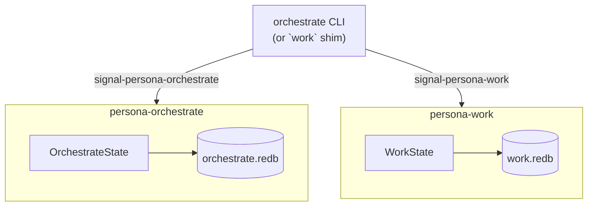
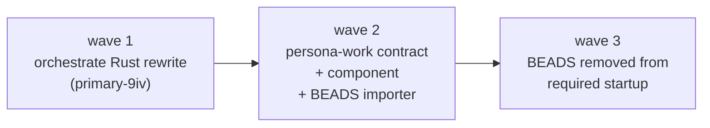
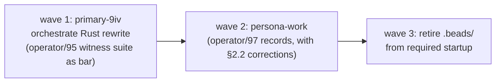

# 98 — Designer critique of operator/95 + operator/97

*Designer review of two operator reports landing in the same
orchestrate-domain wave: operator/95 (the orchestrate CLI /
protocol fit) and operator/97 (BEADS retirement + native typed
work-graph proposal). The two are tightly coupled — operator/97
proposes a second contract crate (`signal-persona-work`) to be
implemented in the same wave as the orchestrate Rust rewrite.
This critique reads both, endorses the load-bearing direction,
and pushes back where the proposals pull in framework or
coupling earlier than the work warrants.*

---

## 0 · TL;DR

**Operator/95** (`~/primary/reports/operator/95-orchestrate-cli-protocol-fit.md`)
re-anchors orchestrate work on the contract-as-truth shape from
`~/primary/reports/designer/93-persona-orchestrate-rust-rewrite-and-activity-log.md`.
**Operator/97** (`~/primary/reports/operator/97-native-issue-notes-tracker-research.md`)
proposes retiring BEADS and replacing it with a native typed
work-graph (`persona-work`) owned by Persona orchestration.

**Endorsements (across both):**

| From | Endorsement |
|---|---|
| /95 | One Nota record on argv (matches `lojix-cli` discipline). |
| /95 | NOTA derives on contract records (with a refinement — only where there's a CLI consumer). |
| /95 | `TaskToken` stored without brackets; `BEADS` excluded from `RoleSnapshot`. |
| /95 | Architectural-truth witness table (the strongest part of /95). |
| /97 | Retire BEADS as the substrate, not preserve it as a sidecar. |
| /97 | Datomic-style append-only events plus materialized projections. |
| /97 | Two IDs (`StableItemId` + `DisplayId`) with explicit collision policy. |
| /97 | One-time importer (not a bridge); archive `.beads/` read-only. |
| /97 | Architectural-truth test set for the work-graph (history loss, ID instability, edge semantics, push-not-pull). |
| /97 | Split `signal-persona-work` from `signal-persona-orchestrate`. |

**Push backs (across both):**

| From | Push back |
|---|---|
| /95 | Per-CLI ractor actor — ceremony at one-shot scale; plain methods on `OrchestrateState`; promote to actor when subscriptions land. |
| /95 | Defer `WirePath` validation to `persona-orchestrate` — the contract should own the invariant from day one (`TryFrom<&str>` with typed error). |
| /97 | Crate-name prefix on records (`WorkItem`, `WorkEvent`, ...) — violates the no-crate-name-prefix rule; should be `Item`, `Event`, `Edge`, `Note`, `Query`, `View`. |
| /97 | Component receiver in `persona-orchestrate` — mixes two bounded contexts (role coordination + work tracking); should be a separate `persona-work` daemon owning its own redb file. |
| /97 | `ReportRef` as an item kind — reports are filesystem files; better modelled as an Edge::References pointing to a typed `ReportPath` value. |
| /97 | `Blocks` and `DependsOn` both as edge kinds — pick one canonical form. |
| /97 | Couple persona-work to the same wave as the orchestrate Rust rewrite — separate the waves; orchestrate first (`primary-9iv`), persona-work next. |

The implementation pair (operator/assistant on `primary-9iv`)
should treat operator/95's witness table as the orchestrate
acceptance bar, this critique's contract-side adjustments as
the contract edits before code starts, and `~/primary/reports/designer/97-persona-system-vision-and-architecture-development.md`
§8 as the orchestrate-domain implementation cascade.

---

## 1 · Operator/95 read — orchestrate CLI / protocol fit

### 1.1 · Endorsements

#### One Nota record on argv

Operator/95 §"CLI Shape" (*"the real binary should accept
exactly one NOTA record and print exactly one NOTA record"*)
matches `lojix-cli` discipline named in
`~/primary/skills/system-specialist.md` §"Operator interface —
Nota only" and the orchestrate `ARCHITECTURE.md` §4
(*"the CLI takes one Nota record on argv. No flags, no
subcommands, no env-var dispatch."*). This is the right shape;
operator/95 names it sharply.

The compatibility shim translation table is correct:

| Old command | Canonical request |
|---|---|
| `claim <role> <scopes> -- <reason>` | `RoleClaim` |
| `release <role>` | `RoleRelease` |
| `status` | `RoleObservation` plus external BEADS display |

The shim never writes lock files itself (operator/95 §"Compatibility
Shim" — *"the shim may keep shell parsing for human convenience,
but it should not write lock files directly after the Rust CLI
lands"*). That's the load-bearing piece; the projection writer
is the Rust component, not the shim.

#### NOTA derives on contract records — with refinement

Operator/95 §"Contract Gap" (*"signal-persona-orchestrate
currently derives rkyv traits, but it does not derive NOTA
projection traits"*) names a real gap. The CLI's
parse-from-argv and render-to-stdout both want the same typed
records the wire carries — the mechanical-translation rule from
`/git/github.com/LiGoldragon/nexus/ARCHITECTURE.md` §"Invariants"
(*one text construct, one typed value*) demands that a typed
record's NOTA projection is a property of the type, not of the
consumer.

Operator/95 considers two choices and recommends adding NOTA
derives to the contract records (option 1). That's correct:
duplicating records in `persona-orchestrate` for CLI parsing
(option 2) creates two parallel vocabularies that drift on the
first variant addition.

**Refinement:** the derive set isn't universal across every
Persona contract repo. The discriminator is *audience*:

| Contract | CLI consumer? | NOTA derives? |
|---|---|---|
| `signal-persona-message` | yes (`message` CLI) | yes |
| `signal-persona-orchestrate` | yes (`orchestrate` CLI) | yes |
| `signal-persona-work` (proposed by /97) | yes (`work` shim → `orchestrate` CLI) | yes |
| `signal-persona-system` | no — daemon ↔ daemon | no |
| `signal-persona-harness` | no — daemon ↔ daemon | no |
| `signal-persona-terminal` (designer/97 §5) | no — daemon ↔ daemon | no |

Adding NOTA derives where there's no human reader pays cost
without benefit (every additional derive expands the trait
surface and slows compile slightly). The rule:
**contract types derive `NotaRecord` / `NotaEnum` when there is
a CLI consumer; otherwise rkyv-only.**

#### `TaskToken` stored without brackets

Operator/95 §"State Rules" (*"`TaskToken` stores the token
without brackets — brackets are a legacy CLI display
convention"*) is exactly right and is currently the shape
`signal-persona-orchestrate` already implements
(`/git/github.com/LiGoldragon/signal-persona-orchestrate/src/lib.rs:96`
— *"a bracketed task identifier (stored without brackets)"*).

The observation deserves elevation from "state rule" to
**contract invariant**: bracket-stripping happens at the CLI's
parse boundary; the wire and the database always carry the raw
token. The argv form `'[primary-f99]'` is a human shell-quoting
convenience because `[` is a shell glob character; nothing else
about the brackets is structural.

This belongs in `signal-persona-orchestrate/ARCHITECTURE.md` as
an explicit invariant. Same shape as the `WirePath` newtype —
the type carries the cleaned form; presentation lives at
boundaries.

#### BEADS exclusion from `RoleSnapshot`

Operator/95 Decision 3 (*"Should `RoleObservation` include
BEADS? I recommend no"*) is right. BEADS is workspace-external
transitional state per `~/primary/AGENTS.md` §"BEADS is
transitional" (*"the destination is Persona's typed messaging
fabric; design new shapes assuming bd goes away"*). Including
BEADS in the typed snapshot would couple the contract to a
substrate the workspace is moving away from.

Operator/97 makes this even sharper: BEADS is being retired,
not just *external*. After /97's persona-work lands, there's no
external system to display beside coordination state — there's
the typed work graph. The shim's role becomes simpler:
translate legacy syntax, render the typed reply.

#### The architectural-truth witness table

Operator/95 §"Architectural-Truth Tests" is the strongest part
of the report. The witness set:

| Test | What it proves |
|---|---|
| canonical claim writes `orchestrate.redb` and lock projection | State truth is durable DB, not direct file mutation |
| legacy shim claim produces same state as canonical claim | Compatibility surface is only translation |
| conflicting claim returns typed `ClaimRejection` | Conflict is contract data, not stderr text |
| claim/release both append activity rows | Activity is automatic and durable |
| request-supplied timestamp is impossible | Time is owned by the component |
| relative path request is rejected or normalized before commit | Durable scopes are not cwd-dependent |
| `status` after DB mutation can regenerate missing lock files | Lock files are projections |
| `tools/orchestrate status` can display BEADS without storing BEADS | BEADS remains external and transitional |

This is operator at its best: every architectural rule has a
witness; every witness is implementable; the bypass-attempt is
the failure mode being caught. The "request-supplied timestamp
is impossible" test in particular is well-shaped — the
`ActivitySubmission` record literally has no timestamp field,
so the test is a compile-fail witness rather than a runtime
assertion. That kind of witness IS the architecture.

Adopt this set as the orchestrate-impl gate: `nix flake check`
green plus this witness set landing is the bar for closing
`primary-9iv`.

### 1.2 · Push back

#### Per-CLI ractor actor — ceremony at this scale

Operator/95 §"Actor Lifetime" + Decision 2 recommends that v1
spawn a short-lived ractor actor inside each CLI invocation:

> *"That keeps the actor boundary real without introducing a
> long-lived daemon. A daemon can come later when subscriptions
> or push notifications require it."*

I push back. The actor framework's value is named in
`~/primary/skills/rust-discipline.md` §"Actors" (*"the reason is
logical cohesion, coherence, and consistency — not performance.
An actor is the unit you reach for when you want to model a
coherent component: it owns its state, exposes a typed message
protocol, and has a defined lifecycle"*). A one-shot CLI that
spawns an actor for one request and exits doesn't get those
benefits. The actor's "lifecycle" is "spawn → handle one
message → die"; the "message protocol" is "exactly one variant";
the "owned state" is "a redb handle that closes on drop."

The shape that already carries the contract — plain methods on
a state struct:

```rust
// no framework, no async, no message dispatch ceremony
pub struct OrchestrateState {
    sema: PersonaSema,
}

impl OrchestrateState {
    pub fn open(path: impl AsRef<Path>) -> Result<Self> { … }

    pub fn claim(&self, request: RoleClaim) -> Result<OrchestrateReply> { … }
    pub fn release(&self, request: RoleRelease) -> Result<OrchestrateReply> { … }
    pub fn handoff(&self, request: RoleHandoff) -> Result<OrchestrateReply> { … }
    pub fn observe(&self, request: RoleObservation) -> Result<OrchestrateReply> { … }
    pub fn submit_activity(&self, request: ActivitySubmission) -> Result<OrchestrateReply> { … }
    pub fn query_activity(&self, request: ActivityQuery) -> Result<OrchestrateReply> { … }
}

// CLI entry — no tokio, no ractor.
fn main() -> ExitCode {
    let request = parse_argv()?;
    let state = OrchestrateState::open(&db_path())?;
    let reply = state.dispatch(request)?;     // exhaustive match → method
    print_nota(&reply);
    ExitCode::SUCCESS
}
```

Each method is one redb transaction; redb's MVCC handles
concurrent CLI invocations cleanly (operator/95 itself notes
this). Pulling in tokio + ractor for a synchronous one-shot
isn't needed at this scale.

**When the actor model becomes the right shape:** the moment
subscriptions land. A future `OrchestrateRequest::SubscribeRoleClaims`
that opens a long-lived stream of `ClaimAcceptance` events is
exactly what ractor is for: typed message protocol, owned
state, defined lifecycle. At that point, promote
`OrchestrateState` into an actor; the methods become message
handlers; the CLI becomes one client and the subscription
listener becomes another.

The pattern: **methods now, actor when subscriptions land**.
Don't pre-pay the framework cost.

This isn't a contract-affecting decision — both shapes implement
the same `signal-persona-orchestrate` channel. But it changes
the implementation cascade: no `tokio` dependency, no ractor
dependency, faster `nix flake check`, simpler debugging.

#### `WirePath` validation — should be contract-owned from day one

Operator/95 Decision 4: *"Should `WirePath::new` validate
absolute normalized paths in the contract crate, or should
validation live in `persona-orchestrate`? I recommend
validation in `persona-orchestrate` first, with contract
constructors tightened later if needed."*

I push back. Two reasons.

**(1) The type's name claims an invariant that the
constructor doesn't enforce.** Today's
`/git/github.com/LiGoldragon/signal-persona-orchestrate/src/lib.rs:74`:

```rust
#[derive(Archive, RkyvSerialize, RkyvDeserialize, Debug, Clone, PartialEq, Eq, Hash)]
pub struct WirePath(String);

impl WirePath {
    pub fn new(path: impl Into<String>) -> Self { Self(path.into()) }
}
```

`WirePath::new` accepts any string. A relative path, a UTF-8
garbage byte sequence, an empty string — all become valid
`WirePath` values. The type's claim ("a wire-form path") is
unenforced; only the `persona-orchestrate` consumer would catch
the violation, and only on its specific code path.

The doc comment names *"newtyped for cross-platform stability
on the wire"* — but the cross-platform-stability claim is
unverified by the constructor. Per `~/primary/skills/rust-discipline.md`
§"Domain values are types, not primitives" (*"the wrapped
field is private; construction with validation goes through
TryFrom"*), the contract should carry the invariant.

**(2) Other future consumers will exist.** Operator/95 itself
names that shim, scripts, future CLIs, and CI tools all
construct `OrchestrateRequest` records. A shim that builds a
`RoleClaim` from a relative path because "we'll validate in
`persona-orchestrate`" silently corrupts the durable scope key
on its way through. The validation needs to be *in the type's
construction* so every consumer is forced to handle it.

```rust
// proposed
pub struct WirePath(String);

#[derive(Debug, thiserror::Error)]
pub enum WirePathError {
    #[error("path is not absolute: {0:?}")]
    NotAbsolute(String),
    #[error("path is empty")]
    Empty,
}

impl TryFrom<&str> for WirePath {
    type Error = WirePathError;
    fn try_from(s: &str) -> Result<Self, Self::Error> {
        if s.is_empty() { return Err(WirePathError::Empty); }
        if !s.starts_with('/') { return Err(WirePathError::NotAbsolute(s.into())); }
        Ok(Self(normalize(s)))
    }
}

// `pub fn new` retired — only `TryFrom<&str>` available
```

(Same rule should apply to `TaskToken`: validate the token
shape — non-empty, no brackets, no whitespace — at construction.
Currently `TaskToken::new` accepts any string. Same fix shape.)

### 1.3 · Other observations from /95 worth promoting

#### `RoleObservation` recent-activity limit

Operator/95 §"State Rules" lists *"`RoleObservation` has a
documented recent-activity limit"* without specifying the
default. The right place to specify it is the
`signal-persona-orchestrate` contract's `ARCHITECTURE.md` —
make the limit a documented part of the channel rather than an
implementation detail.

Proposed: 50 most-recent activity entries by default; a future
minor bump can add an optional limit field on the typed
`RoleObservation` if needs change.

#### Two-step protocol update

Operator/95 Decision 5 (*"two-step update: first document the
target layer, then switch authority after tests pass"*) is
right and matches the workspace pattern. Concretely:

1. `protocols/orchestration.md` adds a *"Target shape: typed
   contract"* section now, naming `signal-persona-orchestrate`
   and `orchestrate` CLI as the truth (without removing the
   bash helper text yet).
2. `primary-9iv` lands. Witness suite green.
3. `protocols/orchestration.md` switches: bash helper becomes
   "compatibility shim section"; typed contract becomes the
   "default flow."

#### Implementation slices are clean

Operator/95 §"Implementation Slices" is well-ordered. Endorse
with the two corrections above (drop "ractor actor" in step 2;
add `WirePath`/`TaskToken` `TryFrom` in step 1's NOTA-derives
pass).

---

## 2 · Operator/97 read — native work tracker proposal

### 2.1 · Endorsements

#### Direction — retire BEADS as substrate, not preserve as sidecar

Operator/97 §"Position" (*"we should retire BEADS as part of
the persona-orchestrate implementation, not preserve it as a
sidecar"*) is right and matches workspace direction. The
embedded-mode exclusive-lock evidence (operator/97 §"Local
Findings" — *"one command hit the embedded backend exclusive
lock"*) is the concrete failure mode that proves the
multi-agent path is not BEADS' design center. Adopting Dolt
server mode would mean another daemon, another versioned
database semantics, another world to keep alive — exactly what
the workspace is *not* optimising for.

The replacement direction — a native typed work-graph owned by
Persona — is the correct destination. `~/primary/AGENTS.md`
§"BEADS is transitional" already names it: *"the destination
is Persona's typed messaging fabric"*. Operator/97 puts a
concrete shape on that destination.

#### Datomic-style append-only events plus projections

Operator/97 §"Sema Tables" (*"the implementation should use
append-only truth plus projections"*) is the right shape and
the closest semantic match to the workspace's existing sema
discipline. Per the report's own framing — facts plus
transaction time, current state as derived value, history
queryable without special backups, notes and issues sharing
the same event/fact machinery — this is Datomic-shaped, and it
maps cleanly onto sema's typed `Table<K, V>` primitives.

The architectural separation:

| Truth | Projection |
|---|---|
| `WORK_EVENTS` table — append-only typed events | `WORK_ITEMS` table — current item state, regenerable |
| `OPERATIONS` table — operation metadata | `WORK_EDGES_BY_*` tables — denormalized indices |
| | `WORK_NOTES_BY_ITEM` — per-item note view |

This is right. The architectural-truth test set's first witness
(*"creating an item writes WORK_EVENTS before WORK_ITEMS"*)
makes this explicit; the *truth* IS the events, the projections
are derivable.

#### Two IDs (StableItemId + DisplayId)

Operator/97 §"ID Design" — separating storage/protocol identity
from display identity is the right move. The LLM-pays-for-
opaque-strings observation is real (an LLM agent that has to
remember `7c3a9f8d-...-43b2` opaque IDs degrades fast); short
display IDs amortise the cost without compromising the durable
shape.

The collision policy (*"if prefix collides, extend by one
character; store alias in DISPLAY_IDS; never ask agents to
invent IDs"*) is correct on all three axes — the agent doesn't
mint identity (per `~/primary/ESSENCE.md` §"Infrastructure
mints identity, time, and sender"), the alias keeps stability,
and the extension policy keeps display IDs short.

#### One-time importer (not a bridge)

Operator/97 §"Migration From BEADS" — one-time import, archive
`.beads/` read-only, no long-term dual-write. This is right.
The "freeze BEADS writes; export; convert; archive; remove
from required agent startup" sequence is the cleanest shape
for retiring transitional substrate; a Persona↔bd bridge would
fix none of the underlying problems and would deepen the
investment the workspace is moving away from (per
`~/primary/AGENTS.md` §"BEADS is transitional" —
*"don't build a Persona↔bd bridge; don't deepen the bd
investment"*).

#### Architectural-truth test set

Operator/97 §"Architectural Tests" matches the same caliber as
operator/95's set:

| Test | Catches |
|---|---|
| Creating an item writes `WORK_EVENTS` before `WORK_ITEMS` | Projection-as-truth regression |
| Missing `WORK_EVENTS` row makes projection regen fail | Silent state mutation |
| `DisplayId` collision extends alias, not stable ID | Agent-visible ID instability |
| Ready query ignores `ParentOf` but respects `Blocks` | Edge semantics drift |
| Closing a blocker makes dependent ready without polling | Push semantics |
| Convenience `work` shim and canonical `orchestrate` request produce same event | CLI authority creep |
| BEADS import preserves old IDs only as aliases | Bridge reintroduction |
| Note correction appends a new event instead of mutating old note | History loss |

Same pattern: every architectural rule has a witness; the
bypass-attempt is the failure mode being caught. Adopt this set
as the persona-work acceptance bar.

#### Open Decision 1 — split `signal-persona-work` from `signal-persona-orchestrate`

Operator/97's recommendation to split is correct. Two
distinct semantic concerns:

- **`signal-persona-orchestrate`** carries role-coordination
  vocabulary: *who is editing what file right now* (transient,
  scope-keyed, lock-projecting).
- **`signal-persona-work`** carries work-graph vocabulary:
  *what items exist, what depends on what, what's been
  said about each* (durable, item-keyed, history-preserving).

These are different shapes; folding them into one contract
crate would make `OrchestrateRequest` a kitchen-sink enum and
hide the boundary `~/primary/skills/abstractions.md`
§"The wrong-noun trap" warns against (*"adjacency of types is
not the same as adjacency of concerns"*).

### 2.2 · Push back

#### Crate-name prefix on records

Operator/97's proposed records: `WorkItem`, `WorkEvent`,
`WorkEdge`, `WorkNote`, `WorkQuery`, `WorkView`. Each carries
the crate name as a prefix.

This violates `~/primary/skills/naming.md`
§"Anti-pattern: prefixing type names with the crate name"
(*"a type's name belongs to its module context, not the
cross-crate global namespace; the crate IS the namespace;
repeating it in the type name is redundant ceremony"*). And
`~/primary/skills/rust-discipline.md` §"No crate-name prefix on
types" (*"call sites read `chroma::Request`, `chroma::Error` —
never `StdVec`, `StdHashMap`"*).

The standard library is the canonical reference. The
sema-ecosystem already follows it: `signal::Frame`,
`signal::Request`, `signal::Reply`, `signal::Tweaks`.
`signal-persona` follows it: `signal_persona::Message`,
`signal_persona::Delivery`, `signal_persona::Authorization`.
`signal-persona-orchestrate` follows it: `RoleClaim`,
`RoleRelease`, `RoleHandoff`, `RoleObservation`,
`ActivitySubmission`, `ActivityQuery`.

`persona-work` should follow the same precedent:

```rust
// inside `persona_work` crate — call sites read
// persona_work::Item, persona_work::Edge, ...
pub struct Item       { … }     // not WorkItem
pub struct Event      { … }     // not WorkEvent
pub struct Edge       { … }     // not WorkEdge
pub struct Note       { … }     // not WorkNote
pub struct Query      { … }     // not WorkQuery
pub struct View       { … }     // not WorkView
pub struct DisplayId  ( … );    // ok — Display- describes; not crate name
pub struct StableItemId( … );   // ok — Stable- describes; not crate name
```

`DisplayId` and `StableItemId` keep their descriptive prefixes
because *Display* and *Stable* are kind-distinguishers, not
namespace markers — the rule is "no namespace prefix," not "no
descriptive prefix."

#### Component receiver — separate `persona-work` daemon, not folded into `persona-orchestrate`

Operator/97 §"Proposed Native Model": *"the component receiver
can still be `persona-orchestrate`. The key is that the
work-tracker vocabulary is isolated from role claim/release
vocabulary."*

I push back. Two distinct bounded contexts:

1. **Role coordination** — claims, releases, handoffs, the
   activity log. State: ephemeral; lock-projection-driven;
   transient. Concern: *who is currently editing what.*
2. **Work tracking** — items, edges, notes, decisions,
   handoffs. State: durable; event-log-driven; long-lived.
   Concern: *what work exists across time.*

`~/primary/skills/micro-components.md` §"The rule" item 7:
*"no component owns more than one bounded context. When the
ubiquitous language inside a crate starts using two
vocabularies — 'session' meaning two different things, or
'build' used for both the verb and the artifact — the crate
must split along that seam."* Operator/97's proposal would have
`persona-orchestrate` use both vocabularies in one redb file.
That's the seam the rule names.

The cleaner shape:



Each daemon owns its own redb file, its own schema, its own
`PersonaSema::open(path)`. Same shape as every other Persona
component (`persona-router` owns `router.redb`; `persona-harness`
owns `harness.redb`). Schema migrations on one don't affect the
other; one corrupted database doesn't take both vocabularies
down.

The CLI side stays ergonomic — one binary (`orchestrate`)
opens the appropriate database based on which request kind it
parsed. No cross-component messaging needed for the typical
flows; agents that genuinely need cross-domain operations (a
claim that closes a work item) build the orchestration
themselves.

#### `ReportRef` as item kind — should be edge, not item

Operator/97 §"Item Kinds" lists `ReportRef` (*"pointer to a
report"*). This conflates two things:

- A **report** is a filesystem file at `reports/<role>/<N>-...md`.
  It has its own identity (path), its own numbering rule, its
  own lifecycle. Reports are not work items.
- A **reference to a report** from a work item is a relationship.

The cleaner shape:

```rust
// not an item kind
pub enum ItemKind { Task, Defect, Question, Decision, Note, Handoff }

// existing edge kind handles report references
pub enum EdgeKind { /* ... */ References }

// referenced thing is a typed external reference
pub enum ExternalReference {
    Report(ReportPath),
    GitCommit(CommitHash),
    BeadsTask(BeadsToken),    // for imported BEADS items
    File(WirePath),
}
```

A work item that "is about" a report uses an `Edge::References`
pointing to `ExternalReference::Report(ReportPath)`. The report
file stays sovereign; the work graph references it. No double
identity (item-id-for-a-report PLUS path-of-the-report); no
risk of the work graph thinking it owns the report's lifecycle.

Saves an item kind. Makes the relationship clearer. Same
pattern reusable for git commits, BEADS imports, and arbitrary
file references.

#### `Blocks` and `DependsOn` — pick one canonical edge

Operator/97 §"Edge Kinds":

| Edge | Ready-queue effect |
|---|---|
| `Blocks` | Yes. Target cannot be ready until source closes. |
| `DependsOn` | Yes, inverse wording of `Blocks`; store one normalized form. |

The proposal already says "store one normalized form" — but
lists both as edge kinds, which means the wire vocabulary
carries both, the implementation has to normalize on commit,
and consumers querying edges have to handle both directions.

Pick one. `DependsOn` is more natural English (*"this task
depends on that one"* reads cleaner than *"that task blocks
this one"*); the inverse query (*"what does this block?"*) is
expressible by reading the edge in reverse via
`WORK_EDGES_BY_TARGET`. Drop `Blocks` from the edge enum.

Same critique applies, lighter, to `DiscoveredFrom` vs
`RelatesTo` — both are loose links with no ready-queue effect;
keep `RelatesTo` (more general, more reusable); drop
`DiscoveredFrom` until a concrete need names it.

#### Implementation wave coupling — separate the waves

Operator/97 §"Recommendation" (*"build a native persona-work
vocabulary and store it in persona-orchestrate's Sema database
in the same implementation wave that replaces the shell
tools/orchestrate"*).

I push back. The orchestrate Rust rewrite (`primary-9iv`) is
already a substantial slice — a new contract crate consumed,
six handlers, lock-file projection, BEADS-still-external shim
work, witness suite. Adding persona-work to the same wave
doubles the surface, doubles the test matrix, and pushes the
"compatibility shim" landing — which unblocks every other
agent — further out.

The cleaner cascade:



Wave 1 ships the typed orchestrate CLI; agents migrate from
`tools/orchestrate` shim → canonical CLI. Wave 2 ships
persona-work; agents migrate from `bd` → typed work graph.
Wave 3 retires `.beads/` from required reads. Each wave is
self-contained, has its own witness suite, ships when ready.

The "same wave" framing is also coupled to the
"folded-into-persona-orchestrate" shape that I push back on
above. With persona-work as its own component (own contract,
own redb, own daemon/library), wave 2 becomes a genuinely
separable piece of work.

### 2.3 · Refinements from /97

#### DisplayId algorithm needs spec

Operator/97 §"ID Design" says *"generate short display
prefix"* without specifying the algorithm. The CLI experience
depends on the choice; pin it before implementation:

| Decision | Recommendation |
|---|---|
| Source | First N bytes of `BLAKE3(StableItemId)` |
| Encoding | `base32` (lowercase, no padding) — readable, unambiguous on case-insensitive media, avoids `0/O 1/I/l` confusion |
| Length | 3 bytes ≈ 5 chars; extends to 6, 7 on collision |
| Workspace prefix | None on the wire; the role/repo provides context |

So DisplayId values look like `9iv`, `kxa`, `ffj`. No
`primary-` prefix — that was a BEADS workspace convention
imported from a substrate the workspace is leaving. Imported
BEADS items keep `primary-9iv` style as their *imported alias*
(per /97's "preserve old IDs as aliases for imported items"),
not as the new format.

#### Activity log (designer/93) versus WorkEvent log

Two parallel event logs land in the same wave: `Activity`
records (designer/93 §3) for role coordination, `Event` records
(operator/97 §"Core Records") for the work graph. The
relationship needs documentation in `signal-persona-work`'s
`ARCHITECTURE.md`:

| Log | Owns | Lives in |
|---|---|---|
| `Activity` | "agent did X at scope Y" — transient role-scoped audit | `orchestrate.redb` |
| `Event` | "work graph changed in this way" — durable item-scoped history | `work.redb` |

Both types of fact deserve their own log because they have
different retention shapes (activity ages out fast; events are
permanent), different audiences (activity → "what's happening
right now"; events → "what has the work graph been"), and
different access patterns (activity → recent-N projection;
events → full history queries). They're parallel concerns; the
contract repos make that explicit by being two contracts.

#### Open Decisions from /97 — designer position

| /97 decision | Operator recommends | Designer position |
|---|---|---|
| 1 — split contract | yes | **yes** — full agreement |
| 2 — convenience name (`work` / `issue` / `note`) | `work` | **yes — `work`** (issues and notes are both work-graph items; `work` names the substrate) |
| 3 — preserve old BEADS IDs as aliases for imported items | yes | **yes** — but only for the imported subset; new items use the new DisplayId format above |
| 4 — import closed BEADS entries | yes | **yes** — closed items carry decisions/rationale; the import is the only way to preserve the lineage |

---

## 3 · Combined decisions matrix

| Decision (source) | Recommendation | Designer position |
|---|---|---|
| /95 — NOTA derives on contract records | yes | **yes, where there's a CLI consumer** (orchestrate ✓, message ✓, work ✓; system / harness / terminal — no, daemon-only) |
| /95 — short-lived ractor actor per CLI | yes | **no — plain methods on `OrchestrateState`**; promote to actor when subscriptions land |
| /95 — BEADS in `RoleSnapshot` | no | **no** — full agreement (and operator/97 makes BEADS *retired*, sharper still) |
| /95 — `WirePath` validation in `persona-orchestrate` first | yes | **no — validate in contract from day one (`TryFrom<&str>`)**; same rule for `TaskToken` |
| /95 — two-step protocol update | yes | **yes** — full agreement |
| /97 — split `signal-persona-work` from `signal-persona-orchestrate` | yes | **yes** — full agreement |
| /97 — convenience name `work` | yes | **yes** |
| /97 — preserve old BEADS IDs as aliases | yes | **yes — but only for imported items** |
| /97 — import closed BEADS entries | yes | **yes** |
| /97 — folded receiver in `persona-orchestrate` | yes | **no — separate `persona-work` daemon owning its own redb** |
| /97 — record names `WorkItem` / `WorkEvent` / etc. | implicit | **no — drop the crate-name prefix; `Item`, `Event`, `Edge`, `Note`, `Query`, `View`** |
| /97 — `ReportRef` as item kind | implicit | **no — model as `Edge::References` pointing to `ExternalReference::Report(ReportPath)`** |
| /97 — `Blocks` and `DependsOn` both as edge kinds | implicit | **no — pick `DependsOn`; drop `Blocks`** |
| /97 — `DiscoveredFrom` and `RelatesTo` both as edge kinds | implicit | **no — pick `RelatesTo`; drop `DiscoveredFrom` until a concrete need surfaces** |
| /97 — same implementation wave as orchestrate Rust rewrite | yes | **no — separate waves: orchestrate first, persona-work next** |

---

## 4 · Net read

Both reports are constructive reads of the orchestrate-domain
work. /95 sharpens the CLI/protocol fit and surfaces a
witness table that should become the orchestrate acceptance
bar. /97 diagnoses BEADS' substrate mismatch correctly and
proposes a Datomic-shaped native replacement that fits the
workspace's typed-record discipline.

The substantive disagreements are about **scope and timing**:

- **Don't pre-pay framework cost.** The per-CLI ractor actor
  (/95) and the implementation-wave coupling (/97) both pull
  in machinery before the work needs it. Plain methods on a
  state struct now; one wave at a time.
- **The contract owns its invariants.** `WirePath` validation
  (/95) and the no-crate-name-prefix rule (/97) both argue
  that contract crates carry their guarantees from day one,
  not bolted on later by consumers.
- **Bounded contexts stay bounded.** Folding persona-work into
  persona-orchestrate (/97) crosses the seam
  `~/primary/skills/micro-components.md` names; same daemon,
  same redb, different vocabularies → schema-migration coupling
  and ownership confusion.

The orchestrate-domain implementation cascade, in priority
order:



The implementation pair (operator or assistant on `primary-9iv`
first, then a follow-up pair on persona-work) should treat:

- operator/95's witness table as the wave-1 acceptance bar;
- this critique's §1.2 corrections as the contract-side edits
  before wave 1 implementation starts;
- operator/97's architectural-truth tests as the wave-2
  acceptance bar;
- this critique's §2.2 corrections as the contract-side edits
  before wave 2 implementation starts;
- `~/primary/reports/designer/93-persona-orchestrate-rust-rewrite-and-activity-log.md`
  + `~/primary/reports/designer/97-persona-system-vision-and-architecture-development.md`
  §8 as the orchestrate-domain implementation cascade.

---

## See also

- `~/primary/reports/operator/95-orchestrate-cli-protocol-fit.md`
  — operator's read of orchestrate CLI / protocol fit; subject
  of §1.
- `~/primary/reports/operator/97-native-issue-notes-tracker-research.md`
  — operator's BEADS-retirement research and persona-work
  proposal; subject of §2.
- `~/primary/reports/designer/93-persona-orchestrate-rust-rewrite-and-activity-log.md`
  — the design /95 reads against; this critique builds on /93's framing.
- `~/primary/reports/designer/97-persona-system-vision-and-architecture-development.md`
  — sibling designer report; §8 names the orchestrate-domain
  cascade; this critique extends it with the wave-2 persona-work
  shape.
- `/git/github.com/LiGoldragon/signal-persona-orchestrate/src/lib.rs`
  — the orchestrate contract today; lines cited.
- `/git/github.com/LiGoldragon/persona-orchestrate/ARCHITECTURE.md`
  — the consumer's documented runtime shape.
- `~/primary/skills/rust-discipline.md` §"Actors" — the
  test for whether ractor is the right shape.
- `~/primary/skills/rust-discipline.md` §"Domain values are
  types" — the validation-at-construction discipline.
- `~/primary/skills/rust-discipline.md` §"No crate-name prefix
  on types" — the rule operator/97's record names violate.
- `~/primary/skills/naming.md` §"Anti-pattern: prefixing type
  names with the crate name" — cross-language version of the
  same rule.
- `~/primary/skills/micro-components.md` §"The rule" item 7 —
  *"no component owns more than one bounded context"* — the
  rule the folded persona-orchestrate proposal crosses.
- `~/primary/skills/contract-repo.md` §"Versioning is the wire"
  — closed enums don't accept silent additions; framing for
  the WirePath / no-crate-prefix push.
- `~/primary/AGENTS.md` §"BEADS is transitional" — the
  workspace direction operator/97 turns into a concrete shape.
