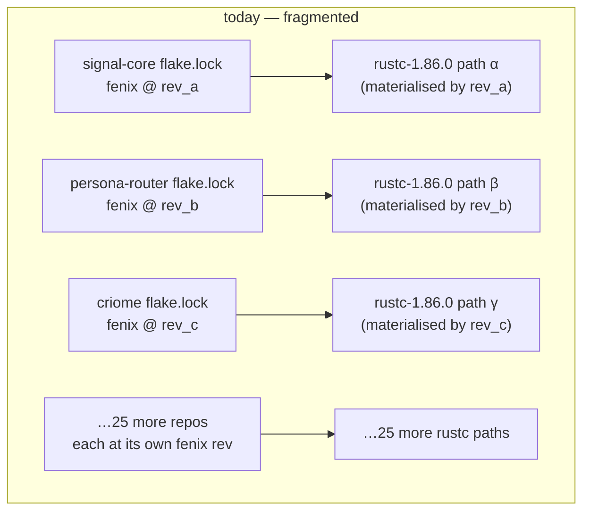
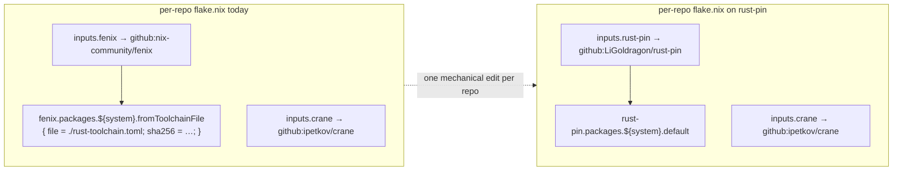
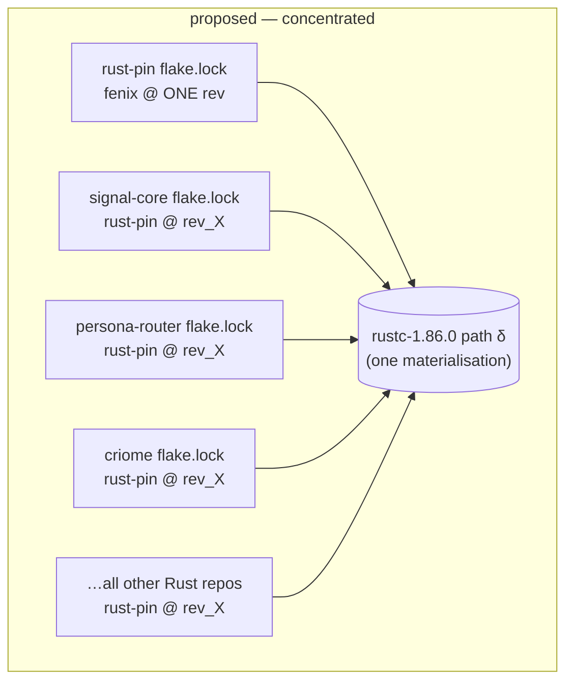
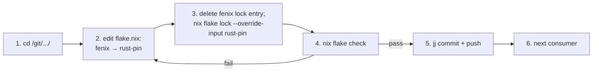
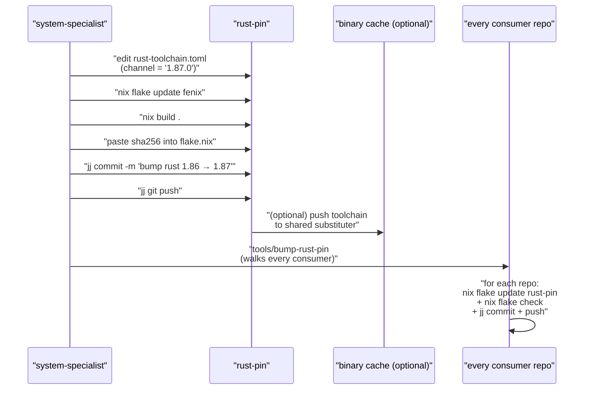
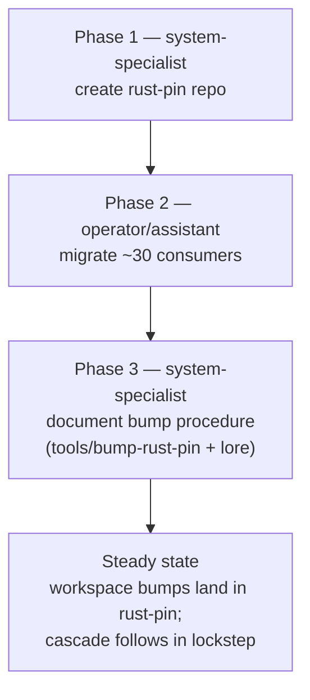

# 99 — Shared Rust toolchain pin — proposal + choreography

*Designer report. Names the bandwidth-leak shape (every Rust
flake pins its own fenix rev → many rustc store paths even when
the underlying Rust version is identical) and proposes the
fix: one workspace-shared toolchain repo every Rust consumer
imports. Designer drafts the shape and the cascade; system-
specialist owns the implementation.*

---

## 0 · TL;DR

**The problem.** Every Rust crate's `flake.nix` in this
workspace declares its own `inputs.fenix` and pins the rev in
its own `flake.lock`. Across ~30 Rust repos, those locks
drift: each repo's most recent `nix flake update` captured a
slightly-different fenix rev, so `fenix.packages.${system}.fromToolchainFile`
produces a different rustc derivation per repo — different
`/nix/store/<hash>-rust-…` paths for what is structurally
the same toolchain. On a slim connection, every divergent rev
is one heavy rustc redownload (~200 MB).

**The fix.** Create one workspace-shared toolchain repo
(name proposed: **`rust-pin`**). It owns `rust-toolchain.toml`,
pins one fenix rev in its own `flake.lock`, and exposes the
materialised toolchain as a flake output. Every Rust consumer
replaces its local `fenix` input with a single
`rust-pin` input. As long as consumers share the same `rust-pin`
rev, they share the same rustc store path → one download per
machine, not N.

**The choreography.** System-specialist creates the repo and
seeds the bump procedure. A workspace-level
`tools/bump-rust-pin` script walks every consumer and runs the
lock update in lockstep, so a workspace-wide bump produces
exactly one new rustc download instead of fragmenting across
update windows. Operator/assistant runs the one-time migration
per-consumer (≈30 mechanical `flake.nix` edits, gated by
`nix flake check`). `~/primary/repos/lore/rust/nix-packaging.md`
gets a corresponding edit so new repos start on the shared pin
from day one.

**Estimated saving on the first workspace-wide bump after
landing:** N − 1 rustc redownloads avoided (where N is the
number of consumer repos that would otherwise update on
different fenix revs over the next month). Concrete cost of
the change: one new repo (~50 lines of flake), one ~30-repo
mechanical edit pass, one lore edit.

---

## 1 · Diagnosis — what's actually leaking bandwidth

### Today's shape

Every consumer flake — verified across signal-core, signal,
signal-persona-orchestrate, persona-router, persona-sema,
criome, sema, nota-codec, lojix-cli, horizon-rs, chroma —
follows the same template (real code, from
`/git/github.com/LiGoldragon/signal-persona-orchestrate/flake.nix:1-15`):

```nix
inputs = {
  nixpkgs.url = "github:NixOS/nixpkgs/nixpkgs-unstable";
  flake-utils.url = "github:numtide/flake-utils";
  fenix = {
    url = "github:nix-community/fenix";
    inputs.nixpkgs.follows = "nixpkgs";
  };
  crane.url = "github:ipetkov/crane";
};
```

…and:

```nix
toolchain = fenix.packages.${system}.fromToolchainFile {
  file = ./rust-toolchain.toml;
  sha256 = "sha256-gh/xTkxKHL4eiRXzWv8KP7vfjSk61Iq48x47BEDFgfk=";
};
```

The pattern is documented in
`~/primary/repos/lore/rust/nix-packaging.md` §"Canonical
flake.nix" as the workspace standard. Every Rust crate built
this way carries:

- one `inputs.fenix` declaration in `flake.nix`;
- one `fenix` lock entry in `flake.lock`;
- one `rust-toolchain.toml` at the repo root;
- one `sha256` of the materialised toolchain literal in
  `flake.nix`.

### What goes wrong on a slim connection



The same Rust version (`channel = "stable"` in every
`rust-toolchain.toml`, or pinned to e.g. `1.86.0`) materialises
through fenix's overlay differently depending on the fenix rev:

- the toolchain derivation depends on fenix's source contents;
- different fenix revs → different derivation hashes;
- different derivation hashes → different `/nix/store` paths;
- different store paths → independent fetches over the wire.

When a consumer runs `nix flake check`, the cargo-deps-cache
trick saves rebuild work but **does nothing for the toolchain
download**. If the consumer's `flake.lock` references a fenix
rev that the local store doesn't have a corresponding toolchain
for, the substituter (or upstream) ships ~200 MB of rustc.

The leak compounds on `nix flake update` cascades. A
`for repo in ... ; do (cd $repo && nix flake update) ; done` run
across the workspace pulls a different fenix rev per
repo and downloads that many distinct rustcs.

### What the fix needs to be

**Concentrate the fenix pin to one place.** Every consumer
references that one place. As long as consumers' `flake.lock`
files all point at the same rev of the shared pin, they all
materialise the same fenix-overlay derivation → the same rustc
store path → one download per machine.

This is the same shape as `signal-core` for the wire and
`sema` for state: **a kernel that the workspace's many
consumers depend on, owned by no daemon, swappable through
one coordinated upgrade**.

---

## 2 · Proposal — `rust-pin` repo

### Shape

Create a new repo at `/git/github.com/LiGoldragon/rust-pin`.
Its sole job is to pin one fenix rev and one
`rust-toolchain.toml`, and expose the materialised toolchain
as a flake output.

```
rust-pin/
├── flake.nix            ─ one fenix input; toolchain output per system
├── flake.lock           ─ pins fenix; pins nixpkgs (toolchain-relevant only)
├── rust-toolchain.toml  ─ canonical Rust channel + components
├── ARCHITECTURE.md
├── AGENTS.md            ─ shim → ~/primary/AGENTS.md
├── CLAUDE.md            ─ shim → AGENTS.md
└── README.md
```

### `flake.nix` (proposed shape — design code)

```nix
{
  description = "Workspace-shared Rust toolchain pin — one fenix rev, one rust-toolchain.toml, one rustc store path per system.";

  inputs = {
    nixpkgs.url = "github:NixOS/nixpkgs?ref=nixos-unstable";
    fenix = {
      url = "github:nix-community/fenix";
      inputs.nixpkgs.follows = "nixpkgs";
    };
  };

  outputs = { self, nixpkgs, fenix }:
    let
      systems = [ "x86_64-linux" "aarch64-linux" "aarch64-darwin" "x86_64-darwin" ];
      forAllSystems = nixpkgs.lib.genAttrs systems;
    in {
      packages = forAllSystems (system: {
        # The default (and currently only) toolchain. Consumers
        # reference this directly in their flake outputs.
        default = fenix.packages.${system}.fromToolchainFile {
          file = ./rust-toolchain.toml;
          sha256 = "sha256-…";   # first-build prints; pasted in
        };

        # `nix run .#print-version` — convenience for verifying
        # the active pin without consuming the toolchain.
        print-version = nixpkgs.legacyPackages.${system}.writeShellScriptBin
          "rust-pin-print-version" ''
            cat ${./rust-toolchain.toml}
          '';
      });
    };
}
```

The flake's *only* output that consumers care about is
`packages.${system}.default` — the toolchain derivation.
Consumers read it, hand it to `crane.mkLib.overrideToolchain`,
and inherit one rustc store path across the workspace.

### `rust-toolchain.toml` (canonical)

Same content the consumer repos already use; lifted verbatim
to the shared repo:

```toml
[toolchain]
channel = "stable"
components = ["cargo", "rustc", "rustfmt", "clippy", "rust-analyzer", "rust-src"]
profile = "default"
```

(If the workspace prefers pinning a specific stable revision
— `channel = "1.86.0"` — that's the one place to do it. The
choice doesn't change the proposal's shape.)

### Consumer flake — before vs after



Real code transformation, applied to
`signal-persona-orchestrate/flake.nix` (one of the simplest
consumers — a contract crate; same pattern across every Rust
repo):

```nix
# Before — each repo declares fenix locally
inputs = {
  nixpkgs.url = "github:NixOS/nixpkgs/nixpkgs-unstable";
  flake-utils.url = "github:numtide/flake-utils";
  fenix = {
    url = "github:nix-community/fenix";
    inputs.nixpkgs.follows = "nixpkgs";
  };
  crane.url = "github:ipetkov/crane";
};

outputs = { self, nixpkgs, flake-utils, fenix, crane }:
  flake-utils.lib.eachDefaultSystem (system:
    let
      pkgs = import nixpkgs { inherit system; };
      toolchain = fenix.packages.${system}.fromToolchainFile {
        file = ./rust-toolchain.toml;
        sha256 = "sha256-gh/xTkxKHL4eiRXzWv8KP7vfjSk61Iq48x47BEDFgfk=";
      };
      # …
```

```nix
# After — the toolchain comes from the shared pin
inputs = {
  nixpkgs.url = "github:NixOS/nixpkgs/nixpkgs-unstable";
  flake-utils.url = "github:numtide/flake-utils";
  rust-pin = {
    url = "github:LiGoldragon/rust-pin";
    inputs.nixpkgs.follows = "nixpkgs";
  };
  crane.url = "github:ipetkov/crane";
};

outputs = { self, nixpkgs, flake-utils, rust-pin, crane }:
  flake-utils.lib.eachDefaultSystem (system:
    let
      pkgs = import nixpkgs { inherit system; };
      toolchain = rust-pin.packages.${system}.default;
      # …
```

The diff per consumer:

- One `inputs.fenix` block → one `inputs.rust-pin` block (same shape).
- One `fenix` argument in the `outputs` parameter list → `rust-pin`.
- One `fenix.packages.${system}.fromToolchainFile { … }` block
  → one `rust-pin.packages.${system}.default` reference.
- The `sha256` literal in `flake.nix` disappears (the shared
  pin holds it once).
- The per-repo `rust-toolchain.toml` either stays as a duplicate
  (for IDE tools that read it independently — rust-analyzer,
  rustup-managed cargo) or becomes a one-line pointer/symlink
  to rust-pin's. See §3.4.

### Why this works



Every consumer that has the same `rust-pin` rev sees the same
fenix rev, the same `rust-toolchain.toml`, and therefore the
same fenix-overlay derivation. The toolchain materialises to
one store path. **One rustc download per machine, regardless
of how many Rust repos are checked out.**

---

## 3 · Choreography

### 3.1 · Phase 1 — system-specialist creates the repo

Owner: **system-specialist** (Nix toolchain discipline lives
in `~/primary/skills/system-specialist.md` §"Owned area" and
the canonical Nix-packaging shape lives in
`~/primary/repos/lore/rust/nix-packaging.md`).

Steps:

1. Create `/git/github.com/LiGoldragon/rust-pin` via `gh repo
   create LiGoldragon/rust-pin --public --source . --remote
   origin --push` (per `~/primary/skills/repository-management.md`).
2. Seed the files: `flake.nix`, `flake.lock`, `rust-toolchain.toml`,
   `ARCHITECTURE.md`, `AGENTS.md` shim, `CLAUDE.md` shim,
   `README.md`. Pin the `sha256` after first-build.
3. `nix flake check` to verify the toolchain materialises and
   `nix run .#print-version` confirms the channel.
4. Commit + push (`jj commit -m '…' && jj git push`).
5. Add an entry to `~/primary/RECENT-REPOSITORIES.md`.

**Acceptance gate:** `nix build /git/github.com/LiGoldragon/rust-pin#packages.x86_64-linux.default`
returns a valid toolchain on the user's primary machine.

### 3.2 · Phase 2 — operator or assistant runs the consumer migration

Owner: **operator** primary lane or **assistant** lane (per
`~/primary/skills/assistant.md` §"Owned area" — *implementation
slices, disjoint code paths*). The migration is mechanical and
parallelisable.



Per-consumer cost: one ~10-line edit plus one `nix flake check`
run. With ~30 consumers the whole pass is ~30 commits. The
`nix flake check` step is the gate — every consumer's CI/test
suite must pass on the new toolchain shape before that
consumer's commit lands.

**Inventory** (verified in §1's survey):

| Repo | Status |
|---|---|
| signal-core, signal, signal-derive, signal-persona, signal-persona-message, signal-persona-system, signal-persona-harness, signal-persona-orchestrate, signal-forge | declares fenix locally |
| persona, persona-message, persona-router, persona-system, persona-harness, persona-wezterm, persona-orchestrate, persona-sema | declares fenix locally |
| criome, sema, sema-derive, mentci-lib | declares fenix locally |
| nota, nota-codec, nota-derive | declares fenix locally |
| horizon-rs, lojix-cli, chroma | declares fenix locally |
| signal-persona | empty `flake.nix` survey result — verify before edit; might already follow a different shape |

(This list is the survey of repos with `fenix` references in
their `flake.nix`. System-specialist runs `grep -lE "fenix" /git/github.com/LiGoldragon/*/flake.nix`
to refresh the list at migration time.)

### 3.3 · Phase 3 — bump procedure (steady state)

Owner: **system-specialist** (with optional operator/assistant
help on the cascade).

When the workspace wants to bump Rust (e.g., to a new stable
release):



**Workspace-level helper.** A new script,
`~/primary/tools/bump-rust-pin`, walks the consumer list and
runs the lock-update + check + commit cycle in lockstep:

```sh
#!/usr/bin/env bash
# tools/bump-rust-pin — workspace-wide rust-pin lock update.
# Walks every Rust consumer, bumps its rust-pin lock,
# runs nix flake check, commits, pushes.
set -euo pipefail

CONSUMERS=(
  signal-core signal signal-derive signal-persona
  signal-persona-message signal-persona-system
  signal-persona-harness signal-persona-orchestrate signal-forge
  persona persona-message persona-router persona-system
  persona-harness persona-wezterm persona-orchestrate persona-sema
  criome sema sema-derive mentci-lib
  nota nota-codec nota-derive
  horizon-rs lojix-cli chroma
)

for consumer in "${CONSUMERS[@]}"; do
  cd "/git/github.com/LiGoldragon/$consumer"
  nix flake update rust-pin
  nix flake check
  jj commit -m "bump rust-pin lock"
  jj bookmark set main -r @-
  jj git push --bookmark main
done
```

(The list is sourced from the same survey grep above; the
script lives in the workspace's `tools/` directory beside
`tools/orchestrate`. System-specialist owns the script.)

**One ordering invariant:** the bump always lands in `rust-pin`
*before* the cascade. Otherwise, consumer-side updates pull
whatever rev `rust-pin/main` currently points at — which might
be the old toolchain.

### 3.4 · Per-repo `rust-toolchain.toml` — keep or remove?

Two options:

**Keep.** Each consumer continues to ship a `rust-toolchain.toml`.
This satisfies cargo/rustup workflows that don't go through
nix (rust-analyzer, IDE tooling, ad-hoc `cargo` invocations).
Cost: one extra file per repo; mild drift risk if kept out of
sync with rust-pin's.

**Remove.** Each consumer relies on rust-pin's
`rust-toolchain.toml`. nix-only workflows are unaffected;
non-nix workflows fall back to whatever rustup default the
machine has.

**Recommendation:** *keep, but add the rule that consumer
`rust-toolchain.toml` files are byte-identical to rust-pin's*.
A workspace `tools/sync-rust-toolchain` script copies
rust-pin's file into every consumer when it's bumped. The
duplication is mild and the IDE-tool benefit is real
(rust-analyzer reads `rust-toolchain.toml` directly without
nix involvement).

The discipline note belongs in
`~/primary/repos/lore/rust/nix-packaging.md` and
`~/primary/skills/nix-discipline.md`; system-specialist owns
the edit.

### 3.5 · Lore + skill updates

Once Phase 1 lands, **system-specialist edits the canonical
docs** so new repos start on the shared pin from day one:

- `~/primary/repos/lore/rust/nix-packaging.md` §"Canonical
  flake.nix" — replace the `fenix` input shape with the
  `rust-pin` input shape; cross-link this report.
- `~/primary/skills/nix-discipline.md` — add a section
  *"Shared Rust toolchain pin"* naming `rust-pin` as the
  workspace-wide Rust toolchain; rule: *new Rust repos
  inherit through `rust-pin`, not through fenix directly*.
- `~/primary/skills/rust-discipline.md` §"redb + rkyv" or a
  sibling section — short pointer to the rust-pin discipline.

### 3.6 · Order of operations summary



Phase 2 can run in parallel slices (one assistant takes
signal-* repos, another takes persona-* repos, system-
specialist takes platform repos). Each consumer's commit
lands independently; the migration is monotonic — once a
consumer is on `rust-pin`, its bandwidth profile improves
even before peers migrate.

---

## 4 · Naming the repo

Three viable names; the user/system-specialist picks:

| Name | For | Against |
|---|---|---|
| `rust-pin` | descriptive (it pins Rust), short, obvious | mildly generic |
| `rust-toolchain` | matches `rust-toolchain.toml` filename | conflicts with the standard filename in greppy contexts |
| `goldragon-rust` | workspace-prefixed, explicit ownership | ties the rust-pin to the cluster name; still works if the cluster is renamed but reads as cluster-specific |
| `criome-toolchain` | ties to the most code-heavy ecosystem | misleads — not just for criome |

**Recommendation: `rust-pin`.** The repo's name describes its
concern (it pins one Rust toolchain). `rust-toolchain` is the
filename's name and conflates with it; the workspace prefixes
(`goldragon-`, `criome-`) imply scope that isn't real (every
Rust crate uses it, not just one cluster).

If the user prefers the workspace-prefix shape, second choice
is `goldragon-rust` — short, clear ownership, no filename
conflict.

---

## 5 · What this proposal isn't

A few clarifications, to head off scope creep during
implementation:

- **Not a binary cache proposal.** A shared substituter
  helps after first download; this proposal makes first
  download N-fold smaller. The two are orthogonal and can
  both happen.
- **Not a Cargo workspace.** The workspace explicitly chose
  micro-components (`~/primary/skills/micro-components.md`):
  *one capability, one crate, one repo*. This proposal does
  not consolidate Rust crates; it consolidates one shared
  *input* across them.
- **Not a cross-language pin.** Only Rust toolchains are
  affected. nixpkgs locks remain per-repo (already much
  smaller artifacts).
- **Not a fenix replacement.** rust-pin uses fenix; it just
  pins one rev of fenix in one place.
- **Not an immediate Rust-version bump.** Phase 1 freezes
  whatever Rust version the consumers are converging on
  today. Bumping comes after the migration is complete and
  the bump procedure has been exercised once.

---

## 6 · Risks and mitigations

| Risk | Mitigation |
|---|---|
| A consumer needs a different Rust version (e.g., a nightly-only feature) | rust-pin can expose multiple toolchain outputs (`packages.${system}.nightly`, `packages.${system}.stable`); consumers pick. Defer until a real need surfaces — adding outputs later is non-breaking. |
| `rust-pin` becomes a bottleneck for bumps | The bump procedure is one commit + one cascade script run; the cost is the cascade, not the central edit. The script makes the cost mechanical. |
| Consumer drift — some repos lag behind on `rust-pin` lock | The cascade script runs in lockstep across all consumers; lagging repos are visible (their `flake.lock` shows an old rust-pin rev) and the script normalises them on next bump. |
| First-build sha256 mismatch on rust-pin | Standard fenix workflow: empty `sha256 = ""`; first build prints expected; paste in. Same shape every consumer already uses today. |
| Migration regresses a consumer's `nix flake check` | `nix flake check` is the per-consumer gate; the consumer's commit only lands if check is green. A failure is local, not workspace-wide. |
| rust-pin's own bumping cadence — fenix itself moves daily | rust-pin's `nix flake update fenix` is run *only when bumping Rust*, not on a clock. The lock there is intentionally stable. |

---

## 7 · Open questions for the user / system-specialist

1. **Repo name.** `rust-pin` (recommended), `goldragon-rust`,
   or another shape?
2. **`rust-toolchain.toml` per-repo — keep or remove?** §3.4
   recommends keep + sync; the alternative is to remove and
   rely on rust-pin's. The keep-+-sync option is mildly
   redundant but safer for non-nix workflows.
3. **Channel pin in `rust-toolchain.toml`.** Today most
   consumers say `channel = "stable"`. The shared pin gives
   the option to lock to a specific stable revision
   (`channel = "1.86.0"`). Lock or stay on `"stable"`?
4. **Cascade script home.** `~/primary/tools/bump-rust-pin`
   (alongside `tools/orchestrate`) or somewhere inside the
   `rust-pin` repo itself? Recommend the workspace-level
   location — the script is *workspace coordination*, not
   *rust-pin's own behavior*.
5. **CI implications.** Any CI workflows that run
   `nix flake check` on individual repos will need a one-time
   rebuild after the migration (since the toolchain
   derivation changes). Worth a heads-up.

---

## 8 · Implementation cascade — concrete next steps

Filed as designer-named, system-specialist-owned BEADS tasks:

| Task | Priority | Owner | Description |
|---|---|---|---|
| (file new) | P1 | system-specialist | Create `/git/github.com/LiGoldragon/rust-pin` per /99 §2; flake outputs the toolchain; first `nix build .#default` succeeds; commit + push. |
| (file new) | P1 | operator/assistant | Migrate every Rust consumer's `flake.nix` to import `rust-pin` per /99 §3.2. One commit per consumer, gated by `nix flake check`. |
| (file new) | P2 | system-specialist | Author `~/primary/tools/bump-rust-pin` per /99 §3.3. |
| (file new) | P2 | system-specialist | Update `~/primary/repos/lore/rust/nix-packaging.md` and `~/primary/skills/nix-discipline.md` per /99 §3.5. |
| (file new) | P3 | system-specialist | (Optional) decide on per-repo `rust-toolchain.toml` policy and ship `tools/sync-rust-toolchain` if keep-+-sync is chosen. |

(BEADS task numbers are placeholders — system-specialist files
when picking up.)

The first BEADS task unblocks the second; the second can be
parallelised across operator/assistant lanes once rust-pin
exists. Phases 3 and steady-state are sequential.

---

## See also

- `~/primary/repos/lore/rust/nix-packaging.md` §"Canonical
  flake.nix" — the current per-repo template; this proposal
  replaces its fenix block.
- `~/primary/skills/nix-discipline.md` §"Lock-side pinning" —
  the rule that flake locks are machine-generated and the
  `--inputs-from` pattern; this proposal builds on it by
  centralising one input.
- `~/primary/skills/system-specialist.md` §"Owned area" —
  Nix toolchain and deploy discipline lives in this lane.
- `~/primary/skills/assistant.md` §"Owned area" — assistant's
  role in parallelising the consumer-migration pass.
- `~/primary/skills/repository-management.md` — the `gh repo
  create` flow for landing rust-pin.
- `~/primary/skills/jj.md` — version-control discipline; the
  per-consumer commit + push.
- `~/primary/RECENT-REPOSITORIES.md` — the repo-list home that
  needs an entry for `rust-pin`.
- `/git/github.com/LiGoldragon/signal-persona-orchestrate/flake.nix`
  — representative consumer flake; the surface this proposal
  edits.
- `~/primary/reports/system-specialist/94-criomos-platform-discipline-audit.md`
  — most recent system-specialist audit; this proposal
  expects to slot into the same discipline cadence.
