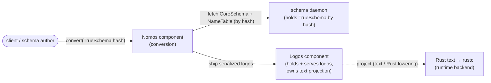

# Logos pipeline — component architecture v0

The next-generation schema→Rust pipeline, expressed as components, contracts,
runtime planes, and a staged bootstrap. This document is the architecture spine;
the macro-language design (Nomos's own grammar and macro model) is owned by
`reports/logos/nomos-macro-model-v0.md` and is deliberately **not** reproduced
here — this document treats Nomos as a *component* and cites the macro model only
where the component boundary depends on it.

Written 2026-07-13 (session `schema-codex`, lane `pipeline-architecture`).

## How to read this document

Provenance discipline, identical to `design-v0.md` and cited with **no Spirit
intent tags** (a fresh audit found the existing intent tags unresolvable this
session; the design session is cited by date instead):

- **[psyche ruling — cite]** — the psyche's decision, with its `design-v0.md`
  item (or the dated dispatch that carried it). Settled unless retracted.
- **[evidence — cite]** — a worker-verified fact about the current workspace,
  with source.
- **[proposal]** — an agent suggestion where the psyche was **silent**. Not
  accepted; needs a decision. Every proposal is also collected in §11.

Two dated authorities are in play. Most rulings are from the **2026-07-11**
design session, recorded in `design-v0.md`. The three-component spine (§1) was
carried to this lane by the **2026-07-13 dispatch** as the psyche's stated
architecture; where it refines a 2026-07-11 item, both are shown and the
reconciliation is flagged (§1.3, §11-P1).

## 1. Overview — the three-component spine

**[psyche ruling — 2026-07-13 dispatch spine]** The pipeline is three
components plus the existing schema stack as the front boundary:

1. **The schema daemon** — holds `TrueSchema`, addressed by hash. This is the
   existing `schema` stack, already content-addressable (see §1.1).
2. **The Nomos component** — performs the conversion. A request references a
   `TrueSchema` by hash; Nomos performs the schema→logos conversion and sends
   the resulting logos, **serialized**, to the Logos component.
3. **The Logos component** — holds and serves logos (`CoreLogos` + logos
   `NameTable`, rkyv stored form) and owns the text projection.

**[psyche ruling — design-v0 §1]** The end-to-end pipeline these components
realize is `schema dialects → macro expansion → logos → Rust text → rustc`, with
Rust as the runtime backend (the Shen/K-Lambda analogy: logos is the
standardized core, Rust text the lowering target, rustc the host).



### 1.1 The schema daemon is the existing content-addressed schema stack

**[evidence — repos/schema/ARCHITECTURE.md]** `schema` is "the schema macro
engine and typed semantic schema data model." Its layout is fully
content-addressable: the hash is computed on the semantic schema-in-Rust value
(`TrueSchema`), never on `.schema` text; `TrueSchema` archives through rkyv
(`to_binary_bytes` / `from_binary_bytes`). `signal-schema` is its current public
contract (`LoadPackage` / `EmitRust` → `PackageLoaded` / `RustEmitted` /
`Rejected`), a schema-derived `WireContract`.

**[proposal]** "The schema daemon holds TrueSchema addressed by hash" is
therefore satisfied by the existing stack; the new construction in this document
is the **Nomos** and **Logos** components plus their contracts. No new schema
daemon is built — but the schema daemon's contract must gain a way to serve
`CoreSchema + schema NameTable` **by hash** to Nomos (§3.2, P7), which
`signal-schema` does not expose today.

### 1.2 Conversions happen outside text — typed objects end to end

**[psyche ruling — 2026-07-13 dispatch spine]** Conversions are typed-object
transformations, never text-to-text. Text appears at exactly two edges:

- **schema text → TrueSchema** at the schema daemon's authoring boundary only
  (existing behavior; the hash is on the typed value, `design-v0 §1.1 evidence`).
- **Logos → text** as a *projection* out of the Logos component (pretty-printed,
  `design-v0 §2`), and the eventual Logos → Rust text lowering (§7).

Everything between — `CoreSchema + NameTable → CoreLogos + NameTable` — is a
typed/serialized transformation carried on the binary wire, never a text stage.
This matches the workspace rule that inter-component transport is binary
protocol frames carrying typed contract messages, with NOTA reserved for
authored data and diagnostics, not as the transport contract.

### 1.3 Reconciliation with design-v0 §3.1 (flagged)

**[psyche ruling — design-v0 §3.1]** stated Nomos definitions are *consumed*
"in the **logos daemon**, at the schema→logos conversion site." **[psyche ruling
— 2026-07-13 dispatch spine]** makes the conversion site its **own Nomos
component**, distinct from the Logos component. Reading: the *consumption site*
ruling stands (Nomos macro packages are consumed at the conversion site); the
2026-07-13 spine **relocates that site** out of the logos daemon into a dedicated
Nomos component. This is a refinement, not a contradiction — but because §3.1
literally names "the logos daemon," the relocation should be psyche-confirmed
(P1). All of §3–§3.1's consumption/dispatch/dialect-package rulings survive
unchanged; only their *host component* moves from Logos to Nomos.

## 2. Components and boundaries

Each stateful component follows the workspace shape: one runtime daemon crate +
thin CLI + a public `signal-<component>` contract crate (owner-policy
`meta-signal-<component>` only if an authority boundary needs it). The canonical
exemplar is the spirit triad (`signal-spirit` public + `meta-signal-spirit`
owner-policy + daemon-local nexus/sema modules), which
`repos/spirit/ARCHITECTURE.md` names as the shape "future component daemon repos
should copy." **[evidence — repos/spirit/ARCHITECTURE.md,
repos/schema/ARCHITECTURE.md]**

| Component | Owns | Public contract | Wire role |
|---|---|---|---|
| schema daemon (existing) | TrueSchema by hash, CoreSchema + schema NameTable | `signal-schema` (+ P7 core-serving op) | serves CoreSchema+NameTable to Nomos |
| **Nomos** (new) | the conversion; loaded Nomos macro packages (dialects) | `signal-nomos` | accepts convert-by-hash; ships serialized logos to Logos |
| **Logos** (new) | CoreLogos + logos NameTable (rkyv), text projection, (eventually) Rust lowering | `signal-logos` | receives serialized logos; serves projections |

**[psyche ruling — 2026-07-13 dispatch spine]** The two contracts and what they
expose:

- **`signal-logos`** exposes logos's **main types**, so that Nomos can
  *construct* logos and ship it *serialized* to the Logos component.
- **`signal-nomos`** exposes the **macro objects** that schema needs to
  *recognize macro invocations* (e.g. the `Map` macro object; `design-v0 §3`).

### 2.1 Component-split test (why three, not one)

**[proposal, grounded in the micro-components split test]** The split is
justified by distinct nouns, vocabularies, and state owners:

- schema daemon owns the **schema** vocabulary and TrueSchema identity;
- Nomos owns the **macro / dialect** vocabulary and the conversion function;
- Logos owns the **logos node** vocabulary (CoreLogos/TrueLogos) and its
  NameTable, projection, and stored form.

Each is a separate bounded vocabulary and a separate codec surface — the split
test's positive triggers. **[evidence — design-v0 §1.2, ruling 1]** The psyche's
own "not enough room for another component" hesitation was about proliferating
components; the 2026-07-13 spine resolves it by making Nomos a genuine
first-class component. This is recorded, and P1 asks him to confirm the
three-component count against that earlier hesitation.

## 3. The Nomos component

Nomos is the conversion. This document owns its **component** shape; its macro
language and macro model live in `nomos-macro-model-v0.md`.

### 3.1 What Nomos consumes and produces

**[psyche ruling — design-v0 §2, §3]** Nomos consumes **CoreSchema + schema
NameTable** (not TrueSchema — CoreSchema so CoreLogos re-uses the same
identifier→name allocation) and produces **CoreLogos + logos NameTable** by
extending that allocation. The identifier space is **continuous across schema
and logos**: schema identifiers keep their meaning in logos; logos mints new ones
by extension (`design-v0 §2`).

**[psyche ruling — design-v0 §3]** The conversion logic *is* the macro system:
named macros (table entries, keyed on **minted identity**, never a string) and
structural macros (per-section positional defaults, e.g. the
"particular-struct" default derive sets). An application `X.()` with no
macro-table entry is an **error**; the structural default is specifically the
`X.{}` form. **[psyche ruling — design-v0 §3.1]** A dialect *is* a Nomos macro
package (macro table + structural section rules).

### 3.2 The conversion request references a TrueSchema by hash

**[psyche ruling — 2026-07-13 dispatch spine]** A request names a `TrueSchema`
by hash. **[proposal, P7]** Since the conversion consumes CoreSchema + NameTable
(§3.1), Nomos must obtain those from the schema daemon by that hash. Two shapes:

- **(a) Nomos pulls** — the schema daemon's contract gains an operation
  "serve CoreSchema + schema NameTable for hash `H`," and Nomos calls it on
  receipt of a convert request. Clean authority boundary; one added op.
- **(b) client pushes** — the client sends CoreSchema + NameTable in the convert
  request. Fewer hops, but the payload is large and duplicates content the schema
  daemon already holds by hash.

**[proposal]** Prefer (a): it keeps the hash as the identity of record and keeps
CoreSchema ownership with the schema daemon. Flagged P7 — it requires an added
schema-daemon contract operation that does not exist in `signal-schema` today.

### 3.3 Does Nomos own durable state?

**[proposal, P4]** The psyche was silent. Nomos's conversion is a **pure typed
function** (CoreSchema + NameTable + loaded dialect → CoreLogos + NameTable); its
only candidate durable state is the **set of loaded Nomos macro packages
(dialects)**. Two shapes:

- **stateful-registry** — Nomos loads and holds dialect packages in a SEMA-owned
  registry (single-writer), and convert requests name a loaded dialect; this
  gives Nomos a real, if thin, SEMA plane.
- **stateless-per-request** — the dialect package travels in the convert request
  (or is fetched by hash like the schema), and Nomos holds no durable state,
  making it a Nexus-heavy pure-transformation service with no SEMA plane.

This turns on the still-**[open]** `design-v0 §8` question of where Nomos
definitions are *authored / held at rest*. Flagged P4; it should be decided with
that open question.

## 4. The Logos component

### 4.1 Identity architecture (mirrors the schema)

**[psyche ruling — design-v0 §2]** Logos mirrors the schema identity
architecture:

- **CoreLogos** — a stringless core; identifiers are indices into a logos
  **NameTable**.
- **TrueLogos** — the projected named view over CoreLogos (mirrors TrueSchema
  over CoreSchema).
- **rkyv** — the stored / in-memory form.
- **deserialized text** — the agent-readable projection, pretty-printed.

The logos NameTable **extends** the schema NameTable allocation (§3.1), so a
CoreLogos node addressing a carried-over schema identifier resolves through the
continuous space.

### 4.2 What the Logos component receives and serves

**[psyche ruling — 2026-07-13 dispatch spine]** Logos *receives serialized
logos* from Nomos (the ship step) and *serves* it. `signal-logos` exposes
logos's main types so Nomos can construct and serialize the logos value on the
wire. **[proposal]** The served surfaces are: store/accept a shipped serialized
logos unit; fetch a logos unit by its identity; project a logos unit to
pretty-printed text (`design-v0 §2`); and (eventually, §7) lower it to Rust text.

### 4.3 Storage / stored form

**[psyche ruling — design-v0 §2]** rkyv is the stored / in-memory form of logos.
**[proposal, P5]** *Which* store backs it was not decided. Because logos is a
**derived materialized view** — regenerable by re-running Nomos over a
`TrueSchema` — it is a rebuildable cache, not an authoritative source of truth.
Two shapes:

- **slot store (in-memory)** — mirror `signal-schema`'s `SchemaSlot` model: logos
  units live in an in-memory slot store, rebuilt on demand. Simple; matches the
  "rebuildable materialized store" framing already used for sema-engine
  (`sema-engine/ARCHITECTURE.md`).
- **sema-engine-backed (durable)** — persist logos units through `sema-engine`
  (redb-backed, single-writer, blake3-addressed) like the rest of the fleet's
  durable state, if a durable, content-addressed logos cache is wanted.

**[proposal]** Prefer the slot store until a durable-logos requirement appears;
logos is derivable, so durability buys little beyond a warm cache. Flagged P5.

### 4.4 Text projection and pretty-printing

**[psyche ruling — design-v0 §2, §1.2]** Text is a **projection**, with
pretty-printing; the projection owns the `.`→`::` translation for Rust paths
(`design-v0 §1.2, ruling 7`) and re-sugars on Rust output while logos itself
stays desugared at the dialect boundary (`design-v0 §7.2`). **[evidence —
design-v0 §7.1]** The existing emitter is already token-based
(`proc_macro2::TokenStream` + `quote`, one `prettyplease` pass); the logos→Rust
projection can inherit that token path's parenthesization and hygiene rather than
reinventing them.

## 5. The contracts

Two new `signal-<component>` contract crates, each a schema-derived
`WireContract` following `contract-repo` discipline: operation types, reply
types, codecs, round-trip tests; **no** daemon runtime, actors, tokio, sockets,
or state. **[evidence — repos/signal-schema/ARCHITECTURE.md]** — the existing
`signal-schema` is the pattern to copy.

### 5.1 signal-logos (proposal for the operation spine)

**[psyche ruling — 2026-07-13 dispatch spine]** `signal-logos` exposes logos's
**main types** so Nomos can construct and ship serialized logos. **[proposal,
P6]** A minimal, stable operation spine (contract-local verbs, no sema
vocabulary on the wire):

- `AcceptLogos` — receive one serialized logos unit shipped by Nomos.
- `FetchLogos` — retrieve a stored logos unit by identity.
- `ProjectLogos` — return the pretty-printed text projection of a unit.
- replies: `LogosAccepted` (with stored identity), `LogosFetched`,
  `LogosProjected`, `Rejected` (closed `RejectionReason`, no catch-all string).

The logos node types themselves (CoreLogos/TrueLogos) are the contract's **main
types**, exported so Nomos can build a logos value and serialize it into
`AcceptLogos`.

### 5.2 signal-nomos (proposal for the operation spine)

**[psyche ruling — 2026-07-13 dispatch spine]** `signal-nomos` exposes the
**macro objects** schema needs to recognize macro invocations. **[proposal,
P6]** Its two exposed surfaces:

- **the macro-object types** (`design-v0 §3`, e.g. the `Map` macro object) —
  imported by the schema side so it can recognize a macro invocation as such;
- **the conversion operation**: `Convert` (names a `TrueSchema` by hash; §3.2),
  replying `Converted` (logos shipped / accepted, referencing the Logos unit
  identity) or `Rejected`.

**[open — design-v0 §8]** Whether Nomos itself obeys the full NOTA invariants is
presumed-yes-unconfirmed; the no-string-dispatch invariant specifically **is**
confirmed via minted-identity keying (`design-v0 §3`). The contract keeps macro
lookup keyed on minted identity, never a string.

### 5.3 No owner-policy contracts proposed yet

**[proposal]** Neither component is proposed to need a `meta-signal-*`
owner-policy contract in v0 — there is no configuration or authority boundary
distinct from the public surface yet. Add one only if dialect-package loading
(P4) turns out to need an owner-authority boundary.

## 6. Runtime shape inside each daemon

**[proposal, P2]** The psyche was silent on whether Nomos and Logos are kameo
actor daemons like the rest of the fleet. Proposal: **yes** — copy the spirit
triad shape (`repos/spirit/ARCHITECTURE.md` names it the shape to copy). Each
daemon runs the three planes:

- **Signal** admits framed `signal-<component>` requests, authenticates the
  caller shape, returns the typed reply envelope.
- **Nexus** owns async mail and external effects. In **Nomos** this is the heavy
  plane: fetch CoreSchema+NameTable from the schema daemon (§3.2), run the
  conversion, ship serialized logos to Logos. In **Logos** it handles the
  projection and (eventually) the rustc hand-off (§8).
- **SEMA** owns durable single-writer state and commits legal transitions —
  thin-or-absent in Nomos (P4), the logos slot/cache writer in Logos (P5).

A root request flows Signal → Nexus → SEMA and returns on the same typed path;
no plane is bypassed by helper calls. The CLI is each daemon's first client,
talking only to its own daemon through its public contract.

**[proposal]** Trace identity is typed and schema-derived: a witness names
component, contract operation, plane, request identity, and terminal outcome —
including, for Nomos, the source `TrueSchema` hash and the shipped logos identity,
so a conversion is traceable end to end.

## 7. Bootstrap staging — explicit phases

**[psyche ruling — 2026-07-13 dispatch spine + design-v0 §3.1, §4]** The
inter-component types are defined in the **current** schema→Rust stack; the
current `schema-rust` pipeline generates their Rust. Eventually logos does the
Rust lowering itself (or via one more component), and *that endpoint replaces
schema-rust emission as THE Rust-generating mechanism*. Presented as phases with
what exists at each:

### Phase 0 — today (exists now)

**[evidence — repos/schema, repos/schema-rust, repos/signal-schema]** The
current schema→Rust stack: `schema` (macro engine, content-addressed TrueSchema),
`schema-rust` (token-based Rust emitter, `prettyplease`), `signal-schema`
(`LoadPackage`/`EmitRust`). **[psyche ruling — design-v0 §4]** The Rust
`schema-rust` currently emits, plus its committed goldens, is the **acceptance
oracle**: any logos that lowers must reproduce that same Rust.

### Phase 1 — define the inter-component contracts on the current stack

**[psyche ruling — 2026-07-13 dispatch spine]** Author `signal-nomos/schema` and
`signal-logos/schema` as `.schema` files and let the **current `schema-rust`**
emit their `src/schema/*.rs` wire surfaces — exactly as `signal-schema` is
generated today. At this phase the contracts exist and compile; the Nomos/Logos
*daemons* do not yet. The logos node types (CoreLogos/TrueLogos), the Nomos
macro-object types, and both operation spines are the schema-generated output.

### Phase 2 — build the Nomos and Logos daemons above those contracts

**[proposal, grounded in design-v0 §4]** Stand up the two component daemons
(§6). Nomos performs `CoreSchema + NameTable → CoreLogos + NameTable`; Logos
holds/serves logos and **projects to text**. The logos→Rust projection is
validated against `schema-rust`'s existing goldens: the migration is correct when
the macro-produced logos lowers to the Rust the current emitter already produces
(`design-v0 §4`). At this phase **`schema-rust` still emits the production Rust**;
the logos path runs in parallel, gated by the golden oracle.

### Phase 3 — logos becomes THE Rust-generating mechanism (endpoint)

**[psyche ruling — 2026-07-13 dispatch spine]** Logos does the Rust lowering
itself (or via one more component); that endpoint **replaces** `schema-rust`
emission. **[proposal, P3]** Whether the Logos→Rust lowering is a **plane inside
the Logos daemon** or a **separate fourth component** was left as the psyche's
"itself or via one more component" — flagged P3. **[proposal, from design-v0 §3.1
+ §7.2]** At this end state the self-hosting shape holds: a dialect is a Nomos
macro package, and the **Logos→Rust projection is the fixed hosted kernel** (the
Shen/K-Lambda parallel — schema defines its own Nomos macros atop a small fixed
lowering). `schema-rust`'s token-based emission (`design-v0 §7.1`) is the
harvest source for that fixed lowering, then retired.

**Compatibility note.** **[evidence — design-v0 §4]** Because Phase 2 gates on
the existing goldens and Phase 3 only swaps the *producer* of identical Rust, the
public Rust surface is unchanged across the cutover — the goldens are the
byte-verification basis, matching the executed nota-grammar-migration precedent
(`nota-grammar-revision-v0.md §2.5`).

## 8. Diagnostics — rustc errors flowing back (proposal)

**[proposal, P8]** The psyche was silent on how rustc diagnostics flow back.
rustc reports against **generated Rust text**, but the author works in schema /
logos. **[evidence — design-v0 §7.2]** The prior-art brief named a
**source-map** from generated Rust back to the schema/logos origin as a
must-design-early pitfall, alongside defensive parenthesization and name hygiene.
Proposal: the Logos→Rust projection emits a source-map keyed by logos node
identity; a rustc diagnostic's span is looked up to a logos node, and — via the
continuous identifier space (§4.1) — back to its schema identity, so the
diagnostic points at the schema origin. Which component owns this back-translation
(Logos, since it owns the projection, is the natural home) is flagged P8.

## 9. Invariants preserved (carried, all psyche-stated)

**[psyche ruling — design-v0 §6]** The architecture must hold the standing NOTA
invariants: strictly typed positional data (the expected type is known at every
boundary; the parser never classifies); positionality, no named binding; no
aliases; capitalization is semantic; per-kind blocks; one namespace per loaded
whole (duplicate name is an error); generics defined by kind, lowering dispatches
on kind never on a string. The macro table's minted-identity keying (`design-v0
§3`) is how the no-string-dispatch invariant is kept at the component boundary.

## 10. Code map (planned, nothing built yet)

This is report-only; no crates exist. The planned repositories, following the
canonical names:

```text
signal-nomos/     schema/*.schema -> src/schema/*.rs   (Phase 1, schema-rust-emitted)
signal-logos/     schema/*.schema -> src/schema/*.rs   (Phase 1, schema-rust-emitted)
nomos/            daemon + thin CLI, signal/nexus/sema planes   (Phase 2)
logos/            daemon + thin CLI, planes + text projection   (Phase 2)
                  + Logos->Rust lowering                        (Phase 3, P3)
```

## 11. Flagged proposals needing psyche decisions

Each is a point where the psyche was silent or where a newer ruling refines an
older one. None is implemented as settled.

- **P1 — three-component count vs the §3.1 "logos daemon" consumption site.**
  The 2026-07-13 spine makes Nomos its own component; `design-v0 §3.1` placed
  Nomos consumption "in the logos daemon." Confirm the relocation and the
  three-component count against the earlier "not enough room for another
  component" hesitation (§1.3, §2.1).
- **P2 — are Nomos and Logos kameo actor daemons with signal/nexus/sema planes,
  like the rest of the fleet?** Proposal: yes, copy the spirit triad (§6).
- **P3 — is the Logos→Rust lowering a plane inside the Logos daemon or a separate
  fourth component?** The psyche said "itself or via one more component" (§7,
  Phase 3).
- **P4 — does Nomos own durable state (a registry of loaded dialect packages) or
  is it a stateless per-request transformer?** Ties to the open "where are Nomos
  definitions authored / held at rest" question (`design-v0 §8`) (§3.3).
- **P5 — storage engine for the Logos component:** in-memory slot store
  (rebuildable) vs `sema-engine`-backed durable cache. Proposal: slot store until
  a durable-logos need appears (§4.3).
- **P6 — the `signal-logos` and `signal-nomos` operation spines** (§5.1, §5.2)
  are agent proposals for the exposed operations and reply vocabulary; confirm or
  correct the verb set.
- **P7 — the schema daemon must serve CoreSchema + schema NameTable by hash to
  Nomos.** `signal-schema` exposes no such operation today; proposal (a) adds one
  (Nomos pulls) over proposal (b) (client pushes the payload) (§3.2).
- **P8 — rustc diagnostic back-flow:** a source-map from generated Rust → logos
  node → schema identity, owned by the Logos component. The psyche was silent on
  the whole diagnostic path (§8).
