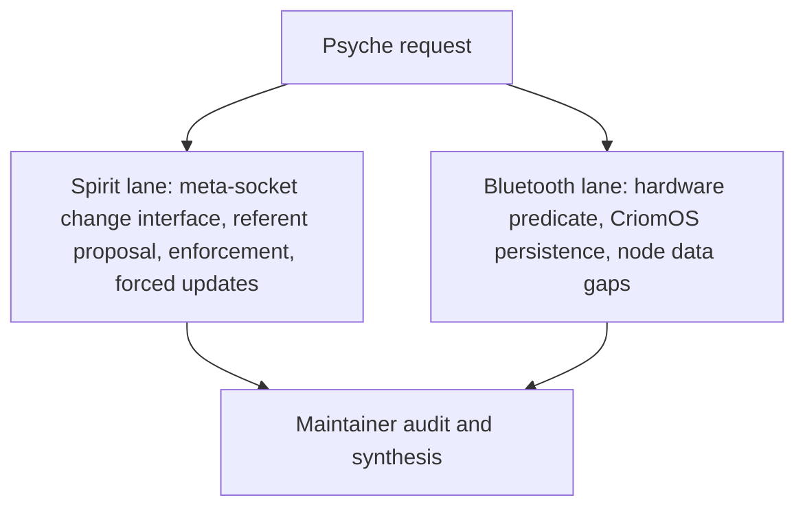

# Spirit referents and Bluetooth hardware fix — frame and method

## User request

The psyche asked to:

- find the Spirit meta-socket interface for forcibly changing existing entries;
- propose referents for active records that currently have none;
- implement referent enforcement and forcibly change those records;
- run a separate investigation/fix so Bluetooth does not break again on this hardware;
- identify exactly what hardware predicate should drive the CriomOS behavior;
- document the durable intent that hardware-dependent discoveries must identify the relevant hardware fact and be represented in cluster/node data so CriomOS can enable features from that data;
- audit the whole thing and report back with visuals, greatest insights, questions, and risks.

## Method

This session is split into two parallel agent lanes plus a maintainer synthesis/audit:

## Live facts at start

- Active Spirit records: 615.
- Active records with referents: 609.
- Active records without referents: 6: `zt3`, `6u6o`, `ki6i`, `t5qr`, `ztC`, `l3ca`.
- Active records with non-kebab referents: 0.
- Bluetooth was temporarily repaired by setting the live firmware loader path to `/run/booted-system/firmware`, reloading `btusb`, and restarting BlueZ.
- Reboot risk remained: generation 131 points firmware loading at a firmware closure containing only `wireless-regdb`, while booted generation 124 contains broad firmware including Intel Bluetooth firmware.

## Acceptance bar

- No active Spirit record remains referent-less unless explicitly retired/Zero.
- Spirit enforcement is implemented at the right layer or a precise blocker is documented.
- Bluetooth fix is tied to a concrete hardware predicate and a persistent CriomOS or deployment-data change.
- Durable hardware-discovery intent is captured in Spirit.
- Final audit distinguishes verified facts from remaining risk.
