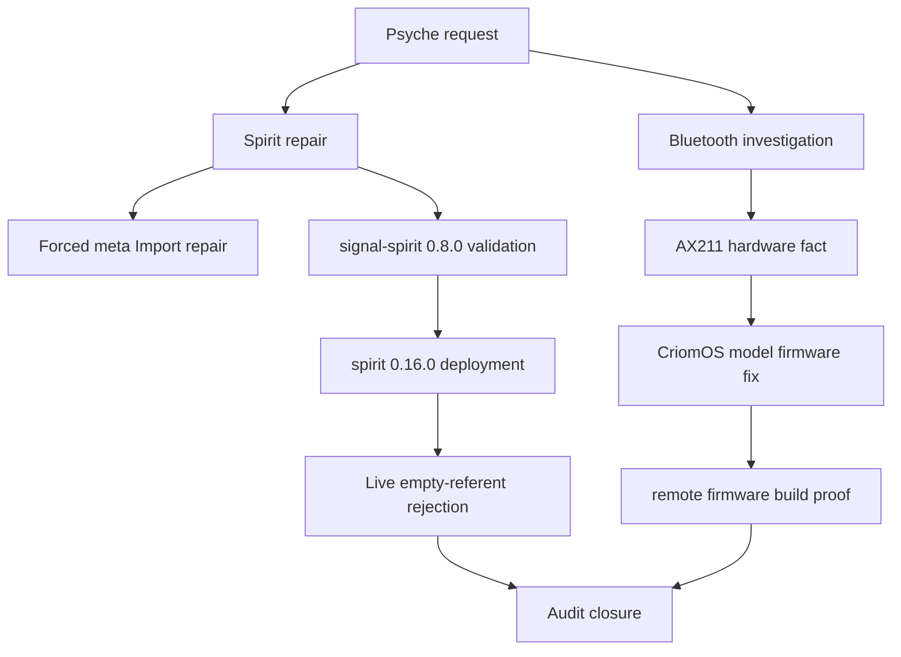

# Final audit — Spirit referents and ouranos Bluetooth

## Outcome

Both requested tracks reached the evidence bar for code, tests, and live checks.

## Greatest insights

1. Active Spirit records need stable retrieval keys. The practical rule is now code: non-Zero entries with empty referents reject at the ordinary contract validation layer.
2. Zero-certainty records remain the right recoverable retirement shape. `ztC` stayed referent-less only because it was moved to `Zero`; active records now all carry referents.
3. Meta Import is the repair scalpel, not the ordinary path. It can upsert stable identifiers for owner-side migration/repair, while ordinary `Record` and `ChangeRecord` now enforce the active-referent rule.
4. The Bluetooth failure was not a BlueZ configuration problem. It was a firmware-closure problem created by a lean OsOnly generation on hardware that still needs Intel Bluetooth firmware.
5. The right persistent firmware predicate is hardware data, not host folklore. The landed fix attaches firmware to `ThinkPadT14Gen5Intel`, backed by observed USB/PCI/DMI facts.
6. OsOnly desktop generations remain a larger hazard. Model-specific firmware fixes the AX211 Bluetooth case, but the bad generation also lacked Home Manager units.

## Evidence ledger

| Area | Evidence |
|---|---|
| Spirit repair | `meta-spirit` imported six forced repairs; active dump after repair had 615/615 with referents and 0 non-kebab referents. |
| Spirit contract | `signal-spirit` commits `cc5ec45ffda3` and `7ae038ef1af5`; `cargo test` passed. |
| Spirit daemon | `spirit` commit `b196c08ec6df`; `cargo test` passed. |
| Deployment | `CriomOS-home` commit `631acec63e4e`; HomeOnly activation status 0. |
| Live enforcement | `spirit Version` reported `0.16.0`; empty-referent active `Record` returned `(Rejected EmptyReferents)`. |
| Live database | Post-rejection dump: 615 active public records, 615 with referents, 0 missing, 0 non-kebab. |
| Bluetooth code | `CriomOS` commit `9d5f9e031db4` adds model-specific firmware for `ThinkPadT14Gen5Intel`. |
| Bluetooth build | Remote-source firmware build for a synthetic `ThinkPadT14Gen5Intel` OsOnly config contains the Intel `ibt-0180-0041` `.sfi` and `.ddc` firmware files. |
| Bluetooth runtime | `bluetooth.service` active; `hci0` remains `UP RUNNING PSCAN`; firmware loader path still uses booted firmware. |

## Subagent audit

The planned parallel subagents did not contribute usable lane reports. Both failed immediately under stale-run reconciliation before producing result files. I continued manually and recorded the failure rather than pretending the parallel workflow succeeded.

## Decisions made in the work

- Enforcement lives in `signal-spirit::Entry::validate`, because every ordinary entry-bearing operation uses the contract validation surface before daemon work.
- Spirit daemon tests were updated to treat implied referent registration as part of active-entry writes; marker expectations moved accordingly.
- State fallback classification now carries the `state` referent, and store migration fallback records carry `migrated-record`, so non-ordinary paths do not reintroduce active empty-referent records.
- Bluetooth persistence uses `ThinkPadT14Gen5Intel` rather than host name, broad chip generation, or a one-off runtime workaround.

## Open questions

1. Should OsOnly desktop generations be prevented from becoming boot defaults unless model firmware coverage and Home Manager omissions are explicitly accepted?
2. Should CriomOS grow a finer hardware fact for USB ID `8087:0033` so future firmware policy can be device-predicate-based rather than model-predicate-based?
3. When should the fixed CriomOS system generation be safely switched on ouranos, replacing the bad boot default?
4. Should the Ethernet EEE mitigation be persisted declaratively, or wait for recurrence?
5. When is the maintenance window for Lenovo firmware and Intel ME updates?

## Risks

- The live system boot default may still be the old bad generation until a safe system deploy changes it.
- The runtime Bluetooth workaround depends on `/run/booted-system/firmware`; it is a bridge, not the final deployed generation.
- Meta Import must remain owner-only; it deliberately bypasses ordinary admission for repair/migration.
- Current active Spirit state is clean, but future non-ordinary migration paths must preserve the new non-empty active referent invariant.
