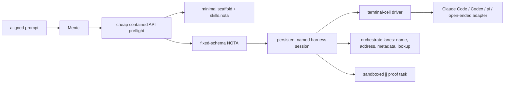

# Mentci Bead-Weave Preparation Handoff

variant: Design

## Problem

The psyche aligned a Mentci slice that turns an aligned prompt into a minimal
scaffold, opens a persistent named harness session, and later files a weave of
BEADS jobs. This wave prepares the durable surfaces only; it does not file the
Mentci beads.

## Landed Durable Surfaces

| Surface | What changed |
|---|---|
| Spirit | Captured the aligned Mentci prompt-to-bead-weave routing decision as `xk7f`. |
| `skills/bead-weaver.md` | New workflow skill for converting aligned prompts or reports into dependency graphs of BEADS tasks. |
| `skills/skills.nota` | Added the `bead-weaver` workflow skill to the typed skill index. |
| `/git/github.com/LiGoldragon/mentci/INTENT.md` | Manifested the prompt-to-work routing goal and constraints into Mentci intent. |
| `/git/github.com/LiGoldragon/mentci/ARCHITECTURE.md` | Added a labelled possible-future architecture section for prompt-to-bead-weave harness sessions. |

## Target Shape

The preflight is the routing and prompt-building engine. It emits NOTA against a
fixed schema, loads the right skills, and creates only a minimal scaffold. The
harness session has its own cheap model knob, separate from the preflight model.
The first proof is a sandboxed jj task, never primary.

## Second-Worker Instructions

Use `skills/bead-weaver.md` as the controlling skill. Also load
`skills/beads.md`, `skills/reporting.md`, `skills/nota-design.md`, and the
Mentci `INTENT.md` / `ARCHITECTURE.md` files listed above. File the actual
Mentci beads only after reading those surfaces.

Recommended first weave:

| Order | Bead title | Done when | Blocks |
|---|---|---|---|
| 1 | Define Mentci preflight NOTA scaffold schema | A fixed pseudo/wire schema names scaffold identity/version, skill loads, model knobs, session request, and constraints. | 2, 3 |
| 2 | Build minimal Mentci preflight prompt path | A prompt can enter the preflight path and produce the fixed-schema NOTA scaffold using a cheap contained model. | 4 |
| 3 | Define persistent harness session addressing contract | Orchestrate lane metadata and session lookup responsibilities are represented without moving liveness out of terminal-cell. | 4 |
| 4 | Implement terminal-cell driver liveness wrapper for Mentci harness sessions | The driver owns process handle, send/read, idle timeout, close signal, and stalled-output detection behind one adapter surface. | 5 |
| 5 | Add first harness adapter for sandboxed jj proof | One adapter can launch/feed/read a harness session in a sandboxed jj task without touching primary. | 6 |
| 6 | Prove thin Mentci prompt-to-harness slice on sandboxed jj task | Prompt-to-preflight-to-scaffold-to-persistent-session works end to end and records observed failure modes. | none |

Do not file first-pass beads for rigorous savings metrics, scaffold caching, or
full adapter parity. Those are deferred until the thin proof exposes real
failure modes.

## Open Checks

Cheap model ids must be verified at implementation time. The psyche named
Claude Haiku-class where available and Codex 5.4 mini as intended classes, but
real provider model identifiers are intentionally not pinned in this wave.
