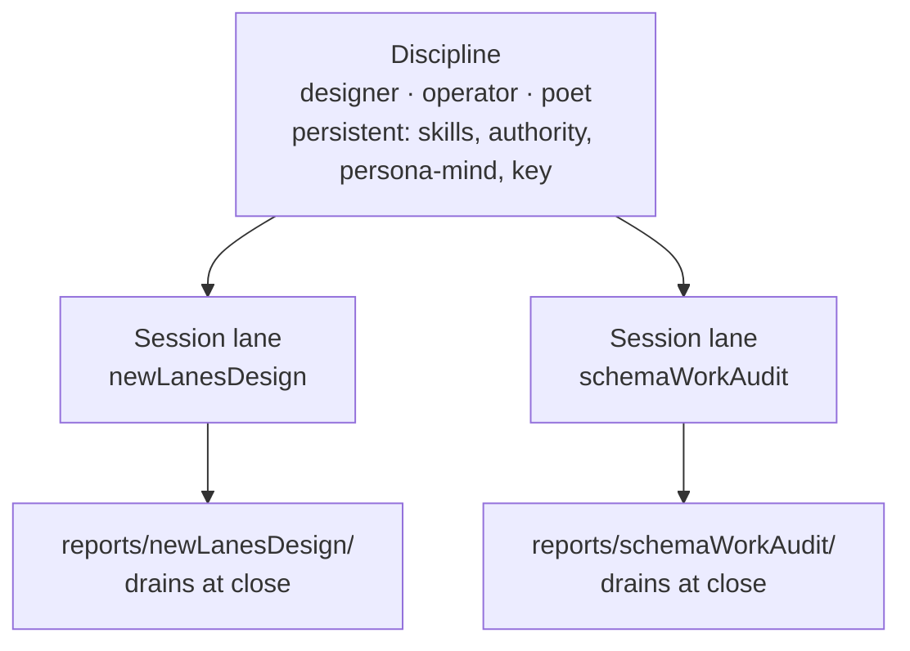
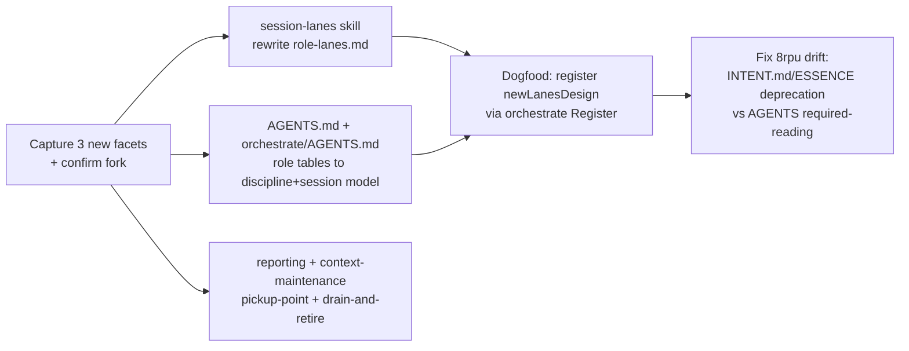

# 0 — newLanesDesign frame, captured-intent map, and the open fork

## Intent Anchors

This redesign rests on intent the psyche has already recorded:

[Dynamic topic-named lanes are the target orchestrate lane model now. A lane is a unique work-session identity for lock ownership and agent flow, such as design-psyche-alignment; discipline or role becomes metadata for skill and authority loading rather than the whole lane name. The current fixed role-shaped lanes remain a compatibility shim until orchestrate supports dynamic lane registration.] (Spirit `potn`, Decision High)

[Roles in persona-orchestrate's lane registry are NOTA vectors of identifier tokens. The LAST token is the base discipline (authority chain + skill loading); preceding tokens are specializations. Filesystem form is the hyphen-joined lowercase rendering. Ordinal prefixes only disambiguate same-role lanes.] (Spirit `irmw`, Decision Medium)

[Agent workflow should favor fresh sessions over context compacting: the psyche clears context and starts a new session for a new topic, while context compaction remains appropriate for a continuing agent still applying work in the same session.] (Spirit `80zj`, Decision Medium)

[Lane retirement requires context maintenance on leftover memories (reports + beads) before identifier retirement; context-maintenance discipline encompasses retired-lane sweeps.] (Spirit `pm1b`, Principle Medium)

[Reports are a small load-bearing set, not an accumulating archive; history lives in jj/git. Context maintenance reduces report count without losing information by agglomerating per topic.] (Spirit `0r17`, Decision High)

## The problem in one paragraph

The workspace organizes work under ~9 fixed role-lanes (`designer`, `operator`, …) plus ordinal/qualified variants, each with a permanent `reports/<role>/` subdirectory. Reports accumulate against the role (designer is at 730) rather than against the work. The psyche's model inverts this: a **lane is a throwaway session named for its intent** (`newLanesDesign`, `schemaWorkAudit`); **discipline** (designer, operator) becomes metadata loaded for skills + authority, not the directory name. Sessions are not endlessly compacted — they are run fresh, drained at close, and archived. The unsolved piece, named by the psyche, is **upkeep**: how do hundreds of intent-named session directories get organized and retired without losing what they taught.

## Most of the vision is already captured intent

This session is mostly **manifestation + cutover**, not invention. The map:

| Psyche's stated facet | Status | Anchor |
|---|---|---|
| Lanes named after session intent; discipline becomes metadata | Captured | `potn`, `irmw` |
| Fresh sessions over endless compaction | Captured | `80zj` |
| Reports are a load-bearing working set, not an archive; git holds history | Captured | `0r17`, `pjib` |
| A session directory is GC-collectable as one unit | Captured | `d0fi` |
| Lane retirement gated on context-maintenance of leftover reports + beads | Captured | `pm1b` |
| Continuation/review report supersedes + deletes its predecessor in one commit | Captured | reporting skill, `0r17` |
| Alignment → fresh-context pickup → fleet of focused sub-agents along a DAG | Captured (as method) | report 728 |
| **First ~100k-token "smart zone": think + align, then fan out a fresh fleet** | **New** | — |
| **Reports are fresh-context pickup points; implementable work → linked beads in a dependency graph** | **New (sharpening)** | — |
| **Throwaway sessions archived for regression / flow-forensics / model-behavior improvement** | **New (extends `80zj`)** | — |

## Finding: the substrate is already built

Two assumed blockers are already gone:

1. **Dynamic lane registration is live in the daemon.** `orchestrate/schema/orchestrate-v0-1.schema` declares `Register [LaneRegistrationRequest]` with `LaneRegistrationRequest (Role LaneAuthority)`, replies `LaneRegistered (LaneRegistration)`, observes with `LanesObserved ((Vec LaneRegistration))`, and `src/lane.rs` + `src/execution.rs:438` implement `register` / `observe` / `retire` / `set_authority`. The `potn` "compatibility shim until the daemon supports it" condition is satisfied — the doc layer is what lags.
2. **Beads already carries the dependency graph.** `bd dep <blocker> --blocks <blocked>`, `bd dep list`, and `bd dep cycles` exist. "Implementable work → dependency-graph of beads" needs no new tool today; the standing constraint is only that beads is transitional toward persona-mind, so we wire conventions, not deeper investment.

So the work is: cut the **documentation + convention layer** over to the model the intent and the daemon already hold, and add the three new workflow facets.

## Reconciling the mirror-model with session-lanes

The prior model (`jq8w`) says lanes are "windows into the same persona." The session-lane model says a lane is a throwaway session identity. These reconcile cleanly along one axis — **discipline is the persistent identity; the lane is the ephemeral session:**

A session lane carries its discipline as the last token of its registry role vector (`[NewLanesDesign Designer]` per `irmw`); the discipline still loads the same skills, authority class, and persona-mind memory. The persona persists; the session is disposable.

## The three new facets I propose to capture

Stated with conviction by the psyche but carrying certainty/importance judgment calls — so I hold them for your one-turn confirmation rather than guessing the metadata:

1. **Smart-zone workflow** (Principle, recommend Medium/Minimum): a session's early high-fidelity window (the psyche's mark: ~100k tokens) is for the main agent's deep thinking and intent alignment; at that mark the agent launches a fleet of fresh-context sub-agents primed with the conclusions, rather than continuing to reason in a degrading or compacted context.
2. **Reports as fresh-context pickup points** (Principle, recommend Medium/Minimum): reports are written so a fresh agent can pick the work up, reason about it, and — where it is implementable — implement it; implementable work is linked to beads forming a dependency graph.
3. **Sessions archived for forensics** (Clarify on `80zj`, recommend Medium): throwaway sessions are archived (not merely discarded) so a later pass can reconstruct a flow, catch regressions, and improve model behavior.

## The one open fork — upkeep and archival

Everything else defaults cleanly; this is the genuine decision. When a session lane drains (every idea routed to **intent** / **bead** / **abandon**, per the report-730 disposition model), where does the session artifact go?

- **Option A — git + transcript is the archive.** The drained `reports/<lane>/` directory is deleted; git history holds the reports and the session transcript holds the reasoning. The working tree only ever shows *active, undrained* lanes; the orchestrate daemon's `LanesObserved` registry is the live index. Cleanest, matches `0r17`/`d0fi`, nothing to maintain. Risk: regression/model-behavior forensics means spelunking git + transcripts, which is less discoverable.
- **Option B — explicit in-tree session archive.** Drained lanes move to an archive surface (e.g. `reports/_archive/<lane>/` or a compacted index) kept deliberately for the regression / model-improvement use the psyche named. More discoverable for forensics; costs ongoing curation and re-grows the surface `0r17` wants small.

Recommendation: **A**, with the daemon registry as the index — unless the regression / model-behavior-improvement use is frequent enough that burying it in git defeats the purpose, in which case a thin **B** (an append-only index of retired lanes pointing at their git range + transcript, not the full reports) is the middle path.

## Implementation surface (slice DAG, after alignment)

A side gap surfaced: `8rpu` (Decision High) says `ESSENCE.md` / `INTENT.md` are **deprecated**, intent driven from Spirit — yet `AGENTS.md` still lists them as required reading. That drift is in scope for the same cutover.

## Method for this session

Smart-zone now (this frame is the thinking artifact). Once the fork is settled and the captures confirmed, fan a fleet along the slice DAG: one sub-agent per ready node, each given the confirmed intent + assigned reading, writing numbered slices into this directory, synthesized into the highest-numbered report. This session dogfoods the very model it designs.
