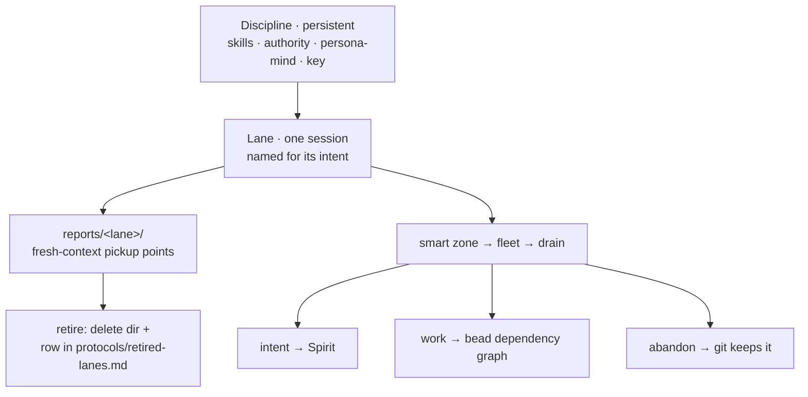

# 8 — newLanesDesign closeout and current state

## TL;DR

The workspace is cut over from fixed role-lanes to **dynamic session lanes**. A
discipline is now the permanent identity; a lane is a throwaway session named for
its intent. The substrate was already built (the orchestrate daemon's
Register/Observe/Retire and the `bd dep` graph), so this was a documentation +
convention cutover, landed on `main` as `628b163d`. This session dogfooded the
model: it ran as the `new-lanes-design-designer` lane and registered live.

## The model

## What changed

- **`skills/session-lanes.md`** (new, replaces deleted `skills/role-lanes.md`) —
  the canonical lane mechanism: discipline vs lane, daemon registration, reports
  as pickup points, the smart-zone → fleet → drain lifecycle, retirement.
- **`AGENTS.md`** and **`orchestrate/AGENTS.md`** — nine disciplines + dynamic
  session lanes; the fixed-lane table is retired as the lane model.
- **`skills/reporting.md`**, **`skills/report-naming.md`**,
  **`skills/context-maintenance.md`**, **`skills/context-maintenance-deep.md`** —
  reports under `reports/<lane>/` written as fresh-context pickup points; the
  close-of-session drain (intent / work / abandon); delete-dir-on-retire.
- **`protocols/retired-lanes.md`** (new) — the append-only thin retired-lane index;
  git history and the session transcript are the archive.
- **`ARCHITECTURE.md`** rewritten current-state (it had drifted to a four-role
  model); **`skills/schema-designer.md`**, **`skills/skills.nota`**, and the
  designer/operator/system-operator/poet skills swept off `role-lanes`.

## Intent captured (Spirit)

- **`6utp`** (Decision) — drain a lane, delete its report directory, keep git +
  transcript as the archive, index retired lanes in `protocols/retired-lanes.md`.
- **`69fa`** (Principle) — the smart zone: first ~100k tokens for thinking +
  alignment, then a fresh-context fleet.
- **`ypg9`** (Decision) — reports as fresh-context pickup points; implementable
  work linked into a bead dependency graph.

## Follow-up work (beads)

Three independent follow-ups (no dependency edges — they don't block each other):

- **`primary-sfr3`** — cut the `8rpu` intent-files deprecation (ESSENCE.md /
  INTENT.md are deprecated per Spirit, but AGENTS.md still lists them as required
  reading) across AGENTS.md + ARCHITECTURE.md. Scoped out of this cutover to keep
  it focused.
- **`primary-dixg`** — create `skills/videographer.md`; videographer is one of the
  nine disciplines but has no skill file to load.
- **`primary-kooj`** — cut `orchestrate/roles.list` / the daemon seed to the
  dynamic-lane model (daemon-infra; operator/schema-operator scope).

## Drain decision (open)

This lane is itself drainable: its substance landed in the actual docs (abandon
fate — already landed), its intent went to Spirit (`6utp`/`69fa`/`ypg9`), and its
follow-up work went to beads. The full dogfood is to **retire it now** — delete
`reports/newLanesDesign/`, append one row to `protocols/retired-lanes.md`, and
`meta-orchestrate "(Retire (Lane new-lanes-design-designer))"`. Held pending the
psyche's review, since draining deletes the reports from the working tree (git
keeps them).
