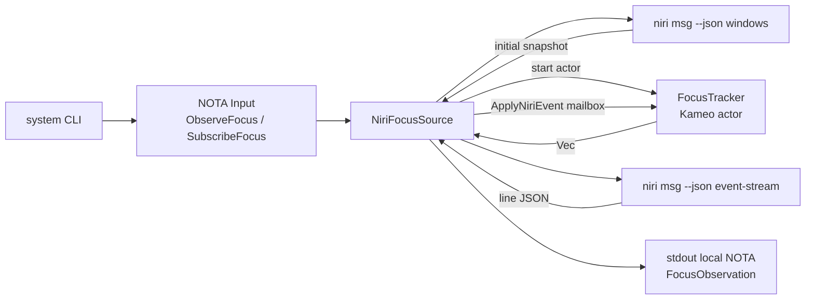
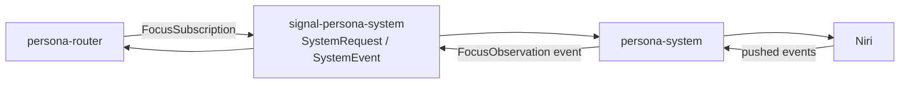
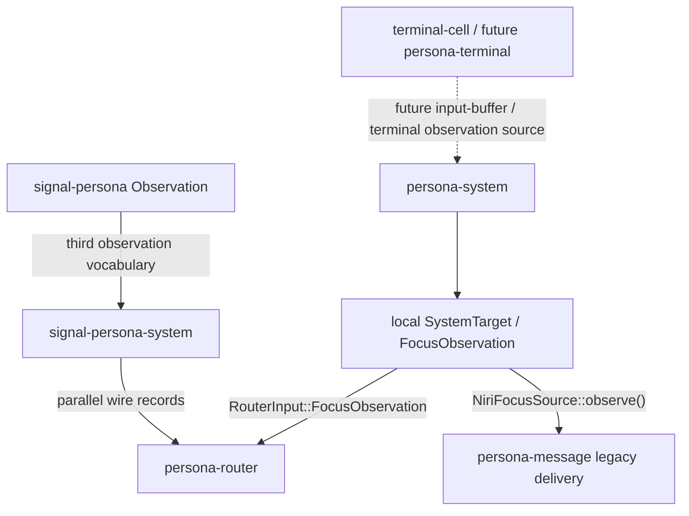

# 104 - Persona System Component and Satellites

Role: `operator-assistant`

Scope: `/git/github.com/LiGoldragon/persona-system` and immediate satellites:
`signal-persona-system`, `persona-router`, `persona-message`, `signal-persona`,
and the current terminal-cell direction as context.

## Short read

`persona-system` is currently a small Niri-backed system-observation component.
The implemented path is:

- parse one NOTA CLI command;
- read `niri msg --json windows` for a one-shot focus observation, or seed a
  subscription from that snapshot;
- follow `niri msg --json event-stream`;
- push event rows through the Kameo `FocusTracker` mailbox;
- print local NOTA `FocusObservation` rows.

The best part is now the local actor shape: `FocusTracker` owns the live
subscription state and the event-stream path crosses its mailbox. The recent
commit `399aa385a073` fixed the old `NiriFocus` wrapper.

The important architectural gap is outside that actor: there are three parallel
observation vocabularies that are not joined.

| Surface | Path | Current state |
|---|---|---|
| Local runtime/CLI records | `persona-system/src/{target,event,niri}.rs` | Implemented and tested. |
| Wire contract | `signal-persona-system/src/lib.rs` | Implemented and round-trip tested, but not used by `persona-system` runtime. |
| Umbrella Persona records | `signal-persona/src/observation.rs` | Exists with another focus/input vocabulary. |

`persona-router` currently imports both `persona-system` and
`signal-persona-system`, so it literally has two `FocusObservation` types in
the same crate. That is the ugliest thing in this area.

## Visual: implemented local path



## Visual: intended satellite contract path



That diagram is architecture, not current implementation. The current
`persona-system` CLI never accepts or emits `signal-persona-system::Frame`, and
`persona-router` does not currently open a system subscription transport.

## Visual: actual current satellite relations



The dashed terminal-cell relation is future context only. I did not inspect or
touch that lane beyond reading `reports/designer-assistant/12-terminal-cell-owner-spike.md`.

## Component map

| File | What it owns | Current quality |
|---|---|---|
| `src/target.rs` | `NiriWindowId`, `NiriWindow`, `SystemTarget`, `HarnessTarget` | Clear and small. Duplicates `signal-persona-system::SystemTarget`. |
| `src/event.rs` | Local `FocusObservation`, `FocusState`, `InputBufferState`, `SystemEvent` | Useful local domain types, but mostly not wired to the Signal contract. |
| `src/command.rs` | CLI input parsing for inline/file NOTA; dispatch to observe/subscribe | Simple. Under-tested. |
| `src/main.rs` | Thin CLI entry point | Good shape. |
| `src/niri.rs` | Niri process adapter, JSON decoding, focus tracking reducer, hand-written NOTA output | The core implementation. Too many responsibilities in one file. |
| `src/niri_focus.rs` | Kameo actor implementation for `FocusTracker`; mailbox messages and witness statistics | Correct actor direction. Public test-witness types are a little awkward. |
| `tests/smoke.rs` | Value-level focus and prompt-state behavior | Good reducer coverage. |
| `tests/actor_runtime_truth.rs` | Kameo/no-ractor guards, mailbox guards, fake event-stream push witness | Good architectural witnesses, but some source-string checks are brittle. |

## Patterns

### Data-bearing actor

The actor type is now the data type:

```text
FocusTracker
  owns target id, last observation, workspace id, generations, mailbox counters
  implements Actor
  handles ApplyNiriEvent
```

This matches `skills/actor-systems.md`: the type with the state owns the
mailbox. The removed `NiriFocus` wrapper no longer shadows the real data.

### Reducer plus actor mailbox

`FocusTracker::apply_event` is a pure-ish reducer over a typed `NiriEvent`.
The actor handler calls `apply_event_from_mailbox`, which increments counters
and delegates to the reducer. Tests exercise both levels:

- `tests/smoke.rs` proves the reducer filters noisy Niri events;
- `tests/actor_runtime_truth.rs` proves subscription events cross the actor
  mailbox.

### Fake backend executable

`niri_subscription_cannot_poll_focus_snapshots` writes a fake `niri` executable
that supports only:

```text
niri msg --json windows
niri msg --json event-stream
```

That is a good pattern. It proves the subscription path uses an event-stream
fixture without requiring a live compositor or a Niri test window.

### Local NOTA text surface

The CLI prints records like:

```text
(FocusObservation (NiriWindow 10) true 2000000007)
```

This is hand-written in `src/niri.rs`, not generated from the Signal contract.
It is acceptable as a local CLI experiment, but it is not the final typed
wire path.

## Satellites

### `signal-persona-system`

This repo owns the intended router/system wire vocabulary:

- `SystemRequest`: focus/input-buffer subscriptions, unsubscriptions, and
  snapshots;
- `SystemEvent`: focus/input-buffer observations, window closed, subscription
  accepted, target missing;
- `Frame`: the Signal frame alias.

It has round-trip tests for every request/event variant. Its Nix surface is
better than `persona-system`: build, test, round-trip, doc, fmt, and clippy
checks are exposed.

High-signal issue: `README.md` is stale. It shows:

```rust
use signal_persona_system::{Frame, SubscribeFocus, SystemRequest, SystemTarget};
let request = SystemRequest::SubscribeFocus(SubscribeFocus { ... });
```

Those names do not exist. The current code uses `FocusSubscription` and
`SystemRequest::FocusSubscription`.

### `persona-router`

Router has two system-observation paths:

- `src/router.rs` accepts `persona_system::FocusObservation` in
  `RouterInput::FocusObservation`;
- `src/delivery.rs` uses `signal_persona_system::FocusObservation`,
  `InputBufferObservation`, and `InputBufferState` in `DeliveryGate`.

This is real type drift. It means the router architecture says it consumes the
Signal system contract, but the runtime input path currently accepts the local
`persona-system` type.

The implemented gate behavior is sensible:

- defer when focus is unknown;
- defer when focus is true;
- defer when input buffer is occupied or unknown;
- defer when focus/input observations describe different targets;
- deliver only when focus is false and input buffer is empty.

But the router does not currently subscribe to `persona-system`; tests inject
observations manually.

### `persona-message`

`persona-message` is a legacy/prototype consumer. Its delivery gate calls
`NiriFocusSource::observe()` directly before sending to a PTY socket. That is a
one-shot snapshot, not the push-subscription architecture. This matches the
open P1 work item: `persona-message` must migrate away from text files and
polling/snapshot delivery toward router-owned state and pushed observations.

I would avoid adding more system behavior to `persona-message`; treat its direct
Niri focus call as transitional.

### `signal-persona`

The umbrella repo has another `Observation` vocabulary:

- `Observation::Focus(FocusObservation)`;
- `InputBufferObservation`;
- `WindowClosed`;
- `HarnessObservation`.

Those records use `PrincipalName`, not `SystemTarget`. This may be the
long-term semantic layer, but today it is another parallel observation surface.

### Terminal-cell direction

`reports/designer-assistant/12-terminal-cell-owner-spike.md` says the terminal
owner is becoming a backend-neutral terminal cell with transcript truth and
disposable viewers. For `persona-system`, the relevant future edge is input
buffer observation: prompt/composer state probably belongs near terminal-cell
or a harness adapter, then flows into the same pushed system/router contract.

That should not be implemented in `persona-system` until the terminal-cell
split names the concrete source.

## What is beautiful

- `FocusTracker` as the actor is now the right shape.
- The fake `niri` event-stream test is a real witness, not a mock hidden behind
  the same code path.
- `NiriWindowId` is the right first identity key. The code treats title/app id
  as evidence in snapshots, not identity.
- Unknown input/focus state is modeled as a safety state, not a reason to force
  delivery.
- The reducer tests and actor truth tests are separated: value behavior and
  mailbox path are both visible.

## What is ugly

1. **Three observation vocabularies.**

   `persona-system`, `signal-persona-system`, and `signal-persona` all define
   focus/input/window observation records. This violates the "one named thing,
   one meaning" rule unless each layer gets an explicit conversion boundary.

2. **Router imports both local and contract focus observations.**

   `persona-router/src/router.rs` imports `persona_system::FocusObservation`;
   `persona-router/src/delivery.rs` imports `signal_persona_system::FocusObservation`.
   Same name, same domain, different types.

3. **`persona-system` architecture says `signal-persona-system`, but code
   prints local NOTA.**

   The runtime does not speak Signal frames, does not use the contract enum,
   and does not emit `SubscriptionAccepted` / `ObservationTargetMissing`.

4. **`src/niri.rs` is too dense.**

   It contains process spawning, JSON decoding, event-domain records, tracking
   reducer, hand-written NOTA rendering, and target rendering. The file is
   still readable, but the concerns are beginning to crowd.

5. **The test-witness statistics are public crate exports.**

   `FocusStatisticsProbe`, `ReadFocusStatistics`, and `FocusStatistics` are
   useful witness types, but they feel like test scaffolding leaking into the
   public API. That may be acceptable if we consider observability a first-class
   actor surface; otherwise it wants a cleaner trace/status shape.

6. **Source-string truth tests are brittle.**

   Tests like `assert!(source.contains("focus.ask(ApplyNiriEvent { event }).send()"))`
   catch shortcuts, but they are formatting-sensitive. Good enough now, but not
   a durable substitute for a typed trace if this component grows.

7. **`signal-persona-system/README.md` is stale.**

   The example names do not compile against the current contract.

## Unimplemented

- `persona-system` does not serve the `signal-persona-system` channel.
- There is no system daemon, socket, or transport.
- No conversion layer exists between local runtime records and
  `signal-persona-system` records.
- Focus unsubscription is contract-only; runtime has no subscription registry.
- Input-buffer subscription/snapshot/observation is contract-only in the system
  component. `InputBufferState` exists locally, but there is no backend.
- `WindowClosed` is parsed from Niri events but not emitted as a Persona or
  Signal event.
- `ObservationTargetMissing` and `SubscriptionAccepted` are not emitted by the
  runtime.
- `NiriFocusSource::subscribe` does not supervise or explicitly kill/wait the
  spawned event-stream child. It reads until EOF.
- No durable system state exists. That is fine today, but if subscriptions or
  backend cursors become durable, the component will need a local Sema table.
- There is no stateful host-display/Niri window-rule witness in this repo.
  The fake executable test is pure and good; live compositor behavior remains
  outside this component's Nix surface.

## Untested

- CLI argument decoding and file-input decoding have little direct coverage.
- Error paths are thinly tested: failed Niri command, invalid JSON, missing
  target, unsupported backend, broken event-stream stdout.
- Niri event variants are under-tested: `WindowClosed`, `WorkspacesChanged`,
  `WindowFocusChanged`, `WindowFocusTimestampChanged`, and unknown event rows.
- `NiriFocusSource::observe` has no fake-command test analogous to the
  subscription witness.
- Long-running subscription behavior is not tested: broken pipe, subscriber
  exit, event-stream process exit, multiple events over time.
- The Signal contract is round-trip tested in its own repo, but not integrated
  with `persona-system`.
- Router subscription flow is not tested because it does not exist yet.
- `persona-system`'s flake exposes only a default cargo test check. It does
  not expose separate fmt, clippy, doc, or named test checks the way
  `signal-persona-system` does.

## Verification run

Current survey verification:

- `nix flake check -L` in `persona-system` returned `all checks passed`.
- `nix flake check -L` in `signal-persona-system` returned `all checks passed`.

Both commands evaluated x86_64-linux outputs and omitted unsupported systems.

## High-signal next fixes

1. Fix `signal-persona-system/README.md` so its example uses
   `FocusSubscription` and `SystemRequest::FocusSubscription`.

2. Add full Nix checks to `persona-system`: `build`, `test`, named
   `actor-runtime-truth`, `smoke`, `doc`, `fmt`, and `clippy`, matching the
   stronger contract-repo shape.

3. Decide the observation vocabulary boundary:

   - Option A: `persona-system` imports and emits `signal-persona-system`
     records directly.
   - Option B: `persona-system` keeps local records but owns explicit
     `From`/`TryFrom` conversions into the contract records.
   - Option C: lift shared records to `signal-persona` and make both
     `persona-system` and `signal-persona-system` use them.

4. Add a small integration test that converts one local focus observation into
   a `signal-persona-system::SystemEvent::FocusObservation` frame and decodes
   it back.

5. Add fake-command tests for `ObserveFocus` and error paths.

6. Defer input-buffer implementation until terminal-cell names the source of
   prompt/composer state.

## Questions

### 1. Which observation vocabulary is authoritative?

Evidence:

- `persona-system/src/event.rs` defines local `FocusObservation`.
- `signal-persona-system/src/lib.rs` defines wire `FocusObservation`.
- `signal-persona/src/observation.rs` defines semantic `FocusObservation`.
- `persona-router` imports both `persona_system::FocusObservation` and
  `signal_persona_system::FocusObservation`.

Do you want one of these to become the authority now? My preference is: keep
`signal-persona-system` as the wire authority for router/system, and either
make `persona-system` use it directly or add explicit conversions immediately.

### 2. Should `persona-system` become a Signal-speaking daemon next?

The current CLI is useful, but it is not the contract path. The contract says
router subscribes once and system pushes events. The implementation says a
human/script runs `system '(SubscribeFocus ...)'` and reads local NOTA lines.

Do you want the next wave to add a small daemon/socket around
`signal-persona-system`, or should the CLI remain the only runtime surface
until router is ready to subscribe?

### 3. Is `persona-message`'s direct `NiriFocusSource::observe()` path dead?

`persona-message/src/delivery.rs` still probes focus synchronously before PTY
delivery. That is exactly the older snapshot path the router push architecture
is meant to replace.

Should I treat every direct `persona-message -> persona-system` focus call as
legacy under the broader message migration, and avoid improving it except to
delete it later?

### 4. Are public actor statistics an accepted observability surface?

The current actor witness exports `FocusStatisticsProbe`,
`ReadFocusStatistics`, and `FocusStatistics`. They are not wrong, but they are
test-shaped.

Should actor witness/status messages be a normal public pattern for Persona
components, or should this be replaced with a more general trace/status API?

### 5. Where should input-buffer observation live?

The contract already has input-buffer subscriptions and observations. The
runtime does not. With terminal-cell becoming the terminal owner, the source of
input-buffer truth may be terminal-cell transcript/screen state, a harness
adapter, or router delivery-state logic.

Which component should mint `InputBufferObservation`: `persona-system`,
`persona-harness`, future `persona-terminal`, or router?

### 6. Should the Niri test-window focus rule become a repo-owned stateful test?

Designer-assistant's terminal-cell report names a Niri rule for test windows
using a stable app id. `persona-system` now has a pure fake-Niri witness, but
no live Niri window-rule witness.

Should that live-compositor test live here as a named `nix run` app, or stay in
system-specialist / terminal-cell while the terminal stack is moving?
