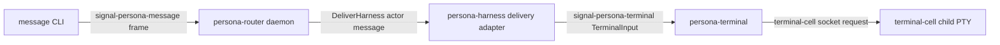

# 105 - Persona terminal/message integration review

*Operator-assistant review. Current state after the
`persona-terminal` Sema registry and Signal witness work; what is
missing before real messages can be delivered into real terminals.*

---

## TL;DR

`persona-terminal` now has a real lower-half witness:

```text
nix run .#test-terminal-signal
  -> starts persona-terminal-daemon
  -> daemon starts terminal-cell
  -> daemon records named session in persona-terminal Sema
  -> resolve reads the terminal socket from Sema
  -> persona-terminal-signal sends TerminalConnection / TerminalInput / TerminalCapture
  -> terminal-cell-backed PTY echoes the message
  -> capture proves the bytes came back from the child PTY
```

The next real-world test should not invent another terminal path. It should
assemble the existing intended chain:



The blocker is not `terminal-cell`. The blocker is the seam between the
message/router/harness side and the terminal side. `persona-router` already
delegates delivery through `persona-harness`, and `persona-harness` already
uses `persona-terminal::contract::TerminalTransportBinding`; but
`persona-message` still carries stale local delivery code and scripts that
depend on the retired `persona-wezterm` path.

---

## What was done

### `persona-terminal`: named session registry

Commit: `persona-terminal` `f0d14ea9 terminal: add sema named session registry`

Files:

- `/git/github.com/LiGoldragon/persona-terminal/src/tables.rs`
- `/git/github.com/LiGoldragon/persona-terminal/src/registry.rs`
- `/git/github.com/LiGoldragon/persona-terminal/src/pty.rs`
- `/git/github.com/LiGoldragon/persona-terminal/scripts/named-session-registry-witness`

`persona-terminal-daemon` accepts `--store`, `--name`, and `--socket`. After
the terminal-cell socket binds, it records a typed `StoredTerminalSession` in
the component-owned Sema database. `persona-terminal-sessions` and
`persona-terminal-resolve` are read-only inspection clients over that Sema
state.

The witness `nix run .#test-named-session-registry` proves:

1. a named daemon starts;
2. the daemon writes the named session into Sema;
3. a CLI resolves the name to the live socket;
4. input and capture work through the resolved socket.

This closed bead `primary-9e8`.

### `persona-terminal`: Signal contract witness

Commit: `persona-terminal` `5b86d915 terminal: add signal contract witness cli`

Files:

- `/git/github.com/LiGoldragon/persona-terminal/src/signal_cli.rs`
- `/git/github.com/LiGoldragon/persona-terminal/src/bin/persona-terminal-signal.rs`
- `/git/github.com/LiGoldragon/persona-terminal/scripts/terminal-signal-witness`
- `/git/github.com/LiGoldragon/persona-terminal/tests/terminal_signal_cli.rs`

`persona-terminal-signal` constructs `signal-persona-terminal` requests,
round-trips them through `signal-core::Frame`, sends them through
`TerminalTransportBinding`, round-trips the returned `TerminalEvent`, and
prints an event line.

The stateful witness `nix run .#test-terminal-signal` proves:

1. `TerminalConnection` returns `TerminalReady`;
2. `TerminalInput` writes to the terminal-cell-backed PTY;
3. `TerminalCapture` returns bytes that include the fixture child output.

This closed bead `primary-8hz`.

### Workspace rule: CLIs as test/control surfaces

Commit: primary `72567b60 skills: define component cli test surfaces`

Files:

- `/home/li/primary/skills/rust-discipline.md`
- `/home/li/primary/skills/testing.md`

The durable rule now says non-contract stateful components may expose thin CLIs
for test/control, but effect-bearing CLIs talk to the daemon path. Read-only
inspection CLIs may open the component Sema database to render state.

---

## Current component fit

### `persona-terminal`

Status: usable as a terminal-cell-backed PTY owner and contract witness.

Current surface:

- `persona-terminal-daemon` starts one terminal-cell-backed session.
- `persona-terminal-sessions` lists named Sema session rows.
- `persona-terminal-resolve` resolves a terminal name to a socket path.
- `persona-terminal-signal` sends contract-shaped terminal operations to a
  known socket.

What it does not yet have:

- a long-lived supervisor socket for named effect-bearing commands;
- delivery status updates in Sema after input/capture/exit;
- subscription/push of terminal events to a harness or router;
- `ConnectionClass` input-gate policy;
- session garbage collection or archive policy;
- by-name effect commands that avoid a resolve-then-socket composition.

This is why bead `primary-75t` remains open: a true control surface should let a
client say "send this Signal terminal request to terminal `operator`" without
the client reading Sema or manually resolving the socket.

### `persona-harness`

Status: the correct middle layer exists, but it is still thin.

Relevant file:

- `/git/github.com/LiGoldragon/persona-harness/src/terminal.rs`

`HarnessTerminalDelivery` accepts a `HarnessTerminalEndpoint::PtySocket` and
uses `TerminalTransportBinding` to send a `TerminalInput` request. This is the
right boundary: harness knows the harness identity and the terminal binding;
terminal owns bytes and PTY.

Missing:

- no stateful witness that starts a real `persona-terminal-daemon` and delivers
  through `HarnessTerminalDelivery`;
- no harness daemon/client control surface yet;
- no harness-owned Sema state for durable harness identity/lifecycle;
- no terminal event subscription path back from terminal to harness.

### `persona-router`

Status: architecturally pointed in the right direction.

Relevant files:

- `/git/github.com/LiGoldragon/persona-router/src/harness_delivery.rs`
- `/git/github.com/LiGoldragon/persona-router/src/router.rs`

`persona-router` accepts `signal-persona-message` frames, commits the message
into in-memory pending state, and delegates terminal effects through the
`HarnessDelivery` actor. That actor converts the registered endpoint into
`HarnessTerminalEndpoint::PtySocket` and calls `persona-harness`.

Missing:

- router state is still in-memory MVP, not router-owned Sema tables;
- no full app-level witness that starts router + terminal and sends via the
  `message` CLI;
- delivery registration is still test/dev shaped: a recipient must be known to
  the router with an endpoint target pointing at a terminal socket;
- no `ConnectionClass` gate yet;
- no committed delivery state after terminal success.

### `persona-message`

Status: good as `message` CLI -> router Signal proxy; stale as local delivery
owner.

Good path:

- `/git/github.com/LiGoldragon/persona-message/src/router.rs`
- `/git/github.com/LiGoldragon/persona-message/src/command.rs`

When `PERSONA_MESSAGE_ROUTER_SOCKET` is set, `message '(Send ...)'` encodes a
`signal-persona-message` frame and sends it to `persona-router`. This is the
path to use.

Stale path:

- `/git/github.com/LiGoldragon/persona-message/Cargo.toml`
- `/git/github.com/LiGoldragon/persona-message/src/delivery.rs`
- `/git/github.com/LiGoldragon/persona-message/src/store.rs`
- older `scripts/setup-pty-*`, `scripts/test-pty-*`, and `scripts/pty-send`

Those still depend on `persona-wezterm` and local `messages.nota.log` delivery.
They should not be used for the new terminal testing path. They are exactly the
kind of retired path that can make a test pass while the real stack is not
being exercised.

---

## What is missing before real-world terminal message tests

### 1. A router-to-terminal stateful witness

The next witness should live in `persona-router` or a top-level integration
repo once the engine manager exists. Today, the pragmatic place is
`persona-router`, because it already owns delivery decisions and already calls
`persona-harness`.

Constraint name:

```text
router_message_delivery_reaches_persona_terminal
```

Witness shape:

```text
nix run .#test-router-message-to-terminal
  1. start persona-terminal-daemon --store terminal.redb --name responder --socket responder.sock
  2. start persona-router-daemon on router.sock
  3. register responder in router/harness registry with endpoint PtySocket(responder.sock)
  4. run message CLI with PERSONA_MESSAGE_ROUTER_SOCKET=router.sock:
       message '(Send responder "hello from router")'
  5. capture responder terminal through persona-terminal-signal capture
  6. assert transcript includes the NOTA Message or body text
```

The important part is that the final send enters through the `message` CLI and
the final terminal write is observed through `persona-terminal`, not through a
test-local direct call.

### 2. A clean harness registration/control surface

The router can only deliver if it knows a recipient endpoint. Right now that is
mostly a development concern. We need one of:

- a router CLI record to register a harness endpoint for tests;
- a harness daemon that registers itself with router;
- an engine-manager spawn step that starts harness and pushes peer socket paths.

For now, the smallest durable shape is a router test/control CLI:

```text
persona-router-daemon '(RegisterHarness responder (PtySocket /tmp/responder.sock))'
```

That should still enter through a typed request and the router daemon mailbox,
not an ad hoc registry file.

### 3. A terminal supervisor socket

The current `persona-terminal-signal` takes `--socket`. It is correct as a
witness, but not the final operational API. The next layer should be:

```text
persona-terminal-control --terminal responder input <bytes>
```

or the equivalent Signal frame sent to a supervisor socket. The supervisor
would:

1. resolve the terminal name through its Sema state;
2. check lifecycle/connection class;
3. forward to the cell socket;
4. update delivery/session state.

That would let router/harness talk to one component socket instead of carrying
per-cell socket paths around as operational truth.

### 4. Terminal delivery state in Sema

The Sema table currently records that a named terminal session exists. It does
not record:

- last accepted input generation;
- last capture sequence;
- last delivery result;
- terminal exit status;
- active viewer attachment;
- health/liveness timestamp;
- source `ConnectionClass` for accepted programmatic input.

For real-world testing, even a minimal `delivery_attempts` or
`terminal_events` table would make the test artifacts much stronger: one step
writes through the daemon, another reads Sema and proves the component recorded
the effect.

### 5. Retire stale `persona-message` terminal delivery code

`persona-message` should remain the NOTA/proxy layer. The local
`persona-wezterm` delivery path should be retired or quarantined behind a
legacy/debug name. Keeping it visible risks agents using the wrong path for new
tests.

The replacement path is:

```text
persona-message CLI -> signal-persona-message -> persona-router
```

not:

```text
persona-message local ledger -> persona-wezterm delivery
```

---

## Proposed implementation sequence

### Slice A - no new contracts

Goal: prove router delivery reaches a real terminal without changing contract
types.

1. Add a `persona-router` stateful Nix app:
   `test-router-message-to-terminal`.
2. Script starts `persona-terminal-daemon` with a named session.
3. Script starts `persona-router-daemon`.
4. Script injects a router harness registration for recipient `responder` with
   endpoint kind `PtySocket` and target equal to the terminal socket.
5. Script runs the `message` CLI with `PERSONA_MESSAGE_ROUTER_SOCKET`.
6. Script captures through `persona-terminal-signal capture`.
7. Script asserts transcript evidence.

This tests the full lower chain while using existing records.

### Slice B - remove stale local delivery from new tests

Goal: prevent wrong-path test success.

1. Add source truth tests in `persona-message` that new `test-pty-*` scripts do
   not reference `persona-wezterm`.
2. Rename or retire stale scripts that still do.
3. Update README guidance to route new terminal tests through
   `PERSONA_MESSAGE_ROUTER_SOCKET`.

### Slice C - terminal supervisor control surface

Goal: let clients use terminal names directly.

1. Add `persona-terminal-control` or equivalent daemon request path.
2. It accepts a terminal name and a `TerminalRequest`.
3. It resolves names internally through Sema.
4. It forwards to the cell socket.
5. It records the effect/result in Sema.
6. Update `persona-harness` to target the supervisor socket, not per-cell socket
   paths.

### Slice D - real harnesses

Goal: run with actual interactive harnesses.

1. Start a real terminal session running a deterministic fixture first.
2. Replace fixture with a Codex/Claude/Pi harness process once the fixture path
   is stable.
3. Use `persona-system` focus observations to gate delivery.
4. Verify message text appears in terminal transcript and response messages
   return through `message`/router.

---

## Near-term recommendation

Do not jump to `persona-mind` for this specific track yet. The next high-signal
work is a `persona-router` integration witness that starts a real
`persona-terminal` session and delivers a `message` CLI submission into it.

That witness will tell us whether the current `message -> router -> harness ->
terminal -> terminal-cell` chain is coherent before we add more engine-manager
or mind-level complexity.

