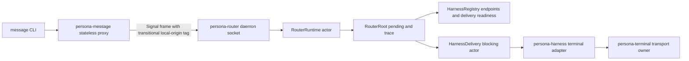

# 106 - Persona message/router/harness implementation review

*Operator-assistant report on the recent implementation slices in
`persona-message`, `persona-router`, and `persona-harness`: what landed, the
architecture I have been applying, the style of code I have been generating,
and the parts I do not think are good enough yet.*

---

## 0. TL;DR

I applied the first cleanup/construction wave from the designer development
plans:

- `persona-message` commit `0cad5526` became a stateless command-line proxy.
  It no longer owns a daemon, a ledger, delivery actors, endpoint vocabulary,
  or terminal transport.
- `persona-router` commit `d8a7f767` stopped depending on `persona-message`.
  The router now owns transitional message records locally and has Nix-wired
  checks for the new boundaries.
- `persona-harness` commit `a7be6af1` gained typed identity projections:
  `Full`, `Redacted`, and `Hidden`.

The architecture is better aligned with the designer plans, but it is still an
MVP slice. The largest shortcomings are: router state is still in memory, there
is no router-owned Sema/redb persistence yet, ingress-derived `MessageOrigin`
is not plumbed through a shared origin/context contract yet, the terminal input
gate is not integrated, and there is no end-to-end real terminal delivery test.

---

## 1. Source Reports Read

- `reports/designer/116-persona-apex-development-plan.md` - the `persona`
  daemon is the engine manager. Its auth-gating language is superseded by
  designer/125.
- `reports/designer/118-persona-router-development-plan.md` - router owns
  routing/delivery state, commits before delivery effects, does not poll, and
  does not depend directly on terminal crates.
- `reports/designer/120-persona-harness-development-plan.md` - harness owns
  harness identity/lifecycle/transcripts and projects identity on the read
  path.
- `reports/designer/122-persona-message-development-plan.md` - message becomes
  a stateless one-shot proxy, not a durable message store.
- `reports/designer/124-synthesis-drift-audit-plus-development-plans.md` -
  cleanup first, then construction; specifically, plan 122 unblocks plan 118.
- `reports/designer/125-channel-choreography-and-trust-model.md` - upstream
  decision record: socket ACL is the trust boundary, `ConnectionClass` is an
  origin/provenance tag, router owns authorized-channel state, and mind
  choreographs grants.
- `reports/designer/126-implementation-tracks-operator-handoff.md` -
  operator-facing implementation tracks. This report uses its track ordering
  but treats the `AuthProof` name in T1 as dangerous until the designer renames
  it to an origin/ingress context shape.
- `reports/designer/127-decisions-resolved-2026-05-11.md` - current center of
  gravity: text message bodies are allowed, persona-system is paused for this
  wave, terminal input gate is the injection safety primitive, terminal-cell's
  control plane speaks `signal-persona-terminal`, and terminal-cell's data
  plane stays raw.
- `reports/designer-assistant/19-response-to-designer-127-and-contract-skill.md`
  - propagation audit: older component plans still contain stale auth, class,
  focus, and transcript fanout language; operators should treat 127 and 125 as
  winning wherever they conflict.

Terminology guard: where designer/124 or lower sections of older plans still
say "ConnectionClass minting", "AuthProof signing", "class-aware delivery", or
"class-aware input gate", operators should read designer/125 as winning. The
new implementation vocabulary should be `MessageOrigin` plus an ingress
context record, not in-band proof/gate language. Candidate names are
`OriginContext`, `MessageOriginContext`, or `IngressContext`; a Persona-local
`AuthProof` name is too likely to pull agents back into a counterfeit
proof/gate model.

I also had earlier context from the active bead `primary-2w6`, whose practical
meaning is: retire the stale `persona-message` local ledger / WezTerm-era path
and move canonical routing truth into `persona-router`.

---

## 2. What Landed

### 2.1 `persona-message`: stateless Signal proxy

`persona-message` now has a very narrow shape:

```text
NOTA CLI input
  -> Input::{Send, Inbox}
  -> signal-persona-message MessageRequest
  -> length-prefixed Signal frame over PERSONA_MESSAGE_ROUTER_SOCKET
  -> router Signal reply
  -> NOTA CLI output
```

The actor index remains only as a transitional identity bridge: process ancestry
is resolved against `actors.nota` to choose the local actor name placed in
Signal auth. The component does not own message state anymore.

Representative code from `repos/persona-message/src/command.rs`:

```rust
#[derive(Archive, RkyvSerialize, RkyvDeserialize, Debug, Clone, PartialEq, Eq)]
pub enum Input {
    Send(Send),
    Inbox(Inbox),
}

impl Input {
    pub fn run(self, actor_index_path: &ActorIndexPath, mut output: impl Write) -> Result<()> {
        let socket =
            SignalRouterSocket::from_environment().ok_or(Error::SignalRouterSocketMissing)?;
        let sender = actor_index_path.resolve_current_process()?;
        let request = self.into_message_request();
        let reply = socket.client().submit(&sender, request)?;
        writeln!(output, "{}", Output::from_router_reply(reply)?.to_nota()?)?;
        Ok(())
    }
}
```

This is representative of the style I have been using: data records first,
explicit conversion into contract records, one effectful call at the edge, and
one typed output projection.

### 2.2 `persona-router`: router owns transitional message records

Before this slice, router reused `persona-message` schema types. That became
wrong as soon as `persona-message` became a stateless proxy. The router now has
local transitional message records in `src/message.rs`.

Representative code from `repos/persona-router/src/message.rs`:

```rust
#[derive(Archive, RkyvSerialize, RkyvDeserialize, NotaRecord, Debug, Clone, PartialEq, Eq)]
pub struct Message {
    pub id: MessageId,
    pub thread: ThreadId,
    pub from: ActorId,
    pub to: ActorId,
    pub body: String,
    pub attachments: Vec<Attachment>,
}
```

That type is not final architecture. It is a bridge: router owns the record for
now so `persona-message` does not, but the real target is router-owned Sema
tables with typed contract records. Per designer/127, plain text message bodies
are allowed; the mistake would be hiding modeled semantics in the body after
they have earned named `MessageKind` or channel-state variants.

The runtime path remains actor-heavy in the current Kameo style:

```text
RouterDaemon socket
  -> RouterConnection
  -> RouterRuntime actor
  -> RouterRoot actor
  -> HarnessRegistry actor
  -> HarnessDelivery actor
  -> persona-harness terminal adapter
```

Representative code from `repos/persona-router/src/router.rs`:

```rust
async fn apply_signal(&mut self, input: SignalMessageInput) -> Result<SignalMessageReply> {
    match input.request {
        SignalMessageRequest::MessageSubmission(submission) => {
            let slot = self.next_signal_message_slot();
            let message = self.signal_message(input.sender, submission, slot);
            self.pending.push(message.clone());
            self.signal_slots
                .push(SignalMessageSlot::new(message.id.clone(), slot));
            self.trace
                .record(message.id.clone(), RouterTraceStep::MessageCommitted);
            let _delivered = self.retry_pending().await?;
            Ok(SignalMessageReply::SubmissionAccepted(
                SignalSubmissionAcceptance { message_slot: slot },
            ))
        }
        SignalMessageRequest::InboxQuery(query) => {
            Ok(SignalMessageReply::InboxListing(SignalInboxListing {
                messages: self.signal_inbox(&query.recipient),
            }))
        }
    }
}
```

The key architecture here is "commit before effect," but today the "commit" is
only an in-memory trace event. That is an honest limitation.

### 2.3 `persona-harness`: typed identity projection

The harness slice is smaller. It converts designer/120's identity-projection
idea into a local read-path projection vocabulary. It is not a runtime security
gate.

Representative code from `repos/persona-harness/src/harness.rs`:

```rust
pub fn identity_projection(&self, access: HarnessIdentityAccess) -> HarnessIdentityProjection {
    match access {
        HarnessIdentityAccess::Full => HarnessIdentityProjection {
            id: Some(self.id.clone()),
            kind: Some(self.kind.clone()),
            working_directory: Some(self.working_directory.clone()),
        },
        HarnessIdentityAccess::Redacted => HarnessIdentityProjection {
            id: Some(self.id.clone()),
            kind: None,
            working_directory: None,
        },
        HarnessIdentityAccess::Hidden => HarnessIdentityProjection {
            id: None,
            kind: None,
            working_directory: None,
        },
    }
}
```

This is a local projection API, not the final security model. Per
designer/125, the security boundary is the filesystem ACL on sockets, and
message flow is authorized by router channel state choreographed by mind.
Harness projection should later consume a requesting `MessageOrigin` or
ingress context and produce a read view; it should not decide whether runtime
traffic is allowed.

---

## 3. Architecture As Implemented



The current architecture has three important boundaries:

1. `persona-message` is a thin process boundary. It turns human-friendly NOTA
   input into the router's Signal contract and exits.
2. `persona-router` is the live owner of routing and pending delivery. It does
   not take a direct dependency on `persona-message` or terminal crates.
3. `persona-harness` owns harness identity and the terminal-adapter contract.
   Router delegates terminal effects through it instead of touching terminal
   crates directly.

---

## 4. Patterns I Have Used Heavily

### 4.1 Typed records with tiny constructors

Most records are small domain wrappers: `ActorId`, `MessageId`, `ThreadId`,
`HarnessId`, `HarnessIdentityProjection`. This keeps string interpretation near
the edge and gives tests concrete types to assert on.

This is good when the wrapper names a real concept. It can become noise when it
only hides a string without adding behavior. `MessageBody(String)` is acceptable
for human text after designer/127; the remaining risk is letting structured
message semantics hide inside that string instead of earning named variants.

### 4.2 Kameo `Self IS the actor`

The actor structs contain state and implement message handlers directly. I have
avoided Ractor and avoided public ZST actors. `RouterRuntime`, `RouterRoot`,
`HarnessRegistry`, `HarnessDelivery`, and `Harness` are data-bearing objects.

This matches the current actor skill well. It also makes tests straightforward:
start an actor, send messages, read state/trace.

### 4.3 Explicit boundary conversion

The code often converts from local records into contract records in one place.
Examples:

- `persona-message::Input -> signal_persona_message::MessageRequest`
- `signal_persona_message::MessageReply -> persona-message::Output`
- router `SignalMessageInput -> Message`
- harness binding -> identity projection

This is the strongest pattern in the recent code. It makes stale ownership
easier to see.

### 4.4 Nix-wired source constraints

I used source-scanning scripts for architectural constraints that are easy to
regress:

- `persona-message` cannot own local ledger/daemon/delivery actors.
- `persona-message` cannot reference the retired terminal brand.
- `persona-router` cannot depend on `persona-message`.
- `persona-router` cannot depend on terminal crates directly.
- `persona-router` cannot poll with timer sleeps/intervals.

This pattern is useful but brittle. It catches obvious drift, not semantic
drift.

---

## 5. Tests That Exist

### 5.1 `persona-message`

The tests prove:

- CLI accepts one NOTA input and emits one NOTA reply.
- Send and Inbox requests go through `PERSONA_MESSAGE_ROUTER_SOCKET`.
- Local message ledger and daemon shapes are absent.
- Actor identity can be resolved through process ancestry and `actors.nota`.
- Retired terminal-brand references stay out of active source.

### 5.2 `persona-router`

The tests prove:

- Signal frames enter through router daemon/connection.
- Signal submissions go through `RouterRuntime` and `RouterRoot`.
- Message commit trace appears before delivery attempt trace.
- Router does not use Ractor.
- Router root does not directly own registry maps.
- Router root does not own terminal blocking work.
- New Nix checks enforce no `persona-message`, no direct terminal crates, no
  timer polling, and no retired terminal-brand strings.

### 5.3 `persona-harness`

The tests prove:

- Harness state lives in the `Harness` actor.
- Transcript events stay tied to the harness identity.
- Retired terminal-brand and sleep-verification strings stay out of terminal
  delivery source.
- Identity projection preserves the distinction between full, redacted, and
  hidden views.
- The projection checks are exposed through Nix:
  `nix flake check .#harness-identity-projection-views` and
  `nix flake check .#harness-identity-projection-source-constraint`.

---

## 6. Shortcomings

### 6.1 Router state is not durable

The router currently uses:

```rust
pending: Vec<Message>,
trace: RouterTrace,
signal_slots: Vec<SignalMessageSlot>,
```

This is enough for actor-flow witnesses. It is not the architecture. The
designer/125 + designer/126 target wants router-owned Sema/redb tables for:

- `channels`;
- `channels_by_triple`;
- `adjudication_pending`;
- delivery attempts;
- delivery results;
- the router's message/routing truth needed to make those tables meaningful.

Router should not own `OwnerApprovalInbox`; mind owns owner approval and
suggestion adoption. Router parks unknown-channel messages and asks mind to
adjudicate.

### 6.2 "Commit before effect" is only a trace witness

The test named `router_cannot_emit_delivery_before_commit` proves ordering
inside memory. It does not prove that anything durable happened before delivery.
The real test should be chained:

1. submit message;
2. inspect router Sema table for committed message;
3. only then allow a delivery attempt artifact;
4. inspect delivery result table.

That does not exist yet.

### 6.3 Message semantics are not separated enough yet

Designer/127 corrects my earlier framing: `MessageBody(String)` is not itself
a blocker. Human messages can be text. What remains unfinished is the split
between human text and modeled semantics. As delivery policy, channel state,
terminal actions, and harness observations become real, those concepts need
named `MessageKind` variants or relation records instead of being packed into
the body string.

### 6.4 Ingress-derived origin is not real in this slice

The proxy still uses the base Signal auth slot as a transitional local-origin
carrier. That is not the future Persona authority model. Designer/125 says
there is no in-band proof inside the local engine: socket ACL admits or rejects
the connection, then messages carry provenance. The future shared contract
should give router and downstream components an ingress-derived
`MessageOrigin` context. Use an origin/context name (`OriginContext`,
`MessageOriginContext`, or `IngressContext`) so the code does not invite a fake
proof/gate model.

### 6.5 Process ancestry is Linux-specific and transitional

`persona-message` resolves actor identity through `/proc/<pid>/status` and
`actors.nota`. This is acceptable as a temporary local harness bridge. It is
not a portable or security-complete identity model.

### 6.6 Harness projection is under-specified

`Full`, `Redacted`, and `Hidden` are clear, but too coarse and the current name
`HarnessIdentityAccess` can read like an access-control gate. It is only a
read-path projection. This implementation does not accept a requesting
`MessageOrigin`/ingress context, does not prove redaction across a daemon
socket, and does not emit typed redacted records over a contract crate.

### 6.7 Nix checks exist, but some are source scans

Source scans are useful as tripwires. They are not behavioral proof. A source
scan can miss an indirect behavior regression, and it can also become noisy if
legitimate text mentions forbidden terms in documentation. The better long-term
shape is artifact tests that drive binaries and inspect typed outputs.

---

## 7. Tests Still Missing

High-signal missing tests:

1. **Router Sema commit chain.** Submit a message, inspect committed router
   state, then drive delivery, then inspect delivery result.
2. **Real terminal success path.** Bring up `persona-terminal` or a test
   terminal-cell fixture, route a message, and prove bytes are accepted by the
   terminal boundary.
3. **Terminal input-gate transaction.** Acquire the gate, hold human bytes,
   read prompt state while the gate is held, inject only if clean, release the
   gate, and replay cached human bytes in order. Focus is not part of this
   safety witness.
4. **Channel-state tests.** Prove inactive channels park messages and emit
   adjudication requests, one-shot channels mark consumed after delivery,
   time-bound channels expire, and retracted channels force re-adjudication.
5. **Subscription initial-state-then-delta tests.** Router, harness, terminal,
   and mind all need the push subscription witness. I have not implemented it.
6. **Frame failure/large-frame tests.** The codecs have max-frame checks, but
   the router/message test surface is not exhaustive around malformed frames.
7. **Crash/restart tests.** Because state is not durable yet, no restart story
   exists.
8. **Concurrency stress tests.** The current actor tests use simple sequential
   asks. They do not stress many submitters, many recipients, or delivery error
   races.
9. **Message semantic-variant tests.** Not started. These should prove that
   modeled delivery/channel/terminal concepts use named variants or records
   instead of being hidden inside human text.

---

## 8. What I Would Redo

If I were redoing this slice with more room, I would do two things differently.

First, I would avoid introducing router-local `Message` shapes as if they were
stable. They are useful for decoupling from `persona-message`, but they risk
becoming sticky. I documented them as transitional, but the code does not force
that transition.

Second, I would build one tiny router Sema table before wiring more actor
surface. The current in-memory trace made it possible to move quickly and prove
actor ordering, but it delays the real commit-before-effect architecture.

---

## 9. What I Think Should Happen Next

The next implementation step should be in `persona-router`: add the first
router-owned Sema persistence slice, aligned with designer/125's channel model.
Keep it narrow:

```text
Signal MessageSubmission
  -> stamp provisional MessageOrigin / ingress context
  -> look up channels_by_triple
  -> if active channel exists, commit delivery_attempt before effect
  -> if no active channel exists, write adjudication_pending and ask mind
```

Then make the test chained and artifact-based through Nix. That will turn the
current trace-only "commit before effect" witness into a real durability
witness. The first tests should be channel-state tests: inactive channel parks,
one-shot consumes, time-bound expires, and retraction forces re-adjudication.

In parallel or immediately after, message-kind work should separate modeled
delivery/channel/terminal concepts from human text. Otherwise the new router
tables will encode too much meaning as opaque body text.

---

## 10. Current Verification

These passed after the recent work:

- `persona-message`: `nix flake check -L`
- `persona-router`: `nix flake check -L`
- `persona-harness`: `nix flake check -L`

The relevant pushed commits are:

- `persona-message` `0cad5526` - `message: become stateless router proxy`
- `persona-router` `d8a7f767` - `router: own message records after proxy split`
- `persona-harness` `a7be6af1` - `harness: add identity visibility projections`
