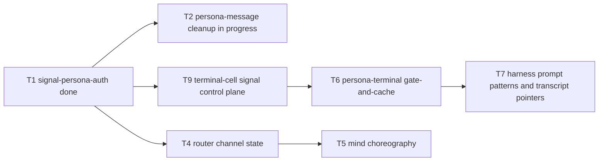
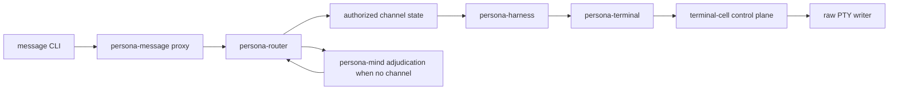
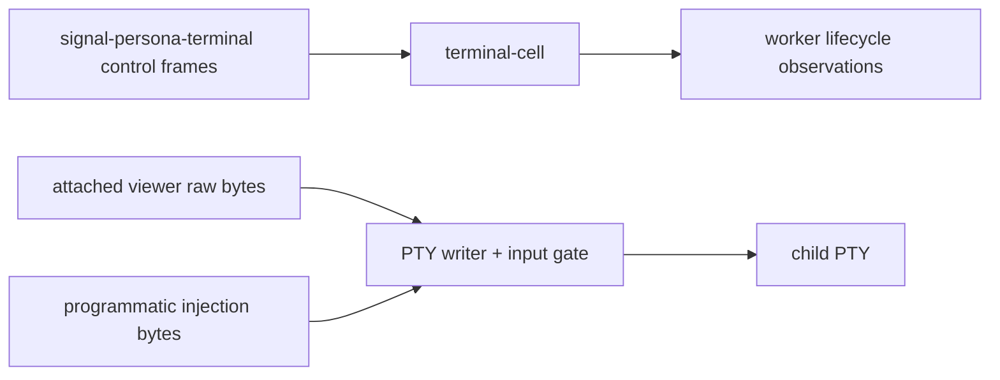

# 107 - Current Persona implementation state survey

*Operator-assistant report, 2026-05-11. Read-only survey with three
subagents: BEADS/locks, current design+skills, and active Persona repo
implementation. No tests were run and no implementation files were edited.*

---

## 0 - Executive Position

The implementation is mid-realignment after the 2026-05-11 design pass.
The current authority order is:

1. `reports/designer/127-decisions-resolved-2026-05-11.md`
2. `reports/designer/125-channel-choreography-and-trust-model.md`
3. `reports/designer/126-implementation-tracks-operator-handoff.md`
4. `reports/designer-assistant/18-current-persona-handoff-after-editorial-pass.md`
5. older component plans only where their update banners say they still apply

The clear current model:

- trust is local filesystem ACL on sockets, not Persona-local in-band proof;
- `signal-persona-auth` owns provenance vocabulary;
- router owns authorized-channel state and parked-message adjudication state;
- mind owns choreography, policy, suggestions, and adoption;
- persona-terminal owns injection safety;
- terminal-cell keeps the raw PTY data plane while its control plane moves to
  `signal-persona-terminal`;
- persona-system is paused for this wave;
- `MessageBody(String)` is allowed; specificity grows through `MessageKind`;
- runtime actors are direct Kameo actors whose public actor nouns carry data;
- every test surface must be Nix-exposed.

The largest live drift is in `persona-router`: it still contains the old
focus/input-buffer delivery gate and class-aware/owner-approval language while
the current design wants authorized-channel state plus mind adjudication.

The cleanest implementation path is T9 first, then T6, while the operator
finishes T2:

---

## 1 - Coordination State

`operator.lock` currently owns:

- `[primary-2w6]`
- `/git/github.com/LiGoldragon/persona-message`
- `/git/github.com/LiGoldragon/signal-persona-message`

Reason: persona-message stateless ingress cleanup.

`operator-assistant.lock` is idle. All other role locks were idle during this
survey.

Open operator-assistant beads are all blocked:

| Bead | Meaning | Blocker |
|---|---|---|
| `primary-v8j` | migrate persona-message identity/provenance to `MessageOrigin` / `IngressContext` | `primary-2w6` and operator's active `persona-message` lock |
| `primary-75t` | persona-terminal named CLI control surface | `primary-8n8`, the supervisor socket and gate-and-cache work |
| `primary-ddx` | workspace-wide `sema` -> `sema-db` rename | `primary-6nr`, the sema raw-byte slot-store decision |

Two bead hygiene issues:

- `primary-i34` appears to duplicate closed `primary-90k`. Both describe
  creating `signal-persona-auth`; `primary-90k` is closed and says the crate
  shipped with `ConnectionClass`, `MessageOrigin`, `IngressContext`, IDs, no
  Persona-local `AuthProof`, and passing checks.
- `primary-9iv` is still `IN_PROGRESS` for persona-mind/orchestrate work but
  no role lock currently owns it. It may be stale or intentionally parked; it
  should be reconciled before another agent assumes it is live.

---

## 2 - Repo State

| Repo | Current good state | Out of place / missing |
|---|---|---|
| `persona` | Daemon/client stub exists; `persona-daemon` binary exists; meta repo composes component checks. | Architecture still says manager classifies connections and terminal gates on `ConnectionClass`; `src/transport.rs` still constructs `signal_core::AuthProof::LocalOperator`; no manager redb, spawn envelope, privileged socket creation, or `EngineId`-scoped component sockets yet. |
| `persona-message` | Operator's dirty worktree is moving strongly toward T2: resolver/schema removed, `surface.rs` added, CLI sends sender-free `signal-persona-message` frames, tests reject local ledger and proof material. | Dirty under operator lock; needs owner verification/commit. Remaining downstream work: update router/apex pins after T2 lands. |
| `persona-router` | Direct Kameo runtime; no runtime dependency on `persona-message`; commit-before-delivery trace shape exists. | Biggest drift: `src/delivery.rs` and `src/harness_registry.rs` still use persona-system focus/input-buffer gates; architecture still names router-owned `OwnerApprovalInbox` and class-aware policy; no channel tables, parked adjudication, `signal-persona-auth`, or mind grant/retract path. |
| `persona-terminal` | Owns terminal metadata through component Sema; wraps terminal-cell; has a signal-contract witness CLI; keeps raw PTY transport local. | Still uses old terminal request/event vocabulary; no `PromptPattern`, gate acquisition with prompt state, `WriteInjection`, `ReleaseInputGate`, delivery attempts, terminal events, viewer attachment state, session health, or archive tables. |
| `terminal-cell` | Strong low-level primitive; input gate exists; raw attach path avoids Kameo mailbox and transcript subscription; worker lifecycle is observable. | Control socket is still bespoke byte-tag protocol in `src/socket.rs`; no `signal-persona-terminal` control plane; no prompt-pattern registry; no prompt-state reply on gate acquisition. |
| `persona-harness` | `HarnessKind` is closed; identity projection is a typed read-path view; terminal delivery points at persona-terminal. | No prompt-pattern publisher yet; no daemon/redb lifecycle state from T7; terminal contract is still pre-T9. |
| `persona-mind` | Closest to the orchestration target: daemon-backed `mind`, Signal frames, `mind.redb`, role/work graph, no lock-file projection, direct Kameo. | No channel choreography: no `AdjudicationRequest`, `ChannelGrant`/extend/retract, suggestion/adoption structures, or real post-commit subscription bus yet. |
| `signal-persona-auth` | T1 mostly landed: provenance/engine/channel IDs, closed `ConnectionClass`, `MessageOrigin`, `IngressContext`, no Persona-local `AuthProof`, round-trip tests. | Not consumed downstream yet. `ComponentName` uses `Message` where designer/126 names `MessageProxy`. Cargo uses `rkyv = { version = "0.8", features = ["std"] }`, which does not match the canonical full rkyv feature set in lore/skills. |
| `signal-persona-terminal` | Pure contract crate with closed enums and round trips. | Pre-127. It models harness-to-terminal transcript/input transport, not terminal-cell's Signal control plane. Missing gate/prompt/injection records, worker lifecycle subscription, and raw-data-plane invariant. `repos/signal-persona-terminal` symlink is missing even though the `/git/...` repo exists. |
| `signal-persona` | Pure engine-manager contract crate. | Still carries manager-era `ConnectionClass`/auth wording in docs while `signal-persona-auth` is now the provenance home. Source and architecture are not aligned: source is narrower than architecture. |
| `signal-persona-system` | Pure contract with round trips. | Current contract still contains `FocusObservation` and `InputBufferObservation`; this is acceptable as deferred system vocabulary, but it must not be treated as an active injection-safety dependency. |
| `signal-persona-message` | `MessageBody(String)` is now acceptable per designer/127; sender-free request payload matches current direction. | Architecture example still shows `Frame { auth: Some(LocalOperatorProof("operator")) }`, which conflicts with persona-message's current no-proof proxy direction. |
| `signal-persona-harness` | Pure harness contract; points terminal transport at persona-terminal. | Architecture still says delivery is gated by `signal-persona-system` observations. Current design says terminal injection safety is terminal-owned through gate-and-cache. |

---

## 3 - The Current Shape Of The Stack

The target flow for message-to-terminal work now reads like this:

Two facts matter:

- `persona-message` is not delivery. It is a stateless NOTA-to-Signal ingress
  surface.
- `persona-system` is not in the injection-safety path for this wave. The
  safety path is terminal-owned: acquire input gate, cache human bytes, check
  prompt state, inject only if clean, release gate, replay cache.

The target control/data split for terminal-cell:

The control path may be Signal-framed. The viewer byte path must remain raw
and must not pass through Signal encoding, Kameo mailbox delivery, or
transcript subscription before the PTY writer.

---

## 4 - High-Signal Mismatches

### 4.1 `persona-router` is pre-127 in both architecture and code

Evidence:

- `/git/github.com/LiGoldragon/persona-router/src/delivery.rs` imports
  `FocusObservation`, `InputBufferObservation`, and `InputBufferState`.
- `/git/github.com/LiGoldragon/persona-router/src/harness_registry.rs`
  accepts `FocusObservation`.
- `/git/github.com/LiGoldragon/persona-router/ARCHITECTURE.md` still says
  non-owner messages go to a router-owned `OwnerApprovalInbox`.

Current design:

- router owns authorized-channel state;
- unknown/inactive channel messages park and ask mind for adjudication;
- mind owns owner approval, suggestion/adoption, and policy.

This is the largest "out of place" implementation surface because it affects
the central message path.

### 4.2 `signal-persona-terminal` is the wrong contract for T9

Evidence:

- `/git/github.com/LiGoldragon/signal-persona-terminal/src/lib.rs` defines
  `TerminalConnection`, `TerminalInput`, `TerminalResize`,
  `TerminalCapture`, transcript events, and rejection reasons.
- It does not define `PromptPattern`, `AcquireInputGate`,
  `WriteInjection`, `ReleaseInputGate`, `PromptState`, or
  worker lifecycle subscription records.

Current design:

- T9 starts contract-first in `signal-persona-terminal`;
- terminal-cell control plane speaks Signal;
- raw data plane stays raw.

This blocks `persona-terminal` T6 and `persona-harness` prompt-pattern work.

### 4.3 Auth/proof vocabulary is split across old and new worlds

Evidence:

- `/git/github.com/LiGoldragon/signal-persona-auth` correctly rejects a
  Persona-local `AuthProof`.
- `/git/github.com/LiGoldragon/persona/src/transport.rs` still constructs
  `signal_core::AuthProof::LocalOperator`.
- `/git/github.com/LiGoldragon/persona-router/src/router.rs` still extracts
  `AuthProof::LocalOperator` into an `ActorId`.
- `signal-persona-message/ARCHITECTURE.md` still shows
  `LocalOperatorProof("operator")` in its example.

This may be acceptable as transitional `signal-core` compatibility, but the
current docs and code need to say that clearly. New Persona contract or
runtime work must not invent a Persona-local proof/gate model.

### 4.4 Meta repo architecture still contains superseded class gates

Evidence:

- `/git/github.com/LiGoldragon/persona/ARCHITECTURE.md` says
  `persona-terminal` gates programmatic input by `ConnectionClass`, and
  `persona-router` owns non-owner approval inbox behavior.

Current design:

- terminal access is socket-permission bounded and input safety is gate/cache;
- router channel state controls delivery;
- mind owns approval/adoption structures.

The `persona` architecture should be updated before it becomes a generator for
new stale implementation.

### 4.5 Active repo map has one stale phrase and one missing symlink

Evidence:

- `/home/li/primary/protocols/active-repositories.md` describes
  `persona-system` as "System facts such as focus and prompt-state
  observations." Current design puts prompt-state checking in terminal-cell /
  persona-terminal and pauses persona-system.
- `/home/li/primary/repos/signal-persona-terminal` is missing even though
  `/git/github.com/LiGoldragon/signal-persona-terminal` exists and
  `protocols/active-repositories.md` names it as active.

The missing symlink is small but high-friction: agents following the `repos/`
index will fail to find the active terminal contract repo.

### 4.6 `signal-persona-auth` is correct in concept but not yet wired

Evidence:

- `signal-persona-auth` exists and owns the current provenance records.
- No surveyed consumer repo is yet depending on it in the active runtime path.
- The crate's rkyv dependency uses only `features = ["std"]`, while the
  canonical rkyv feature set elsewhere is `std`, `bytecheck`, `little_endian`,
  `pointer_width_32`, and `unaligned` with `default-features = false`.

This should be handled before broad downstream adoption, because contract
feature parity is part of the wire/disk compatibility discipline.

---

## 5 - What Looks Healthy

- Direct Kameo has mostly displaced direct Ractor in active Persona runtime
  repos. Ractor references found in tests are source-scan guards or historical
  prose, not runtime dependencies.
- Public ZST actor drift is not the main current problem. The active actor
  problems are missing planes and stale topology, not the old Ractor marker
  pattern.
- `persona-message` appears to be converging strongly on the stateless proxy
  shape under the operator's current lock.
- `terminal-cell` already has the hard low-level primitive: input gate,
  caching/replay, raw attach path, worker lifecycle observations, and tests for
  high-output attach behavior.
- `persona-mind` is the closest repo to the command-line mind destination:
  daemon-backed, Signal-framed, redb-backed, and not reinvesting in lock-file
  projection.
- `persona-harness` already closed `HarnessKind` and reframed identity as a
  read-path projection, matching designer/127 and designer/125.

---

## 6 - Recommended Next Work

1. **Let the operator finish `primary-2w6` before touching
   `persona-message` or `signal-persona-message`.**
   The current operator lock owns both repos. After that lands,
   operator-assistant can resume `primary-v8j`: replace transitional identity
   handling with `IngressContext` / `MessageOrigin` where it belongs.

2. **Fix the small coordination/index issues.**
   Close or supersede `primary-i34` against closed `primary-90k`, inspect
   `primary-9iv`, create the missing `repos/signal-persona-terminal` symlink,
   and update `active-repositories.md` so persona-system is not described as a
   prompt-state owner.

3. **Start T9 contract-first.**
   `signal-persona-terminal` should gain the terminal-cell control-plane
   vocabulary: prompt patterns, gate acquire/release, injection write,
   prompt-state result, worker lifecycle subscription, and the raw-data-plane
   invariant.

4. **Then implement T6 in `persona-terminal`.**
   Use T9's contract to coordinate gate-and-cache delivery against a real
   terminal-cell-backed session. Persist delivery/session state in the
   component's Sema layer and expose Nix stateful witnesses.

5. **Refactor `persona-router` onto channel state.**
   Retire active focus/input-buffer delivery gates and class-aware owner inbox
   behavior. Add channel tables, parked adjudication, and mind grant/retract
   flow. Keep current actor-trace witnesses as the first ordering proof, then
   add redb/Nix-chained witnesses when router Sema lands.

6. **Wire `signal-persona-auth` downstream with feature parity.**
   Fix or consciously document the rkyv feature set first, then consume
   `ConnectionClass`, `MessageOrigin`, and `IngressContext` from the contract
   rather than duplicating or preserving local proof vocabulary.

---

## 7 - Open Questions To Bring Back To The Human / Designer

1. **Should `ComponentName::Message` in `signal-persona-auth` be renamed to
   `MessageProxy` before downstream adoption?**

   Evidence: designer/126 names the component `MessageProxy`, while
   `signal-persona-auth/src/names.rs` currently uses `Message`. Renaming now is
   cheap because no downstream consumer is wired yet. Waiting makes the shorter
   name part of the contract.

2. **Should `signal-persona-terminal` replace its current harness-terminal
   transcript/input vocabulary or grow a second relation family?**

   Evidence: skills now allow one component contract crate to carry multiple
   explicit relation families. T9 needs terminal-cell control-plane records,
   while current `signal-persona-terminal` already has harness-terminal
   transport records. Replacing is simpler; splitting relation families may
   better match the updated contract-repo skill.

3. **How should transitional `signal-core::AuthProof` be named in reports and
   code while local Persona moves to `MessageOrigin`?**

   Evidence: designer-assistant/18 says distinguish base `signal-core` carrier
   compatibility from rejected Persona-local proof types. Current code still
   constructs `AuthProof::LocalOperator` in `persona` and `persona-router`.
   The implementation needs a migration phrase that will not train agents back
   into proof/gate design.

---

## 8 - Verification Notes

This was a read-only survey. I ran:

- lock and BEADS status reads;
- workspace design/skill reads;
- architecture/source grep across active Persona and Signal repos;
- per-repo `jj st` / recent commit checks;
- targeted source reads for `persona-message`, `persona-router`,
  `persona-terminal`, `terminal-cell`, `signal-persona-auth`, and
  `signal-persona-terminal`.

I did not run `nix flake check` in surveyed repos, because this report is an
implementation-state survey and `persona-message` is actively dirty under the
operator lock.
