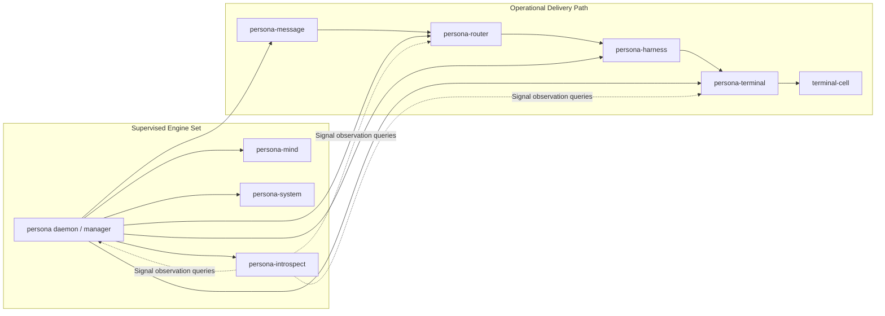

# 110 - Engine-wide architecture/implementation gap assessment

*Operator-assistant report, 2026-05-13. Scope: full Persona engine
assessment after reacquiring workspace skills and reading the current
architecture reports. This report separates implemented behavior from
contract-only, scaffold, conceptual, and stale architecture claims.*

---

## 0. Method

I treated these as current load-bearing sources:

- `ESSENCE.md`
- `repos/lore/AGENTS.md`
- `protocols/orchestration.md`
- `protocols/active-repositories.md`
- `skills/operator-assistant.md`
- `skills/engine-analysis.md`
- `skills/rust-discipline.md`
- `skills/actor-systems.md`
- `skills/kameo.md`
- `skills/contract-repo.md`
- `skills/testing.md`
- `skills/nix-discipline.md`
- `skills/naming.md`
- `skills/architectural-truth-tests.md`
- `reports/designer/148-persona-prototype-one-current-state.md`
- `reports/designer/149-cleanup-ledger-2026-05-13.md`
- `reports/designer/150-signal-network-design-draft.md`
- `reports/designer/151-synthesis-2026-05-13.md`
- `reports/designer-assistant/38-prototype-introspection-reassessment-after-146.md`
- `reports/operator/114-persona-introspect-prototype-impact-survey.md`

I also inspected the active engine repositories under
`/git/github.com/LiGoldragon/`. The `persona` repository is currently
dirty and operator-owned under `operator.lock`; I only read it. Findings
against `persona` include the operator's in-flight working copy, not just
the last committed `main` revision.

Status vocabulary:

| Status | Meaning |
|---|---|
| Hooked | Running code exists and is wired into the expected component path. |
| Partial | Some real code is present, but an architectural edge is missing. |
| Stubbed | Shape exists, but behavior returns fixed/unimplemented/unknown results. |
| Contract-only | The wire crate exists, but runtime crates do not consume it yet. |
| Conceptual | Architecture says it should exist; source does not yet implement it. |
| Stale | A document or name no longer matches the current design/implementation. |

---

## 1. Executive summary

The engine is moving in the right direction, but it is not yet a
prototype-one engine. It is a set of typed contracts, Kameo component
runtimes, Sema-backed local stores, and a manager repository that is
currently being moved from "six-component first stack" toward "six
operational components plus a supervised introspection plane."

The highest-signal gap is not inside one crate. It is the mismatch
between the current architecture documents and the implementation path:

- `reports/designer/151-synthesis-2026-05-13.md` still says
  prototype-one has six supervised components and `persona-introspect` is
  deferred.
- `reports/designer-assistant/38-prototype-introspection-reassessment-after-146.md`
  and `reports/operator/114-persona-introspect-prototype-impact-survey.md`
  say `persona-introspect` belongs in prototype acceptance as the
  inspection plane.
- The operator's current `persona` working copy follows the latter
  direction: `EngineComponent::Introspect` exists, the supervised set is
  seven, and the flake now includes `persona-introspect`.
- `persona/ARCHITECTURE.md` still has stale section-0.6 wording that
  describes introspection as planned/deferred.

The second major gap is that the common supervision relation exists in
`signal-persona`, but the component daemons do not yet speak it. The
manager can launch child processes, but "ready" still does not mean a
successful typed health/readiness round trip.

The third major gap is the delivery witness. Message ingress can stamp
and forward to the router, the router has real channel-state machinery,
and terminal has serious gate/session state, but the live
router-to-harness-to-terminal daemon path is not complete. In particular,
`persona-harness` still returns typed unimplemented for domain operations
other than status.

The fourth major gap is introspection. `signal-persona-introspect`,
`signal-persona-router`, and `persona-introspect` now exist, but the
runtime is still an acceptance-oracle scaffold: it returns
`Unknown` prototype witness fields and does not query manager/router/
terminal daemons over Signal yet.

---

## 2. Current engine shape

The implementation now wants two overlapping sets:



That is the cleanest vocabulary:

- **Operational delivery components:** `mind`, `router`, `system`,
  `harness`, `terminal`, `message`.
- **Prototype supervised components:** the operational delivery
  components plus `introspect`.
- **Inspection plane:** supervised and prototype-critical, but not a hop
  in the delivery path.

The current `persona/src/engine.rs` working copy implements this split:

- `EngineComponent::operational_delivery_components()` returns six.
- `EngineComponent::prototype_supervised_components()` returns seven.
- `EngineComponent::first_stack()` currently returns the seven-component
  supervised set.

That last alias is naming debt. `first_stack()` now means "prototype
supervised set," while older documents used "first stack" for the six
operational delivery components.

---

## 3. Component gap ledger

| Component / contract | Current implementation | Architecture target | Status |
|---|---|---|---|
| `signal-persona` | Has `ComponentKind::Introspect`, `SpawnEnvelope`, `SupervisionRequest`, readiness and health records. | Single management contract for engine status, lifecycle, spawn envelope, and supervision relation. | Partial / contract-present |
| `signal-persona-auth` | Has `MessageOrigin`, `IngressContext`, `ConnectionClass`, `ComponentName::Introspect`; source rejects `AuthProof` vocabulary. | Provenance vocabulary, not in-band proof/gate authority. | Hooked |
| `persona` | In-flight manager now knows `Introspect`, seven supervised components, component socket/state layout, direct process launcher, manager Sema store. | Apex manager launches all supervised components, writes typed spawn envelope, applies socket modes, conducts readiness/health supervision, records reducer snapshots, owns prototype witnesses. | Partial |
| `persona-message` | Real daemon/client. Stamps origin from local peer credentials and forwards `StampedMessageSubmission` to router. No local ledger. | Stateless ingress proxy; no durable message truth; router owns routing truth. | Mostly hooked |
| `signal-persona-message` | Owns message ingress/submission contract and stamped submission records. | Message ingress contract only, not router policy. | Hooked |
| `persona-router` | Real Kameo-heavy router runtime with Sema tables for channels, adjudication, delivery attempts/results. Accepts stamped submissions. | Router owns channel state, routing truth, accepted messages, delivery attempts/results, and router observation replies. | Partial |
| `signal-persona-router` | New observation contract scaffold with summary, trace, and channel-state query/reply shapes. | Router-owned observation contract consumed by router and introspect. | Contract-only |
| `persona-harness` | Daemon binds socket and answers status; terminal adapter code exists. Domain operations return `HarnessRequestUnimplemented`. | Harness receives router deliveries and drives terminal operations through typed terminal contract. | Stubbed / partial |
| `signal-persona-harness` | Has harness status, delivery, prompt, cancellation, and unimplemented types. | Harness relation contract. | Hooked at contract layer |
| `persona-terminal` | Real Kameo runtime, Sema-backed terminal records, gate/prompt/session machinery, terminal-cell integration tests. | Terminal owns sessions, worker lifecycle, input-gate safety, delivery attempt records, and introspection-ready observations. | Mostly hooked |
| `signal-persona-terminal` | Has prompt pattern, input gate, write injection, prompt state, worker lifecycle, terminal introspection records. | Terminal-owned contract and observation records. | Hooked |
| `persona-system` | Focus tracker and daemon status skeleton exist; architecture says system work is paused. | System receives environment/focus events and pushes observations when unpaused. | Partial / paused |
| `signal-persona-system` | System event contract exists. | System relation contract. | Hooked at contract layer |
| `persona-mind` | Advanced Kameo daemon with mind-local Sema, role/work/activity state, CLI/daemon tests. | Central mind state, work graph, channel adjudication, owner approval inbox, common supervision. | Partial |
| `signal-persona-mind` | Rich contract with work/choreography types. | Mind relation contract for work graph and adjudication. | Contract ahead of runtime |
| `signal-persona-introspect` | Central introspection envelope, selectors, prototype witness, delivery trace, unimplemented/denied replies. | Envelope and projection wrapper only; component records remain in owning contracts. | Contract-only |
| `persona-introspect` | Kameo actors exist and are state-bearing, but CLI starts an in-process root with empty targets and daemon prints scaffold text. Prototype witness returns `Unknown`. | Supervised daemon that queries manager/router/terminal over Signal and projects one NOTA proof. | Stubbed |
| `terminal-cell` | Terminal substrate exists and is wired through persona sandbox/dev-stack scripts. | Raw terminal data-plane component under terminal/harness control. | Hooked enough for adjacent tests |

---

## 4. Critical gaps

### 4.1 Architecture truth is split on introspection timing

`reports/designer/151-synthesis-2026-05-13.md` and
`persona/ARCHITECTURE.md` preserve the old "six supervised components,
introspection deferred" posture. The user's correction, designer-
assistant report 38, operator report 114, the active beads, and current
operator implementation all point the other way: prototype supervision
should include `persona-introspect`.

This should be reconciled in the architecture documents before more code
and tests name the old model. The target wording should be:

- operational delivery path: six components,
- prototype supervised set: seven components,
- inspection plane: `persona-introspect`, not a delivery hop.

### 4.2 Supervision relation exists but is not live across daemons

`signal-persona` has the right contract-level pieces:
`SpawnEnvelope`, `SupervisionRequest`, `ComponentHello`,
`ComponentReadinessQuery`, `ComponentHealthQuery`,
`GracefulStopRequest`, and typed replies.

The implementation gap is runtime adoption:

- component daemons do not yet read a typed `signal-persona::SpawnEnvelope`
  file through `PERSONA_SPAWN_ENVELOPE`;
- the launcher currently passes component facts through environment
  variables such as `PERSONA_STATE_PATH`, `PERSONA_SOCKET_PATH`, and
  `PERSONA_PEER_SOCKET_COUNT`;
- the manager launches child processes but does not yet conduct a common
  typed readiness/health round trip;
- `ComponentReady` remains architecture/event vocabulary, not a proven
  daemon interaction.

This means the "spawns first stack skeletons" witness is still not the
real witness. It can prove process launch, but not the supervision
contract.

### 4.3 Manager state is durable, but reducers/snapshots are not the described shape

`persona` now has manager Sema tables for engine records and event log
records. That is real progress.

The architecture still describes two reducer snapshots:

- `engine-lifecycle-snapshot`
- `engine-status-snapshot`

I found manager records and event log storage, but not these reducer
tables by name. I also did not find startup restore behavior that loads
the latest stored engine record before serving status. The current
manager startup path persists/synchronizes current state instead.

The architecture should either rename the target to the implemented
record/event-log shape, or implementation should add the reducer
snapshots and restore path.

### 4.4 Socket authority is declared, but socket modes are not applied by runtimes

Architecture and tests model socket modes by component boundary:
external ingress for `message.sock`, internal sockets for manager,
router, terminal, harness, mind, system, and introspect.

The current runtime code binds Unix sockets, but I did not find
permission-setting logic for the runtime sockets. `set_permissions`
appears in tests for making fixture scripts executable, not as runtime
socket `chmod`.

Until socket modes are applied after bind, the filesystem-ACL trust model
is architectural intent, not enforcement.

### 4.5 Router owns real state, but not yet the full durable message truth

`persona-router` is one of the stronger components:

- channel tables exist in router-owned Sema,
- adjudication pending records exist,
- delivery attempt/result records exist,
- stamped message submission is required for Signal ingress,
- raw unstamped submission returns typed unimplemented.

The gap is that accepted-message and route-decision truth is still mostly
runtime trace/in-memory shape:

- `pending` and `signal_slots` are vectors in `RouterRoot`,
- `MessageCommitted` is a trace step,
- delivery attempts/results persist, but accepted-message records are not
  yet a durable router-owned table,
- `signal-persona-router` is not consumed by `persona-router`.

For prototype introspection, router should expose a contract-owned
observation relation that can answer: message accepted, route decision,
delivery attempt, delivery result, adjudication status.

### 4.6 Harness blocks the full delivery witness

`persona-message` can forward to router and `persona-router` can model
delivery attempts, but the live daemon path still stops at harness.

`persona-harness/src/daemon.rs` handles status queries and returns
`HarnessRequestUnimplemented` for other domain requests. It can identify
`MessageDelivery` for routing, and terminal adapter code exists, but the
daemon does not yet execute message delivery into `persona-terminal`.

Until this lands, `persona-daemon-delivers-fixture-message` cannot be a
true end-to-end witness.

### 4.7 Introspection contracts exist, but the oracle is not live

The pieces now exist:

- `signal-persona-introspect`
- `persona-introspect`
- `signal-persona-router`
- terminal observation records in `signal-persona-terminal`
- terminal Sema tables using those observation records

The live path does not yet exist:

- `persona-introspect-daemon` only prints scaffold text;
- `introspect` CLI starts an in-process root with empty target sockets;
- `IntrospectionRoot::prototype_witness` returns `Unknown` for manager,
  router, terminal, and delivery status;
- no manager/router/terminal Signal fan-out occurs.

This is the biggest near-term opportunity after supervision and harness
delivery: make introspection prove the engine instead of proving only
that the new crate builds.

### 4.8 Apex Nix wiring is improving, but the full engine witness is not there

The in-flight `persona` flake now includes `persona-introspect` as an
input and package. That closes an older gap.

Remaining Nix gaps:

- `signal-persona-introspect` is not an apex flake input/check;
- `signal-persona-router` is not an apex flake input/check;
- `persona-dev-stack` still exports only message/router/terminal package
  paths, not the full supervised engine set;
- no Nix witness yet launches seven supervised components and verifies
  typed supervision readiness;
- no Nix witness yet drives fixture delivery through
  message/router/harness/terminal/cell;
- no Nix witness yet asks `persona-introspect` for the prototype proof.

The testing skill is clear: these should be named flake checks/apps, not
loose local scripts.

### 4.9 rkyv feature discipline still has runtime-crate drift

The canonical rkyv feature set is explicit:

```toml
default-features = false
features = ["std", "bytecheck", "little_endian", "pointer_width_32", "unaligned"]
```

Several core contract crates already use that exact shape. These runtime
crates still use bare `rkyv = "0.8"`:

- `persona-message/Cargo.toml`
- `persona-router/Cargo.toml`
- `persona-introspect/Cargo.toml`

That does not necessarily break today, but it violates the storage/wire
discipline and can produce mismatched archive assumptions at boundaries.

### 4.10 Mind is advanced locally, but not yet the channel/adjudication center

`persona-mind` has more real daemon/state machinery than many components:
Kameo actors, daemon/client transport, Sema tables, role/work/activity
tests, and restart persistence.

The architecture gap is around its future engine role:

- common `signal-persona` supervision is described but not implemented;
- `signal-persona-mind` has choreography/channel vocabulary, but the
  runtime does not yet implement the owner-approval/adjudication path;
- the old `Config` actor still looks like a low-value actor: it is
  spawned in the root path, not retained as an active root child, and
  mainly wraps store location.

This is not a prototype-one delivery blocker if structural channels are
enough for the fixture path. It is a blocker for non-structural channel
decisions and for retiring BEADS into the native mind work graph.

---

## 5. Stale or retired vocabulary scan

Source scan across active Persona engine repos found no live dependency
on `ractor`, `persona-actor`, or `workspace-actor`. The hits are tests
that reject those strings. That part of the actor-library hallucination
cleanup is holding.

Source scan found no live `AuthProof`, `LocalOperatorProof`, or
`LocalOperator` authority model. Hits are tests or docs that reject those
terms. `signal-persona-auth` is correctly centered on origin context.

WezTerm is mostly gone from runtime vocabulary. Remaining hits are:

- source-scan tests that reject retired terminal branding;
- `persona-system` Niri fixture strings using
  `org.wezfurlong.wezterm`;
- old in-repo reports.

The `persona-system` fixture strings are not runtime dependency, but they
are stale test vocabulary. If the goal is total WezTerm retirement, those
fixtures should become neutral terminal app examples.

---

## 6. Representative implementation patterns

### 6.1 Good pattern: data-bearing Kameo actors

The newer components usually avoid zero-sized actor shells. For example,
`persona-introspect` already gives actors real state:

```rust
pub struct IntrospectionRoot {
    target_directory: ActorRef<TargetDirectory>,
    query_planner: ActorRef<QueryPlanner>,
    manager_client: ActorRef<ManagerClient>,
    router_client: ActorRef<RouterClient>,
    terminal_client: ActorRef<TerminalClient>,
    projection: ActorRef<NotaProjection>,
    handled_queries: u64,
}
```

The problem is not actor shape. The problem is that the actor graph is not
yet wired to real Signal clients.

### 6.2 Good pattern: component-owned Sema

`persona-router`, `persona-terminal`, and `persona-mind` all own local
Sema/redb state. This matches the architecture:

- router owns router state,
- terminal owns terminal state,
- mind owns mind state,
- the manager owns manager state.

I did not see evidence of a shared Sema daemon returning under another
name.

### 6.3 Risky pattern: manager-local spawn envelope

`persona` currently has a local `ComponentSpawnEnvelope` and passes its
contents into child processes through many environment variables.

That is useful for current tests, but the architectural target is a
typed `signal-persona::SpawnEnvelope` written by the manager and pointed
to by `PERSONA_SPAWN_ENVELOPE`. Without that, every component invents
its own spawn/env reader and the supervision contract stays beside the
system instead of inside it.

### 6.4 Risky pattern: "first stack" name drift

The implementation now has the right conceptual split, but the old
`first_stack()` method returns the seven-component supervised set.
Tests using `first_stack()` are therefore testing seven components under
a six-component name.

This is the kind of naming drift that later causes wrong architecture to
reappear in code. It should be retired or renamed once the operator's
current `persona` slice lands.

---

## 7. Suggested next work

Highest signal, in order:

1. Reconcile architecture wording on introspection timing.
   `persona/ARCHITECTURE.md` and designer synthesis should say the same
   thing as the active implementation path: six delivery components,
   seven supervised prototype components.

2. Finish the common supervision relation end to end.
   Make every supervised daemon read the typed spawn envelope, bind its
   socket, answer `ComponentHello`, `ComponentReadinessQuery`, and
   `ComponentHealthQuery`, and let the manager record `ComponentReady`
   only after that typed round trip.

3. Implement harness delivery.
   Change `persona-harness` from status-only daemon to real
   `MessageDelivery` receiver that calls `persona-terminal` over the
   terminal contract.

4. Wire router observations.
   Make `persona-router` depend on and answer `signal-persona-router`
   observation queries, and persist accepted-message/route-decision truth
   needed by introspection.

5. Turn `persona-introspect` from scaffold into live acceptance oracle.
   Start with one query: prototype witness. It should ask manager,
   router, and terminal over Signal and return one NOTA projection.

6. Add the three Nix witnesses.
   Use named flake checks/apps for supervision, delivery, and inspection.
   Do not prove the engine by reading test-local files or opening peer
   databases.

7. Fix rkyv feature drift in `persona-message`, `persona-router`, and
   `persona-introspect`.

8. Apply socket permissions after bind.
   This converts the filesystem-ACL trust model from documentation into
   enforcement.

---

## 8. Questions

1. Should `reports/designer/151-synthesis-2026-05-13.md` be treated as
   stale on introspection timing, or should the implementation pause and
   return to six supervised components?

2. Should `EngineComponent::first_stack()` be deleted after the current
   operator slice lands, with callers forced to choose either
   `operational_delivery_components()` or
   `prototype_supervised_components()`?

3. Should router accepted-message truth become a contract-owned
   observation record now, or should the first introspection witness infer
   acceptance from delivery attempts/results only?

4. Should the first `persona-introspect` slice be stateless, or should it
   immediately get its own `introspect.redb` for query audit and
   subscription cursors?

5. Should `persona-dev-stack` become a full seven-component stack now, or
   stay a narrower message/router/terminal smoke tool while
   `persona-daemon` owns the real full-engine witness?

---

## 9. Bottom line

The engine has moved past pure architecture. The contracts are mostly in
place, several component runtimes are real, and the state model is
consistently Sema-local rather than centralized. The codebase is also
better than it was on actor discipline: I did not find live ractor or
phantom actor-library contamination.

The prototype is still not alive as an engine. The missing pieces are
precise and testable: typed supervision, socket-mode enforcement, harness
delivery, router observations, live introspection, and Nix witnesses that
exercise real processes instead of internal fakes.

