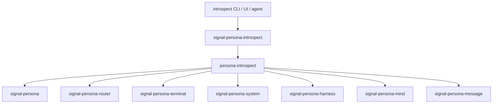

# 111 - Persona-introspect contract dependency gap

## Status After Sema-Engine Reports

This report is still correct about the contract ownership boundary:
`signal-persona-introspect` is an envelope, and `persona-introspect`
consumes component-owned contracts over daemon sockets. It is stale if
read as "each component must hand-roll its own query/filter/time-window
engine." Shared database mechanics now target `sema-engine`.

Implement the manager/router/terminal fan-out slice, but route
component-local query execution toward `sema-engine` as it lands.
`persona-introspect` should not use `sema-engine` to inspect peer
databases directly. It should use `sema-engine` only for its own local
introspection database, observation indexes, and query/subscription state.

## Summary

No, `persona-introspect` is not yet aware of all component-owned
introspection data types.

The current architecture is right: `signal-persona-introspect` is a central
query/reply envelope, not a bucket for every component's rows. Component-owned
observation records should live in the owning component contracts, such as
`signal-persona-router` and `signal-persona-terminal`.

The implementation has only reached the first half of that shape:

- `signal-persona-introspect` exists and defines the central envelope.
- `signal-persona-router` exists and defines router observation records.
- `signal-persona-terminal` exists and defines terminal-owned introspection
  records.
- `signal-persona`, `signal-persona-system`, and `signal-persona-harness`
  already define status or observation records that introspection can consume.
- `persona-introspect` does not yet depend on those component-owned contract
  crates, so it cannot decode or project their real records.

The recent implementation pass made `persona-introspect-daemon` bind a Unix
socket and serve `signal-persona-introspect` frames. It still returns scaffold
`Unknown` observations because the fan-out into component-owned contracts is
not wired yet.

## Architecture Rule

The intended contract split is:



`signal-persona-introspect` asks for an engine-level view and wraps the final
projection. It should not own router tables, terminal sessions, manager event
rows, harness lifecycle rows, or mind graph rows.

The component contract owns the typed data when the observed state belongs to
that component. That keeps ownership aligned with runtime ownership:

| Component | Contract home for observation types |
|---|---|
| Persona manager | `signal-persona` |
| Router | `signal-persona-router` |
| Terminal | `signal-persona-terminal` |
| System | `signal-persona-system` |
| Harness | `signal-persona-harness` |
| Mind | `signal-persona-mind` |
| Message ingress | `signal-persona-message` |
| Introspection envelope/projection | `signal-persona-introspect` |

Sibling crates like `signal-persona-terminal-introspect` should not be created
by default. The current rule in
`/git/github.com/LiGoldragon/signal-persona-introspect/ARCHITECTURE.md` is to
split to a sibling introspection contract only when the observation vocabulary
becomes heavy or high-churn.

## Current Contract Inventory

### `signal-persona-introspect`

Path:
`/git/github.com/LiGoldragon/signal-persona-introspect`

Current role:

- central `IntrospectionRequest`
- central `IntrospectionReply`
- broad selectors such as `IntrospectionTarget` and `IntrospectionScope`
- broad engine-level replies such as `EngineSnapshot`,
  `ComponentSnapshot`, `DeliveryTrace`, and `PrototypeWitness`
- unimplemented/denied wrappers

It intentionally does not define component-specific rows. Its architecture
states: "This crate does not own router tables or route-decision records,
terminal session or transcript records, manager event-log rows, message ingress
ledgers, harness lifecycle records, component databases, actors, sockets,
reducers, or redaction policy."

One stale detail: its prototype status still says the next implementation step
is wiring `persona-introspect` to receive frames. That is now partially done in
`persona-introspect` commit `6abefdd0 persona-introspect: serve signal daemon
socket`. The remaining step is fan-out to peer components.

### `signal-persona-router`

Path:
`/git/github.com/LiGoldragon/signal-persona-router`

This is the clearest component-owned observation contract. It defines:

- `RouterSummaryQuery`
- `RouterMessageTraceQuery`
- `RouterChannelStateQuery`
- `RouterSummary`
- `RouterMessageTrace`
- `RouterDeliveryStatus`
- `RouterChannelState`
- `RouterChannelStatus`
- `RouterObservationUnimplemented`

This matches the architecture statement in
`protocols/active-repositories.md`: router observations stay in
`signal-persona-router`, and `persona-introspect` should use them without
turning `signal-persona-introspect` into a shared schema bucket.

Implementation gap: `persona-introspect` does not depend on
`signal-persona-router` yet.

### `signal-persona-terminal`

Path:
`/git/github.com/LiGoldragon/signal-persona-terminal`

This contract has a dedicated `src/introspection.rs` module. It defines
terminal-owned inspectable records such as:

- `TerminalObservationSequence`
- `TerminalSocketPath`
- `TerminalViewerName`
- `TerminalSessionObservation`
- `TerminalDeliveryAttemptObservation`
- `TerminalEventObservation`
- `TerminalIntrospectionSnapshot`

It also owns the operational terminal contract types that introspection will
need to understand in context:

- prompt patterns
- input gates
- write injection acknowledgements
- prompt state
- terminal worker lifecycle records

Implementation gap: `persona-introspect` does not depend on
`signal-persona-terminal` yet.

### `signal-persona`

Path:
`/git/github.com/LiGoldragon/signal-persona`

This contract owns manager/supervision-facing state:

- `ComponentStatusQuery`
- `ComponentStatus`
- `ComponentHello`
- `ComponentReadinessQuery`
- `ComponentReady`
- `ComponentNotReady`
- `ComponentHealthQuery`
- `ComponentHealthReport`
- spawn envelope and peer socket records

Implementation gap: `persona-introspect` has a `ManagerClient` actor, but it
does not depend on `signal-persona` and cannot ask the manager for typed
readiness or health.

### `signal-persona-system`

Path:
`/git/github.com/LiGoldragon/signal-persona-system`

This contract owns system observation state:

- `FocusSubscription`
- `FocusSnapshot`
- `FocusObservation`
- `SystemStatusQuery`
- `SystemStatus`
- `SystemHealth`
- `SystemReadiness`

Implementation gap: `persona-introspect` does not currently track a system
socket and does not depend on `signal-persona-system`.

### `signal-persona-harness`

Path:
`/git/github.com/LiGoldragon/signal-persona-harness`

This contract owns router-to-harness delivery and harness observation state:

- `MessageDelivery`
- `InteractionPrompt`
- `DeliveryCancellation`
- `HarnessStatusQuery`
- `DeliveryCompleted`
- `DeliveryFailed`
- `HarnessStatus`
- `HarnessHealth`
- `HarnessReadiness`

Implementation gap: `persona-introspect` does not currently track a harness
socket and does not depend on `signal-persona-harness`.

### `signal-persona-mind`

Path:
`/git/github.com/LiGoldragon/signal-persona-mind`

This contract owns mind/orchestration vocabulary. Recent operator work is
moving it toward a typed graph with snapshots and relation validators.
Introspection should eventually consume mind graph/status records from this
contract, not invent parallel mind state in `signal-persona-introspect`.

Implementation gap: `persona-introspect` does not currently track a mind socket
and does not depend on `signal-persona-mind`.

### `signal-persona-message`

Path:
`/git/github.com/LiGoldragon/signal-persona-message`

This contract owns message ingress vocabulary. It is relevant for proving that
an externally submitted message entered the engine with the expected origin
context.

Implementation gap: `persona-introspect` does not currently track a message
socket and does not depend on `signal-persona-message`.

## `persona-introspect` State

Path:
`/git/github.com/LiGoldragon/persona-introspect`

Current dependencies in `Cargo.toml`:

- `signal-core`
- `signal-persona-auth`
- `signal-persona-introspect`

Missing dependencies for real component awareness:

- `signal-persona`
- `signal-persona-router`
- `signal-persona-terminal`
- `signal-persona-system`
- `signal-persona-harness`
- `signal-persona-mind`
- `signal-persona-message`

Current runtime actors:

- `IntrospectionRoot`
- `TargetDirectory`
- `QueryPlanner`
- `ManagerClient`
- `RouterClient`
- `TerminalClient`
- `NotaProjection`

Current socket directory:

- manager socket from `PERSONA_MANAGER_SOCKET_PATH`
- router socket from peer records named `router` / `persona-router`
- terminal socket from peer records named `terminal` / `persona-terminal`

Missing socket targets:

- system
- harness
- mind
- message

Current behavior:

- `persona-introspect-daemon` can bind a socket.
- The daemon can decode and reply to `signal-persona-introspect` frames.
- It can answer `PrototypeWitness`, `EngineSnapshot`, `ComponentSnapshot`,
  and `DeliveryTrace`.
- Replies are scaffolded. Readiness and delivery status are `Unknown`.

That means the daemon surface is real, but the component-observation graph is
not real yet.

## Gap Matrix

| Area | Contract exists? | `persona-introspect` depends on it? | Peer client actor exists? | Real query wired? |
|---|---:|---:|---:|---:|
| Central introspection envelope | yes | yes | root handles it | yes, scaffold replies |
| Manager readiness/health | yes, in `signal-persona` | no | yes, `ManagerClient` | no |
| Router summary/trace/channel | yes, in `signal-persona-router` | no | yes, `RouterClient` | no |
| Terminal sessions/delivery/events | yes, in `signal-persona-terminal` | no | yes, `TerminalClient` | no |
| System focus/status | yes, in `signal-persona-system` | no | no | no |
| Harness status/delivery ack | yes, in `signal-persona-harness` | no | no | no |
| Mind graph/status | partial, in `signal-persona-mind` | no | no | no |
| Message ingress/origin | yes, in `signal-persona-message` | no | no | no |

## Revised Implementation Order After `sema-engine`

### 1. Add component contract dependencies to `persona-introspect`

Start with the prototype witness path:

- `signal-persona`
- `signal-persona-router`
- `signal-persona-terminal`

These are enough for `persona-introspect` to speak the current
manager/router/terminal peer contracts over sockets.

Do not add every dependency at once unless the code immediately uses it.
The design wants broad awareness eventually, but Cargo dependencies should
track actual implementation slices. A dependency earns its place when
`persona-introspect` has a client actor and a Nix-wired socket witness for that
contract.

### 2. Teach `TargetSocketDirectory` the full first-stack peer set

Current peer parsing only records router and terminal. It should eventually
track:

- manager
- mind
- message
- router
- system
- harness
- terminal
- introspect, for self-reference only when needed

The first implementation slice can add only the peers needed by the query being
wired.

### 3. Make each client actor own its protocol codec, not peer storage logic

The current `ManagerClient`, `RouterClient`, and `TerminalClient` are state
holders with socket paths. They should become real Kameo actors that:

- receive a typed query request from `IntrospectionRoot`
- encode the component contract's Signal frame
- talk to the peer daemon socket
- decode the component contract's typed reply
- return a typed observation or a typed unavailable result

This preserves the actor-heavy shape and keeps protocol knowledge inside the
client actor for that component.

The client actor must stop at the peer daemon boundary. It must not open peer
databases, import peer store modules, or implement query/filter/time-window
logic over another component's state.

The peer daemon owns semantic lowering:

```text
persona-introspect client actor
  -> peer daemon socket
  -> peer component contract request
  -> peer daemon validates and lowers to sema-engine when available
  -> peer daemon returns peer component contract reply
  -> persona-introspect projection
```

Before `sema-engine` exists in a peer component, fake peer sockets in tests are
acceptable contract witnesses. They should not grow into component-private
query engines.

### 4. Add a typed projection layer instead of flattening too early

`IntrospectionRoot` should not turn every component reply directly into loose
strings. It should fan in typed component replies and hand them to
`NotaProjection` for edge rendering.

The central `PrototypeWitness` can stay broad for now, but the real internal
flow should preserve specific types such as `RouterMessageTrace` and
`TerminalIntrospectionSnapshot` until the projection boundary.

### 5. Add Nix-wired tests for each live relation

Each relation should get a named check in `flake.nix`, not only a generic
`cargo test`.

Good first checks:

- `test-daemon-router-trace`: a fake router daemon socket speaks
  `signal-persona-router` and returns a `RouterMessageTrace`;
  `persona-introspect` maps it into delivery trace without reading
  `router.redb`.
- `test-daemon-terminal-snapshot`: a fake terminal daemon socket speaks
  `signal-persona-terminal` and returns a `TerminalIntrospectionSnapshot`;
  `persona-introspect` can name terminal session and delivery attempt state
  without importing terminal store code.
- `test-daemon-manager-readiness`: a fake manager daemon socket speaks
  `signal-persona` and returns component readiness/health;
  `persona-introspect` maps readiness without inventing local manager state.
- `test-no-peer-redb-open`: source/test witness that live introspection still
  crosses daemon sockets and does not read peer redb files.
- `test-no-peer-query-engine`: source/test witness that `persona-introspect`
  does not implement component-local scan/filter/time-window logic for router,
  terminal, manager, or any future peer. Shared database mechanics belong
  behind the peer daemon's `sema-engine` use.

## Main Risk

The main risk is bucket drift.

If operators respond to missing dependencies by adding router, terminal,
harness, or mind row shapes directly into `signal-persona-introspect`, the
architecture loses its ownership boundary. `persona-introspect` should depend
on many contracts; `signal-persona-introspect` should not absorb them.

That shape is unusual but correct here:

- many dependencies in the high-privilege projection component are acceptable;
- many unrelated row definitions in the central introspection envelope are not.

## Short Answer

We have some of the contracts, but `persona-introspect` has not been made aware
of them yet.

The next high-signal implementation slice is to add `signal-persona`,
`signal-persona-router`, and `signal-persona-terminal` as dependencies of
`persona-introspect`, then replace the current `Unknown`
manager/router/terminal scaffold replies with typed socket queries against
those component-owned contracts.

That slice is a fan-out/projection slice only. Component-local query execution
belongs in the peer daemons and should route toward `sema-engine` as that
engine lands.
