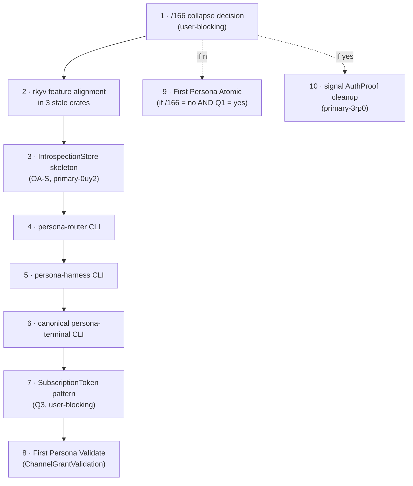

# 113 - Persona engine audit against latest designer and designer-assistant reports

*Operator-assistant report, 2026-05-14. Deep audit of the persona engine
implementation against the freshest designer thread (162-166) and the freshest
designer-assistant audits (45-54). Reads source for every active component in
the Persona ecosystem and the two storage kernels. The audit reports captured
a true snapshot of their own moment, but several of their P0 findings have
since landed; this report names what is now true.*

---

## 0 · TL;DR

The persona engine has moved substantially since the most recent design
syntheses were written. The single most load-bearing audit gap from
`reports/designer-assistant/54-verb-coverage-implementation-and-design-audit.md`
§4.4 — **receiver-side verb validation is missing across the component graph**
— is **now closed across all nine components.** Every component daemon has a
`reject mismatched signal verbs on receive` commit on tip.

The sema-engine surface is similarly ahead of
`reports/designer-assistant/49-sema-engine-state-and-introspect-readiness.md`'s
audit: `Assert`, `Mutate`, `Retract`, `Atomic`, `Match`, `Validate`,
`Subscribe`, `list_tables`, and `operation_log_range` are all landed.
`persona-mind` is a real `sema-engine` consumer with post-commit delta
delivery wired through a typed `SubscriptionSupervisor` actor.

The `signal-persona` engine-catalog gap that `/164` flagged is **closed in
both contract source and `persona`'s manager**: `EngineLaunchProposal`
(`Assert`), `EngineCatalogQuery` (`Match`), and `EngineRetirement` (`Retract`)
are declared in `signal-persona` and consumed in `persona/src/manager.rs`.

What still drifts:

1. **`/166` Atomic-collapse proposal is unresolved.** Designer recommends
   collapsing `SignalVerb` 7→6 by moving the bundle relation out of the verb
   enum and into the frame shape (`Request::Operation { ops: Vec<Op> }`). The
   user has not confirmed. Every Persona contract carries `Atomic`-less variant
   sets today, so the structural cost would land mainly in `signal-core` +
   `signal_channel!` + `sema-engine::AtomicBatch`.
2. **CLI surface drift remains** per `/164` §5.2: `persona-router`,
   `persona-harness` ship only their daemon; `persona-terminal` ships eight
   command-shaped binaries instead of one canonical `terminal` NOTA-in CLI.
3. **`rkyv` feature drift** still affects three crates: `persona-message`,
   `persona-router`, `persona-introspect` use bare `rkyv = "0.8"` instead of
   the workspace's `default-features = false` + `std, bytecheck, little_endian,
   pointer_width_32, unaligned` set.
4. **`signal` (sema-ecosystem vocabulary) still ships `AuthProof` and an
   `auth_proof` frame field.** Bead `primary-3rp0` tracks the cleanup; no live
   Persona consumer depends on `signal`, so this is contained but unfinished.
5. **`persona-introspect` Slice 1 is half-landed.** Receive path now checks
   verbs; the daemon binds the socket; but neither the `IntrospectionStore`
   actor nor any peer observation contract (`signal-persona-router`,
   `signal-persona-terminal`, `signal-persona`) is wired. Replies still
   scaffold-return `Unknown` for prototype-witness fan-out fields.
6. **Three design questions await the user**:
   `/166` 7→6 collapse;
   first Persona-domain `Atomic` (`RoleHandoff` or stay `Mutate`?);
   `SubscriptionToken` shape for subscribe-lifecycle Pattern B.

The persona engine is in much better implementation shape than the audit
reports describe; the most expensive remaining work is design-shaped (Atomic
collapse) and CLI-shape work, not verb discipline.

---

## 1 · Method

This audit reads, in order:

1. `ESSENCE.md`, `lore/AGENTS.md`, `protocols/orchestration.md`,
   `skills/operator.md`, `skills/operator-assistant.md`.
2. The latest designer reports `/157`–`/166`.
3. The latest designer-assistant reports `/45`–`/54`.
4. The recent operator and operator-assistant reports `/112`–`/115`
   (operator), `/108`–`/112` (operator-assistant).
5. `ARCHITECTURE.md` for `signal-core`, `sema-engine`, `persona`,
   `persona-mind`.
6. `git log` tip on every state-bearing component plus contract crates.
7. Targeted source grep for receiver pattern, `Request::assert`,
   `into_payload_checked`, `unchecked_operation`, engine-catalog usage,
   sema-engine integration, and `rkyv` feature alignment.

The audit covers nine state-bearing component repos plus four kernel/contract
crates plus three meta surfaces.

Operator-assistant lock claimed for `[persona-engine-audit]` before reading;
this report's only write is itself, which lives under
`reports/operator-assistant/` and is exempt from claim flow.

---

## 2 · The receiver-validation gap is closed workspace-wide

DA `/54 §4.4` and `/53 §5` named the workspace-wide receive-path gap: every
component decoded a Signal frame with the destructure-and-discard pattern
`FrameBody::Request(Request::Operation { payload, .. }) => Ok(payload)`,
throwing away the wire verb. The sender side was honest (`signal_channel!`
emits a verb-per-variant witness); the receiver side was not.

The corrective primitive — `Request::into_payload_checked()` plus typed
`SignalVerbMismatch` — landed in `signal-core` at commit
`fddfe8a signal-core: check request payload verbs`.

Every component has since landed a corresponding receive-path conversion:

| Repo | Commit | Receiver call site |
|---|---|---|
| `persona` | `3c2e280 persona: reject mismatched signal verbs on receive` | `src/transport.rs:109`, `src/supervision_readiness.rs:360`, `src/bin/persona_component_fixture.rs:265` |
| `persona-mind` | `730aacf persona-mind: reject mismatched signal verbs on receive` | `src/transport.rs:121` |
| `persona-message` | `ad8869d persona-message: reject mismatched signal verbs on receive` | `src/router.rs:145`, `src/supervision.rs:242` |
| `persona-router` | `57ac444 persona-router: reject mismatched signal verbs on receive` | `src/router.rs:367`, `src/supervision.rs:255` |
| `persona-introspect` | `7ef54cd persona-introspect: reject mismatched signal verbs on receive` | `src/daemon.rs:308`, `src/supervision.rs:253` |
| `persona-terminal` | `c468ec6 persona-terminal: reject mismatched signal verbs on receive` | `src/signal_cli.rs:309`, `src/supervision.rs:253`, `src/supervisor.rs:269` |
| `persona-system` | `5cebb28 persona-system: reject mismatched signal verbs on receive` | `src/daemon.rs:210`, `src/supervision.rs:253` |
| `persona-harness` | `1f9ab3d persona-harness: reject mismatched signal verbs on receive` | `src/daemon.rs:242`, `src/supervision.rs:253` |
| `criome` | `e43eafe criome: reject mismatched signal verbs on receive` | `src/transport.rs:32` |

The "DA `/54` P0" item is complete. The seven-root verb discipline is now
**structurally enforced on both sender and receiver sides** across the
Persona ecosystem.

The only stale write path I found is `persona-router/src/router.rs:1904` —
`Request::unchecked_operation(...)`. That call site is the deliberately-named
escape hatch and is currently used inside a negative test that injects a
mismatched-verb frame to prove rejection works. That is the intended use.

---

## 3 · `sema-engine` surface

Implementation has moved well past DA `/49`'s audit. The current surface
matches the `/158 §3.1` `Engine` API closely.

### 3.1 · Landed in `sema-engine`

Per `sema-engine/ARCHITECTURE.md` plus git tip and source layout:

| Surface | Status | Recent landing |
|---|---|---|
| `Engine::open(EngineOpen)` | landed | `eca3255 sema-engine: scaffold database engine library` |
| `Engine::register_table(TableDescriptor<R>)` | landed | scaffold + `record.rs` |
| `Engine::assert(Assertion<R>)` + operation-log entry | landed | scaffold |
| `Engine::mutate(Mutation<R>)` (typed missing-record error) | landed | `5e63917 sema-engine: execute mutate and retract verbs` |
| `Engine::retract(Retraction<R>)` (typed missing-record error) | landed | same |
| `Engine::atomic(AtomicBatch<R>)` with preflight checks | landed | `78872ce sema-engine: add atomic write bundle root` |
| `Engine::match_records(QueryPlan<R>)` (`All` / `Key` / `Range`) | landed | scaffold + plan widening |
| `Engine::validate(QueryPlan<R>)` (no operation-log entry) | landed | `ebe53ec sema-engine: add validate dry-run root` |
| `Engine::subscribe(QueryPlan<R>, Arc<dyn SubscriptionSink<R>>)` | landed | `c88b366 sema-engine: add post-commit subscriptions` + `a7a7744 sema-engine: allow inline subscription delivery` |
| `Engine::list_tables()` | landed | scaffold |
| `Engine::operation_log_range(SequenceRange)` | landed | `33e7c63 sema-engine: add operation log snapshots` |
| `Engine::storage_kernel()` (composition handle for unmigrated tables) | landed | `23b4360 sema-engine: expose owned kernel handle` |
| `ReadPlan` with `Constrain`/`Project`/`Aggregate`/`Infer`/`Recurse` nodes | nodes typed, return `UnsupportedReadPlan` | `9e59fc4 sema-engine: adopt SignalVerb and own read plans` |
| Subscribe modes: detached default + inline for actor sinks | landed | `b8dbce2 sema-engine: document subscription delivery modes` |
| Receipt types: `MutationReceipt`, `AtomicReceipt`, `QuerySnapshot`, `ValidationReceipt` (all carry `SnapshotId`) | landed | various |

Source files under `sema-engine/src/`: `catalog.rs`, `engine.rs`, `error.rs`,
`lib.rs`, `log.rs`, `mutation.rs`, `query.rs`, `record.rs`, `snapshot.rs`,
`subscribe.rs`, `table.rs`. Matches the `/158 §3.1` plan exactly.

### 3.2 · Still future per `sema-engine/ARCHITECTURE.md` §"Package Order"

- `register_index` / `IndexDescriptor` / `IndexRef` — index-keyed lookup
  + `QueryPlan::ByIndex` execution. Needed before `/160`'s Slice 2 lands
  (time-window observation queries for terminal/router via the introspect
  path).
- Executable semantics for `Constrain`, `Project`, `Aggregate`, `Infer`,
  `Recurse` ReadPlan nodes. Today these return `UnsupportedReadPlan`;
  executable forms are downstream of the first consumer that needs them.
- Durable subscription failure counters + consumer rebind helpers (per
  `/158 §3.5` subscription contract).

### 3.3 · `persona-mind` is the first real sema-engine consumer

Per `persona-mind/ARCHITECTURE.md` §4 and commit history:

```
83c3ebe persona-mind: route graph records through sema-engine
1a20067 persona-mind: register graph subscriptions through sema-engine
c4a80e8 persona-mind: deliver graph subscription deltas through actors
5f5870f persona-mind: consume SignalVerb engine stack
```

`MindGraphLedger`:
- writes typed `Thought`/`Relation` records through `Engine::assert` on
  registered `thoughts` / `relations` record families;
- reads them through `Engine::match_records`;
- registers subscriptions through `Engine::subscribe` with a typed
  `SubscriptionSink<R>` adapter that forwards into `SubscriptionSupervisor`;
- maintains only Persona-specific filter rows locally via the **same**
  `sema` kernel handle (`Engine::storage_kernel()`), so the process never
  opens two redb handles to one file.

This is the design from `/158 §6.1 Package 4` landed in code. The
"persona-mind first consumer" milestone is now real for graph paths.

The remaining persona-mind work named in the ARCH is widening: more graph
queries beyond Assert/Match, mutations for Thought correction via
`Supersedes`, and broader subscription filter validation.

---

## 4 · The engine-catalog gap is closed

`/164 §4.3` + `/165 §2.1` flagged a real architectural hole: the
`signal-persona::EngineRequest` contract carried only `EngineStatusQuery` /
`ComponentStatusQuery` / `ComponentStartup` / `ComponentShutdown` — no
`Assert`-shaped engine spawn, no `Match`-shaped catalog listing, no
`Retract`-shaped engine retirement.

Active state on tip:

- `signal-persona/src/lib.rs:168-193` declares
  `EngineLaunchProposal { ... }`,
  `EngineCatalogQuery { ... }`,
  `EngineRetirement { ... }`.
- The `EngineRequest` macro invocation at lines 457-459 wires them as
  `Assert`, `Match`, `Retract`.
- `persona/src/manager.rs:96-102` handles
  `EngineRequest::EngineLaunchProposal` and `EngineRequest::EngineCatalogQuery`.
- `persona/src/request.rs:120-212` encodes/decodes the matching
  `EngineRetirementAcceptance` / `EngineRetirementRejection` NOTA records.

The "stale persona lock" item from DA `/54 §4.1` (persona built against a
pre-engine-catalog commit) is resolved. The verb shape the user articulated
at `/164 §3.1` ("if we want to create a new engine, we have to send an
`Assert` verb of a certain kind") is now the implementation.

What remains: the manager's behavior on these variants is still partial.
`EngineCatalogQuery` returns an `EngineCatalog` reply with whatever the
manager currently knows; `EngineLaunchProposal` accepts launch but does not
yet drive a full multi-engine spawn-and-supervise cycle through to
`ComponentReady`. This is operator-shaped (not designer-shaped) work — the
contract is right; the manager's reducer is being incrementally widened.

---

## 5 · Outstanding contract+design questions

### 5.1 · `/166` Atomic-collapse — pending user

`reports/designer/166-atomic-collapses-into-frame-shape.md` proposes
collapsing `SignalVerb` from seven to six by dropping `Atomic` and moving the
commit-bundle relation up into the frame shape (`Request::Operation` becomes
`Request::Operations(Vec<Op>)`). This is the freshest design move; no code
has landed against it. `signal-core/src/request.rs` still has all seven
variants per `signal-core` git tip (`fddfe8a` is checked-payload work, not a
collapse).

Implication if confirmed:
- `signal-core` breaks every consumer's `Request<P>` shape;
- `signal_channel!` macro's emit shape changes (per-variant verbs stay
  declared but the envelope wraps in `Vec<Op>`);
- `sema-engine::AtomicBatch<R>` renames to `Commit<R>` (or similar) and
  becomes the only commit shape;
- every component's receive path keeps using `into_payload_checked` but
  iterates over the Vec of ops;
- CLI surfaces gain `[ (Assert ...) (Assert ...) ]` multi-op syntax;
  single-op desugar stays via the bare `(Assert ...)` form.

Designer recommends collapse. The scope is real (workspace-wide) but the
discipline already exists.

### 5.2 · First Persona-domain `Atomic` — `RoleHandoff` candidate

Designer `/165 §3.1` + DA `/54 §4.2` propose
`signal-persona-mind::RoleHandoff` (atomic `Retract OldClaim` + `Assert
NewClaim`) as the first Persona use of `Atomic`. Today's persona-mind
`RoleHandoff` is a single `Mutate`. The question is whether handoff reads
honestly as two-facts-under-one-snapshot or as one transition. Designer
defers to user judgment.

If `/166` lands first, this question doesn't surface as an `Atomic`-variant
choice — `RoleHandoff` becomes a wire `Vec<Op>` of `[Retract, Assert]` with
no contract-level `Atomic` token to declare. Either way, the domain
substance is the same: model as two facts, or model as one transition.

### 5.3 · `Subscribe` lifecycle Pattern B — `SubscriptionToken`

Designer `/165 §3.3` + DA `/54 §5 Q3` recommend a single per-contract
`Retract SubscriptionRetraction(SubscriptionToken)` lifecycle pattern,
replacing the three coexisting patterns (system uses paired Retract,
terminal+mind use implicit close-on-drop).

Today `signal-core` exposes no `SubscriptionToken` primitive. Subscription
replies don't carry a token. Adopting Pattern B requires:
- adding a `SubscriptionToken` typed primitive in `signal-core` (or in each
  contract);
- subscription acceptance replies gain a `SubscriptionToken` field;
- unsubscribe variants address by token rather than domain key.

This is bounded operator work — wait for user confirmation, then a
coordinated sweep across `signal-persona-mind`, `signal-persona-terminal`,
`signal-persona-introspect`, `signal-persona-system` (which currently uses
the paired-by-target shape).

---

## 6 · CLI surface drift (persistent gap from `/164`)

Designer `/164 §5.2-§5.3` and DA `/53 §6` flagged the CLI thin-wrapper
intent gap. Status today:

| Component | CLI binary | Status |
|---|---|---|
| `persona` | `persona` | ✓ thin wrapper over `signal-persona`. |
| `persona-mind` | `mind` | ✓ thin wrapper over `signal-persona-mind`. |
| `persona-message` | `message` + `persona-message-daemon` | ✓ CLI + supervised daemon. |
| `persona-introspect` | `introspect` + `persona-introspect-daemon` | ✓ CLI exists; daemon binds and routes verbs. Replies still scaffold (see §8). |
| `persona-system` | `system` + `persona-system-daemon` | ✓ CLI exists. |
| `persona-router` | only `persona-router-daemon` | **missing CLI**. Per `/164 §5.2`, contract has 3 `Match` variants ready to wrap. |
| `persona-harness` | only `persona-harness-daemon` | **missing CLI**. Per `/164 §5.2`, contract has 4 variants ready to wrap. |
| `persona-terminal` | 9 binaries: `-daemon`, `-view`, `-send`, `-capture`, `-type`, `-sessions`, `-resolve`, `-signal`, `-supervisor` | **largest deviation**. No canonical `terminal` CLI. Per `/164 §5.3` + DA `/54 §5 Q6`, target is one `terminal` CLI; keep `-supervisor` etc. as named helpers/witnesses. |
| `criome` | `criome` | ✓ CLI exists. |

This is operator-shaped work, four bounded slices: (a) add `router` CLI, (b)
add `harness` CLI, (c) add canonical `terminal` CLI, (d) decide which of the
eight terminal helpers stay as named dev fixtures (per DA `/54 §5 Q6` —
backward compatibility is not a constraint, so the non-essential helpers
retire).

---

## 7 · `rkyv` feature drift

Operator-assistant `/110 §4.9` flagged three crates using bare
`rkyv = "0.8"` instead of the canonical
`default-features = false, features = ["std", "bytecheck", "little_endian",
"pointer_width_32", "unaligned"]`. Status today:

| Repo | `rkyv` line | Status |
|---|---|---|
| `persona` | canonical | ✓ |
| `persona-mind` | canonical | ✓ |
| `persona-message` | `rkyv = "0.8"` (bare) | **stale** |
| `persona-router` | `rkyv = "0.8"` (bare) | **stale** |
| `persona-introspect` | `rkyv = "0.8"` (bare) | **stale** |
| `persona-terminal` | canonical | ✓ |
| `persona-system` | no direct dep (transitive) | ✓ (no risk surface) |
| `persona-harness` | no direct dep (transitive) | ✓ |
| `criome` | canonical | ✓ |
| `sema` | canonical | ✓ |
| `sema-engine` | canonical | ✓ |
| `signal-core` | canonical | ✓ |

Drift in `persona-message`, `persona-router`, `persona-introspect` is the
same as `/110 §4.9` reported — these three did not get fixed in the
intervening sweeps. The fix is mechanical: one-line Cargo.toml edit per
crate. They build today because direct callers use the same feature set
transitively through `signal-core`, but the discipline rule from
`lore/rust/rkyv.md` is "every crate that mentions `rkyv` directly pins the
canonical feature set."

---

## 8 · `persona-introspect` Slice 1 — half-landed

Per `/160 §3 Slice 1`:

| Package | Description | Status |
|---|---|---|
| OA-1 | `signal-persona-introspect` verb-mapping witness | ✓ landed (`signal-persona-introspect` uses `signal_channel!` SignalVerb annotations) |
| OA-2 | Envelope extension (`ComponentObservations`, `ListRecordKinds`, `AwaitingCorrelationCache`) | not landed |
| OA-3c | `signal-persona-terminal` observation contract types | landed historically; needs sequence/observed_at backfill per `/41 §1.1` |
| OA-Dc | `signal-persona-router` observation contract types | landed (`RouterSummaryQuery`, `RouterMessageTraceQuery`, `RouterChannelStateQuery`) |
| OA-A | Real `EngineSnapshot` reply via manager fan-out | not landed (returns scaffold) |
| OA-B | Real `ComponentSnapshot` reply via per-target fan-out | not landed |
| OA-C | Real `PrototypeWitness` composed from OA-B facts | not landed (returns `Unknown`) |
| OA-4s | `TerminalClient` skeleton actor | shell exists; no real Signal frame round-trip |
| OA-Ds | `RouterClient` skeleton actor | shell exists; no real Signal frame round-trip |
| OA-5 | CLI `Input` extension | partially landed (only `PrototypeWitness` exercised) |
| OA-S | `IntrospectionStore` Kameo actor + introspect.redb + record-family types | **not landed**. No `IntrospectionStore` in source; no `sema-engine` dependency in `persona-introspect/Cargo.toml`. |

The new tip work since `/160` was written:
- `persona-introspect: serve signal daemon socket` (daemon binds, decodes
  Signal frames, dispatches);
- `persona-introspect: reject mismatched signal verbs on receive`
  (receiver-validation closed);
- `persona-introspect: own supervision relation` (responds to
  `signal-persona::SupervisionRequest`);
- `persona-introspect: apply managed socket mode` + `expose socket mode
  witness`.

So the Slice 1 daemon shell, supervision-relation reception, socket-mode
discipline, and receiver-validation are all complete. The fan-out work
(`OA-A` / `OA-B` / `OA-C` / `OA-4s` / `OA-Ds`) and the `IntrospectionStore`
skeleton + `sema-engine` dep (`OA-S`) are still ahead.

The Slice 1 entry points are unblocked: the contracts exist, the daemon is
real, the receive path is correct, and `sema-engine` has enough surface
(`Assert` + `Match` over registered tables) to land the
`IntrospectionStore` skeleton today.

Per `/160 §7 Q6` (and Q1 = stateful-with-cache), introspect's place in the
sema-engine consumer queue is **after persona-mind stabilizes and after
criome lands** — but the Slice 1 OA-S skeleton itself can land as soon as
operator-assistant has bandwidth.

---

## 9 · Legacy `signal` (sema vocabulary) — bead `primary-3rp0`

Per operator-assistant `/112 §"Open Work"` + bead `primary-3rp0`: the
`signal` crate still ships `AuthProof`, an `auth_proof: Option<AuthProof>`
field on its frame, and the older `BlsG1` / `CommittedMutation` vocabulary.
Current state confirmed in source:
- `signal/src/lib.rs:69` re-exports `AuthProof, BlsG1, CommittedMutation`;
- `signal/src/frame.rs:37` declares the `auth_proof` field;
- `signal/src/auth.rs:17-24` defines `AuthProof`.

This is contained: no live Persona consumer depends on `signal`
(per `/112 §"Signal / Signal-Core Understanding"`). Persona uses
`signal-core` plus the `signal-persona-*` family; current `criome` also
doesn't use `signal` directly. The `signal` crate's known direct
consumers are `nexus`, `mentci-lib`, `mentci-egui`, and `signal-forge`.

Cleanup is operator-shaped and can land independently. The architectural
direction (per `signal-persona-auth`) is that authority comes from
**channel state** + **`ConnectionClass`** + **`MessageOrigin`**, not from
in-band proof fields on frames. The `signal` crate has not caught up.

---

## 10 · Open beads relevant to this audit

```
○ primary-3rp0  signal: resolve legacy AuthProof and duplicate kernel vocabulary (role:operator)
○ primary-0uy2  persona-introspect: store local observation state through sema-engine (role:operator)
○ primary-devn  persona+signal-persona+persona-router: retire MessageProxy phantom; add supervision relation; two reducers (per designer/142) (role:operator)
○ primary-hj4   persona-mind: channel choreography, subscriptions, suggestions (role:operator)
○ primary-hj4.1 persona-mind: implement typed mind graph from designer/152 (role:operator)
○ primary-hj4.1.3 persona-mind: decide and implement graph ID derivation policy (role:operator)
○ primary-a18   persona-engine-sandbox: bind credential root and add provider auth smoke (role:operator)
○ primary-8n8   persona-terminal: supervisor socket and gate-and-cache delivery (role:operator)
○ primary-5rq   criome: implement Spartan BLS auth substrate (role:operator)
○ primary-ffew  criome: migrate identity and attestation state to sema-engine (role:operator)
```

The audit findings map onto these beads cleanly:

| Audit finding | Bead | Status implication |
|---|---|---|
| Slice 1 `OA-S` (IntrospectionStore) | `primary-0uy2` | ready to start; sema-engine surface is sufficient |
| CLI gap (router) | none yet | new bead candidate |
| CLI gap (harness) | none yet | new bead candidate |
| CLI gap (terminal canonical) | none yet | new bead candidate |
| `rkyv` feature drift in 3 crates | none yet | new bead candidate |
| `signal` AuthProof cleanup | `primary-3rp0` | open; designer-shaped scope (channel-state model is correct direction) |
| First Persona Atomic decision | none | awaits user (Q1 in `/165`) |
| Subscription token decision | none | awaits user (Q3 in `/165`) |
| `/166` collapse decision | none | awaits user |
| persona-mind channel choreography | `primary-hj4` + sub-beads | open; substantial work |

---

## 11 · Recommended next operator order

Closely following DA `/54 §7`'s "do not start by adding more proposed
variants" discipline. The receiver-validation step (step 1 in DA `/54`'s
order) is done. Re-ordering for current reality:



`A` (collapse decision) shapes downstream work: yes collapses dissolves
the first-Atomic question and changes step `I`; no leaves the seven-verb
shape and step `I` proceeds.

`B` (rkyv) is cheap mechanical work, unblocked, can land any time.

`C` (IntrospectionStore) is the next live introspect milestone and uses
already-shipped sema-engine surfaces.

`D` / `E` / `F` are bounded CLI slices; they each take an existing contract
and lower its variants to a NOTA-in/NOTA-out CLI per the `mind`/`message`
pattern.

`G` then `H`/`I` only land after `A` is decided (the token shape interacts
with `/166`'s Vec-shape envelope), and after the CLI surfaces normalize so
the witnesses are uniform.

`J` (legacy `signal`) can run in parallel to anything else; it's contained.

---

## 12 · What's solid right now

Worth naming what landed cleanly, because the audit reports' tone (P0 gap,
half-migrated, drifted) reads more dire than tip reality warrants:

- **Seven-root verb discipline is enforced on both wire sides** across nine
  components.
- **`sema-engine` is library-only, depends only on `sema` + `signal-core`,
  has no daemon binary, has no actor framework dependency**, matches
  `/158` constraints. Holds one `sema::Sema` handle per Engine; consumers
  with unmigrated tables go through `Engine::storage_kernel()` rather than
  opening a second handle (a real correctness witness).
- **`persona-mind` is a real sema-engine consumer** for typed Thoughts/
  Relations and graph subscriptions, with post-commit delta delivery
  routed through `SubscriptionSupervisor`. The "first real consumer"
  milestone is operational.
- **Engine-catalog verbs are landed end-to-end**: contract, manager
  reducer, CLI NOTA encoding.
- **Supervision relation closed for every component**: every state-bearing
  component has `own supervision relation` + `apply managed socket mode`
  commits on tip. The manager-side `ComponentReady` path verifies typed
  hello/readiness/health replies before recording the transition.
- **The first-stack prototype topology witness runs in Nix**:
  `persona-daemon-launches-nix-built-prototype-topology` starts seven
  supervised components, proves each binds its declared socket mode,
  exchanges supervision frames, and reaches `ComponentReady` (per the
  recent `19b08cc add nix-built prototype topology witness` commit).

The engine is past "set of typed contracts and component runtimes" (per
`/110 §1`) and into "running supervised prototype with verb-correct frame
handling on every typed edge."

---

## 13 · Three questions for the user (in priority order)

For the persona engine work to keep flowing, these decide where operators
go next:

1. **Atomic-collapse (`/166`)**: collapse `SignalVerb` 7→6 and move the
   commit-bundle into the frame shape (`Vec<Op>`), or keep seven? My
   reading concurs with designer's recommendation to collapse — it's
   structurally cleaner, dissolves the "first Persona Atomic" decision,
   and the breaking pass is bounded because every contract already exists
   with `Atomic`-less variant sets. But this is workspace-wide, so it
   wants explicit confirmation before the operator pass starts.
2. **`SubscriptionToken` for Pattern B (`/165 §3.3` + Q3)**: adopt one
   per-contract `Retract SubscriptionRetraction(SubscriptionToken)` and
   add a `SubscriptionToken` primitive (where: `signal-core` or
   per-contract?). If `/166` collapses first, the token primitive still
   shapes the same way; this is decoupled.
3. **First Persona-domain `Atomic` (`/165 §3.1` + Q1)**: only relevant if
   `/166` = no. If we keep seven verbs, should `RoleHandoff` become an
   `Atomic` of `Retract OldClaim` + `Assert NewClaim`, or stay a single
   `Mutate`? If `/166` = yes, this dissolves into "is RoleHandoff one
   wire frame with two ops or one op?" — same domain substance, no verb
   shape decision.

The audit's load-bearing implication: **most of the discipline work the
recent audits flagged is now landed**. The remaining work is design-shaped
(the three questions above) and CLI-shape work (router, harness, terminal
canonical). Operator and operator-assistant lanes can clear all of it
without further design rounds, once those three decisions are made.

---

## 14 · See also

- `~/primary/reports/designer/166-atomic-collapses-into-frame-shape.md`
  — Atomic collapse proposal, freshest design move.
- `~/primary/reports/designer/165-verb-coverage-across-persona-components.md`
  — per-component verb-coverage map; corrected for active source. The two
  open questions in §4 are this audit's §13.1 and §13.3.
- `~/primary/reports/designer/164-signal-core-vs-signal-and-cli-verb-wrapping.md`
  — kernel-vs-vocabulary split, CLI thin-wrapper intent. The CLI gaps at
  §6 here trace back to `/164 §5`.
- `~/primary/reports/designer/162-signal-verb-roots-synthesis.md`,
  `/163-seven-verbs-no-structure-eighth.md` — adopted seven-root spine,
  schema-as-data containment.
- `~/primary/reports/designer/158-sema-kernel-and-sema-engine-two-interfaces.md`
  — the two-interface design that the implementation now realizes.
- `~/primary/reports/designer/160-persona-introspect-brief-for-operator-assistant.md`
  — Slice 1/2/3 plan; §8 here traces the Slice 1 status against it.
- `~/primary/reports/designer-assistant/54-verb-coverage-implementation-and-design-audit.md`
  — the audit whose P0 receiver-validation finding §2 here closes out.
- `~/primary/reports/designer-assistant/53-signal-core-cli-verb-implementation-audit.md`
  — parallel audit, same conclusion; CLI gap finding in §6 here.
- `~/primary/reports/designer-assistant/49-sema-engine-state-and-introspect-readiness.md`
  — sema-engine surface audit; §3 here updates it against tip.
- `~/primary/reports/operator/115-sema-engine-split-implementation-investigation.md`
  — operator's package-order plan, executed.
- `~/primary/reports/operator-assistant/110-engine-wide-architecture-implementation-gap-assessment.md`
  — broader engine-shape assessment; §7 here updates the rkyv finding.
- `~/primary/protocols/active-repositories.md` — current active repo map.
- `/git/github.com/LiGoldragon/signal-core/src/request.rs` — seven-verb
  `SignalVerb`, `Request::into_payload_checked`, `SignalVerbMismatch`.
- `/git/github.com/LiGoldragon/sema-engine/ARCHITECTURE.md` — current
  engine surface and package order.
- `/git/github.com/LiGoldragon/persona/ARCHITECTURE.md` §1.5–§1.7 — engine
  manager model, channel choreography, startup strategy.
- `/git/github.com/LiGoldragon/persona-mind/ARCHITECTURE.md` §4 — runtime
  topology with `sema-engine` consumer paths.
