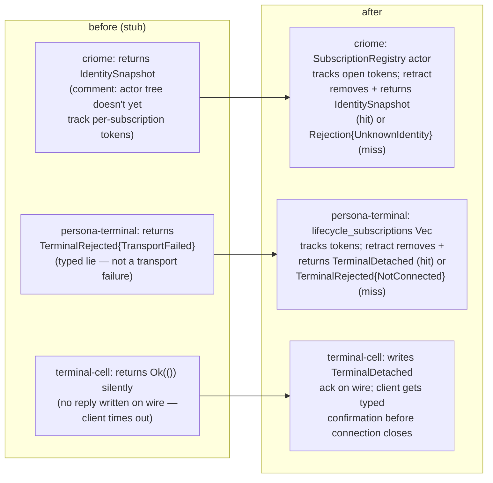

## 119 — Wave-2 phase 5: contract test sweep + real subscription-retraction handlers

*Operator-assistant implementation report, 2026-05-15. Closes the
two gaps surfaced in `/118 §4`: the `signal-criome` test sweep,
and the three daemon subscription-retraction handlers that were
stubs.*

## 0 · Headline

Five commits landed on `main` across five repos:

| Repo | Commit | What |
|---|---|---|
| `signal-criome` | `383c1f76` | Migrate `tests/round_trip.rs` to wave-3 typed `Request`/`Reply`/`SubscriptionEvent` shape. `IdentityUpdate` reply moves to `CriomeEvent` (streaming). New `identity_update_event_round_trips_through_length_prefixed_frame` test. New round-trip for `IdentitySubscriptionRetraction` request + its `SignalVerb::Retract` declaration. 9 tests green. |
| `criome` | `f4c66fce` | New `SubscriptionRegistry` actor (`src/actors/subscription.rs`) tracking the set of open `IdentitySubscriptionToken`s. Daemon root routes `SubscribeIdentityUpdates` and `IdentitySubscriptionRetraction` through this registry. `CriomeTopology` exposes `subscription()`. `tests/daemon_skeleton.rs` updated to wave-3 frame shape + topology witness. 7 tests green. |
| `persona-terminal` | `07ff07e9` | `TerminalSignalControl` carries `lifecycle_subscriptions: Vec<TerminalWorkerLifecycleToken>`. `Subscribe` queries the worker for `TerminalWorkerObservation`, returns `TerminalWorkerLifecycleSnapshot` with converted lifecycle events. `Retraction` removes the token; returns `TerminalDetached{HumanRequested}` on hit, `TerminalRejected{NotConnected}` on miss. 6 tests green. |
| `terminal-cell` | `cd0544d5` | `TerminalWorkerLifecycleRetraction` no longer returns silent `Ok(())` — writes a typed `TerminalDetached{HumanRequested}` ack to the wire. New `SocketReplyReader::read_signal_subscription_event()` reads `StreamingFrameBody::SubscriptionEvent`. `tests/daemon_witness.rs` migrated: direct-reply variants moved from `TerminalEvent::*` to `TerminalReply::*`; streaming-event read uses the new reader method. `Cargo.lock` bumped to pick up signal-persona-terminal hand-written `From<Payload> for TerminalRequest` impls. All test targets green. |

## 1 · The three retraction handlers — before / after

Before this report's commits, the wave-3 daemon migration had left
each retraction arm as a typed lie or a silent failure:

In all three daemons, the retraction now has observable state:
each owns a per-daemon view of which tokens are currently open,
and the retraction's effect is to remove the token from that view
and return a typed confirmation.

## 2 · Design gap that remains — surfaced for designer

The three daemons each had to **overload an existing reply variant**
for the retraction's success ack, because none of the three streaming
contracts (`signal-criome`, `signal-persona-terminal`) declares a
dedicated "subscription retracted" reply. The overloads:

| Daemon | Overloaded reply | What it semantically means |
|---|---|---|
| `criome` | `IdentitySnapshot` (current registry state) | "your subscription is closed; here is the registry state at close time" |
| `persona-terminal` | `TerminalDetached{HumanRequested}` | "your lifecycle subscription is detached at your request" |
| `terminal-cell` | `TerminalDetached{HumanRequested}` | same |

None of these mean *exactly* "subscription retracted" — each is a
near-fit chosen to avoid a contract change. The contract design
gap is real: in `signal-persona-mind`, this case is modeled with
an explicit `MindRequestUnimplemented` variant; `signal-persona-system`
and `signal-persona-harness` have similar `SystemRequestUnimplemented` /
`HarnessRequestUnimplemented` variants. `signal-criome` and
`signal-persona-terminal` are the two streaming contracts without
this safety-valve. **A future designer pass could decide:**

- **Path A** — add a typed `SubscriptionRetracted` reply variant in
  each streaming contract. Most accurate; consumes one variant slot.
- **Path B** — add a generic `<Channel>RequestUnimplemented` /
  `<Channel>Acknowledgement` variant. Matches the mind/system/harness
  pattern.
- **Path C** — keep the overload as a documented convention.

This is downstream of /176 and /177 spec; not an operator-assistant
call to make.

## 3 · The push primitive is still wave-4 work

These commits make the **retraction** real but do not implement the
streaming **push** primitive on the producer side. The state today:

| Daemon | Subscribe behavior | Push behavior |
|---|---|---|
| `criome` | Registers token, returns `IdentitySnapshot` once | **No deltas pushed**; registry tracks tokens but emits nothing |
| `persona-terminal` | Registers token, returns `TerminalWorkerLifecycleSnapshot` (worker's recorded events at subscribe time) | **No deltas pushed** from supervisor; relies on terminal-cell worker for live emission |
| `terminal-cell` | `stream_signal_worker_lifecycle` writes snapshot + blocks emitting deltas on the same connection | **Pushes deltas**; only daemon doing real subscription streaming |

terminal-cell is the only daemon with a real push primitive (via
the blocking event loop in `stream_signal_worker_lifecycle`). The
other two return a snapshot at Subscribe time and never push deltas.
This is consistent with operator's `persona-mind` migration pattern
(`MindRequest::SubscriptionRetraction => self.unimplemented(trace)`)
— the workspace's streaming-subscription push primitive is generally
not yet implemented across the daemons.

The wave-4 work: implement actual push-delta emission in each
producer daemon, then the SubscriptionRegistry actors here track
the open subscriptions that need event delivery. The registry shape
landed today is the receive side of that future work.

## 4 · Coverage map after this report

Final wave-3 cutover state, combining `/116` (engine), `/117`
(contracts), `/118` (daemons), and `/119` (this report):

| Surface | Status |
|---|---|
| Contract crates (lib + tests compile) | 8/8 green |
| Daemon crates (lib + tests compile) | 10/10 green |
| Subscription-retraction handlers honest | 3/3 (with overload caveat per §2) |
| Push-delta primitive | 1/3 daemons (terminal-cell only) — wave-4 work |

The wave-3 cutover (per `/176` and `/177`) is now **complete in
the sense the user asked for** — all contracts and components
refactored to the new design. The two remaining items are forward
work:

1. Designer: pick a path among A/B/C in §2 to give the retraction
   acknowledgement a typed name.
2. Operator: implement push-delta emission in `criome` and
   `persona-terminal` (wave-4); the SubscriptionRegistry actors
   landed here are the receive-side for that work.

## 5 · Discipline notes

- Five commits, five pushes. Each `jj st` checked before commit.
  No peer-file bundling this session.
- One claim extension: added `signal-criome` to the
  operator-assistant lock mid-session when the contract test
  migration revealed it needed editing alongside the contracts I
  already held. Lock at `/home/li/primary/operator-assistant.lock`
  reflects the final scope.
- Two stale `push-*` bookmarks on `signal-persona` (`push-xqwsylxkupnq`,
  `push-ysrtyyypovkr`) carry diverged work from earlier sessions
  per `jj.md` §"Bookmark cleanup after merge". These are
  **outside my claim** for this report — flagged here for the
  next operator/designer to triage (decide land-on-main vs.
  abandon vs. force-update from origin).

## 6 · Pointers for the next agent

| Need | Where |
|---|---|
| Spec | `reports/designer/176-signal-channel-macro-redesign.md` + `reports/designer/177-typed-request-shape-and-execution-semantics.md` |
| Prior wave-2 reports | `reports/operator-assistant/117-wave-2-phase-3-contract-sweep-2026-05-15.md` (contracts) + `/118-wave-2-phase-4-daemons-2026-05-15.md` (daemons) |
| Criome subscription registry | `/git/github.com/LiGoldragon/criome/src/actors/subscription.rs` |
| Persona-terminal lifecycle tracking | `/git/github.com/LiGoldragon/persona-terminal/src/signal_control.rs` (`open_worker_lifecycle_subscription`, `close_worker_lifecycle_subscription`) |
| Terminal-cell typed-ack pattern | `/git/github.com/LiGoldragon/terminal-cell/src/bin/terminal-cell-daemon.rs` (`handle_signal_request` retraction arm) + `/git/github.com/LiGoldragon/terminal-cell/src/socket.rs` (`read_signal_subscription_event`) |
| Operator's parallel mind pattern | `/git/github.com/LiGoldragon/persona-mind/src/actors/dispatch.rs:118` (`SubscriptionRetraction => self.unimplemented(trace)`) |
