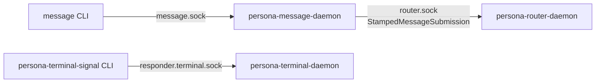

## 122 — persona dev-stack smoke: 3-daemon end-to-end working

*Operator-assistant implementation report, 2026-05-15. Fixes the
broken `persona-dev-stack-smoke` and delivers the user's requested
"working sandbox test with 2 or more components".*

## 0 · Headline

One commit, `persona@24603185`. `persona-dev-stack-smoke` and its
inside-unit wrapper `persona-engine-sandbox-dev-stack-smoke` now run
end-to-end with three real daemons + the message CLI.

| Witness | What it proves |
|---|---|
| `nix run .#persona-dev-stack-smoke` | `persona dev stack smoke=passed` over router + message-daemon + terminal-daemon, with real `(SubmissionAccepted 1)` reply and inbox `(RouterInboxEntry 1 owner "hello from persona meta")` returned through SO_PEERCRED-stamped origin |
| `nix run .#persona-engine-sandbox-dev-stack-smoke` | Same three-daemon flow inside `persona-engine-sandbox --inside-unit --harness pi`, producing sandbox manifest + dev-stack-run/processes/sockets artifacts |
| `nix flake check -L` | Whole `persona` flake stays green |

## 1 · The bug it was

`persona-dev-stack-smoke` was returning
`Error: Nota(UnknownKindForVerb { verb: "Input", got: "Register" })`
on the first CLI call. Two root causes:

1. **Stale CLI verb.** The `message` CLI's `Input` enum has only
   `Send` and `Inbox` variants today (`persona-message/src/command.rs:30`).
   The script's `(Register operator None)` was a no-longer-valid
   command from a pre-wave-3 CLI surface; the NOTA decoder rejected
   the `Register` head at the CLI's input layer.

2. **Wrong daemon hop.** `persona-router-daemon` rejects raw
   `MessageSubmission` with `MessageRequestUnimplemented` (per
   `persona-router/src/router.rs:774`); only
   `StampedMessageSubmission` is accepted. The submission must route
   through `persona-message-daemon`, which binds `message.sock` and
   stamps origin via SO_PEERCRED before forwarding to `router.sock`.
   The old script sent `MessageSubmission` directly to `router.sock`
   via `PERSONA_MESSAGE_ROUTER_SOCKET` — a path the CLI doesn't read,
   to a daemon that wouldn't accept it.

## 2 · What the fix shape looks like

In `scripts/persona-dev-stack`:

- Spawn `persona-message-daemon $message_socket $router_socket`
  alongside the existing router/terminal coprocs, reading its
  `persona-message-daemon socket=…` readiness line.
- Drop the `(Register operator None)` line entirely.
- Set `PERSONA_MESSAGE_SOCKET=$message_socket` on the CLI calls
  (previously `PERSONA_MESSAGE_ROUTER_SOCKET=$router_socket`, which
  the CLI doesn't read).
- Wire the new daemon into `cleanup`, `write_environment_file`, and
  the process/socket manifests.

The terminal-cell path was already working today; nothing changed
there.

## 3 · What this means

The user asked for "a working sandbox test with 2 or more
components". This is now passing at three component daemons + one
CLI client:

- `persona-router-daemon` — accepts stamped submissions, holds at
  slot, serves inbox queries.
- `persona-message-daemon` — accepts CLI submissions, stamps origin,
  forwards to router.
- `persona-terminal-daemon` — owns a live PTY, accepts
  connect/input/capture through typed Signal.
- `message` and `persona-terminal-signal` CLIs — thin clients that
  drive the daemons through their respective sockets.

## 4 · What's still gap

Two items deliberately not addressed today:

1. **Promote `dev-stack-smoke` from package to flake check.** Today
   `persona-dev-stack-smoke` is a Nix *app* (manual `nix run`), not a
   `nix flake check` derivation. The corresponding check
   `persona-dev-stack-script-builds` only proves the script exists.
   The two passing today are runnable manually but not in the
   regression gate. Reason it's not just a one-line promotion: the
   smoke needs a PTY for `persona-terminal-daemon`, and the design
   note in TESTS.md says "It is a stateful app, not a pure" check
   on purpose. If the user wants a smaller 2-component check
   (router + message-daemon only, no PTY) in the regression gate,
   that would land cleanly and could go in `nix flake check`.

2. **Router-to-harness-to-terminal delivery.** TESTS.md still
   carries: "intentionally explicit that it does not yet prove
   router-to-harness-to-terminal delivery." The smoke proves
   submission and inbox query through the router, plus the terminal
   PTY surface independently — but the router doesn't yet hand the
   message to the harness, which doesn't yet drive the terminal. The
   harness-side push-delta primitive is wave-4 operator work.

## 5 · Pointers for the next agent

| Need | Where |
|---|---|
| The smoke script | `/git/github.com/LiGoldragon/persona/scripts/persona-dev-stack` |
| The flake derivation (manual run) | `/git/github.com/LiGoldragon/persona/flake.nix` (`personaDevStack` at line ~202) |
| Inside-unit sandbox wrapper | `/git/github.com/LiGoldragon/persona/flake.nix` (`personaEngineSandboxDevStackSmoke` at line ~257) |
| Message daemon (source of the stamping seam) | `/git/github.com/LiGoldragon/persona-message/src/daemon.rs:345` (the `MessageSubmission → StampedMessageSubmission` rewrite) |
| Router-side acceptance | `/git/github.com/LiGoldragon/persona-router/src/router.rs:777` (the `StampedMessageSubmission` arm of `apply_router_signal_request`) |
| Reply shape proof | Last run's artifact: `(RouterInboxListing [(RouterInboxEntry 1 owner "hello from persona meta")])` |
