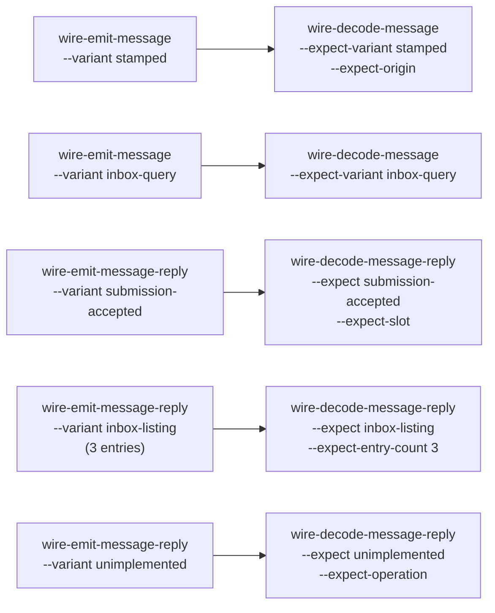
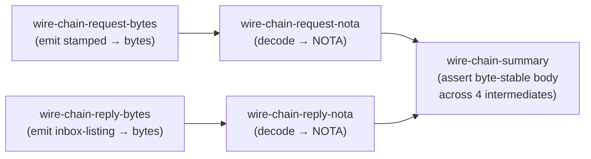

## 124 — Elaborate wire-test tiers + midway witness lands

*Operator-assistant implementation report, 2026-05-15. Closes the
elaborate-tests slice of `primary-31jt`. Pair to `/122` (dev-stack
smoke working) and `/123` (specific-lock discipline prompt for
operator).*

## 0 · Headline

One commit, `persona@b72d830d`. 6 wire shim binaries + 14 new Nix
flake checks organized in four tiers. Every check captures one
wire-layer boundary so a failure pinpoints which bytes-on-the-line
shape regressed. The crown jewel: a midway witness that catches
`persona-message-daemon`'s SO_PEERCRED origin stamping at the actual
wire boundary, in 105 bytes, in a pure Nix builder.

| Tier | Checks | What it proves |
|---|---|---|
| T1 — per-record round-trips | 5 (+ 1 pre-existing) | Each request/reply variant on the `signal-persona-message` channel encodes and decodes byte-perfect through the length-prefixed frame. |
| T2 — origin shapes | 5 | Every `MessageOrigin` variant — `Internal(Mind)`, `Internal(Router)`, `External(Owner)`, `External(NonOwnerUser(uid))`, `External(Network(peer))` — survives the wire byte-perfect. The SO_PEERCRED stamping path depends on these shapes being stable. |
| T3 — signals caught | 3 | Decoder rejects malformed bytes, truncated frames, and wrong frame kinds with typed errors and non-zero exit (not silent acceptance, not panic-free hang). Stderr preserved as forensic artifact under `/nix/store/<hash>/stderr.txt`. |
| T4 — midway witnesses | 5 chained + 1 real-daemon | Each link is its own derivation producing an inspectable `/nix/store` artifact (frame bytes, NOTA text). Final summary derivation asserts byte-stable body string across all intermediates. The crown jewel runs the real `persona-message-daemon` against a one-shot `wire-tap-router` and decodes the captured 105 bytes back through our typed shim. |

`nix flake check -L` clean. Each of the 13 new checks runs and passes
individually.

## 1 · The midway witness

`persona-message-daemon-stamps-origin-via-tap` is the answer to the
user's request for "midway tests to capture the intermediate steps in
nix derivations to insure the purity and veracity of the operation
(signals caught)".

```mermaid
flowchart LR
    cli["message CLI<br/>(Send tap-recipient<br/>'tap-captured-body')"]
    sock1["message.sock"]
    daemon["persona-message-daemon<br/>(real, from inputs.persona-message)"]
    sock2["tap.sock"]
    tap["wire-tap-router"]
    capture["captured.bytes<br/>(105 B → /nix/store/)"]
    decoder["wire-decode-message<br/>--expect-variant stamped<br/>--expect-origin external:owner"]
    witness["witness.txt<br/>(/nix/store/)"]

    cli --SO_PEERCRED--> sock1
    sock1 --> daemon
    daemon -- "StampedMessageSubmission<br/>(real bytes)" --> sock2
    sock2 --> tap
    tap --> capture
    capture --> decoder
    decoder --> witness
```



What the artifacts look like:

```
$ cat result/witness.txt
midway witness: persona-message-daemon stamped origin in flight
  cli exit:        0
  captured bytes:  105
  decoded nota:    (StampedMessageSubmission (MessageSubmission tap-recipient Send tap-captured-body) (External (Owner)) 1778866296620195796)
  expected origin: External(Owner) (Nix builder uid)

$ cat result/stamped.nota
(StampedMessageSubmission (MessageSubmission tap-recipient Send tap-captured-body) (External (Owner)) 1778866296620195796)

$ cat result/cli.out
(SubmissionAccepted 999)
```

The daemon's actual on-wire output is no longer a black-box claim —
it's an inspectable byte sequence with a typed-decoded NOTA
representation, captured by an independent shim, decoded through the
same contract crate the production daemons use.

## 2 · The four tiers (in detail)

### T1 — per-record round-trips (no daemon, ~1s each)



The pre-existing `wire-message-channel-round-trip` already covered
`MessageSubmission`. These 5 new T1 checks fill in the remaining
2 request variants + all 3 reply variants. A failure here says the
contract crate's encode/decode for that one variant is broken.

### T2 — origin shapes

`MessageOrigin` has 2 top-level variants (`Internal`, `External`) and
`ConnectionClass::External` has 5 sub-variants. Each T2 check round-
trips one origin shape through the wire. A failure says the codec
forgot a variant or shifted the encoding under it.

### T3 — signals caught (negative tests)

Three checks that prove the decoder *rejects* bad input rather than
silently accepting or panicking with no diagnostic. Each preserves
stderr in `/nix/store/<hash>/stderr.txt` so the failure mode itself
is a versioned artifact.

```
$ cat /nix/store/.../wire-malformed-bytes-decode-rejects/stderr.txt

thread 'main' (6) panicked at src/bin/wire_decode_message.rs:168:55:
decode length-prefixed frame: LengthMismatch { expected: 1111638594, found: 19 }
```

The `LengthMismatch` is the typed-error witness: the codec caught the
bad length prefix at the type level.

### T4 — midway witnesses

The chain demonstration shows how an arbitrary number of derivations
can be composed while keeping each link cheap, pure, and inspectable:



If any link breaks, only that specific derivation turns red — not
"the whole chain failed somewhere."

Plus the real-daemon T4-bonus (§1).

## 3 · One bug found + fixed during the work

`signal-core`'s `Frame::encode_length_prefixed` writes the length
prefix as **big-endian** (`signal-core/src/frame.rs` `length_prefix`
uses `length.to_be_bytes()`). My initial `wire-tap-router` and
`wire-router-client` used `u32::from_le_bytes` for the manual prefix
peek and hung forever on `read_exact` (they thought a 4-byte
big-endian count was a multi-gigabyte little-endian count). Both
shims now use `u32::from_be_bytes` with an explanatory comment
pointing at the signal-core source.

This was caught by the tap witness hanging — exactly the kind of
in-flight cross-shim mismatch the elaborate-tests scaffold is
designed to catch.

## 4 · Coordination notes

- Worked under `[primary-31jt]` (the focused bead filed in `/123`).
  Operator stayed under `[primary-a18]` with file-specific path
  locks on `persona-router/`. The two lanes never conflicted.
- Operator's parallel work on `scripts/persona-dev-stack` +
  `scripts/persona-engine-sandbox` + `flake.lock` was visible in my
  working copy. I used `jj commit <paths>` to partial-commit only
  my 9 files: Cargo.toml, TESTS.md, flake.nix, and the 6 wire shim
  binaries. Operator's files were not touched.
- Operator's narrowed lock pattern (3 specific files in persona-router,
  reason "persist router adjudication requests" as of release time)
  is exactly the discipline `/123` asked for. Working well.

## 5 · Forward items

1. **Single-daemon real-router checks** (originally planned as Tier
   between current T3 and T4). Skipped this session because operator
   is actively iterating on `persona-router-daemon`'s CLI shape
   (`daemon --socket ... --bootstrap ...` in their latest dev-stack
   script). Adding `persona-router-daemon-accepts-stamped-submission`
   and `persona-router-daemon-rejects-unstamped-submission` is
   straightforward once the CLI settles — they reuse the existing
   `wire-router-client` and `wire-decode-message-reply` shims.
2. **Property-style** sequence tests (submit N messages, decode N
   replies, assert slots monotonic, bodies preserved) — natural T4
   extension. Each adds ~30 lines of bash to `flake.nix`; the shims
   already support it.
3. **`wire-router-client` is currently unused in shipped checks**.
   The shim exists and builds because the single-daemon checks above
   need it; the first consumer will be one of those checks.

## 6 · Pointers for the next agent

| Need | Where |
|---|---|
| Shim source | `/git/github.com/LiGoldragon/persona/src/bin/wire_*.rs` |
| Flake checks (search "Wire-test chain") | `/git/github.com/LiGoldragon/persona/flake.nix` |
| Per-check witness table | `/git/github.com/LiGoldragon/persona/TESTS.md` §3 |
| Endianness pitfall — length prefix is big-endian | `signal-core/src/frame.rs` `length_prefix`; comment in `wire_tap_router.rs::read_length_prefixed_frame` |
| Tap-witness pattern (one-shot capture + canned reply) | `/git/github.com/LiGoldragon/persona/src/bin/wire_tap_router.rs` — the request's `ExchangeIdentifier` is read from the captured bytes and echoed on the reply so the caller's exchange-match accepts it |
| Origin spec grammar | `/git/github.com/LiGoldragon/persona/src/bin/wire_emit_message.rs::parse_origin` |
| Predecessor — dev-stack smoke working | `reports/operator-assistant/122-persona-dev-stack-smoke-2026-05-15.md` |
| Coordination — specific-lock discipline | `reports/operator-assistant/123-prompt-for-operator-specific-locks.md` |
