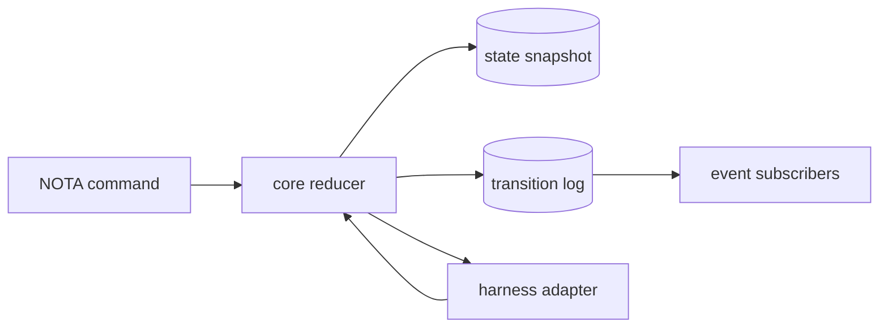
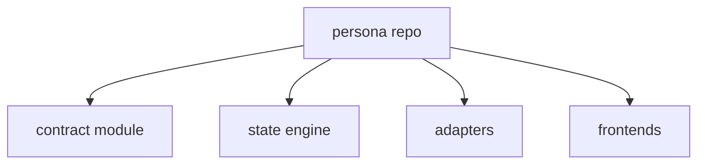
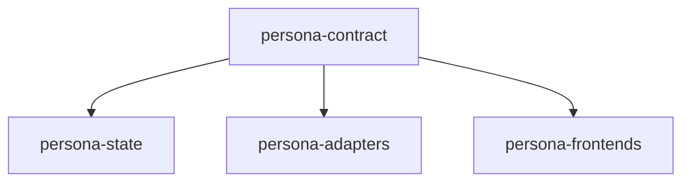

# Persona Core State Pass

Date: 2026-05-06

## What I Read

- Gas City runtime/session code: provider verbs, session state transitions,
  submit intents, pending interactions, output peeking, and SSE transcript
  streams.
- Gas City architecture: one object model with CLI and API projections over it.
- The Rust orchestrator repo: redb cursor, rkyv dispatch records, ordered event
  processing, duplicate suppression.
- The older orchestrator design v3: cursor plus body-filter dispatcher over
  event sequences.
- Persona's current schema scaffold.

## The Design Move

Persona should have one core state machine. Adapters may keep process-local
state, but Persona truth is a reducer-owned snapshot plus transition log.



## What I Added In Persona

```text
src/schema.rs
  CorePhase
  HarnessLifecycleState
  TransitionCommandKind
  StateRevision
  StateCursorRecord
  HarnessObservationRecord
  PendingInteractionRecord
  StateTransitionRecord
  PersonaStateSnapshot

src/state.rs
  PersonaState
    - from_snapshot
    - snapshot
    - into_snapshot
    - revision
    - record_transition
```

I also updated the Persona architecture map and added the repo-local design
report:

```text
/git/github.com/LiGoldragon/persona/reports/2026-05-06-persona-core-state-machine.md
```

## Core Idea

Gas City had several state machines stacked on top of each other:

```text
TOML config
  -> session beads
  -> provider runtime
  -> tmux/session state
  -> controller cache
  -> event log
  -> bead metadata
```

Persona should invert that:

```text
command
  -> one reducer
  -> transition
  -> event
  -> projection
```

Effects are subordinate:

```text
transition says "deliver message"
  -> adapter receives effect request
  -> adapter writes to harness/process/protocol
  -> adapter reports observation
  -> reducer records observation transition
```

## Harness Boundary

Gas City's useful harness manipulation verbs are still the right inventory:

```text
start
stop
interrupt
nudge / submit
send keys
peek / transcript
pending interaction
respond
wait for idle
last activity
```

The part to reject is treating tmux as the truth. Persona should make terminal
display a client concern and keep runtime truth in process streams, protocol
frames, exit status, and explicit observations.

## Repository Split Question

There are two plausible shapes:



or:



My current read: keep one repo for the first pass, but keep a real contract
boundary in code. Split the contract into its own repo only when frontend or
adapter churn starts forcing state-engine rebuilds.

## Questions For You

- Should the current `orchestrator` repo become the seed of Persona's state
  engine, or stay as a reference to mine for patterns?
- Is the first runtime target a direct PTY/process adapter, or should the
  first adapter be a structured protocol around existing harness CLIs?
- Should extensions only submit commands to the core, or can they own detached
  sub-state and publish observations back into the reducer?
- Does Persona model BEADS tasks as first-class work objects, or does BEADS
  stay outside as workspace-agent orchestration only?
