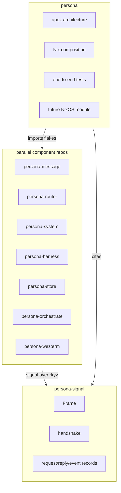
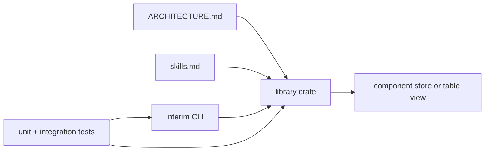
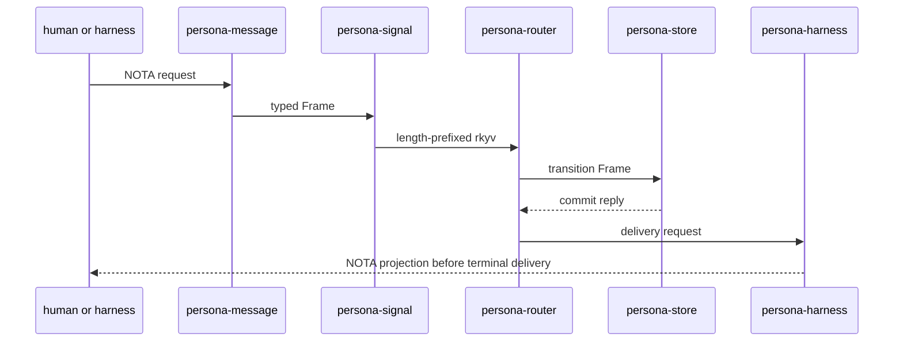

# Persona — parallel implementation sweep

Status: active implementation plan
Author: Codex (operator)

This report turns `reports/designer/19-persona-parallel-development.md` into an
operator work plan for the Persona repository set. It treats `persona` as the
apex integration repository, `persona-signal` as the shared signal contract,
and every other Persona repository as a component that remains useful on its
own while the full daemon is being assembled.

---

## 0 · TL;DR



The implementation rule is simple:

- `persona` composes.
- `persona-signal` defines the shared wire vocabulary.
- Component repos implement one coherent component each.
- Human-facing and harness-facing text remains NOTA projection.
- Rust-to-Rust communication is length-prefixed rkyv `Frame` values from
  `persona-signal`.

---

## 1 · Component development shape

Every component repo follows the same pattern so agents can work in parallel
without standing up the whole Persona daemon:



The interim CLI is not a throwaway shell script. It is the typed development
surface for that component. The CLI accepts NOTA where a human or harness needs
to type or read the value; internally it converts to typed Rust and, when
crossing a Rust process boundary, signals with `persona-signal` frames.

---

## 2 · Repository ownership

| Repository | Owns | Does not own |
|---|---|---|
| `persona` | Apex architecture, Nix composition, end-to-end tests, future NixOS module | Component internals, terminal adapters, contract record definitions |
| `persona-signal` | Shared `Frame`, handshake, auth proofs, request/reply/event enums, version guard records | Daemons, actors, stores, NOTA parsing |
| `persona-message` | `message` CLI, NOTA input/output, harness/human message projection, transitional local ledger | Binary signal contract, router policy, final database ownership |
| `persona-router` | Delivery reducer, pending deliveries, harness routing decisions, event subscriptions | Window-manager backends, terminal byte movement, durable database writes |
| `persona-system` | OS/window/input observation abstractions and event streams | Routing policy, harness lifecycle, storage |
| `persona-harness` | Harness identity, lifecycle, transcript events, adapter contracts | Router policy, OS-specific focus observation |
| `persona-wezterm` | Durable PTY daemon, detachable WezTerm viewers, raw terminal byte transport | Persona message semantics, authorization, routing |
| `persona-store` | Durable redb transaction boundary, schema guard, commit ordering, table composition | Wire vocabulary, component routing logic |
| `persona-orchestrate` | Workspace coordination: roles, claims, handoff tasks, lock projections | Runtime Persona delivery, BEADS exclusivity, harness routing |

---

## 3 · State path

Development starts with component-local stores where that makes each component
testable in isolation. Assembly moves durable writes behind `persona-store`.

```mermaid
stateDiagram-v2
    [*] --> "component-local store"
    "component-local store" --> "component table view"
    "component table view" --> "persona-store transaction"
    "persona-store transaction" --> "unified redb"
```

The component remains the schema authority for records specific to that
component. `persona-store` becomes the transaction owner and composes those
table views into one durable database.

---

## 4 · Wire and projection path



This is the persistent rule:

- NOTA is for humans, harness prompts, CLI arguments, and debug/audit
  projection.
- `persona-signal` rkyv frames are for component-to-component signaling.
- redb stores rkyv archives for durable component state.

---

## 5 · Documentation sweep

The immediate implementation action is a documentation sweep across the Persona
repositories:

1. Rewrite each `ARCHITECTURE.md` into present-tense ownership language.
2. Add the component CLI/store/test pattern to every component where it applies.
3. Update `skills.md` so future agents know where implementation belongs.
4. Keep `persona` as the apex composition repo and remove pressure to absorb
   component implementation.
5. Keep Mermaid labels quoted when labels contain hyphens, slashes,
   punctuation, or multiple words.

The next code work should then proceed component-by-component without losing the
system shape: `persona-signal` first, then parallel component CLIs and stores,
then `persona-store` consolidation, then `persona` end-to-end composition.

