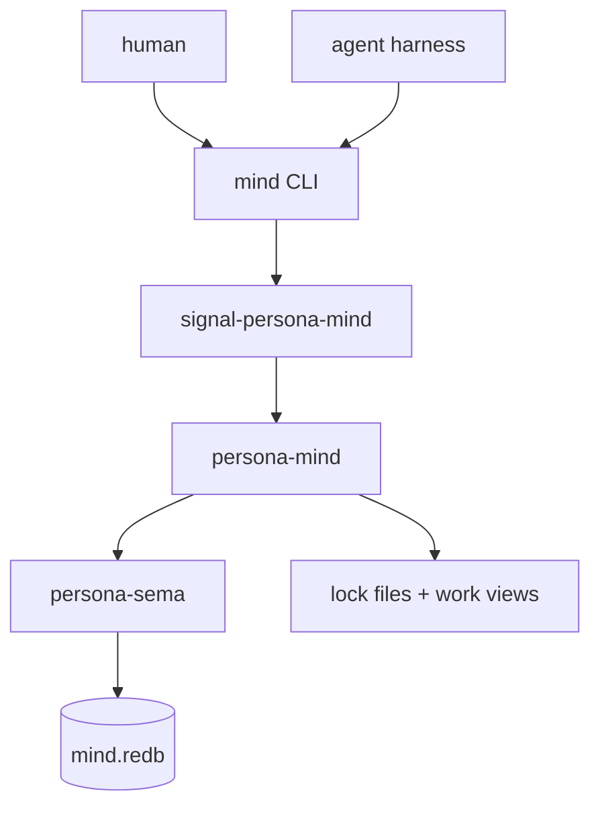
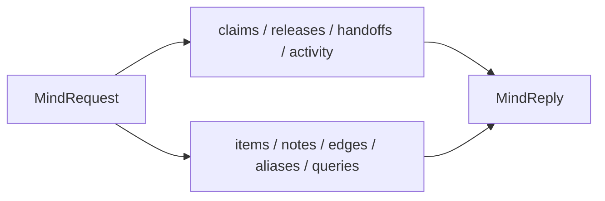
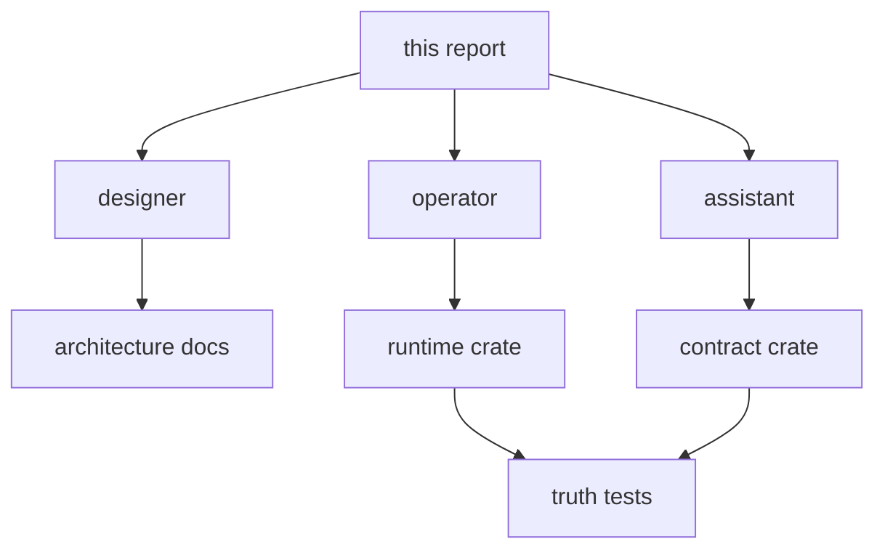

# Persona Mind Central Rename Plan

## Decision

The central state component is **`persona-mind`**.

The old split between a coordination component and a separate work graph
component is no longer the active architecture. Persona's heart owns the
living state of the system: claims, handoffs, activity, tasks, notes,
dependencies, decisions, aliases, and ready-work views.

## Why

`persona-mind` is a better noun than a narrow coordination term because the
component is not only scheduling file ownership. It is the place where
Persona remembers what agents are doing, what work exists, how work depends
on other work, and what should be attended to next.

The component boundary now reads:

| Component | Owns |
|---|---|
| `persona-mind` | central state machine: claims, handoffs, activity, memory/work graph, ready-work queries |
| `persona-router` | message transport and delivery scheduling |
| `persona-harness` | harness lifecycle and harness-side delivery |
| `persona-system` | OS/window/focus/input observations |
| `persona-sema` | typed database library layer |

The previous work-graph split was too bounded-context-heavy for the shape the
user wants. Work tracking is not a sibling of the central state machine; it
is one of the mind's domains.

## Rename Map

| Retired name | Active name |
|---|---|
| former coordination runtime repo | `persona-mind` |
| former coordination signal contract repo | `signal-persona-mind` |
| former work runtime repo | folded into `persona-mind` |
| former work signal contract repo | folded into `signal-persona-mind` |
| former coordination database | `mind.redb` |
| former coordination state type | `MindState` |
| former coordination request enum | `MindRequest` |
| former coordination reply enum | `MindReply` |

The compatibility shell helper remains `tools/orchestrate` for now because
agents already call it. It becomes a shim over the `mind` binary later. That
helper name is a transitional user command, not the component identity.

## Signal Contract Shape

The single central contract must include both coordination and work/memory
operations. Agents should not create a second work contract.

The first migration should preserve the typed shapes already prototyped:

| Domain | Keep |
|---|---|
| coordination | role names, scope references, path validation, task tokens, activity records |
| memory/work | item, note, edge, event, alias, query, view |
| storage | append-event first; projections derive current views |
| tests | behavioral truth tests that prove the component actually opens items, links dependencies, resolves aliases, and rejects unknown items |

## Repository Actions

1. Rename the central runtime repo to `persona-mind`.
2. Rename the central contract repo to `signal-persona-mind`.
3. Move the useful work-graph records/tests into the mind contract/runtime.
4. Delete or archive the redundant work repos after their useful content has
   landed in mind.
5. Update the apex `persona` repo so `persona-mind` is the central component.
6. Update primary workspace docs and active skills so future agents stop
   recreating the old split.

## Edit Priority

The first editing wave should hit high-signal truth files only:

| Location | Change |
|---|---|
| `protocols/orchestration.md` | target implementation is `persona-mind` + `signal-persona-mind`; BEADS replacement is mind memory graph |
| `AGENTS.md` | BEADS transitional paragraph points to mind, not separate work repos |
| `repos/persona/ARCHITECTURE.md` | make `persona-mind` the central component |
| central runtime architecture | rename to `persona-mind`; add memory/work ownership |
| central contract architecture | rename to `signal-persona-mind`; add memory/work vocabulary |
| work runtime + contract repos | mark redundant and migrate useful tests/records |

Older reports are historical and should not be bulk-edited unless they are
still used as live instructions. New reports should cite this report when
they need the current truth.

## Architectural Truth Tests Needed

The renamed component is not done until tests prove the main function:

| Test | Failure caught |
|---|---|
| claim writes durable state and regenerates lock projection | direct lock-file mutation bypass |
| open item appends event and creates item projection | fake "done" scaffold that rejects all work |
| dependency edge changes ready/blocked query | graph exists but does not drive attention |
| alias resolves imported task identity | imported BEADS identity lost |
| report reference is an external edge | reports accidentally become fake item kinds |
| activity time is store-stamped | agents invent timestamps |
| unknown item rejects mutation/query | silent creation or stringly fallback |

These are agent-facing tests: they intentionally look like tests for whether
the implementation is telling the truth about its architecture.

## Parallel Editing Guidance

Use the orchestration protocol before editing shared files. Claims should be
repo- or file-scoped. Reports remain role-owned and do not need claims.

## Open Decisions

| Decision | Current lean |
|---|---|
| CLI binary name | `mind` as canonical; `tools/orchestrate` remains compatibility shim |
| Database path | `mind.redb`; exact filesystem location still open |
| Work repo deletion timing | after useful records/tests are migrated |
| Contract enum names | `MindRequest` / `MindReply` |
