# 101. Persona-mind full architecture proposal

## 1. Thesis

`persona-mind` should be Persona's central state component. It is not a
generic database, not a router, not a terminal controller, and not a
replacement for the signal contracts. It is the stateful actor tree that owns
the workspace coordination truth:

- role claims and releases
- handoffs
- activity logs
- work and memory graph items
- notes
- dependencies
- decisions
- aliases for imported or external identities
- ready-work views
- compatibility projections such as `<role>.lock`

The short version:

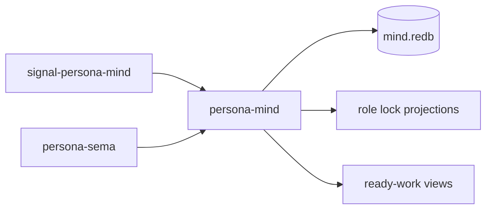

`signal-persona-mind` is the wire vocabulary. `persona-sema` is the typed
database library. `persona-mind` owns one database file through that library
and applies the contract as ordered state transitions.

## 2. Current Ground Truth

The current implementation already has the right direction but is still a
partial scaffold.

| Area | Current state | Target state |
|---|---|---|
| Contract | `signal-persona-mind` defines `MindRequest` and `MindReply` variants for role, activity, and memory/work operations. | Keep this as the only public protocol for mind operations. Extend only when a state transition cannot be expressed honestly. |
| Claims | `persona-mind` has in-memory claim scope logic and overlap tests. | Persist claims in `mind.redb`, with one writer actor deciding conflicts atomically. |
| Memory/work graph | `persona-mind` has an in-memory reducer with tests for open, note, link, status, alias, ready, blocked, and query behavior. | Preserve reducer semantics, but store items, edges, notes, aliases, and events in sema-backed tables. |
| Activity | Contract exists. | Implement as store-stamped append-only activity records. |
| CLI | Architecture names `mind` as one NOTA argv record to one NOTA reply. | Keep that. The CLI should translate text into a typed signal request, then submit to the same actor path used by any host. |
| Legacy coordination | `<role>.lock` files and BEADS exist today. | Make lock files projections from `mind.redb`. Treat BEADS as transitional import input, not a live dependency. |

## 3. Component Boundary

`persona-mind` owns coordination state. Other Persona components must not
write that state directly.

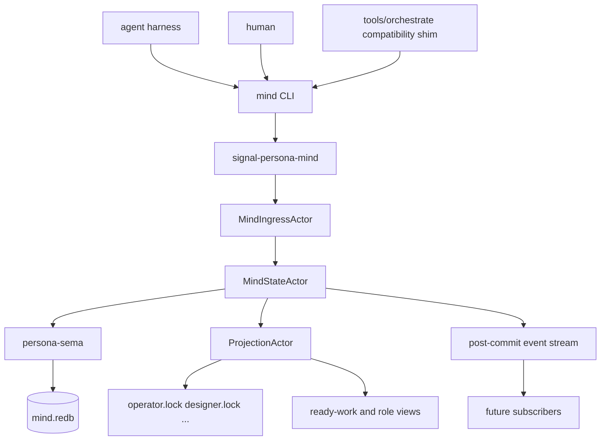

The important invariant is one state owner:

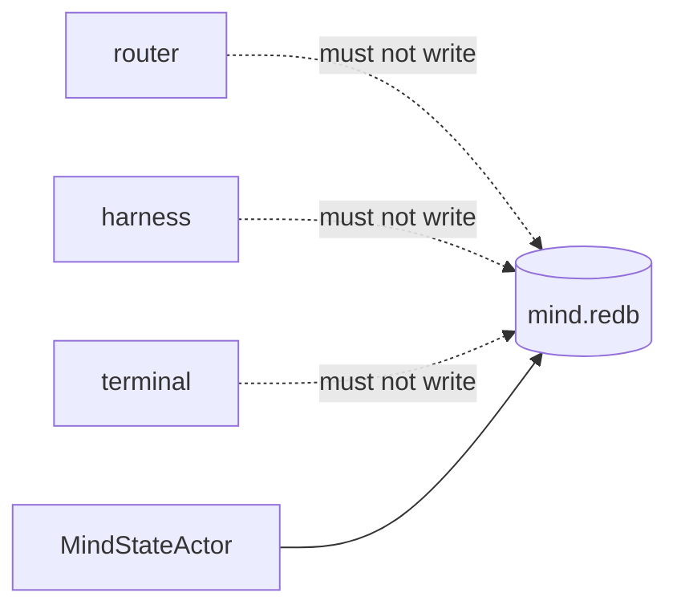

The router may route Persona messages. The harness may inject or observe a
terminal. The terminal layer may own pane/session handles. None of those
components owns role claims, handoffs, memory items, or work dependencies.

## 4. Actor Tree

Every runtime form should use the same actor structure. For the first working
stack, the `mind` CLI can start the actors in-process for a single request. A
long-lived host can reuse the same actor tree later when post-commit
subscriptions become necessary.

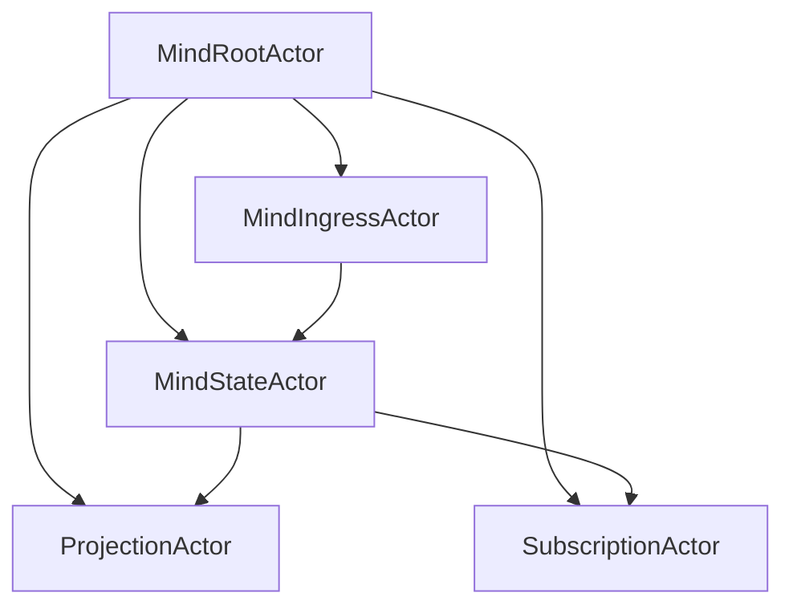

| Actor | Owns | Does not own |
|---|---|---|
| `MindRootActor` | Actor startup, shutdown, handles, configuration. | State transitions. |
| `MindIngressActor` | Decoded request intake, caller identity envelope, reply correlation. | Database writes. |
| `MindStateActor` | The sema database handle, transaction order, reducers, store-stamped IDs and time. | Terminal focus, router delivery, process management. |
| `ProjectionActor` | Post-commit lock-file and view-file projections. | Authoritative state. |
| `SubscriptionActor` | Push notifications after commit. | Polling, speculative reads before commit. |

Only `MindStateActor` opens write transactions. This makes claim conflicts,
handoffs, item status changes, and dependency updates serial and auditable.

## 5. Signal Boundary

All public operations enter through `signal-persona-mind`.

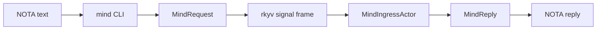

The CLI is a convenience layer. It must not become a second command language.
Human and agent-facing text is NOTA. Internally, requests and replies are typed
signal records serialized with rkyv where a wire boundary exists.

The contract should remain domain-shaped, not database-shaped. Good examples:

- `RoleClaim`
- `RoleRelease`
- `RoleHandoff`
- `ActivitySubmission`
- `Open`
- `AddNote`
- `Link`
- `ChangeStatus`
- `AddAlias`
- `Query`

Bad examples:

- `InsertRow`
- `UpdateTable`
- `StoreMessage`
- `RawMutation`

Mind accepts intent. It decides the storage mutation.

## 6. Storage Model

`persona-mind` owns one sema-backed redb file:

```text
mind.redb
```

The file should live in a workspace-local state directory at first, because
Persona coordination is workspace-scoped today. A system-level Persona OS
deployment can later move the location behind configuration without changing
the contract.

Recommended tables:

| Table | Purpose |
|---|---|
| `CLAIMS` | Current active role claims. |
| `HANDOFFS` | Pending and completed handoffs. |
| `ACTIVITIES` | Store-stamped activity log. |
| `ITEMS` | Work, memory, decision, and issue items. |
| `EDGES` | Typed dependencies and references between items or external targets. |
| `NOTES` | Notes attached to items. |
| `ALIASES` | External identifiers such as imported BEADS IDs. |
| `EVENTS` | Append-only event log for every state mutation. |
| `META` | Schema version, store identity, migration marker. |

The event log is the audit trail. The tables are projections optimized for
current-state queries.

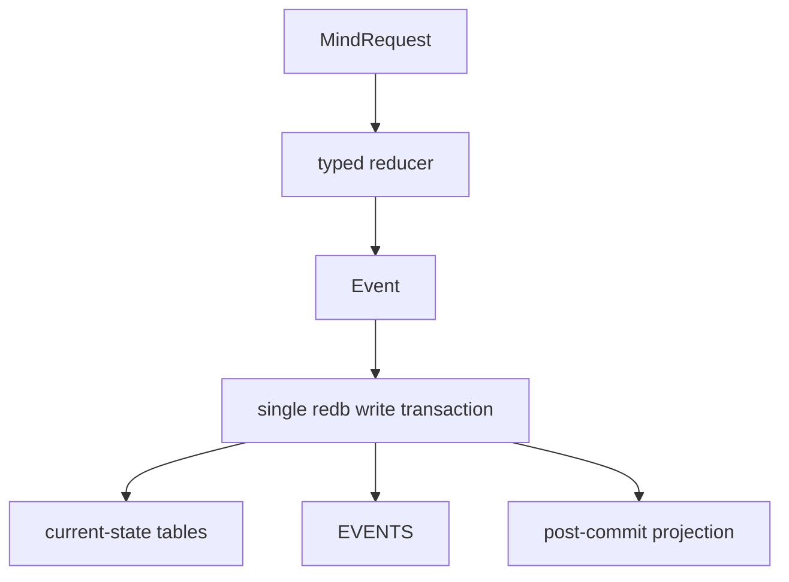

Store-minted data:

- activity timestamps
- event sequence
- operation IDs
- item IDs
- display IDs
- imported-alias records

Agent-minted data should be treated as user content, not authority. This is
especially important for IDs and timestamps.

## 7. Claim And Handoff Semantics

Role claims are the replacement for ad hoc lock editing. The lock files remain
visible compatibility projections.

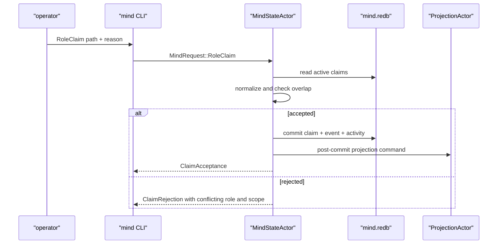

Rules:

- Claims are advisory coordination state, but the workspace treats them as a
  hard social protocol.
- Path claims must be normalized by `persona-mind`, not trusted from callers.
- Parent/child overlap is a conflict across roles.
- Redundant child claims under the same role collapse into the parent claim.
- A handoff is not a release plus a claim. It is a typed transition with one
  event that preserves provenance.
- Lock projection failure is not allowed to silently hide a successful claim.
  The reply must surface projection status or the projection actor must retry
  by push-driven scheduling.

## 8. Activity Semantics

Activity is not chat history. It is a typed operational log.

Examples:

- role claimed a scope
- role released a scope
- role created a work item
- role linked a dependency
- role added a note
- role changed item status
- role imported a BEADS task

The caller can submit activity content, but the store supplies time and slot.

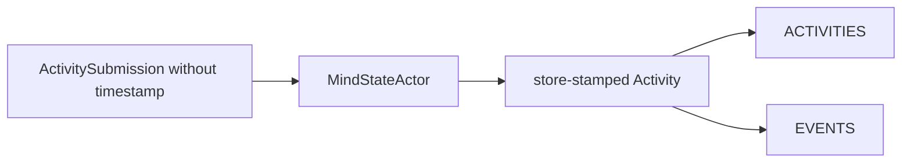

Open design issue: current memory mutations need a reliable actor identity.
The clean solution is a common request envelope:

```text
MindEnvelope {
    actor,
    request,
}
```

If the CLI derives actor identity from the role configuration, the actor field
must still enter the typed state transition before persistence. Otherwise
memory/work events cannot be audited correctly.

## 9. Memory And Work Graph

The folded `persona-work` concept belongs inside mind. Work is not separate
from memory; it is a graph of things the Persona knows, intends, blocks on, or
has decided.

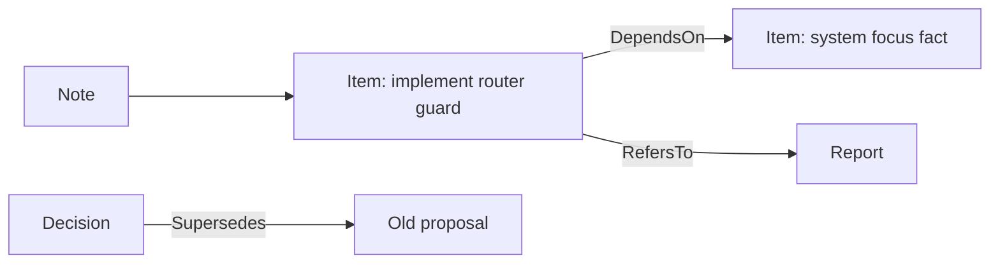

Core item kinds:

- task
- issue
- decision
- note-backed memory
- imported external item
- report reference

Core edge kinds:

- depends on
- blocks
- refers to
- supersedes
- duplicates
- follows up

The current in-memory `MemoryState` already proves the basic reducer shape:

- open item
- attach note
- link dependency
- change status
- add alias
- query ready work
- query blocked work
- resolve imported BEADS alias

The next step is not to redesign those semantics. The next step is to move the
truth from `RefCell<Graph>` into sema-backed tables while preserving the tests.

## 10. BEADS Transition

BEADS is transitional and never a lock.

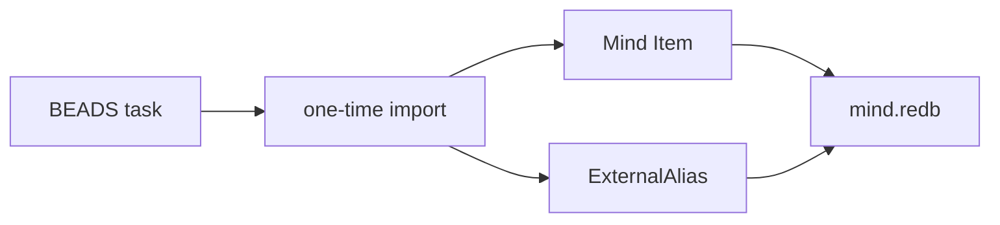

Rules:

- Do not build a live Persona to BEADS bridge.
- Do not deepen BEADS investment.
- Do import BEADS entries when useful.
- Preserve old BEADS IDs as aliases so historical references remain
  searchable.
- New work should be represented as mind items, not BEADS tasks, once the CLI
  is available.

## 11. CLI Shape

The `mind` binary should be boring and strict:

```text
mind '<NOTA record>'
```

It returns exactly one NOTA reply record.

Compatibility tools can remain:

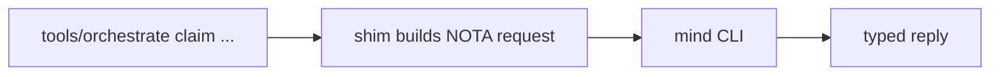

The CLI must not grow flag-shaped alternate semantics. If a convenience command
is needed, it should lower into the same typed request and should be tested as
a projection.

Examples of acceptable CLI responsibilities:

- parse one NOTA request
- decode it into `MindRequest`
- attach configured caller identity
- start or connect to the mind actor tree
- print one `MindReply`

Examples of unacceptable CLI responsibilities:

- directly edit lock files
- directly mutate redb tables
- create untyped JSON/TOML/YAML side channels for operations
- generate authoritative timestamps or IDs

## 12. Rust Module Shape

Recommended crate layout:

```text
persona-mind/
  src/
    lib.rs
    main.rs
    actor.rs
    service.rs
    state.rs
    store.rs
    tables.rs
    claim.rs
    activity.rs
    memory.rs
    projection.rs
    config.rs
```

| Module | Responsibility |
|---|---|
| `actor.rs` | ractor actor definitions and messages. |
| `service.rs` | Data-bearing service object used by CLI and tests. |
| `state.rs` | `MindState` object that owns reducers and store access. |
| `store.rs` | Sema-backed persistence wrapper. |
| `tables.rs` | Typed table definitions and migration/version checks. |
| `claim.rs` | Claim normalization and conflict reducer. |
| `activity.rs` | Activity append reducer. |
| `memory.rs` | Item/edge/note/alias reducer. |
| `projection.rs` | Lock-file and read-view projection writer. |
| `config.rs` | Workspace-local paths and caller identity configuration. |

The style constraint is important: reducers should be methods on data-bearing
objects. Free functions should be avoided except where Rust traits require
them. Zero-sized types should not become fake services.

## 13. Test Plan

Persona needs tests that prove architectural behavior, not just local function
behavior.

### 13.1 Contract tests

In `signal-persona-mind`:

- every request variant round-trips through rkyv
- every reply variant round-trips through rkyv
- invalid wire data fails closed
- contract examples remain small enough for agents to read

### 13.2 Reducer tests

In `persona-mind`:

- parent and child claim overlap is detected
- same-role redundant claims collapse
- cross-role overlap rejects
- handoff preserves provenance
- item open creates exactly one event
- dependency controls ready and blocked views
- alias resolves imported identity
- unknown item mutation rejects

### 13.3 Storage truth tests

These are the tests most likely to catch agent slop.

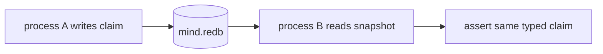

Required cases:

- write in one process, read in another
- event append and projection table update happen in one transaction
- store, not caller, supplies timestamp
- store, not caller, supplies item ID
- failed projection does not erase a committed event

### 13.4 Actor ordering tests

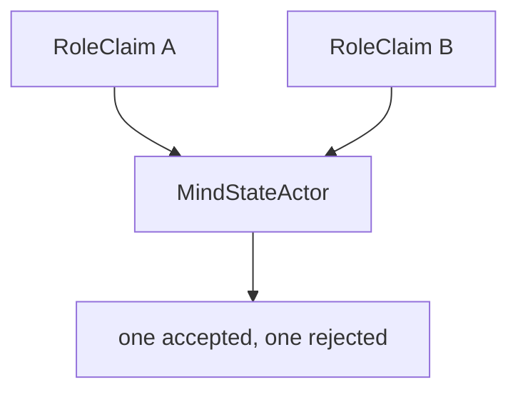

Required cases:

- concurrent overlapping claims produce deterministic conflict results
- non-overlapping claims can both commit
- query after commit sees committed state
- query before commit never observes speculative state

### 13.5 Architecture truth tests

These should look strange to a conventional team, but they are right for an
agent-written codebase:

- `persona-mind` depends on `signal-persona-mind`
- `persona-mind` depends on `persona-sema`
- `persona-mind` does not depend on router, harness, terminal, or WezTerm
- `persona-mind` does not import BEADS as a live backend
- lock files are written only by projection code
- CLI code does not open redb write transactions directly
- no polling loops exist in mind
- every mutation appends an event

## 14. Implementation Phases

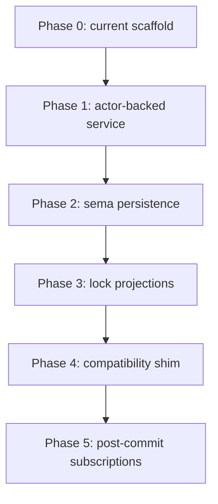

### Phase 0: Current scaffold

Already present:

- signal contract
- claim reducer tests
- memory/work reducer tests
- apex architecture naming mind as central

### Phase 1: Actor-backed service

Add ractor dependency and actor tree.

Deliverables:

- `MindRootActor`
- `MindIngressActor`
- `MindStateActor`
- in-process CLI path using the actor tree
- no persistent daemon required yet

### Phase 2: Sema persistence

Move state truth into sema-backed redb tables.

Deliverables:

- `mind.redb` path config
- typed table setup
- migration/version marker
- persisted claims
- persisted activities
- persisted memory graph
- separate-process storage tests

### Phase 3: Lock projections

Generate compatibility files from committed state.

Deliverables:

- projection actor
- `<role>.lock` writer
- projection failure behavior
- tests proving manual lock-file edits are not authoritative

### Phase 4: Compatibility shim

Rewrite `tools/orchestrate` as a caller of `mind`.

Deliverables:

- claim/release/handoff compatibility
- old orchestration protocol examples updated
- docs stating lock files are projections

### Phase 5: Post-commit subscriptions

Add push-driven change delivery.

Deliverables:

- subscription actor
- no polling
- projection retry triggered by commit or filesystem error recovery event
- future router/system integration points

## 15. Decisions Needed

These are the decisions I would bring back before implementation locks in the
wrong shape.

| Decision | Recommendation | Why |
|---|---|---|
| Database location | Workspace-local state path first. | Current coordination is workspace-scoped and must be easy to inspect. |
| Runtime form | Short-lived actor tree in `mind` CLI first; long-lived host only when subscriptions need it. | Gives actor discipline now without inventing daemon lifecycle too early. |
| Caller identity | Add or confirm a common request envelope carrying actor identity. | Memory/work mutations need accountability. Current reducer uses a placeholder actor. |
| Projection failure reply | Surface projection failure or retry state in typed replies/events. | A committed claim with a failed lock projection must not look fully successful. |
| BEADS import | One-shot import only, with aliases. | Matches the workspace rule that BEADS is transitional. |
| Activity auto-logging | Every state mutation should append an event; user-visible activity may be a selected projection of those events. | Avoids duplicate truth while preserving auditability. |

## 16. Final Shape

When finished, the first usable `persona-mind` stack should make this true:

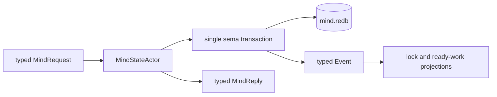

If an agent wants to claim a path, hand off work, record a decision, open a
task, mark work blocked, or query ready work, it goes through mind. The
workspace can then stop treating lock files and BEADS as the coordination
substrate and start treating them as old projections and imported history.

