# 102. Actor-heavy Persona-mind research

## 1. Thesis

Persona should treat actors as a correctness device, not mainly as a
performance device.

Most Rust actor discussions ask: "How much overhead does an actor add?" For
Persona, the more important question is: "Did the author name the logical
phase, isolate its state, give it a typed mailbox, and make it observable?"

That leads to a deliberately actor-heavy design:

- every component has actors
- every internal engine phase has actors
- every actor has a supervised parent
- every actor has a typed mailbox
- every logical operation produces an observable actor trace
- every persistent mutation passes through a store actor
- every query passes through query actors, view actors, and read actors

The conclusion of this research is:

1. Keep `ractor` for the first working stack.
2. Add a `persona-actor` discipline layer on top of it.
3. Do not build a custom runtime yet.
4. Design tests that prove actor usage, not just functional outputs.
5. Revisit runtime replacement only if actor-density exposes a concrete
   missing primitive: virtual actors, deterministic actor scheduler,
   first-class topology dumps, or lower-cost actor-per-phase spawning.

## 2. Why Actor Density

The point is not that every phase needs concurrent execution. The point is
that every phase needs a named owner.

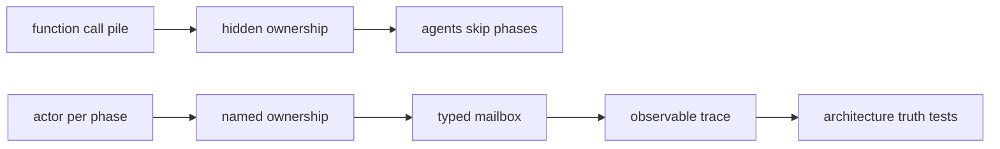

In ordinary human-written code, a team might rely on code review to notice
that a developer bypassed the claim conflict checker. Persona cannot rely on
that. It needs tests that fail when the implementation has the right output
for the wrong architectural reason.

An actor boundary gives us a testable artifact:

| Architectural promise | Actor-shaped test |
|---|---|
| "claims are normalized" | Trace must include `ClaimNormalizeActor`. |
| "conflicts are checked" | Trace must include `ClaimConflictActor` before `SemaWriterActor`. |
| "IDs are store-minted" | Trace must include `IdMintActor`; request content must not carry authority. |
| "time is store-minted" | Trace must include `ClockActor`; caller timestamp is ignored or rejected. |
| "queries do not repair state" | Query trace may include `SemaReadActor`, never `SemaWriterActor`. |
| "no direct database writes" | Only `SemaWriterActor` opens write transactions. |

## 3. Prior Art

### 3.1 Erlang/OTP

Erlang is the clearest precedent for actor abundance. Its documentation says
Erlang processes are lightweight, fast to create and terminate, and scheduled
with low overhead. It also documents a default process limit of 1,048,576
simultaneously alive processes. The important idea is not the exact number.
The important idea is cultural: a process per concern is normal.

OTP supervision trees matter more than raw message passing. The Erlang docs
define workers and supervisors as a hierarchy for fault-tolerant design.
Persona should adopt that mindset: supervisors are not optional decoration.

Lessons:

- actor abundance is a normal design posture
- supervision is part of the design, not an afterthought
- black-box system tests matter
- process aliases are useful for request/reply and timeout cleanup

Sources:

- [Erlang processes](https://www.erlang.org/doc/system/ref_man_processes.html)
- [Erlang system limits](https://www.erlang.org/doc/system/system_limits.html)
- [Erlang/OTP design principles](https://www.erlang.org/docs/27/system/design_principles.html)
- [Erlang Common Test](https://www.erlang.org/doc/apps/common_test/basics_chapter)

### 3.2 Akka

Akka makes hierarchy central. Its guide says actors are organized into a
tree-like hierarchy and the parent supervises children. Akka supervision
offers the classical decision set: resume, restart, stop, or escalate.

Persona should copy the mental model, not the JVM stack:

- actor creation implies parent ownership
- child death is never silent
- restart/stop/escalate policy is part of actor design
- a root tree should be inspectable

Sources:

- [Akka actor model](https://doc.akka.io/libraries/guide/concepts/akka-actor.html)
- [Akka supervision](https://doc.akka.io/libraries/akka-core/current/supervision-classic.html)

### 3.3 Orleans

Orleans contributes the virtual actor idea. A grain is a virtual actor with a
stable identity; it is addressable even when not currently activated. That is
close to what Persona may want for work items, roles, and harnesses.

Persona does not need Orleans today, but it should steal this shape:

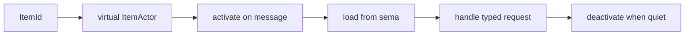

This could let mind treat every work item as an actor without keeping every
item actor resident forever.

Sources:

- [Microsoft Orleans overview](https://learn.microsoft.com/en-us/dotnet/orleans/overview)
- [Microsoft Research Orleans](https://www.microsoft.com/en-us/research/project/orleans-virtual-actors/)

### 3.4 Pony

Pony is relevant because it shows the extreme end of "actor model as language
discipline." Pony advertises no locks or atomics at the user level, with the
type system enforcing data-race freedom.

Persona cannot get Pony's capability type system in Rust for free, but it can
copy the rule: no shared mutable state between actors. If an actor needs a
fact, it asks the actor that owns that fact.

Source:

- [Pony language](https://www.ponylang.io/)

### 3.5 Actor Testing Prior Art

CAF has a deterministic test coordinator so unit tests can control dispatch
and timeouts. Setac controls actor schedules by marking messages relevant to
the test. Shuttle and Loom show the Rust-side shape for controlled
concurrency exploration. Turmoil shows deterministic single-process testing
for distributed systems with simulated hosts, time, and network.

Persona should not wait for a perfect off-the-shelf actor tester. It should
create a small test harness around the actor trace.

Sources:

- [CAF deterministic testing](https://actor-framework.readthedocs.io/en/0.18.1/Testing.html)
- [Setac actor testing](https://mir.cs.illinois.edu/setak/setac.html)
- [Loom](https://docs.rs/loom/latest/loom/)
- [Shuttle](https://docs.rs/shuttle/latest/shuttle/)
- [Turmoil](https://tokio.rs/blog/2023-01-03-announcing-turmoil)

## 4. Rust Actor-System Survey

This is the broad Rust actor-system pass. It separates the frameworks that
could influence Persona from smaller or lower-signal crates that do not
currently change the recommendation.

| System | Strength | Concern | Persona fit |
|---|---|---|---|
| `ractor` | OTP-inspired, pure Rust, supervision, monitors, typed messages, RPC reply ports. | No built-in deterministic actor scheduler or first-class architecture trace. | Best current base. Add Persona discipline layer. |
| `kameo` | Tokio-native, lifecycle hooks, bounded mailboxes, supervision, remote actor refs. | Younger API surface; would require migration; less aligned with existing lore. | Worth tracking. Not a reason to switch now. |
| `coerce` | Distributed actors, persistence, clustering, sharding, metrics. | Too much built-in distributed machinery for our signal/sema separation. | Study for clustering and metrics, not as first stack base. |
| `dactor` | Framework-agnostic traits, adapters for `ractor` and `kameo`, deterministic `Clock`, remote abstractions. | New and broad; could duplicate our signal contracts if adopted carelessly. | Strong inspiration for `persona-actor`; possible future abstraction layer. |
| `actix` | Mature, typed messages, async and sync actors, supervision, Tokio. | Ecosystem gravity is web; actor framework is older shape. | Stable fallback, not the best match. |
| `xtra` | Tiny, fast, safe. | Too minimal for supervision-heavy architecture. | Good reference for small API, not enough for mind. |
| `heph` | Actor kinds for thread-local, thread-safe, and sync actors; performance-aware. | Lower-level and different runtime posture. | Interesting for future system/runtime layer, not first stack. |
| `elfo` | Topology, tracing, dumping, actor groups. | Larger framework and less aligned with current code. | Study for topology dumps and observability. |
| `stakker` | Extremely lightweight, method-addressed actors, compile-time checked calls, low overhead. | Single-threaded low-level runtime, custom event-loop integration. | Useful inspiration if actor count overhead becomes real. |
| `bastion` | Fault-tolerant runtime, dynamic supervision, cluster features. | Custom runtime and older ecosystem fit. | Too foreign for first stack. |
| `riker` | Akka-like hierarchy, supervision, event sourcing language. | Pre-1.0 and older. | Historical reference only. |
| `act-zero` | Ergonomic method-call actors, executor agnostic. | Does not foreground supervision/topology enough for us. | Ergonomics reference only. |
| `zestors` | Flexible, fault-tolerance goal, strongly typed intent. | Supervision/distribution not implemented in current docs. | Not a candidate now. |
| `pptr` | Composable actor-like API. | Too small and young for central Persona infrastructure. | Watch only. |
| `thespian` | Erlang-inspired process/supervisor wording. | Basic package, docs name TODO ergonomics. | Not a candidate now. |
| `thespis` | Interface traits for actor addresses and handlers. | More interface than runtime for our needs. | Not a candidate now. |
| `act_rs` | Minimal actor framework. | Too minimal for our supervision/testing goals. | Not a candidate now. |
| `actors-rs` | Actor-system crate. | Low signal in available docs. | Not a candidate now. |
| `puppet` | Actor-oriented crate family. | Low signal in available docs. | Not a candidate now. |

Sources:

- [`ractor` docs](https://docs.rs/ractor/latest/ractor/)
- [`kameo` actor docs](https://docs.rs/kameo/latest/kameo/actor/index.html)
- [`coerce` docs](https://docs.rs/coerce/latest/coerce/)
- [`dactor` docs](https://docs.rs/dactor)
- [`actix` README](https://github.com/actix/actix)
- [`xtra` docs](https://docs.rs/xtra/latest/xtra/)
- [`heph` actor docs](https://docs.rs/heph/latest/heph/actor/index.html)
- [`elfo` docs](https://docs.rs/elfo/latest/elfo/)
- [`stakker` docs](https://docs.rs/stakker/latest/stakker/)
- [`bastion` docs](https://docs.rs/bastion/latest/bastion/)
- [`riker` docs](https://riker.rs/)
- [`act-zero` docs](https://docs.rs/act-zero/latest/act_zero/)
- [`zestors` docs](https://docs.rs/zestors/latest/zestors/)
- [`pptr` docs](https://docs.rs/pptr/latest/pptr/)
- [`thespian` docs](https://docs.rs/thespian/latest/thespian/)
- [`thespis` docs](https://docs.rs/thespis)
- [`act_rs` docs](https://docs.rs/act_rs/latest/act_rs/)
- [`actors-rs` docs](https://docs.rs/actors-rs/latest/actors_rs/)
- [`puppet` docs](https://docs.rs/puppet/latest/puppet/)

## 5. Evaluation Against Persona's Extreme Needs

Persona's actor system needs are unusual:

| Need | Why Persona needs it |
|---|---|
| Actor per logical phase | Forces agents to name and isolate every step. |
| Actor topology introspection | Lets tests prove the tree exists. |
| Per-operation traces | Lets tests prove the right actors handled a request. |
| Typed actor messages | Keeps signal contracts meaningful inside the runtime. |
| Strict write ownership | Prevents random components from mutating `mind.redb`. |
| Deterministic actor tests | Reproduces race and ordering bugs. |
| Supervisor policies | Makes failure behavior explicit. |
| Virtual actors | Lets every role, item, harness, and query have identity without permanent residency. |
| Push-only notifications | Matches workspace no-polling rule. |

Current `ractor` covers:

- typed messages
- actor refs
- supervision links
- monitors
- RPC reply ports
- named actors
- async runtime compatibility

Current `ractor` does not directly cover:

- declarative topology manifest
- required actor trace emission
- deterministic actor scheduler
- virtual actor activation
- architecture truth testing
- "actor per phase" enforcement

That gap is not enough to switch frameworks now. Most Rust actor systems also
do not provide those Persona-specific discipline tools. The right move is to
build a thin `persona-actor` layer above `ractor`.

## 6. Proposed Persona Actor Layer

`persona-actor` should not be a new runtime at first. It should be a discipline
crate.

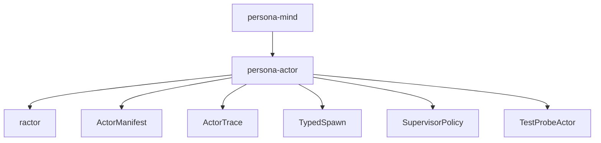

Core types:

| Type | Purpose |
|---|---|
| `ActorManifest` | Declares expected supervisors, child actors, actor kinds, and allowed message edges. |
| `ActorKind` | Stable typed identity for an actor class: claim normalizer, query planner, sema writer, etc. |
| `ActorPath` | Typed runtime path, not a raw string. |
| `SpawnPlan` | Data-bearing plan for creating a child actor under a supervisor. |
| `ActorTrace` | Append-only test/debug trace of actor lifecycle and message handling. |
| `TraceProbe` | Test actor that receives trace events. |
| `SupervisorPolicy` | Restart, stop, escalate, or ignore rules as typed data. |
| `MessageEdge` | Allowed sender -> receiver -> message-kind relation. |

The layer should wrap `ractor::Actor::spawn_linked` so every actor spawn is
registered and traced.

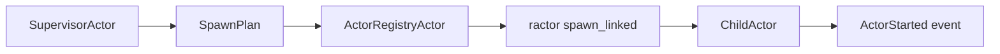

No one should call raw `spawn_linked` except the wrapper.

## 7. Actor-Heavy Mind Runtime

The mind runtime should be comfortable with hundreds of actors.

```mermaid
flowchart TB
    root["MindRootActor"]
    root --> registry["ActorRegistryActor"]
    root --> ingress["IngressSupervisorActor"]
    root --> dispatch["DispatchSupervisorActor"]
    root --> domain["DomainSupervisorActor"]
    root --> store["StoreSupervisorActor"]
    root --> views["ViewSupervisorActor"]
    root --> subscriptions["SubscriptionSupervisorActor"]
    root --> replies["ReplySupervisorActor"]
    root --> probes["TraceProbeSupervisorActor"]

    ingress --> session_pool["RequestSessionPoolActor"]
    session_pool --> session_a["RequestSessionActor A"]
    session_pool --> session_b["RequestSessionActor B"]
    session_pool --> session_c["RequestSessionActor C"]

    domain --> claims["ClaimSupervisorActor"]
    claims --> normalize["ClaimNormalizeActor"]
    claims --> conflict["ClaimConflictActor"]
    claims --> collapse["ClaimCollapseActor"]

    domain --> graph["MemoryGraphSupervisorActor"]
    graph --> item_open["ItemOpenActor"]
    graph --> link["LinkActor"]
    graph --> status["StatusChangeActor"]
    graph --> alias["AliasActor"]
    graph --> note["NoteActor"]

    domain --> query["QuerySupervisorActor"]
    query --> plan["QueryPlanActor"]
    query --> traverse["GraphTraversalActor"]
    query --> explain["BlockerExplainActor"]
    query --> shape["QueryResultShapeActor"]

    store --> writer["SemaWriterActor"]
    store --> reader_pool["SemaReaderPoolActor"]
    store --> ids["IdMintActor"]
    store --> clock["ClockActor"]
    store --> event_append["EventAppendActor"]
    store --> commit["CommitActor"]

    views --> role_view["RoleSnapshotViewActor"]
    views --> ready_view["ReadyWorkViewActor"]
    views --> blocked_view["BlockedWorkViewActor"]
    views --> activity_view["RecentActivityViewActor"]
```

This graph is intentionally dense. The purpose is to make architectural claims
visible. If an implementation has no `ClaimCollapseActor`, then redundant
claim collapse probably became an unreviewed helper method somewhere.

## 8. Query Trace Example

For a ready-work query, the output is not enough. The test must prove the query
walked through the read-only actor path.

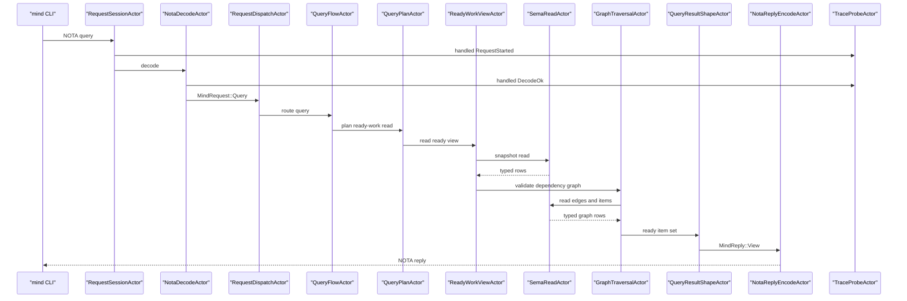

Required negative assertion:

```text
trace must not contain SemaWriterActor
```

## 9. Mutation Trace Example

For an item-open mutation, the test must prove that ID and time are not caller
authority.

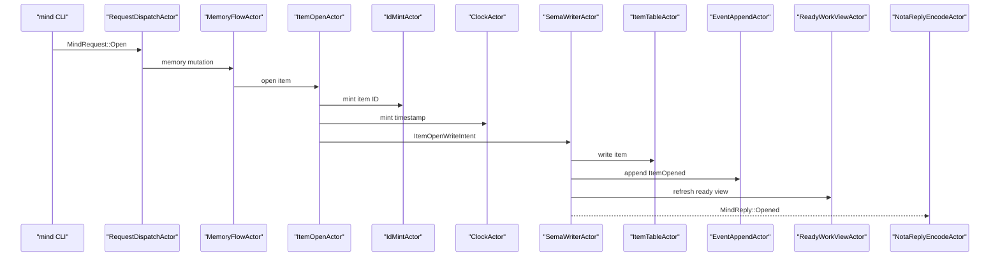

Required negative assertions:

```text
request item ID is ignored or rejected
request timestamp is ignored or rejected
ItemOpenActor does not open a redb write transaction
```

## 10. Testing Strategy

### 10.1 Topology Manifest Test

Every component should have an actor manifest checked in source. The runtime
must expose a topology dump. Tests compare the expected tree against the
running tree.

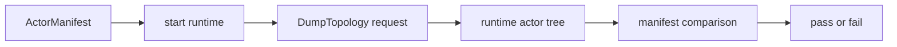

The manifest should be data, not prose. If a report says
`ClaimNormalizeActor` exists but the manifest omits it, the report is not
architecture truth.

### 10.2 Trace Contract Tests

Each `MindRequest` variant gets a required trace pattern.

Example:

```text
RoleClaim:
  RequestSessionActor
  NotaDecodeActor
  CallerIdentityActor
  RequestDispatchActor
  ClaimFlowActor
  ClaimNormalizeActor
  ClaimConflictActor
  SemaWriterActor
  EventAppendActor
  RoleSnapshotViewActor
  NotaReplyEncodeActor
```

Test form:

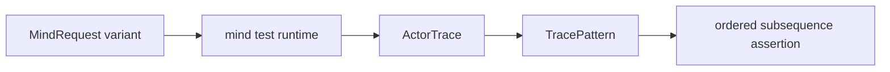

This catches implementations that produce the right reply while bypassing a
required actor.

### 10.3 Forbidden Edge Tests

Some actor edges must never exist:

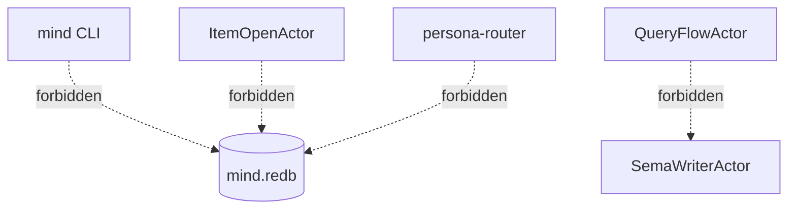

Test form:

- static scan: no imports of redb/sema writer outside store actors
- runtime trace: no forbidden actor edge observed
- compile-time feature: store internals are private to `actors/store.rs`

### 10.4 Failure Injection Tests

Every actor phase gets a failure injection point.

| Inject failure at | Expected behavior |
|---|---|
| `NotaDecodeActor` | typed rejected reply, no domain actor starts |
| `CallerIdentityActor` | typed rejected reply, no store actor starts |
| `ClaimConflictActor` | claim rejection, no writer actor |
| `SemaWriterActor` | mutation fails, event not appended |
| `EventAppendActor` | transaction aborts or explicit failure event policy applies |
| `ReadyWorkViewActor` | commit survives, view retry event emitted |
| `NotaReplyEncodeActor` | operation result already committed, CLI receives typed transport failure |

### 10.5 Deterministic Schedule Tests

`ractor` itself does not give Persona a CAF-style deterministic coordinator.
We should add a test-only runtime layer that records actor steps and lets the
test drive delivery order for pure actor messages.

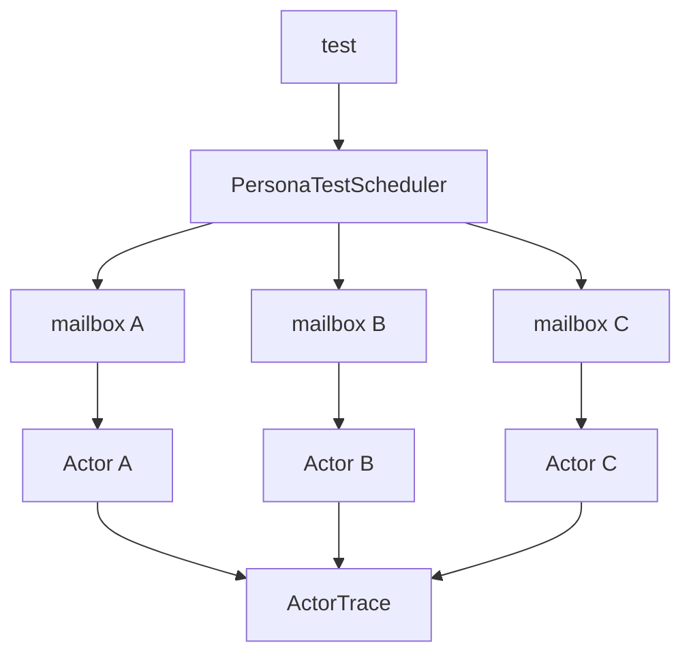

Use layers:

- Loom for low-level synchronization primitives.
- Shuttle for randomized concurrency schedules that are larger than Loom can
  exhaustively explore.
- Turmoil when actor tests cross host/network boundaries.
- PersonaTestScheduler for message-order assertions inside mind.

### 10.6 Linearizability Tests

For concurrent mutations, the committed event log must match some legal serial
order.

Example claim test:

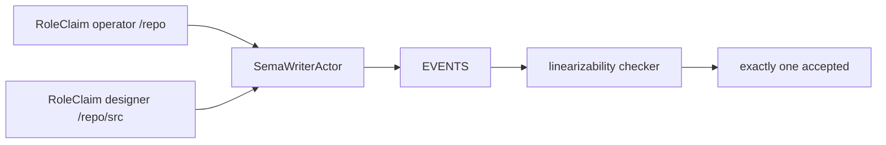

This is especially important because actor-heavy systems can hide ordering
bugs behind "eventual" behavior.

### 10.7 Actor Count And Residency Tests

We should test actor abundance directly.

| Test | Purpose |
|---|---|
| spawn 1,000 short-lived request actors | prove request actors are cheap enough |
| spawn 10,000 virtual item identities with lazy activation | prove identity count does not imply resident count |
| run 100 concurrent queries | prove read actors do not block writer actor |
| fail every child of one supervisor | prove supervisor policy is explicit |
| dump topology under load | prove observability remains available |

The point is not to optimize prematurely. The point is to prevent a future
agent from collapsing actor boundaries because they assumed actor count was
too expensive without evidence.

## 11. Should Persona Switch Away From Ractor

Not now.

`ractor` matches the current lore and is close enough to the Erlang/OTP
mindset. Its limitations are Persona-specific discipline gaps, not runtime
fundamentals.

What we need first is:

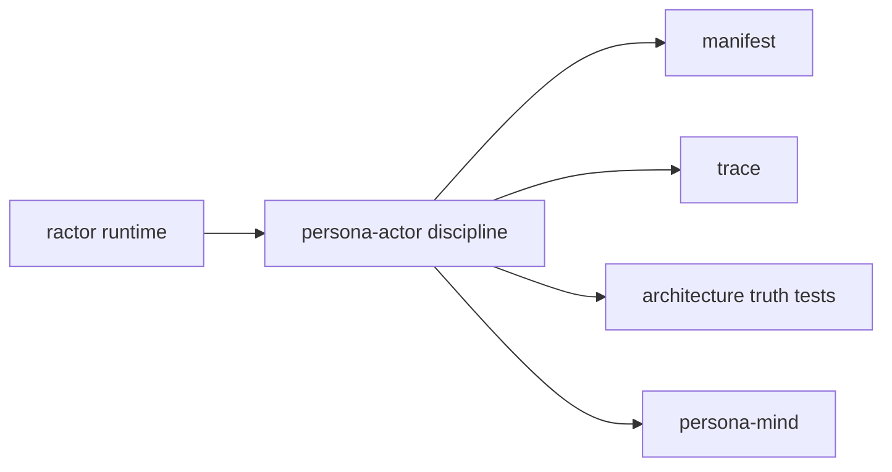

Switch criteria:

| Trigger | Candidate response |
|---|---|
| Actor-per-phase creates intolerable task overhead | Study `stakker` style runtime or custom lightweight scheduler. |
| Virtual actors become central | Add virtual actor layer or study Orleans-like activation in `persona-actor`. |
| Remote actors become immediate | Compare `kameo`, `coerce`, and `dactor` again. |
| Deterministic testing cannot be layered on `ractor` | Prototype custom test runtime for `persona-actor` messages. |
| Topology introspection cannot be made reliable | Wrap all spawns and forbid raw actor spawning. |

## 12. Own Runtime Question

Creating our own full actor runtime is not the first move. Creating our own
actor discipline crate probably is.

The custom runtime becomes justified only if we need these all at once:

- actors as cheap as ordinary queue entries
- deterministic scheduler built in
- virtual activation built in
- typed topology manifest built in
- trace events built in
- no raw spawn API
- no bypass around supervision
- store-aware actor persistence

That would be a real runtime, not a wrapper. It should be called only after
`persona-actor` proves what the missing primitive really is.

## 13. Recommendation

Immediate direction:

1. Keep `ractor` as the runtime.
2. Create `persona-actor` as a small wrapper/discipline crate.
3. Forbid raw `ractor` spawn in Persona components outside `persona-actor`.
4. Add `ActorManifest`, `ActorTrace`, `TraceProbeActor`, and `SpawnPlan`.
5. Add architecture truth tests for `persona-mind`:
   - topology exists
   - query path is read-only
   - mutation path uses ID/time/store actors
   - every request variant emits required trace sequence
   - forbidden edges never appear
6. Revisit runtime replacement only after those tests produce concrete pain.

The core idea: Persona can be actor-heavy today without inventing a runtime
today. The runtime is a mechanism. The discipline is the architecture.
