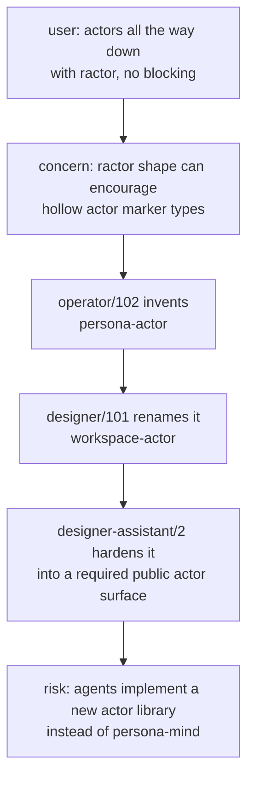
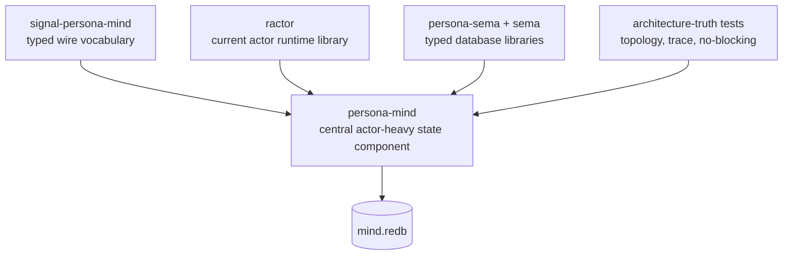
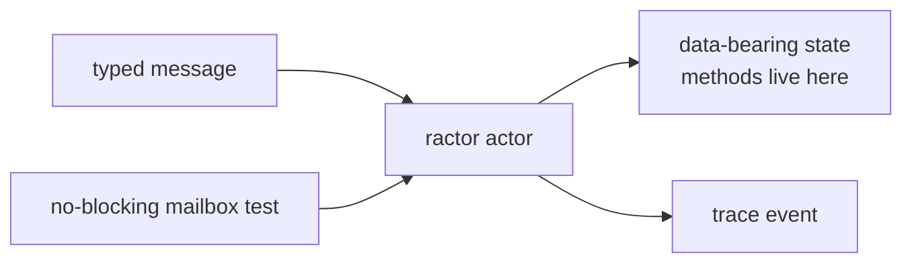
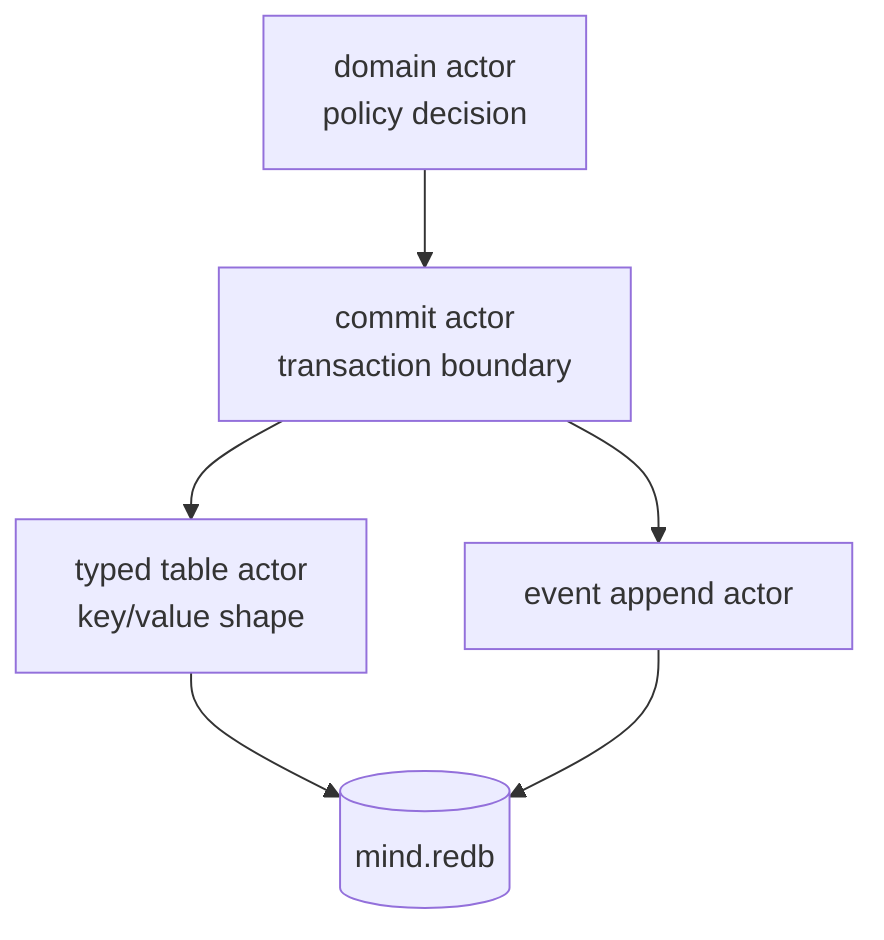

# 103. Actor abstraction drift correction

## 1. Diagnosis

The recent actor-report chain introduced an unapproved abstraction and then
treated it as if it were architecture.

The unapproved abstraction has two names:

- `persona-actor`
- `workspace-actor`

Neither name came from the user. Neither crate exists. Neither is currently
approved as a repository, library, trait, or implementation dependency.

What was approved is narrower and stronger:

- use actors heavily
- use `ractor` as the current Rust actor library
- make every meaningful logical plane actor-shaped
- keep actor communication typed
- supervise actors
- do not hide blocking work inside actors
- do not use shared locks as the real synchronization model
- make actor boundaries testable through topology and trace witnesses

The drift happened when a real concern was over-solved:

The concern is worth remembering. The abstraction is not approved.

## 2. Reports reread

| Report | Inline summary | Current status |
|---|---|---|
| `reports/operator/100-persona-mind-central-rename-plan.md` | Renames orchestrate into mind and makes mind the central coordination/state component. | Keep. Not contaminated by actor-crate naming. |
| `reports/operator/101-persona-mind-full-architecture-proposal.md` | Designs persona-mind as central state plus dense actor tree; includes `SemaWriterActor` / `StoreSupervisorActor` vocabulary. | Mostly keep; needs wording cleanup around generic store actors. |
| `reports/operator/102-actor-heavy-persona-mind-research.md` | Surveys actor systems, recommends `ractor`, then invents `persona-actor` as a wrapper/discipline crate. | Superseded by this correction for implementation planning. Do not implement `persona-actor`. |
| `reports/designer/100-persona-mind-architecture-proposal.md` | Pins details inside operator/101's actor tree: display IDs, sema key shapes, caller identity, DB path, subscription sketch. | Keep with caution; its actor names inherit operator/101's store vocabulary. |
| `reports/designer/101-extreme-actor-system-and-no-zst-actors.md` | Rewritten as `workspace-actor` trait proposal; renames `persona-actor` to workspace scope. | Treat as speculative design only. Do not implement without explicit user approval. |
| `reports/designer-assistant/2-data-bearing-actors-and-persona-actor-audit.md` | Audits ractor's raw API, then endorses `workspace-actor` and forbids direct ractor in Persona-facing crates. | Contaminated by unapproved abstraction. Useful only for its observation that raw ractor's `Self`/`State` split deserves care. |
| `reports/operator-assistant/97-persona-mind-actor-density-compliance-review.md` | Finds current persona-mind/router/message/system code does not yet implement the actor-dense architecture. | Keep. Its recommendation to add `ractor` to persona-mind is closer to approved direction than the later wrapper-crate reports. |
| `reports/designer/92-sema-as-database-library-architecture-revamp.md` | Clarifies sema as a library and rejects shared storage actor / storage namespace patterns. | Keep. This is a guardrail against generic `StoreActor` drift. |

## 3. What remains approved

The corrected implementation truth is:

Approved near-term implementation does **not** require a new actor
abstraction repo. It requires `persona-mind` to become a real `ractor`-based
actor system with structural tests.

## 4. What is explicitly not approved

Do not implement these as next steps:

| Drift | Why it is not approved |
|---|---|
| `persona-actor` crate | Invented in `reports/operator/102-actor-heavy-persona-mind-research.md`; user never requested it. |
| `workspace-actor` crate | Designer rename/expansion of the same invention; user explicitly questioned it. |
| `workspace_actor::Actor` trait | A concrete API proposal, not approved architecture. |
| Ban direct `ractor::Actor` in Persona-facing code | Depends on the unapproved wrapper crate. |
| Build actor wrapper before persona-mind | Inverts the goal. The goal is a working actor-heavy mind, not an actor framework. |
| Treat `persona-actor` → `workspace-actor` as a migration | Both names are speculative; there is no migration target. |

## 5. The real ractor question

The reports did surface a legitimate implementation question:

> How do we use ractor without letting actor code collapse into hollow labels,
> blocking handlers, or hidden service objects?

That question has a simpler first answer than a new actor library:

1. Use `ractor` directly.
2. Give every actor a typed message enum and typed failure surface.
3. Keep real behavior on data-bearing objects: actor `State`, reducer types,
   table adapters, flow state, or domain records.
4. Allow ractor's framework marker shape where it is genuinely the actor
   framework shape. Do not turn it into a namespace for arbitrary helper
   functions.
5. Add tests that prove the actor path was used and the mailbox was not
   blocked.

This preserves the user's stated direction: use ractors, actors everywhere,
no locks, no blocking.

## 6. Store actor wording cleanup

Another older drift remains in the actor reports: generic store-actor
language.

`reports/designer/92-sema-as-database-library-architecture-revamp.md`
already rejects a shared `StorageActor` namespace. The same warning applies
inside persona-mind. `persona-mind` may have actors that own write ordering,
transaction boundaries, table views, ID minting, and event append. It should
not become one generic actor that owns "storing" for everyone.

Safer vocabulary:

| Avoid | Prefer |
|---|---|
| "store actor" | domain commit actor, write-order actor, table actor, event append actor |
| "storage actor owns sema" | the component owns its redb; specific actors own typed state transitions |
| "SemaWriterActor stores everything" | write-order actor serializes commits; domain actors still own policy |
| "StoreSupervisorActor" as a generic namespace | `CommitSupervisorActor`, `TableSupervisorActor`, or explicit domain supervisors if needed |

The implementation invariant is:

No actor should own "storage" in the abstract. Actors own named state
transitions and named tables.

## 7. Corrected implementation direction

Do this first:

1. Update `persona-mind` implementation around direct `ractor`.
2. Add a `src/actors/` tree with a small but real vertical slice.
3. Route one request through the actor path:
   `CliIngressActor -> NotaDecodeActor -> CallerIdentityActor ->
   EnvelopeActor -> RequestDispatchActor -> one domain flow actor ->
   commit/read actors -> NotaReplyEncodeActor`.
4. Keep existing reducers as data-bearing sync facades under actors where
   useful.
5. Add architecture-truth tests before broad feature work:
   - topology includes required actors
   - trace includes required actor sequence
   - query trace excludes write/commit actors
   - mutation trace includes ID/time/commit/event actors
   - actor handler cannot block mailbox
   - no `Arc<Mutex<...>>` state sharing between actors

Do **not** start with:

- a new actor library
- an actor trait repo
- deterministic scheduler
- virtual actor layer
- runtime replacement

Those may become decisions later, but they are not current work.

## 8. Skill/doc cleanup implied

The report chain contaminated a few docs with abstraction-crate language. The
next cleanup pass should remove or soften these claims:

| Path | Cleanup |
|---|---|
| `skills/actor-systems.md` | Keep actor-density, no-blocking, no-locks. Remove implication that a workspace actor trait/adapter crate is expected. |
| `skills/rust-discipline.md` | Keep `ractor` as default and no blocking. Avoid saying ractor must be hidden behind an adapter. |
| `skills/abstractions.md` | Keep "verbs belong to nouns"; remove or soften the ractor-adapter implication. |
| `reports/operator/102-actor-heavy-persona-mind-research.md` | Treat `persona-actor` sections as superseded by this report. |
| `reports/designer/101-extreme-actor-system-and-no-zst-actors.md` | Mark as speculative/unapproved until user explicitly asks for an actor abstraction crate. |
| `reports/designer-assistant/2-data-bearing-actors-and-persona-actor-audit.md` | Mark as contaminated by `workspace-actor` assumption; salvage only ractor API observations. |

## 9. Decision points for the user

These are real decisions; agents should not silently decide them:

| Decision | Default until user decides |
|---|---|
| Should we create a custom actor abstraction crate? | No. |
| Should direct `ractor::Actor` be forbidden? | No. Use ractor directly for now. |
| Must actor framework marker types be non-ZST? | No new hard rule. User previously allowed ZSTs for actors; keep framework-shaped actors acceptable. |
| Should persona-mind wait for a wrapper crate? | No. Start persona-mind with direct ractor and tests. |
| Should Kameo or another actor runtime replace ractor? | No. Revisit only after direct ractor prototype exposes concrete pain. |

## 10. Bottom line

The actor-heavy idea is not contaminated. The invented actor-abstraction crate
is.

Proceed with `ractor` directly. Build the actor-dense `persona-mind` vertical
slice. Prove it with topology, trace, and no-blocking tests. Do not create
`persona-actor`, `workspace-actor`, or any equivalent crate unless the user
explicitly asks for it after seeing the direct-ractor implementation pressure.
