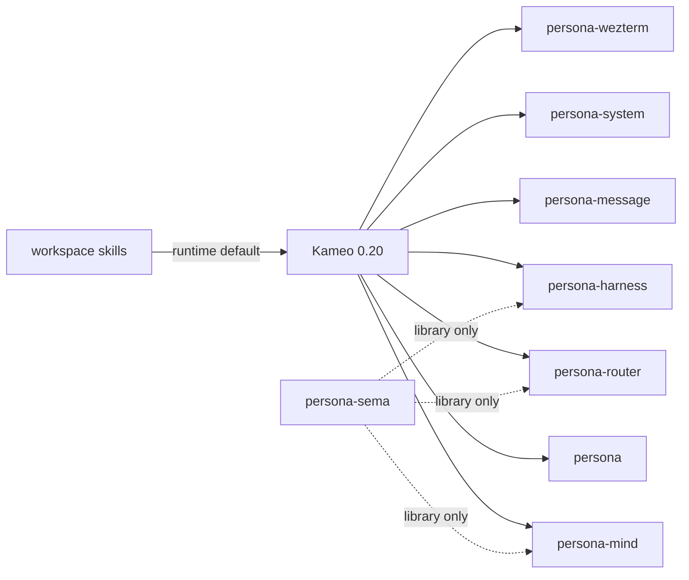
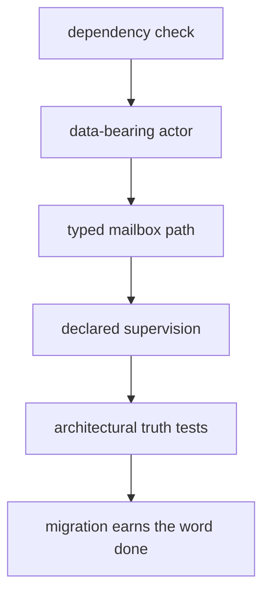
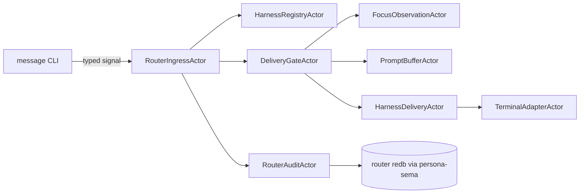

# 104 — Kameo Migration Prognosis

*Operator report. Written before toolchain or flake edits, so the
assistant agents have a shared status view before the next implementation
wave.*

---

## 0 · Prognosis

The Kameo switch is past the risky decision point. The first wave has
landed: the active Persona runtime crates now use direct Kameo actors,
and the workspace skills now name Kameo as the actor runtime.

This does **not** mean Persona is fully actor-dense yet. It means the
runtime substrate is now aligned with the desired style:

- actor structs carry state;
- each message kind has a typed handler;
- local handles wrap `ActorRef<A>` without becoming a second actor layer;
- tests can prove that work crossed an actor mailbox;
- future implementation should create more actors, not larger handlers.

The next wave should be implementation work on top of Kameo, not another
actor-framework debate.

---

## 1 · Current State

| Repository | Status | Meaning |
|---|---|---|
| `persona` | Kameo request path landed | Meta CLI request handling now crosses a Kameo actor. |
| `persona-mind` | Kameo actor tree landed | Central state component has a Kameo root and child actors. |
| `persona-router` | Kameo daemon actor landed | Router state is owned behind a Kameo actor. |
| `persona-message` | Kameo daemon actor landed | Transitional message ledger mutations route through an actor. |
| `persona-system` | Kameo focus actor landed | Niri focus subscription rows are pushed through an actor. |
| `persona-harness` | Kameo lifecycle actor landed | Harness binding/lifecycle/transcript counters have actor ownership. |
| `persona-wezterm` | Kameo terminal actor landed | Terminal delivery state moved behind a data-bearing actor. |
| `persona-sema` | Intentionally not actorized | It is a storage library; consumers own Kameo actors around their redb files. |

The migration reports and skills I used as current truth:

- `reports/designer/103-kameo-wave-landed.md`
- `reports/operator-assistant/100-kameo-persona-actor-migration.md`
- `reports/designer-assistant/5-kameo-testing-assistant-findings.md`
- `skills/kameo.md`
- `skills/actor-systems.md`
- `skills/rust-discipline.md`

---

## 2 · Visual Status

The important line is the dotted one: `persona-sema` stays a library.
Actor ownership belongs to the component using the database, not to the
database library itself.

---

## 3 · What “Migrated” Must Mean

The first wave proves “no longer ractor-shaped.” The next wave must
prove “actually actor-shaped.”

For a runtime crate, I would not call the migration complete until it
has all of this:

| Constraint | Test shape |
|---|---|
| No ractor runtime remains | Source/lockfile truth test rejects `ractor` dependency and symbols. |
| Public actor nouns carry state | Test scans or instantiates actors and rejects marker-only public actors. |
| Work crosses mailbox | A request produces an actor trace or witness event from inside the handler. |
| State is owned by actor | Two messages mutate/read the same actor state without external shared locks. |
| Blocking is isolated | Tests or source checks reject sleep/poll/blocking calls in normal handlers. |
| Supervision is explicit | Child actors have named restart policy or documented no-restart reason. |
| Fallible work uses `ask` | Tests/source checks reject `tell` to fallible handlers unless panic recovery is explicit. |

---

## 4 · Implementation Readiness

Persona is ready to start building on Kameo now.

The strongest next targets:

1. `persona-mind`

   This should become the real central actor tree. It should own the
   durable mind database through `persona-sema`, accept typed
   `signal-persona-mind` requests, and emit observable actor traces. The
   open bead `primary-9iv` points here.

2. `persona-message`

   The current ledger is transitional. It should move toward typed
   signal input, `persona-sema` persistence owned by a message actor, and
   a CLI surface that hides the full Nexus wrapper when convenient. The
   open bead `primary-2w6` points here.

3. `persona-router`

   Router should split into more actors: ingress, registry, routing,
   focus-gate, prompt-gate, delivery, retry, observation, and audit.
   This is where Kameo’s actor density will matter most.

4. `persona-system` + `persona-harness`

   These should supply typed observations and delivery capabilities to
   router. Their actors should be small, event-driven, and tested with
   no sleeps or polling.

---

## 5 · Next-Wave Shape

The value of Kameo is that each box above can be a small data-bearing
actor with a narrow mailbox. This is the opposite of one daemon actor
with a large internal match statement.

---

## 6 · Toolchain Prognosis

Kameo 0.20 requires Rust `1.88.0` as a minimum. That does not mean we
should freeze on `1.88`; it only means crates using Kameo must not claim
an older MSRV.

The likely workspace direction:

- pick one Rust toolchain source for the active Persona stack;
- anchor it in `signal-core` if that remains the base contract/kernel
  repo for the stack;
- make downstream flakes follow that input instead of each repo fetching
  its own Rust toolchain;
- document the pattern in `skills/nix-discipline.md` after verifying the
  exact existing lore pattern and flake input names.

The flake mechanism I expect to use is the standard `inputs.<name>.follows`
shape, but the exact path should be confirmed against `repos/lore` and
the current `signal-core` flake before editing. That is the next task,
not something this prognosis report claims as already implemented.

Decision still needed: whether the shared toolchain should be stable
new-enough Rust, beta, or nightly. From an implementation standpoint,
the active constraint is only “at least Kameo’s MSRV”; from the
workspace style standpoint, nightly is acceptable if the stack agrees on
one pinned source.

---

## 7 · Risks

| Risk | Why it matters | Mitigation |
|---|---|---|
| Shallow actorization | A crate can depend on Kameo while still acting like one large synchronous object. | Add actor-path and actor-density truth tests. |
| Handler blocking | Blocking inside a handler recreates hidden locks. | Move IO/waits/processes to dedicated actors or actor pools. |
| Restart confusion | Kameo restart reconstructs from args/factory; it does not preserve mutated memory. | Persist critical state before acknowledging durable operations. |
| Detached work | `DelegatedReply`/spawned tasks can bypass supervision if overused. | Use supervised actors for real long work. |
| Toolchain drift | Each flake fetching a separate Rust toolchain wastes time and creates inconsistent builds. | Pin one shared toolchain input and use flake follows. |
| `persona-sema` overreach | Treating sema as an actor owner would create a shared database daemon. | Keep sema as library; actor owner lives in each component. |

---

## 8 · Recommended Parallel Split

```mermaid
flowchart TB
    contract_lane["contract lane"] --> signal_message["signal-persona-message"]
    contract_lane --> signal_mind["signal-persona-mind"]
    contract_lane --> signal_system["signal-persona-system"]

    runtime_lane["runtime lane"] --> mind_runtime["persona-mind"]
    runtime_lane --> router_runtime["persona-router"]
    runtime_lane --> message_runtime["persona-message"]

    platform_lane["platform lane"] --> system_runtime["persona-system"]
    platform_lane --> harness_runtime["persona-harness"]
    platform_lane --> terminal_runtime["persona-wezterm"]

    toolchain_lane["toolchain lane"] --> signal_core["signal-core toolchain anchor"]
    toolchain_lane --> nix_skill["skills/nix-discipline.md"]
```

The operator/assistant split should avoid touching the same component.
Good immediate division:

- one agent owns `signal-core` + flake/toolchain documentation;
- one agent owns `persona-mind` actor-density implementation;
- one agent owns `persona-router` gate/delivery actor decomposition;
- one agent owns `persona-message` persistence migration;
- one agent audits tests across all changed repos.

The contracts must lead runtime changes whenever two components talk to
each other. Kameo changes the in-process execution model; Signal remains
the typed wire model between components.

---

## 9 · Bottom Line

The Kameo migration is ready to become real implementation work.

What landed removes the old framework mismatch. What remains is the more
important part: making Persona actor-dense enough that the code structure
itself forces correct thinking.

The next technical dependency is shared Rust toolchain pinning. The next
architectural dependency is actor-density truth tests that make it hard
for an agent to mark a component “done” when it merely compiles.
