# 105 — Command-line mind architecture survey

Role: `operator`

Question: how much do we actually understand about finishing
`persona-mind` with a command-line `mind` interface that replaces the
current `tools/orchestrate` lock-file helper?

## 0 · Short answer

We understand the architecture well enough to start the next
implementation wave, but not well enough to call the stack close to
done.

The **contract** is the most mature part. `signal-persona-mind` already
defines a broad typed request/reply vocabulary for role coordination,
activity, and the memory/work graph. It round-trips through
length-prefixed `signal-core` frames and its `nix flake check` passes.

The **runtime** is partially real. `persona-mind` has a direct Kameo
actor tree, an in-process `MindRuntime`, trace/topology tests, and an
in-memory work-graph reducer. Memory/work mutations and queries run
through the actor path.

The **command-line mind** is not implemented. The binary exists, but
`src/main.rs` only prints `mind scaffold`. There is no NOTA parser /
renderer path for `MindRequest` / `MindReply`, no durable
`mind.redb`, no `persona-sema` tables for mind records, and the
role-claim/release/handoff/activity variants are currently unsupported
by `persona-mind`.

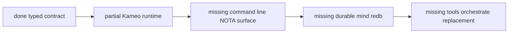

Rough engineering read:

| Layer | Readiness | Why |
|---|---:|---|
| `signal-persona-mind` typed contract | 8/10 | broad request/reply vocabulary, validation newtypes, rkyv frame round trips |
| memory/work graph semantics | 6/10 | in-memory reducer and tests exist; durable tables do not |
| Kameo runtime skeleton | 6/10 | real actor tree exists; many named planes remain trace phases |
| role coordination semantics | 4/10 | contract and some reducer pieces exist; runtime dispatch returns unsupported |
| durable `mind.redb` state | 1/10 | architecture is clear; code is still in-memory |
| command-line `mind` | 1/10 | binary exists but prints `mind scaffold` |
| `tools/orchestrate` replacement | 2/10 | target protocol is documented; compatibility shim is not implemented |

So the architecture is **usable**, but the production command is still
mostly unbuilt.

## 1 · Survey evidence

I surveyed these sources and ran checks:

| Area | Evidence |
|---|---|
| `signal-persona-mind` contract | `signal-persona-mind/src/lib.rs`, `signal-persona-mind/tests/round_trip.rs`, `signal-persona-mind/ARCHITECTURE.md` |
| `persona-mind` runtime | `persona-mind/src/service.rs`, `src/actors/*`, `src/memory.rs`, `tests/*`, `ARCHITECTURE.md` |
| current orchestration helper | `protocols/orchestration.md`, `tools/orchestrate` |
| storage substrate | `sema/ARCHITECTURE.md`, `persona-sema/ARCHITECTURE.md` |
| recent design reports | `reports/operator/95-...`, `97-...`, `99-...`, `101-...`, `104-...`; `reports/designer/98-...`, `100-...`, `106-...`; `reports/operator-assistant/100-...` |

Verification:

- `nix flake check` passed in `/git/github.com/LiGoldragon/signal-persona-mind`.
- `nix flake check` passed in `/git/github.com/LiGoldragon/persona-mind`.

The working copies for `persona-mind`, `signal-persona-mind`,
`persona`, and `persona-router` were clean when inspected. The current
coordination lock owner for `persona-mind` and `persona-router` is
`operator-assistant`, so this report stayed read-only for those repos.

## 2 · What is actually implemented

### 2.1 Contract

`signal-persona-mind` is a real contract crate. Its channel is declared
with one `signal_channel!` invocation:

```rust
signal_channel! {
    request MindRequest {
        RoleClaim(RoleClaim),
        RoleRelease(RoleRelease),
        RoleHandoff(RoleHandoff),
        RoleObservation(RoleObservation),
        ActivitySubmission(ActivitySubmission),
        ActivityQuery(ActivityQuery),
        Open(Opening),
        AddNote(NoteSubmission),
        Link(Link),
        ChangeStatus(StatusChange),
        AddAlias(AliasAssignment),
        Query(Query),
    }
    reply MindReply {
        ClaimAcceptance(ClaimAcceptance),
        ClaimRejection(ClaimRejection),
        ReleaseAcknowledgment(ReleaseAcknowledgment),
        HandoffAcceptance(HandoffAcceptance),
        HandoffRejection(HandoffRejection),
        RoleSnapshot(RoleSnapshot),
        ActivityAcknowledgment(ActivityAcknowledgment),
        ActivityList(ActivityList),
        Opened(OpeningReceipt),
        NoteAdded(NoteReceipt),
        Linked(LinkReceipt),
        StatusChanged(StatusReceipt),
        AliasAdded(AliasReceipt),
        View(View),
        Rejected(Rejection),
    }
}
```

The contract already has the six workspace roles:

```rust
pub enum RoleName {
    Operator,
    OperatorAssistant,
    Designer,
    DesignerAssistant,
    SystemSpecialist,
    Poet,
}
```

It also already owns validated boundary newtypes:

| Type | Implemented invariant |
|---|---|
| `WirePath` | requires absolute path, rejects `..`, normalizes repeated/`.` components |
| `TaskToken` | stores raw unbracketed token, rejects brackets/whitespace/empty |
| `ScopeReason` | rejects empty or multiline text |
| `TimestampNanos` | store-supplied; request types cannot submit it |

Round-trip tests cover role/activity requests, memory requests, every
`QueryKind`, every `EdgeKind`, external references, scope variants, and
boundary validation.

Assessment: **contract is strong for rkyv frame work; incomplete for
the command-line text surface.**

### 2.2 Runtime

`persona-mind` has a real Kameo-backed in-process runtime:

```rust
pub struct MindRuntime {
    root: ActorRef<MindRoot>,
}

impl MindRuntime {
    pub async fn start(store: StoreLocation) -> Result<Self> {
        let root = MindRoot::start(RootArguments::new(store)).await?;
        Ok(Self { root })
    }

    pub async fn submit(&self, envelope: MindEnvelope) -> Result<MindRuntimeReply> {
        let reply = self
            .root
            .ask(SubmitEnvelope { envelope })
            .await
            .map_err(|error| crate::Error::ActorCall(error.to_string()))?;
        Ok(MindRuntimeReply::from_root_reply(reply))
    }
}
```

`MindRoot` starts the current long-lived actors: `Config`,
`StoreSupervisor`, `SubscriptionSupervisor`, `ReplySupervisor`,
`ViewSupervisor`, `DomainSupervisor`, `DispatchSupervisor`, and
`IngressSupervisor`.

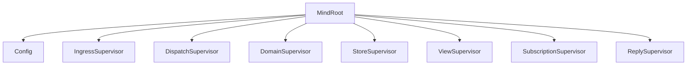

Memory/work mutations are implemented behind the actor path:

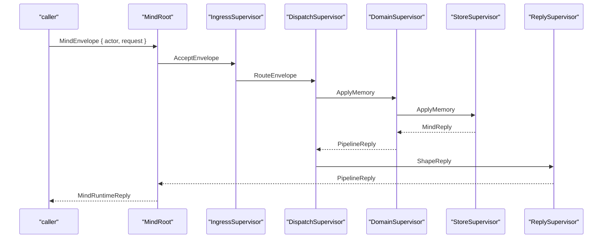

The in-memory reducer currently handles:

- `Open`
- `AddNote`
- `Link`
- `ChangeStatus`
- `AddAlias`
- `Query`

The reducer has tests for projections and query behavior:

- opening items persists a projection and event;
- notes attach to item views;
- `DependsOn` drives ready/blocked views;
- aliases resolve imported identities;
- report references are edges, not item kinds;
- unknown items reject mutations and queries.

Assessment: **runtime has a real actor path for memory/work, but the
durable state layer and role/activity flows are not implemented.**

### 2.3 Current CLI

The `mind` binary exists in `Cargo.toml`:

```toml
[[bin]]
name = "mind"
path = "src/main.rs"
```

But the implementation is still:

```rust
fn main() {
    println!("mind scaffold");
}
```

Assessment: **no command-line mind exists yet.**

## 3 · What is only architecture today

The current architecture says the target CLI is:

```sh
mind '<one NOTA request record>'
```

and the reply is one NOTA record. `tools/orchestrate` becomes a
compatibility shim during migration.

The current shell helper still owns the live implementation:

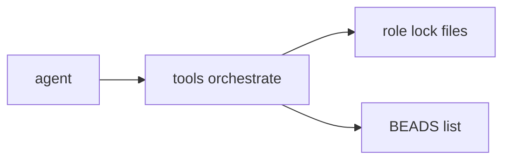

The target shape is:

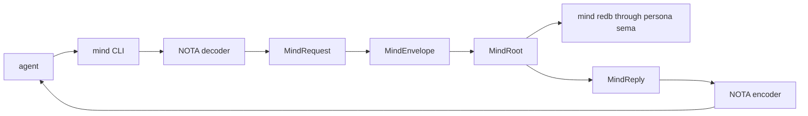

The eventual human/agent surface should feel like this. The exact NOTA
record spellings below are illustrative because the NOTA projection for
`signal-persona-mind` has not landed yet:

```sh
mind '(RoleClaim Operator ((Path "/git/github.com/LiGoldragon/persona-mind")) "implement command-line mind")'
mind '(Query Ready 20)'
mind '(Open Task High "wire command-line mind" "Replace lock-file helper with typed state")'
```

The important shape is one record in, one record out. Convenience shims
may hide that shape for humans, but they should lower into the same
typed request:

```sh
tools/orchestrate claim operator /git/github.com/LiGoldragon/persona-mind -- implement command-line mind
# becomes
mind '<one RoleClaim NOTA record>'
```

The target state shape is:

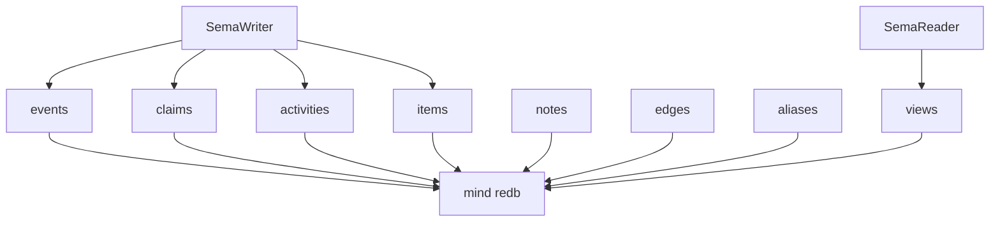

The architecture has converged on these durable decisions:

| Decision | Confidence |
|---|---|
| `persona-mind` is Persona's central state component | High |
| `signal-persona-mind` is the public typed vocabulary | High |
| `mind.redb` is owned by `persona-mind` through `persona-sema` / `sema` | High |
| BEADS is transitional; imported IDs become aliases, not a live bridge | High |
| Request payloads do not carry caller identity/time/slot IDs | High |
| `mind` takes one NOTA request and prints one NOTA reply | High |
| Direct Kameo is the actor runtime; no `persona-actor` wrapper crate | High |

The main contradictions left:

| Topic | Conflict |
|---|---|
| lifecycle | one-shot in-process actor tree vs long-lived daemon |
| lock files | temporary regenerated projections vs fully retired typed views |
| trace phases | accepted trace markers vs demand that every named plane become a real actor |
| storage pins | designs name `DisplayId`, table keys, caller identity, `mind.redb` path, subscriptions; implementation has not landed them |

## 4 · Gap register

### Gap 1 — No NOTA projection for the CLI

`signal-persona-mind` derives rkyv traits, not NOTA traits. Its
architecture names the command-line surface, but the crate does not yet
make `MindRequest` / `MindReply` parseable/renderable as NOTA.

The CLI should not create a second text vocabulary. It should decode
the contract records' NOTA projection into the exact same typed
`MindRequest` that rkyv frames carry.

Needed shape:

```rust
pub struct MindTextDecoder<'input> {
    text: &'input str,
}

impl<'input> MindTextDecoder<'input> {
    pub fn new(text: &'input str) -> Self {
        Self { text }
    }

    pub fn into_request(self) -> Result<MindRequest> {
        // NOTA decode into signal_persona_mind::MindRequest.
        // No separate CLI request enum.
    }
}

pub struct MindTextEncoder;

impl MindTextEncoder {
    pub fn new() -> Self {
        Self
    }

    pub fn reply(&self, reply: &MindReply) -> Result<String> {
        // NOTA encode from signal_persona_mind::MindReply.
    }
}
```

### Gap 2 — Role coordination variants are unsupported

`DispatchSupervisor` routes memory/work variants, but role and activity
variants currently go through `unsupported`:

```rust
MindRequest::RoleClaim(_) => self.unsupported(envelope, trace, ActorKind::ClaimFlow),
MindRequest::RoleHandoff(_) => self.unsupported(envelope, trace, ActorKind::HandoffFlow),
MindRequest::ActivitySubmission(_) | MindRequest::ActivityQuery(_) => {
    self.unsupported(envelope, trace, ActorKind::ActivityFlow)
}
MindRequest::RoleRelease(_) | MindRequest::RoleObservation(_) => {
    self.unsupported(envelope, trace, ActorKind::ClaimFlow)
}
```

This is the main reason `persona-mind` cannot replace
`tools/orchestrate` yet.

Needed actors:

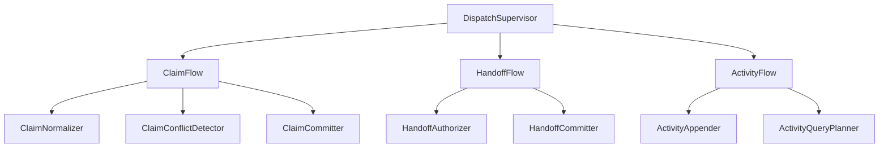

Whether these are all real Kameo actors immediately or some remain
trace phases is the active design tension. For the command-line mind,
the stateful/failure-bearing planes should become real actors first:
claim conflict, activity append/query, ID/time mint, and durable write.

### Gap 3 — No durable `mind.redb`

`StoreSupervisor` owns `MemoryState`, which is in-memory:

```rust
pub(super) struct StoreSupervisor {
    memory: MemoryState,
}
```

`MemoryState` stores:

```rust
struct Graph {
    default_actor: ActorName,
    next_item: u64,
    next_event: u64,
    next_operation: u64,
    items: Vec<Item>,
    edges: Vec<Edge>,
    notes: Vec<Note>,
    events: Vec<Event>,
}
```

No `persona-sema` dependency exists in `persona-mind/Cargo.toml` yet.

Needed shape:

```rust
pub struct MindStore {
    sema: PersonaSema,
    tables: MindTables,
}

impl MindStore {
    pub fn open(path: MindStorePath) -> Result<Self> {
        let sema = PersonaSema::open(path.as_path())?;
        Ok(Self {
            sema,
            tables: MindTables::current(),
        })
    }

    pub fn write(&self, command: StoreCommand) -> Result<StoreReceipt> {
        self.sema.sema().write(|transaction| {
            command.apply(transaction, &self.tables)
        })
    }

    pub fn read(&self, query: StoreQuery) -> Result<MindReply> {
        self.sema.sema().read(|transaction| {
            query.read(transaction, &self.tables)
        })
    }
}
```

The exact table declarations should live in the Persona storage layer
for mind records. Today `persona-sema` only stores umbrella
`signal-persona` records, not `signal-persona-mind` records. That is a
real repo-boundary decision: either extend `persona-sema` with
mind-specific tables or create a `persona-mind` local table module over
the lower `sema` kernel. The current docs lean toward mind-owned
tables using the shared sema kernel.

### Gap 4 — Store-minted identity is still provisional

Current in-memory IDs are deterministic counters:

```rust
StableItemId::new(format!("item-{:016x}", self.next_item))
```

Designer/100 pins a different target:

- short human `DisplayId`, default three characters, collision-extended;
- stable internal item ID;
- operation IDs;
- event sequence;
- timestamp/clock;
- caller identity resolved before persistence.

Needed shape:

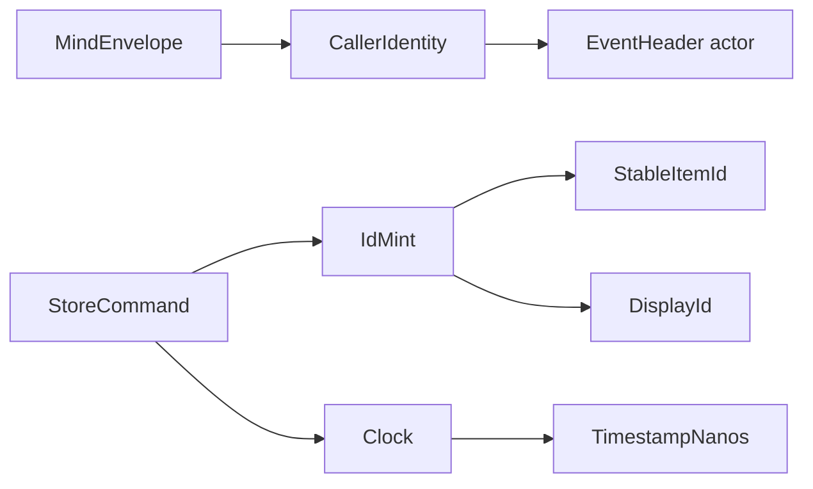

### Gap 5 — Current actor topology is mixed real actors + trace phases

`ActorKind` enumerates many planes, while only the long-lived ones are
real Kameo actors. This is no longer a hidden mismatch because
`ActorResidency` explicitly distinguishes `Root`, `LongLived`, and
`TracePhase`.

That is acceptable as an implementation staging device. It is not
enough for the final command-line mind if trace phases become a way to
pretend an actor exists. The next wave should convert the planes that
own state, IO, identity, or failure into real data-bearing actors.

Priority conversions:

| Trace phase today | Why it should become real |
|---|---|
| `NotaDecoder` | owns text decoding diagnostics |
| `CallerIdentityResolver` | owns identity resolution failure |
| `ClaimConflictDetector` / `ClaimFlow` | owns conflict semantics |
| `SemaWriter` | owns write ordering |
| `SemaReader` | owns read snapshots |
| `IdMint` | owns stable/display ID collision state |
| `Clock` | owns store-supplied time |
| `EventAppender` | owns append-only event ordering |

## 5 · Recommended command-line architecture

I recommend the first working command-line mind be **one-shot
in-process Kameo**, not a daemon. The same actor tree can later be
hosted by a daemon when subscriptions or push streams require it.

Why: the immediate problem is replacing shell-level lock writes with a
typed request/reply tool. A daemon adds lifecycle and transport before
the storage and text surfaces are even complete. The one-shot CLI still
uses the real actor tree; it just starts and stops it per invocation.

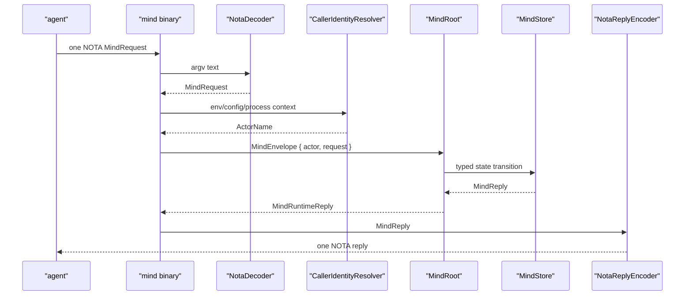

The CLI owns only process-boundary concerns:

```rust
pub struct MindCommand {
    argv: Vec<String>,
    environment: MindEnvironment,
}

impl MindCommand {
    pub fn from_process(argv: Vec<String>, environment: MindEnvironment) -> Self {
        Self { argv, environment }
    }

    pub async fn run(self) -> Result<MindExit> {
        let input = MindInput::from_argv(self.argv)?;
        let request = MindTextDecoder::new(input.text()).into_request()?;
        let actor = CallerIdentity::from_environment(self.environment).resolve()?;
        let store = MindStorePath::from_environment(self.environment);

        let runtime = MindRuntime::start(store.into_location()).await?;
        let reply = runtime
            .submit(MindEnvelope::new(actor, request))
            .await?;
        runtime.stop().await?;

        let encoder = MindTextEncoder::new();
        let text = encoder.reply(reply.reply().ok_or(Error::NoReply)?)?;
        Ok(MindExit::success(text))
    }
}
```

This sketch is deliberately built out of data-bearing types, not free
functions:

| Type | Owns |
|---|---|
| `MindCommand` | process invocation state |
| `MindInput` | exactly-one-argument rule |
| `MindTextDecoder` | NOTA decode diagnostics |
| `CallerIdentity` | actor resolution inputs |
| `MindStorePath` | path defaults and env override |
| `MindRuntime` | actor tree |
| `MindTextEncoder` | NOTA reply rendering |

## 6 · Command scenarios

### 6.1 Claim a path

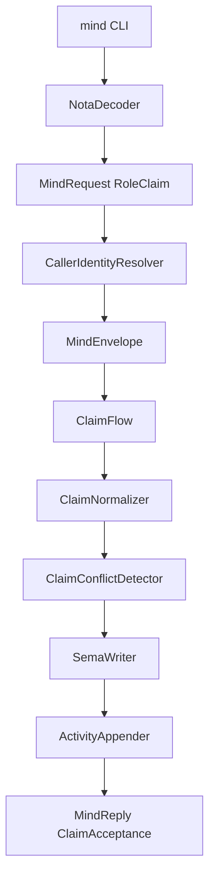

What must be true:

- path normalization happens before commit;
- conflict is a typed `ClaimRejection`, not stderr text;
- claim acceptance appends activity automatically;
- lock files are not authoritative state.

### 6.2 Query ready work

```mermaid
flowchart TB
    cli[mind CLI] --> request[MindRequest Query]
    request --> flow[QueryFlow]
    flow --> planner[QueryPlanner]
    planner --> ready[ReadyWorkView]
    ready --> reader[SemaReader]
    reader --> graph[GraphTraversal]
    graph --> shaper[QueryResultShaper]
    shaper --> reply[MindReply View]
```

What must be true:

- query path contains `SemaReader`;
- query path does not contain `SemaWriter`;
- ready/blocked status derives from typed dependency edges;
- no BEADS lookup is part of the steady-state path.

### 6.3 Import a BEADS task once

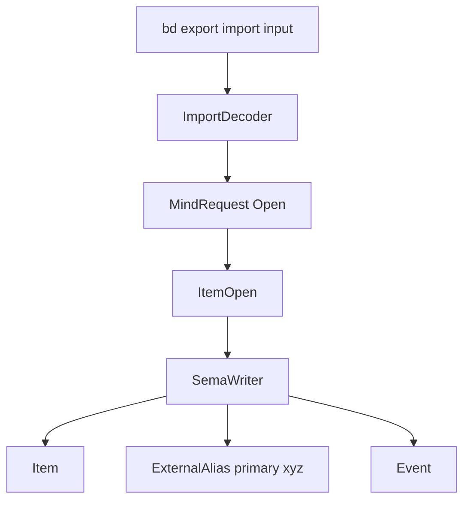

What must be true:

- BEADS ID becomes an `ExternalAlias` or `ExternalReference::BeadsTask`;
- there is no live Persona↔bd bridge;
- no BEADS database lock affects Persona truth after import.

## 7 · Architectural-truth tests needed next

These should land before declaring the command-line mind usable:

| Test | Proves |
|---|---|
| `mind_cli_accepts_one_nota_record_and_prints_one_nota_reply` | command surface is not a flag/subcommand dialect |
| `mind_cli_uses_signal_persona_mind_records_not_local_cli_records` | no duplicate text vocabulary |
| `role_claim_reaches_claim_flow_and_returns_claim_acceptance` | role coordination is implemented, not unsupported |
| `conflicting_claim_returns_claim_rejection_as_typed_reply` | conflicts are data, not stderr |
| `claim_release_handoff_append_activity_records` | activity is automatic and durable |
| `query_ready_uses_reader_without_writer` | read path cannot mutate state |
| `mind_store_persists_across_two_cli_invocations` | `mind.redb` is real |
| `lock_files_are_not_the_source_of_truth` | deleting projection files cannot delete state |
| `beads_is_not_read_during_steady_state_query` | BEADS is retired |
| `request_payload_cannot_supply_actor_or_timestamp` | infrastructure mints identity/time |
| `trace_phase_that_owns_state_has_impl_actor` | no fake actor planes for stateful work |

The test style should be weird on purpose: tests should prove the
architecture path was used, not only that the final reply looks right.

## 8 · Decisions to bring to the user

### Decision 1 — one-shot CLI first, or daemon first?

Evidence:

- `persona-mind` already has an in-process `MindRuntime`.
- The current `mind` binary is a scaffold.
- Subscriptions are not implemented.

Options:

| Option | Tradeoff |
|---|---|
| one-shot in-process Kameo first | fastest route to replacing `tools/orchestrate`; actor tree remains real; no push subscriptions yet |
| daemon first | better long-lived subscription shape; slower and adds transport/lifecycle before storage/text is complete |

Recommendation: **one-shot first**, with the actor tree structured so a
daemon can host the same root later.

### Decision 2 — retire lock files immediately or keep projections briefly?

Evidence:

- User intent says mind replaces lock files.
- `protocols/orchestration.md` still says lock files become regenerated
  projections.
- Existing agents still coordinate through `tools/orchestrate`.

Options:

| Option | Tradeoff |
|---|---|
| no projections in v1 | clean truth model; current agents must switch to `mind` immediately |
| temporary projections | smoother migration; risks keeping lock files psychologically authoritative |

Recommendation: **temporary read-only compatibility projections only if
needed**, and name them explicitly as disposable. No new architecture
should depend on them.

### Decision 3 — where do mind-specific tables live?

Evidence:

- `persona-sema` currently declares umbrella `signal-persona` tables,
  not `signal-persona-mind` tables.
- `sema` is the kernel; consumer-specific table layouts belong in a
  consumer typed layer.

Options:

| Option | Tradeoff |
|---|---|
| extend `persona-sema` with mind table set | one Persona storage layer; could grow broad |
| put `MindTables` in `persona-mind` over `sema` | tighter ownership; less reusable table layer |

Recommendation: **put the first `MindTables` in `persona-mind`** unless
another component needs to read/write those tables directly. Other
components should talk to mind through `signal-persona-mind`, not by
opening its database.

## 9 · Implementation order

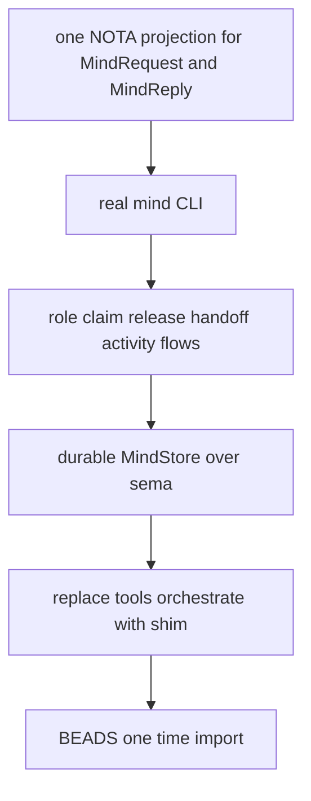

The first two slices can be tested without committing to the full table
layout. The third and fourth must land before the command can replace
the current lock helper.

## 10 · Prognosis

Architecture understanding: **high**.

Implementation completeness: **medium-low**.

The project is past the vague-design phase. We have named components,
typed contracts, a Kameo runtime, and tests that already prove some
architectural paths. What remains is not philosophical; it is concrete
engineering:

- add NOTA projection to the `signal-persona-mind` command surface;
- implement the `mind` binary;
- implement role/activity flows;
- replace in-memory state with durable `mind.redb`;
- decide the lock-file migration boundary;
- convert the stateful trace phases into real actors where needed.

Once those land, `tools/orchestrate` can become a compatibility shim
instead of the operational source of truth.
