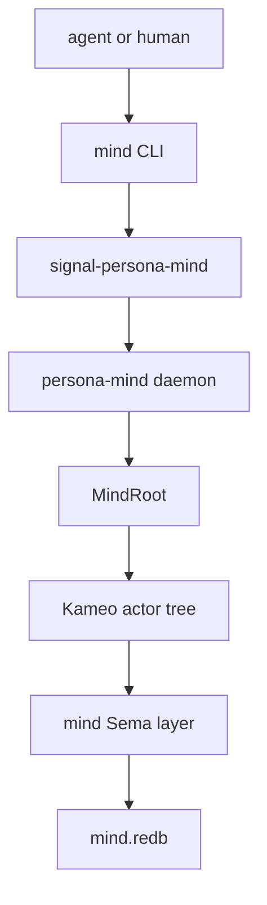
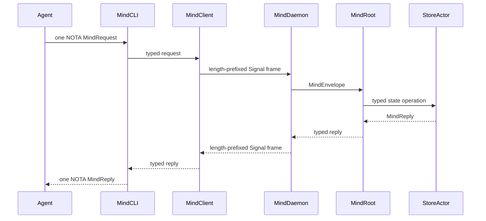

# Operator 106 — PersonaMind Constraints and Witness Pass

## State of the world

`persona-mind` is not launchable as the command-line mind yet. The real
implementation today is an in-process Kameo runtime with a memory/work reducer
and actor traces. The `mind` binary still prints a scaffold string. The daemon
boundary, NOTA projection, local transport, durable `mind.redb`, and successful
role/activity flows are the next implementation wave.

The useful foundation is now clearer:

| Layer | Current state | Constraint pressure added |
|---|---|---|
| `/git/github.com/LiGoldragon/signal-persona-mind` | contract exists and round-trips | role coverage now includes `PoetAssistant`; docs match implemented variant names |
| `/git/github.com/LiGoldragon/persona-mind` | actor runtime and in-memory graph exist | constraints now name daemon-first, no CLI DB ownership, no lock-file projection |
| `/git/github.com/LiGoldragon/signal-core` | frame kernel exists | negative frame-boundary tests landed |
| `/git/github.com/LiGoldragon/sema` | database kernel exists | docs now say typed tables live with the state-owning component by default |
| `/git/github.com/LiGoldragon/persona` | apex composition repo | architecture now says what it may and may not own |

## Shape

The most important boundary is: the CLI is not a runtime owner. It accepts one
NOTA request record, sends one typed Signal request to the daemon, receives one
typed reply, prints one NOTA reply record, and exits.

## What changed

- `/home/li/primary/skills/architecture-editor.md` now requires a
  `Constraints` section in component `ARCHITECTURE.md` files.
- `/home/li/primary/skills/architectural-truth-tests.md` now treats
  constraints as the seed list for weird tests.
- `/home/li/primary/ESSENCE.md` now states the principle: architecture is not
  finished until constraints have witnesses.
- `/git/github.com/LiGoldragon/signal-persona-mind/src/lib.rs` adds
  `RoleName::PoetAssistant`.
- `/git/github.com/LiGoldragon/signal-persona-mind/tests/round_trip.rs` adds
  `role_name_covers_workspace_coordination_roles`.
- `/git/github.com/LiGoldragon/persona-mind/tests/weird_actor_truth.rs` adds
  witnesses for:
  - `mind_cli_cannot_open_the_mind_database`;
  - `mind_source_cannot_depend_on_persona_sema`;
  - `mind_source_cannot_project_lock_files_or_live_beads_backend`.
- `/git/github.com/LiGoldragon/signal-core/tests/frame.rs` adds witnesses for
  handshake rejection, length-prefix failures, and protocol compatibility.

## Next implementation target

Implementation order I would take next:

1. Add the daemon/client process boundary in `/git/github.com/LiGoldragon/persona-mind`.
2. Add NOTA projection for a small first slice of `MindRequest` / `MindReply`.
3. Route `RoleClaim` through real claim actors instead of the unsupported path.
4. Introduce mind-local Sema tables over `/git/github.com/LiGoldragon/sema`.
5. Add Nix-chained witness tests where the writer process emits `mind.redb` and a
   separate reader process verifies the typed records.

## Questions

No blocking questions. The main product decision already looks settled:
daemon-first, lock files outside the implementation, no shared `persona-sema`,
and constraints drive tests.
