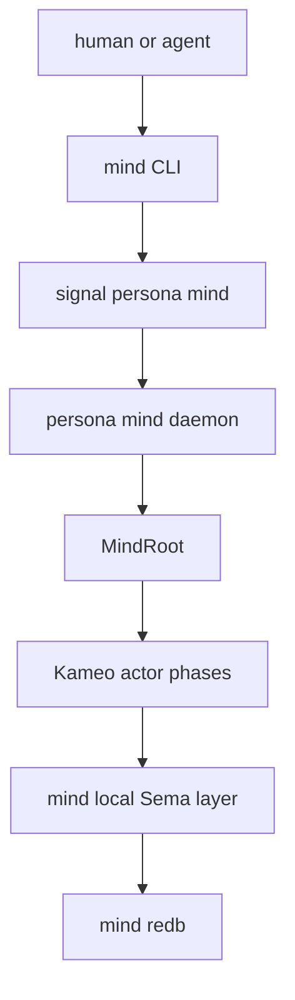
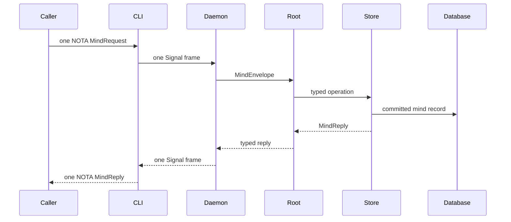

# Operator 107 — PersonaMind World Rescan

## 0 · Short Read

The Persona stack is cleaner than it was at the last operator pass, but
`persona-mind` is still not launchable as the command-line mind.

The current truth:

- `persona-mind` has a real direct Kameo actor path and in-memory work graph.
- The `mind` binary and daemon are still scaffold-level.
- `MindRuntime` still exists as an in-process facade and is now explicitly a
  cleanup target.
- Durable `mind.redb`, mind-local Sema tables, caller identity, NOTA projection,
  local transport, and role/activity flows are still the implementation wave
  that makes `mind` usable.
- Lock files and BEADS are transitional workflow surfaces, not implementation
  targets for `persona-mind`.

I found one concrete contract drift during this scan: the workspace now has the
`system-assistant` role, but `signal-persona-mind::RoleName` did not include it.
I fixed and pushed that as:

| Repo | Commit | What |
|---|---|---|
| `/git/github.com/LiGoldragon/signal-persona-mind` | `22a04428` | add `RoleName::SystemAssistant`, update role-coverage witness and docs |

Verification:

- `nix flake check -L` in `/git/github.com/LiGoldragon/persona-mind` passes.
- `nix flake check -L` in `/git/github.com/LiGoldragon/signal-persona-mind`
  passes after the role repair, with 36 round-trip tests.

## 1 · Workspace Changes Since My Last Pass

The largest workspace-level changes I saw:

| Area | Current truth |
|---|---|
| Roles | The workspace now has eight roles: `operator`, `operator-assistant`, `designer`, `designer-assistant`, `system-specialist`, `system-assistant`, `poet`, `poet-assistant`. |
| Actors | Direct Kameo remains the runtime. No `workspace-actor`, no `persona-actor`, no ractor path. |
| Architecture files | Constraints are now mandatory test seeds. A component architecture should name constraints plainly enough to become witness-test names. |
| BEADS | Still transitional. It is never a lock. Native mind work graph replaces it later. |
| Sema | Sema is a database library. Each state-bearing component owns its own redb and table layer. No shared `persona-sema` for mind state. |
| CLI shape | Daemon-first is settled. CLIs are thin clients when durable state or long-lived actors are involved. |

The primary worktree is currently dirty from another role's file:

- `reports/operator-assistant/100-kameo-persona-actor-migration.md`

I did not touch or commit it.

## 2 · Active Shape

Current implementation stops short of the daemon, transport, NOTA projection,
and durable store. Tests currently exercise the in-process Kameo path through
`MindRuntime`.

## 3 · PersonaMind Readiness

| Layer | Current readiness | High-signal gap |
|---|---|---|
| Contract | Good and now synced to eight roles. | Subscription/event push remains future work. |
| Kameo runtime | Real root and phase actors exist. | `MindRuntime` facade still hides the intended public actor surface. |
| Actor naming | Forwarding trace actors are now `*Phase`. | `ActorKind` still mixes real actors and trace phases; designer-assistant has `primary-rhh`. |
| Store | In-memory reducer exists. | No durable `mind.redb`; no mind-local Sema table module. |
| CLI | Binary exists. | No one-record NOTA decode, Signal frame client, daemon socket, or NOTA reply render. |
| Role work | Contract records exist. | Role claim/release/handoff/activity flows are not fully routed. |
| Tests | Nix checks pass; weird actor truth tests exist. | Need chained durable-store witnesses once redb lands. |

The next production milestone is still:

## 4 · Assistant Work

I do not think I need to file new BEADS for an assistant right now. The useful
assistant-sized slices already exist:

| Bead | Role | Why it matters |
|---|---|---|
| `primary-3ro` | operator-assistant | Apply the data-type-shadowing rule across persona-* actors. |
| `primary-m8x` | operator-assistant | Delete `MindRuntime`; expose `ActorRef<MindRoot>` or a justified domain surface. |
| `primary-rhh` | designer-assistant | Decide whether `ActorKind` should be dropped or split so trace phases stop masquerading as actors. |

Those are exactly the checks I would have delegated. Adding more tickets now
would mostly duplicate the queue.

## 5 · Operator Next Work

The next operator implementation work should stay centered on
`persona-mind`. I would take it in this order:

1. Let or help the `MindRuntime` cleanup land, because it affects the public
   shape every daemon/client test will touch.
2. Add daemon/client scaffolding around `MindRoot`: socket path type, client
   type, daemon endpoint type, one-frame request/reply path.
3. Add the first NOTA projection for a tiny slice of `MindRequest` and
   `MindReply`, still lowering to the same contract records.
4. Add mind-local Sema table declarations and a durable `mind.redb` path.
5. Add chained Nix witnesses: one step writes `mind.redb`, another step reads
   it through the authoritative table layer.
6. Route `RoleClaim` first, because that is the replacement pressure for the
   lock-file protocol.

The most important correctness tests to add next are:

- `mind_cli_cannot_open_mind_redb`;
- `mind_cli_cannot_reply_without_daemon_signal_frame`;
- `daemon_cannot_commit_without_mind_sema_table`;
- `role_claim_cannot_skip_conflict_detector`;
- `query_cannot_send_write_intent`;
- `mind_redb_written_by_one_process_is_read_by_another`.

## 6 · No Blocking Questions

I do not have a blocking question right now.

The implementation direction is clear enough: keep `persona-mind` as the center,
keep contracts in `signal-persona-mind`, keep all process traffic typed Signal,
make the CLI a daemon client, and make constraints earn tests.
