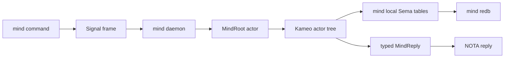
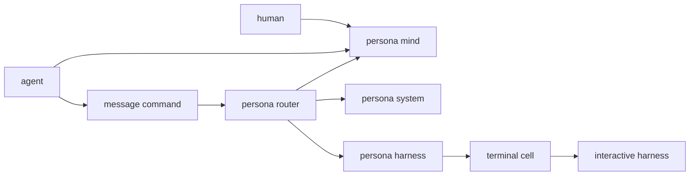
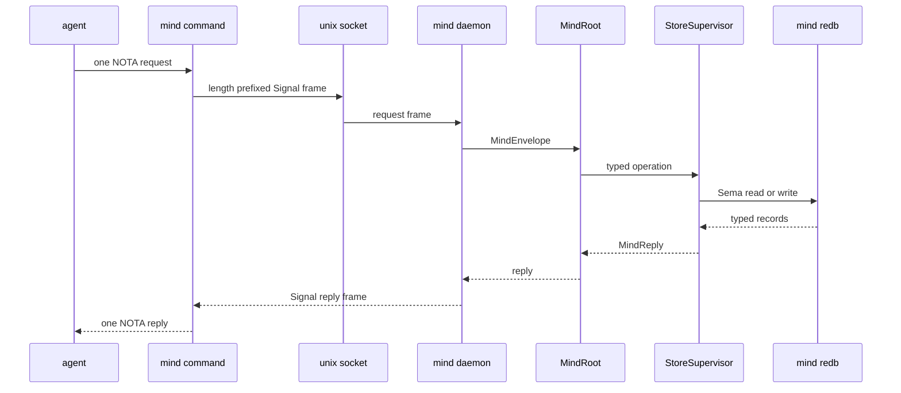
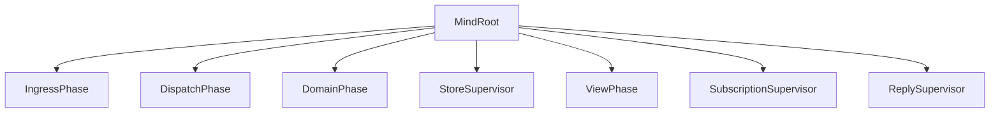
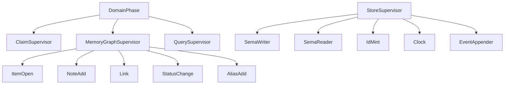

# 108 - Persona Mind System Overview

Role: operator  
Scope: what the current Persona stack actually does, with emphasis on
`persona-mind` because it is now the executable center of the system.  
Verification: `nix flake check -L` passed in
`/git/github.com/LiGoldragon/persona-mind` on 2026-05-11.

---

## Short Read

The implemented system is no longer just reports. There is a working
daemon-backed `mind` command in `/git/github.com/LiGoldragon/persona-mind`.
It accepts one NOTA request, sends a typed Signal frame over a Unix socket to a
long-lived Kameo actor tree, mutates or reads mind-owned state, and prints one
NOTA reply.

What works today:

- role claim, release, handoff, and observation;
- activity submission and recent activity query;
- work graph opening, note, link, status, alias, and query;
- durable storage through `sema` tables in a mind-owned `mind.redb`;
- Signal request/reply framing through `signal-persona-mind`;
- architecture-witness tests that prove the CLI uses the daemon and the actor
  path instead of silently mutating state in-process.

What does not work yet:

- `mind` is not yet the live workspace coordination tool replacing
  `tools/orchestrate`;
- there is no default daemon discovery or supervisor service;
- the work graph is stored as a whole typed snapshot rather than normalized
  tables;
- many named actors are still trace phases, not live Kameo actors;
- subscriptions exist as a scaffold, not as the real post-commit notification
  surface;
- BEADS and lock files are not integrated, and that is intentional. They are
  transitional workspace mechanisms, not part of `persona-mind` architecture.

---

## Current Shape

The real stack is this:



The repository roles are:

| Repo | What it owns right now |
|---|---|
| `/git/github.com/LiGoldragon/signal-core` | Frame/envelope/channel kernel. |
| `/git/github.com/LiGoldragon/signal-persona-mind` | The typed `MindRequest` / `MindReply` contract. |
| `/git/github.com/LiGoldragon/sema` | The generic typed redb library. |
| `/git/github.com/LiGoldragon/persona-mind` | The daemon, CLI client, Kameo actor tree, reducers, and mind-local tables. |
| `/git/github.com/LiGoldragon/persona` | Apex/meta repo wiring checks together through Nix. |

Everything else in the Persona family is adjacent right now:
`persona-router`, `persona-system`, `persona-harness`, `persona-message`,
`persona-wezterm`, and `terminal-cell` matter for the next stack, but they are
not on the working `mind` mutation path described here.

---

## Broader Persona Context

The larger Persona stack is trying to become this:



Only the `persona-mind` lane is currently executable in a serious way. The
other lanes are at different maturity levels:

| Area | Current reality |
|---|---|
| `persona-mind` | Working daemon/client/actor/store path. |
| `signal-persona-mind` | Working typed contract repo used by `persona-mind`. |
| `signal-persona-message` | Contract direction for message CLI to router; useful, but not the live system center. |
| `signal-persona-system` | Contract direction for system observations such as focus/prompt facts. |
| `persona-router` | Intended message router, not yet the finished typed actor daemon. |
| `persona-system` | Intended OS/window/prompt-state adapter, not yet the finished source of system facts. |
| `persona-harness` | Intended harness boundary. Prior experiments used terminal injection; that surfaced correctness hazards. |
| `persona-message` | Transitional message CLI experiments. Useful history, not current architecture truth. |
| `persona-wezterm` / `terminal-cell` | Terminal/session experiments. The system is still rethinking terminal ownership and multiplexing. |

The earlier harness work did teach one important thing: injecting text into an
interactive prompt is unsafe unless the router can prove the prompt buffer and
focus state are acceptable. A message arriving while a human is typing can
corrupt both the human prompt and the delivered message. That is why
`persona-system` and the router-side input gate remain first-class pieces of
the future stack.

---

## What The Command Does

The implemented binary has two modes.

Start the daemon:

```sh
mind daemon --socket /tmp/mind.sock --store /tmp/mind.redb
```

Submit one NOTA request:

```sh
mind \
  --socket /tmp/mind.sock \
  --actor operator \
  '(RoleClaim Operator [(Path "/git/github.com/LiGoldragon/persona-mind")] "claim via mind")'
```

Expected reply shape:

```nota
(ClaimAcceptance Operator [(Path "/git/github.com/LiGoldragon/persona-mind")])
```

Current common requests:

```nota
(RoleRelease Operator)
(RoleHandoff Operator Designer [(Path "/git/github.com/LiGoldragon/persona-mind")] "handoff")
(RoleObservation)

(ActivitySubmission Operator (Path "/git/github.com/LiGoldragon/persona-mind") "worked on mind")
(ActivityQuery 5 [])

(Opening Task High "Implement command line mind" "make daemon path usable")
(NoteSubmission (Display aab) "note body")
(AliasAssignment (Display aab) primary-test)
(Link (Display aab) References (Report "reports/operator/105-command-line-mind-architecture-survey.md") None)
(StatusChange (Display aab) InProgress "started")
(Query (Open) 10)
```

The CLI convenience surface is still thin. It does not yet have natural
subcommands like `mind claim ...`; the command line takes the NOTA record
directly. The public examples should prefer `Display` or `Alias` references.
The token is only a short handle; the type lives in the record wrapper
(`Display`, `Stable`, `OperationId` on the Rust side), not in the string.

---

## Runtime Path

The actual request path is:



The important implementation point is that `--actor operator` is not part of
the request payload. It becomes Signal auth in the client frame. That keeps
caller identity outside agent-authored domain data.

Relevant code from
`/git/github.com/LiGoldragon/persona-mind/src/transport.rs`:

```rust
pub async fn submit(&self, request: MindRequest) -> Result<MindReply> {
    let mut stream = UnixStream::connect(self.endpoint.as_path()).await?;
    let frame = self.codec.request_frame(&self.actor, request);
    self.codec.write_frame(&mut stream, &frame).await?;
    let reply = self.codec.read_frame(&mut stream).await?;
    self.codec.reply_from_frame(reply)
}
```

The daemon extracts the actor identity from Signal auth before entering
`MindRoot`:

```rust
let frame = self.codec.read_frame(&mut stream).await?;
let actor = self.codec.actor_from_frame(&frame)?;
let request = self.codec.request_from_frame(frame)?;
let envelope = MindEnvelope::new(actor, request);
let root_reply = self.root.ask(SubmitEnvelope { envelope }).await?;
```

---

## Actor Topology

The current actor tree is a real Kameo tree at the broad phase level:



The manifest also names many smaller phases:



But the second diagram is partly aspirational. In
`/git/github.com/LiGoldragon/persona-mind/src/actors/manifest.rs`, many of
those entries have `ActorResidency::TracePhase`, not `LongLived`. The tests can
prove the conceptual path was witnessed, but they do not prove every small noun
is already its own Kameo mailbox.

That distinction matters. We chose Kameo to make actor state real, not to draw
actor-shaped labels over methods.

---

## Storage

`persona-mind` owns its own Sema tables. There is no shared `persona-sema`
layer. The current table declarations live in
`/git/github.com/LiGoldragon/persona-mind/src/tables.rs`:

```rust
const CLAIMS: Table<&'static str, StoredClaim> = Table::new("claims");
const ACTIVITIES: Table<u64, StoredActivity> = Table::new("activities");
const MEMORY_GRAPH: Table<&'static str, MemoryGraph> = Table::new("memory_graph");
```

Role claims and activity are stored as separate typed records. The work graph is
currently stored as one typed snapshot:

```rust
pub(crate) fn replace_memory_graph(&self, graph: &MemoryGraph) -> Result<()> {
    self.database.write(|transaction| {
        MEMORY_GRAPH.insert(transaction, MEMORY_GRAPH_KEY, graph)?;
        Ok(())
    })?;
    Ok(())
}
```

This is enough to prove durable restart behavior. It is not the final database
shape. The destination is normalized typed tables for items, notes, edges,
aliases, and events.

---

## Contract Pattern

The cleanest pattern in the current system is the contract repo split:

```rust
signal_channel! {
    request MindRequest {
        RoleClaim(RoleClaim),
        RoleRelease(RoleRelease),
        RoleHandoff(RoleHandoff),
        RoleObservation(RoleObservation),
        ActivitySubmission(ActivitySubmission),
        ActivityQuery(ActivityQuery),
        Opening(Opening),
        NoteSubmission(NoteSubmission),
        Link(Link),
        StatusChange(StatusChange),
        AliasAssignment(AliasAssignment),
        Query(Query),
    }
    reply MindReply {
        ClaimAcceptance(ClaimAcceptance),
        ClaimRejection(ClaimRejection),
        ReleaseAcknowledgment(ReleaseAcknowledgment),
        HandoffAcceptance(HandoffAcceptance),
        HandoffRejection(HandoffRejection),
        RoleSnapshot(RoleSnapshot),
        ActivityAcknowledgment(ActivityAcknowledgment),
        ActivityList(ActivityList),
        OpeningReceipt(OpeningReceipt),
        NoteReceipt(NoteReceipt),
        LinkReceipt(LinkReceipt),
        StatusReceipt(StatusReceipt),
        AliasReceipt(AliasReceipt),
        View(View),
        Rejection(Rejection),
    }
}
```

That lives conceptually in `signal-persona-mind`: the contract names the
allowed vocabulary. `persona-mind` implements it.

The pattern to preserve:

1. Contract repo owns wire records.
2. Component repo owns daemon, actor tree, state transitions, storage, and text
   projection.
3. Text is NOTA only.
4. Binary communication is Signal only.
5. Durable state is Sema owned by the component.

---

## Text Projection Pattern

The text projection is implemented in
`/git/github.com/LiGoldragon/persona-mind/src/text.rs`. It maps human/agent
NOTA records to contract records and back.

The good part:

```rust
impl MindTextRequest {
    pub fn from_nota(source: &str) -> Result<Self> {
        let mut decoder = Decoder::new(source);
        Ok(Self::decode(&mut decoder)?)
    }

    pub fn into_request(self) -> Result<contract::MindRequest> {
        match self {
            Self::RoleClaim(claim) => Ok(contract::MindRequest::RoleClaim(claim.into_contract()?)),
            Self::Opening(opening) => {
                Ok(contract::MindRequest::Opening(opening.into_contract()?))
            }
            // ...
        }
    }
}
```

The shape is right: NOTA text is decoded into a text type, then converted into
the contract type. The problem is size and duplication. `text.rs` is a large
manual mirror of `signal-persona-mind`. Every new contract variant now invites
manual enum mirrors, conversion methods, and reply rendering.

This is probably the most correction-worthy file in the current system.

---

## Tests That Matter

The useful tests are not just normal unit tests. They are architectural witness
tests:

| Test surface | What it proves |
|---|---|
| `tests/cli.rs` | NOTA text maps into `MindRequest`; CLI sends through daemon. |
| `tests/daemon_wire.rs` | Signal frame transport and restart persistence work. |
| `tests/weird_actor_truth.rs` | Source guards prevent Kameo drift, lock-file projection drift, and in-process CLI shortcuts. |
| `flake.nix` `cli-binary` | The built binary starts a daemon and submits real CLI requests through a socket. |

The right instinct is here: tests name architectural constraints and look for
violations an agent might otherwise hand-wave away.

The current flake check passes:

```text
nix flake check -L
all checks passed
```

---

## Suspicious Or Ridiculous Code

These are the pieces I would not want to fossilize.

### 1. `text.rs` is too much hand-written projection

Source: `/git/github.com/LiGoldragon/persona-mind/src/text.rs`

It has the right boundary but the wrong maintenance cost. The file mirrors
contract enums and records manually. That means any contract change must be
reflected twice: once in `signal-persona-mind`, once in the text projection.
The immediate risk is drift.

Correction direction: keep text projection in the component for now, but reduce
manual duplication. Either derive the projection where possible or create a
small pattern for projection records that makes missing variants impossible to
miss.

### 2. `MemoryState` uses `RefCell` inside actor-owned state

Source: `/git/github.com/LiGoldragon/persona-mind/src/memory.rs`

```rust
pub struct MemoryState {
    store: StoreLocation,
    graph: RefCell<MemoryGraph>,
}
```

This is not a disaster because Kameo serializes actor message handling at the
actor boundary, but it smells like an old reducer object was placed inside an
actor instead of becoming actor-shaped itself.

Correction direction: split the reducer into real actors or into a plain
`&mut self` object owned directly by the store actor. Avoid interior mutability
unless it is truly modeling shared runtime state.

### 3. Work graph persistence writes the whole graph snapshot

Source: `/git/github.com/LiGoldragon/persona-mind/src/memory.rs`

```rust
let mut next_graph = self.graph.borrow().clone();
let reply = next_graph.dispatch_envelope(envelope);
if MemoryReply::new(&reply).committed() {
    tables.replace_memory_graph(&next_graph)?;
    self.graph.replace(next_graph);
}
```

This is good enough to prove durable behavior. It is also obviously not the
final Sema shape. Every mutation clones the graph, applies it, and replaces the
single `memory_graph` record.

Correction direction: event append first, normalized item/note/edge/alias
tables next, derived views last.

### 4. `StoreSupervisor` owns too many domains

Source: `/git/github.com/LiGoldragon/persona-mind/src/actors/store.rs`

```rust
pub(super) struct StoreSupervisor {
    memory: MemoryState,
    tables: MindTables,
}
```

The methods on it handle claims, handoffs, activity, memory writes, and memory
reads. That is too broad for the actor-heavy discipline. It is currently the
central funnel that lets the system work. It should not remain the long-term
shape.

Correction direction: split into actors such as `ClaimStore`, `ActivityStore`,
`MemoryWriter`, `MemoryReader`, `IdMint`, `Clock`, and `EventAppender`, with
`StoreSupervisor` supervising rather than doing.

### 5. `Clock` is a tiny helper pretending to be a noun

Source: `/git/github.com/LiGoldragon/persona-mind/src/tables.rs`

```rust
struct Clock;

impl Clock {
    fn new() -> Self {
        Self
    }
}
```

The architecture talks about `Clock` as an actor-worthy phase because time is
infrastructure-minted. The code has a local helper struct that just calls
`SystemTime::now`. That is not the same thing.

Correction direction: make time injection explicit. For tests, use a
data-bearing test clock. For production, use a clock actor or clock service
owned by the store path.

### 6. Activity append scans all activity records to find the next slot

Source: `/git/github.com/LiGoldragon/persona-mind/src/tables.rs`

```rust
fn next_activity_slot(&self) -> Result<u64> {
    let records = self.activity_records()?;
    Ok(records
        .iter()
        .map(|activity| activity.slot)
        .max()
        .map_or(0, |slot| slot + 1))
}
```

This is simple and correct for a tiny prototype. It is also the sort of thing
that turns embarrassing as soon as the table grows.

Correction direction: store a counter record, mint slots inside one write
transaction, or move sequence ownership into an `ActivityAppender` actor.

### 7. `serve_forever` is prototype daemon behavior

Source: `/git/github.com/LiGoldragon/persona-mind/src/transport.rs`

```rust
pub async fn serve_forever(self) -> Result<()> {
    loop {
        if let Err(error) = self.serve_next().await {
            eprintln!("mind daemon client error: {error}");
        }
    }
}
```

There is no shutdown channel, no concurrent client handling, no structured
logging, and socket cleanup only exists in one-shot test serving. It is fine
for proving the daemon path; it is not production daemon behavior.

Correction direction: supervised accept loop, graceful stop request, bounded
client tasking, structured error records, socket cleanup on shutdown.

### 8. Trace phases can become architecture theater

Source: `/git/github.com/LiGoldragon/persona-mind/src/actors/manifest.rs`

The manifest names many actors, but many are `TracePhase`. This is useful when
it drives future implementation, and harmful if it lets us claim actor density
without mailboxes.

Correction direction: keep the manifest, but add tests that require important
stateful/failure-bearing phases to graduate from `TracePhase` to `LongLived`
when their implementation lands.

---

## What I Would Correct First

1. Add default endpoint resolution for `mind`, while keeping explicit
   `--socket` and `--store` for tests.
2. Split `StoreSupervisor` into smaller Kameo actors for claims, activities,
   memory writes, memory reads, ID minting, event append, and time.
3. Replace whole-graph snapshot storage with event append plus normalized
   tables.
4. Make the subscription path real: post-commit events should publish after
   durable write success.
5. Shrink `text.rs` by introducing a projection pattern that cannot silently
   miss contract variants.
6. Convert `serve_forever` into a real daemon loop with shutdown and cleanup.
7. Add a migration story from `tools/orchestrate` to `mind` without making lock
   files part of `persona-mind`.

---

## Bottom Line

The system is coherent enough to build on. The strongest part is the
Signal-contract → daemon → Kameo actor → Sema storage path. The weakest part is
that several implementation details are still first-wave scaffolding wearing
future architecture names.

The most valuable next pass is not adding more vocabulary. It is making the
existing vocabulary harder to fake:

- fewer trace-only actors for stateful phases;
- more real actor mailboxes;
- normalized durable tables;
- generated or mechanically checked text projection;
- production-shaped daemon lifecycle.

That would turn `persona-mind` from a working prototype into a workspace tool
we can start using without quietly keeping `tools/orchestrate` as the real
system.
