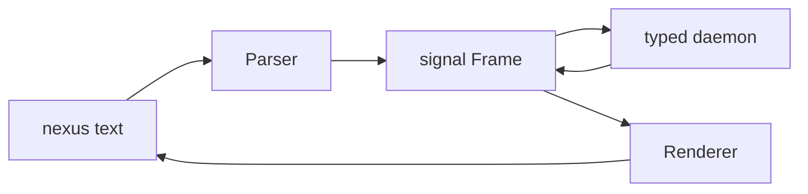
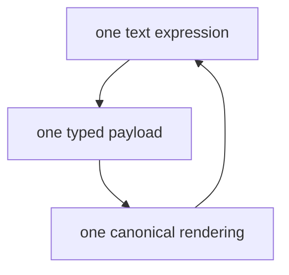
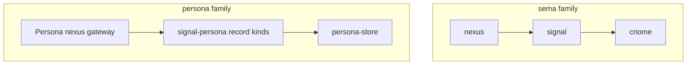
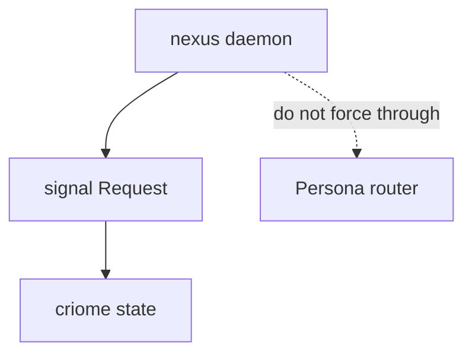
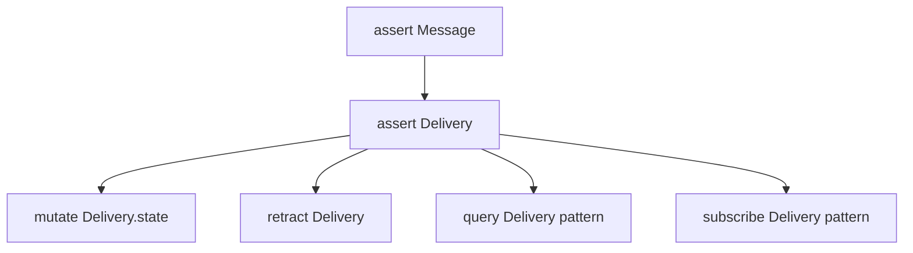
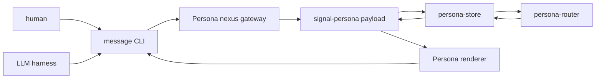
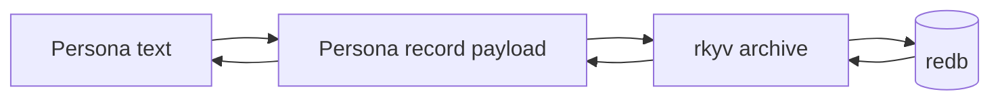
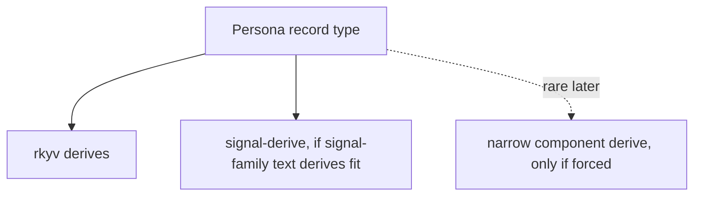
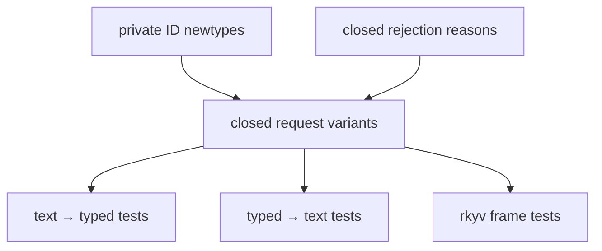
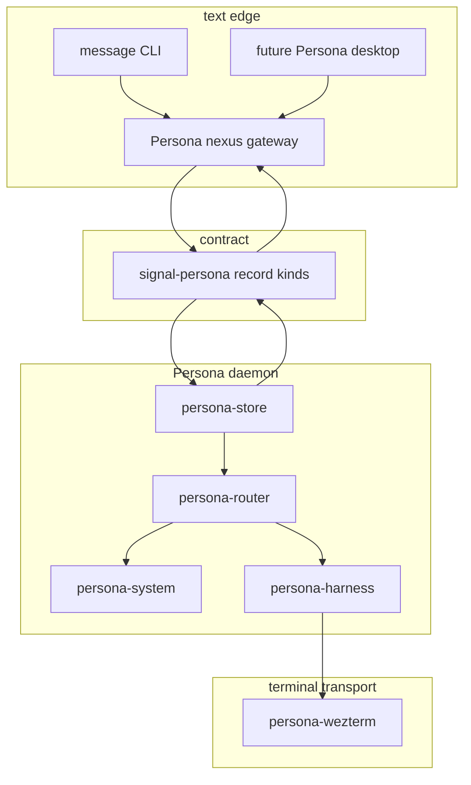

# Persona and Nexus Translation

Status: operator design report
Author: Codex (operator)

This report answers whether Persona should use Nexus after the
`signal-persona` rename and after dropping the speculative `persona-derive`
idea. It also integrates `reports/designer/21-persona-on-nexus.md`.

The conclusion is stronger after reading the designer pass: Persona should use
Nexus as the protocol discipline. Persona contributes typed record kinds and
effect reactors; it should not invent a parallel Send/Deliver/Defer protocol.

---

## 1 · Reading Nexus Correctly

Nexus is the human-and-agent text surface for a typed signal wire. Its real
shape is:



The important rule is not the syntax. The important rule is perfect
specificity:



Nexus does not parse a generic record and decide later what it means. The first
token selects a verb, the record head selects a closed typed payload, and the
daemon forwards typed `signal` frames. Text exists at the edge. Internal daemon
traffic is rkyv `Frame` values.

That is the part Persona should copy.

---

## 2 · What Persona Should Reuse

Persona should reuse the Nexus pattern with `signal-persona` as the Persona
record-kind layer:



The current `nexus` daemon is tied to `signal::Request` and `criome`. Persona
should not force router traffic through sema-specific request variants. The
reusable part is the protocol shape:

| Nexus idea | Persona use |
|---|---|
| Text at the edge only | Agents and humans author text; daemon components speak `signal-persona` |
| Parser / renderer pair | Text client gateway and human-readable audit rendering |
| One text construct → one typed payload | No generic `Message { kind: String }` dispatch |
| FIFO replies by connection position | No mandatory correlation IDs in the transport layer |
| No durable state in translator | Durable state remains in `persona-store` |
| `nota-codec` dialect support | Persona text should ride the same codec family |
| Universal verbs | Persona operations become assert / mutate / retract / query / subscribe over Persona records |

---

## 3 · What Persona Should Not Reuse

Persona should not import sema-specific meanings just because Nexus already has
them.



Nexus verbs like Assert, Mutate, Query, and Subscribe fit Persona too. The
wrong move is narrower: do not coerce Persona into sema's existing `Node` /
`Edge` / `Graph` kinds or route it through criome-specific state. Persona's
domain is its own record graph: messages, deliveries, harness bindings,
focus/input observations, deadlines, and delivery outcomes.

The right move is to preserve the Nexus invariant and build the Persona
translation surface over Persona record kinds.

---

## 4 · Record Graph Mapping

Persona's earlier custom verbs collapse into Nexus operations:



| Former protocol idea | Nexus-shaped meaning |
|---|---|
| Send | Assert a `Message` record |
| Deliver | Assert or mutate a `Delivery` record |
| Defer | Mutate `Delivery.state` to `Deferred(reason)` |
| Discharge | Retract or mutate the `Delivery` record to a terminal state |
| Subscribe to focus or delivery | Subscribe to a pattern over observation or delivery records |
| Manual inspection | Query a pattern over the Persona record graph |

The router's state machine remains real, but it is no longer a protocol enum.
It is a reactor over records.

---

## 5 · Proposed Persona Text Gateway

Persona needs a gateway with the same architectural role as Nexus:



The existing `persona-message` CLI can be the first client-facing binary. It
should become a thin Persona-shaped wrapper over the Nexus text surface, not a
bespoke command grammar. The translator logic should be a library boundary, so
the same parser and renderer can serve:

| Surface | Use |
|---|---|
| `message` CLI | Human and harness-authored sends, inbox reads, diagnostics |
| Test harnesses | Text prompts that teach agents one compact surface |
| Future Persona desktop | Human-readable composer and inspector views |
| Audit tools | Rendering stored `signal-persona` frames back to text |

The name of the repo boundary is the open design question. Two clean options:

| Option | Shape |
|---|---|
| Keep in `persona-message` first | Best for minimal surface; parser/renderer move out only when a second client needs them |
| Create `nexus-persona` | Best if the text language becomes a first-class sibling of `nexus` |

I prefer starting inside `persona-message` only if the implementation stays
small and exact. If the first pass needs a daemon, subscriptions, and renderer
service at once, create `nexus-persona` immediately. The invariant matters more
than the repo count, but a real translator daemon is a real component.

---

## 6 · Text Shape

Persona should stop thinking in terms of ad hoc NOTA command records like a
temporary shell protocol. The text surface should be schema-shaped and
round-trip against Persona record kinds.

```mermaid
flowchart TB
    send["(Message operator responder \"status please\")"]
    request["PersonaAssert::Message"]
    delivery["DeliveryRequested"]
    reply["(Ok)"]

    send --> request
    request --> delivery
    delivery --> reply
```

A few candidate expressions, shown only as surface examples:

```nexus
(Message operator responder "send me a two word status")
(Delivery 100 responder Pending)
(| Delivery @messageSlot responder @state |)
*(| FocusObservation responder @focused |)
```

The exact record fields are still design work, but the verb level is no longer
open. The parser must land directly on the precise typed payload:

| Text shape | Typed value |
|---|---|
| `(Message …)` | `PersonaAssert::Message(Message)` |
| `(Delivery …)` | `PersonaAssert::Delivery(Delivery)` |
| `~(Delivery …)` | `PersonaMutate::Delivery(...)` |
| `(| Delivery … |)` | `PersonaQuery::Delivery(DeliveryQuery)` |
| `*(| FocusObservation … |)` | subscription over `FocusObservationQuery` |

No downstream component should receive a string command and switch on its text.

---

## 7 · Relationship To `signal-persona`

`signal-persona` remains the binary contract for Persona record kinds and
Persona's per-verb payloads. The text gateway is a projection, not a
replacement.



The route through the system should be:

1. Parse text into a Nexus verb over a closed `signal-persona` payload.
2. Send length-prefixed rkyv using the signal-family envelope.
3. Store durable state through `persona-store`.
4. Route through actors using typed values.
5. Render typed replies or audit values back to Persona text only at the edge.

---

Layering on `signal` needs one careful implementation decision. `signal-forge`
establishes the design precedent: layered crates reuse signal's Frame,
handshake, and auth while contributing only audience-scoped payloads. The
mechanics need to be confirmed in code: either `signal` exposes a reusable
generic envelope for layered payloads, or `signal-persona` mirrors the frame
shape until `signal` can be generalized. The design direction is still clear:
do not duplicate envelope concepts as a separate Persona protocol.

---

## 8 · Dropping `persona-derive`

`persona-derive` should not exist as a broad repo. It was speculative noise.



The stronger rule:

| Need | Home |
|---|---|
| rkyv archive / serialize / deserialize | Stock `rkyv` derives |
| NOTA / schema / Nexus-pattern derivation matching signal-family rules | Reuse or extend `signal-derive` |
| Store-table mapping forced by redb ergonomics | Narrow component derive, e.g. `persona-store-derive`, only when a real repeated shape exists |
| Broad Persona macro bucket | Do not create |

Macros are not an ecosystem boundary. A derive crate appears only when the
same code-generation shape repeats enough to deserve a typed noun.

---

## 9 · Implementation Consequences

The next `signal-persona` pass should be stricter because Nexus makes weak
typing more visible:



Concrete effects:

| Area | Change |
|---|---|
| `signal-persona` | Rebase from invented request/reply protocol toward Persona record kinds and per-verb payloads |
| `persona-message` | Become the first Persona Nexus client or wrapper |
| `persona-router` | Subscribe to delivery/observation records and mutate delivery state |
| `persona-store` | Become sema-shaped for Persona: validate, persist, query, subscribe, broadcast |
| `persona` | Compose the text gateway as an edge service, not a central state owner |

---

The existing bead `primary-tss` should pivot. The typed-identity work still
matters, but the larger task is no longer "strengthen the invented protocol";
it is "make `signal-persona` the Persona record-kind layer over signal-family
verbs."

---

## 10 · Decision Points

These need user direction before they become repository work:

| Decision | Recommendation |
|---|---|
| Should Persona use Nexus discipline? | Yes. Persona's apparent verbs are Nexus verbs over Persona record kinds. |
| Should Persona depend on the current `nexus` daemon? | Not directly while it is criome-specific. Reuse/genericize the daemon pattern. |
| Should the Persona text gateway live in `persona-message` or a new repo? | Start in `persona-message` only if small; create `nexus-persona` when it becomes a daemon or shared renderer. |
| Should `persona-derive` exist? | No. Drop it. Use stock derives, `signal-derive`, or a narrow component derive only when forced. |
| Should `signal-persona` own Frame/handshake/auth? | No as a design direction. Reuse signal-family envelope concepts; adjust `signal` if needed. |
| Should `persona-store` mirror criome? | Yes. It validates, persists, queries, and broadcasts subscriptions for Persona records. |

---

## 11 · Updated Architecture View



The architecture keeps the same separation as Nexus:

- text is for humans and LLM harnesses;
- `signal-persona` owns Persona record kinds and per-verb payloads;
- `persona-store` owns durable state and subscription fanout;
- the translator owns no durable state;
- no component receives stringly commands.
