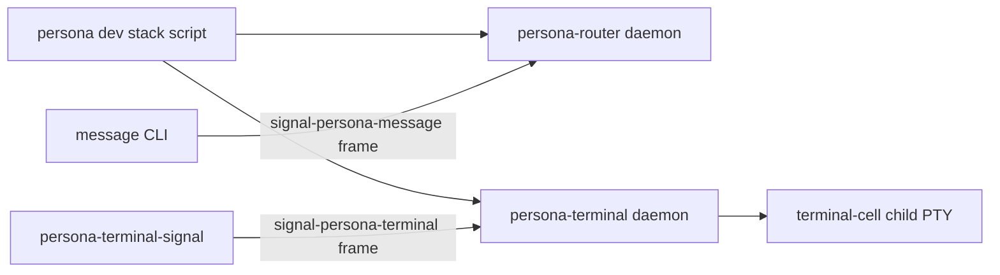
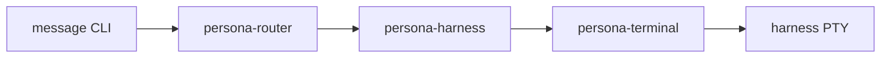

# 110 - Persona meta integration start

*Operator report. Current executable shape for starting the Persona stack from
the `persona` meta repository, with the systemd decision and the remaining
message-to-terminal seam made explicit.*

## Read

Current integration truth comes from:

- `persona/ARCHITECTURE.md` — `persona` is the host-level engine manager and
  apex Nix/deployment repo.
- `reports/designer/115-persona-engine-manager-architecture.md` — one
  privileged `persona` daemon supervises multiple engine instances and pushes
  socket paths to components.
- `reports/designer/114-persona-vision-as-of-2026-05-11.md` — the federation is
  `persona`, `persona-mind`, `persona-router`, `persona-system`,
  `persona-harness`, `persona-terminal`, plus `persona-message` as proxy.
- `reports/operator-assistant/105-persona-terminal-message-integration-review.md`
  — `persona-terminal` has a real terminal-cell-backed Signal witness; the
  missing seam is message/router/harness registration into terminal.
- `persona-message/ARCHITECTURE.md` — `message` can proxy `Send` and `Inbox`
  through `PERSONA_MESSAGE_ROUTER_SOCKET`; the local ledger path is
  transitional.
- `persona-router/ARCHITECTURE.md` — router accepts `signal-persona-message`
  frames and owns routing policy, but current state is in-memory and recipient
  endpoint registration is not exposed as a durable daemon control surface.
- `persona-terminal/ARCHITECTURE.md` — terminal owns terminal-cell sessions,
  named-session Sema metadata, Signal terminal request witness, and raw byte
  transport.
- `persona-harness/ARCHITECTURE.md` — harness remains the harness identity /
  lifecycle / terminal-adapter boundary.

## Systemd read

There are Rust libraries for systemd integration, but they serve different
layers:

| Need | Rust surface | Use now |
|---|---|---|
| Daemon readiness / watchdog / socket activation | `sd-notify` — lightweight Rust crate for readiness and state notifications to systemd. Docs: <https://docs.rs/sd-notify/latest/sd_notify/> | Good for component daemons once they are real services. |
| Direct systemd control over D-Bus | `zbus_systemd` — pure Rust bindings to systemd D-Bus services, including the `systemd1` module. Docs: <https://docs.rs/zbus_systemd/latest/zbus_systemd/> | Later, if the `persona` daemon itself asks systemd to start transient units or inspect units. |
| Official systemd Manager API | `org.freedesktop.systemd1.Manager` has `StartUnit`, `StopUnit`, `StartTransientUnit`, job signals, and permission checks. Docs: <https://man.archlinux.org/man/org.freedesktop.systemd1.5.en> | Useful for the production supervisor design. |

The integration decision I recommend:

1. **Dev/test first:** `persona` owns Nix apps/scripts that start the component
   binaries in a temporary runtime directory. This gives repeatable stateful
   tests without requiring host service installation.
2. **Production next:** `persona` owns a NixOS module that declares systemd
   services for the privileged `persona` daemon and, later, per-engine
   component units.
3. **Rust systemd integration later:** use `sd-notify` inside daemons for
   readiness; use `zbus_systemd` only if `persona` needs to create/control
   transient systemd units dynamically. Do not make a Rust systemd client the
   first integration dependency.

## Current runtime slice

The smallest honest stack the meta repo can start today is:



This proves two live halves:

- `message` reaches `persona-router` as Signal, and `Inbox` reads the router's
  accepted message state.
- `persona-terminal` starts a named terminal-cell session, accepts Signal
  terminal input, and captures PTY output.

It does **not** yet prove:



The missing pieces are outside the `persona` meta repo and are already covered
by current work:

- `persona-router` needs a typed daemon control surface or relation contract
  for registering a recipient endpoint with a terminal binding.
- `persona-harness` needs a daemon/control surface that accepts router delivery
  requests over `signal-persona-harness` and calls `signal-persona-terminal`.
- `persona-terminal` needs a named supervisor socket so clients talk to the
  terminal daemon by terminal name, not by carrying per-cell socket paths.
- `persona-message` needs the stale local ledger/delivery code retired from new
  tests so the only new message path is `message -> router`.

## Persona-harness place

`persona-harness` stays in the engine. Its place is between router policy and
terminal bytes:

```text
router decides delivery is allowed
  -> harness maps recipient identity and harness capability to terminal action
  -> terminal writes raw bytes to the PTY
```

The router should not know harness provider details. The terminal should not
know Persona message semantics. Harness is the semantic adapter between those
planes.

## First meta-repo work

The `persona` repo now adds:

1. A Nix app `persona-dev-stack` that starts the current runnable halves:
   `persona-router-daemon`, `persona-terminal-daemon`, and a configured
   `message` CLI environment.
2. A Nix app `persona-dev-stack-smoke` that runs the same stack long enough to
   prove:
   - router socket is live;
   - `message '(Send responder ...)'` enters router through Signal;
   - `message '(Inbox responder)'` sees the accepted message;
   - terminal Signal input/capture works on the named `responder` session.
3. An architecture update stating that this is an integration scaffold, not the
   final supervisor.

This starts the meta-repo integration now while preserving truth: the final
message-delivery witness waits on the router/harness/terminal control seam.

## Verification

The live stateful runner passed with:

```sh
nix run .#dev-stack-smoke -L
```

The pure flake suite passed with:

```sh
nix flake check -L
```

`dev-stack-smoke` is intentionally an app rather than a pure `checks`
derivation because the terminal daemon owns a live PTY. The pure check
`persona-dev-stack-script-builds` verifies the Nix-created runners exist.
