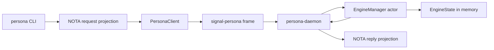
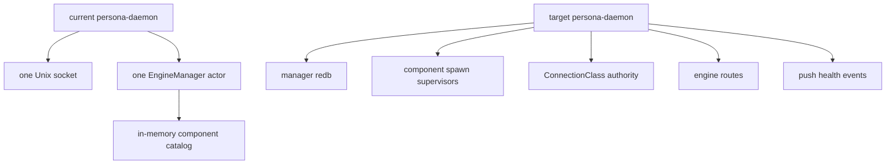
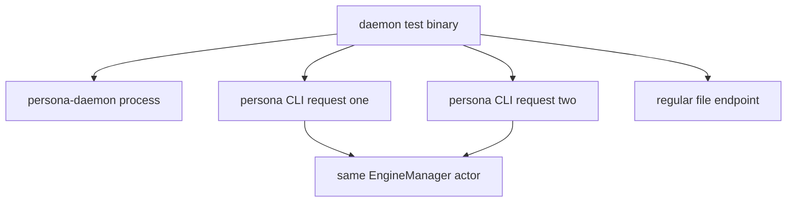

# 111 - Persona daemon implementation review

*Operator report. Scope: the `persona` repo work I landed in
commits `5a9769b3` (`persona daemon client slice`) and
`7a3676f1` (`rename persona daemon binary`). Purpose: explain
the current architecture, show representative code patterns,
and name the shortcomings without treating the scaffold as
finished architecture.*

---

## 0 - Short Read

The `persona` repo now has a real daemon-client slice:

- `persona` is a thin command-line client.
- `persona-daemon` is the long-lived process.
- The client sends one length-prefixed `signal-persona` frame over a Unix
  socket.
- `persona-daemon` owns one live Kameo `EngineManager` actor.
- The actor owns an in-memory `EngineState`.
- Replies are projected back to one NOTA record on stdout.

This is useful, but it is still a scaffold. It is not yet the real host
engine manager described by `reports/designer/116-persona-apex-development-plan.md`
and `reports/designer/115-persona-engine-manager-architecture.md`. There is
no manager redb, no component process supervision, no per-engine resource
catalog, no real `ConnectionClass` minting, no peer-credential check, no
spawn envelope, and no component socket topology decision.

The next implementation should not deepen this scaffold blindly. It should
wait for the designer decisions called out in
`reports/designer-assistant/16-new-designer-documents-analysis.md`: where
`ConnectionClass` lives, whether `persona` accepts all component sockets or
components accept their own sockets, one writer actor per redb file, whether
hot-swap is deferred, and how contract relation boundaries are named.

---

## 1 - Current Implemented Shape



The important boundary is that `persona` no longer constructs and starts the
manager actor in-process. The CLI decodes text, lowers it into the
`signal-persona` management contract, sends a frame to the daemon, waits for
one reply frame, renders one NOTA record, and exits.

The daemon is the first production-shaped noun, but not yet production
complete. It binds one Unix socket, starts one `EngineManager`, and dispatches
one request per accepted connection.



---

## 2 - Files Touched

Current code map in `/git/github.com/LiGoldragon/persona`:

| File | What it does |
|---|---|
| `src/main.rs` | Thin `persona` CLI client. |
| `src/bin/persona_daemon.rs` | Long-lived daemon binary entry point. |
| `src/transport.rs` | Unix socket endpoint, caller, frame codec, client, daemon loop. |
| `src/manager.rs` | Kameo `EngineManager` actor and message handlers. |
| `src/state.rs` | In-memory engine/component status reducer. |
| `src/request.rs` | NOTA CLI request/reply projection to and from `signal-persona`. |
| `tests/daemon.rs` | Process-level daemon/client tests. |
| `tests/manager.rs` | Actor-path and state-persistence tests. |
| `Cargo.toml` | Adds `persona-daemon` binary. |
| `flake.nix` | Adds `nix run .#persona-daemon`. |
| `ARCHITECTURE.md` / `TESTS.md` | Documents current slice and witnesses. |

---

## 3 - Representative Code

### 3.1 Thin CLI

This is the style I have been trying to use for command-line surfaces:
decode the process boundary, hand off to an object, and render exactly one
reply.

```rust
let request = match CommandLine::from_env().decode_request() {
    Ok(request) => request,
    Err(error) => {
        eprintln!("error: {error}");
        return ExitCode::from(2);
    }
};
let engine_request = request.into_engine_request();

let reply = match PersonaClient::from_environment()
    .submit(engine_request)
    .await
{
    Ok(reply) => reply,
    Err(error) => {
        eprintln!("error: {error}");
        return ExitCode::from(2);
    }
};
```

What this gets right:

- The CLI does not own engine state.
- The CLI calls a daemon.
- The CLI uses a typed projection into `signal-persona`.

What is still wrong:

- Error output is plain stderr, not a typed NOTA failure record.
- There is no daemon auto-discovery beyond `PERSONA_SOCKET` or `/tmp/persona.sock`.
- Caller identity still comes from environment fallback, not from real
  infrastructure authority.

### 3.2 Daemon Transport Objects

Most behavior is attached to data-bearing types:

```rust
#[derive(Debug, Clone, PartialEq, Eq)]
pub struct PersonaEndpoint {
    path: PathBuf,
}

impl PersonaEndpoint {
    pub fn from_environment() -> Self {
        match std::env::var_os("PERSONA_SOCKET") {
            Some(path) => Self::from_path(path),
            None => Self::from_path("/tmp/persona.sock"),
        }
    }

    fn unlink_existing_socket(&self) -> Result<()> {
        match std::fs::symlink_metadata(&self.path) {
            Ok(metadata) if metadata.file_type().is_socket() => {
                std::fs::remove_file(&self.path)?;
                Ok(())
            }
            Ok(_) => Err(Error::SocketPathOccupied {
                path: self.path.clone(),
            }),
            Err(error) if error.kind() == std::io::ErrorKind::NotFound => Ok(()),
            Err(error) => Err(error.into()),
        }
    }
}
```

This is representative of the code style: a small object owns a concrete
piece of state and the behavior that belongs to that state. It is not a
free helper function.

The socket unlink check was added after reviewing the first cut: the daemon
may remove a stale socket, but it must not delete an arbitrary regular file
at the endpoint path.

### 3.3 Signal Frame Codec

The wire path is explicit and small:

```rust
pub async fn read_frame(&self, stream: &mut UnixStream) -> Result<Frame> {
    let mut prefix = [0_u8; 4];
    stream.read_exact(&mut prefix).await?;
    let length = u32::from_be_bytes(prefix) as usize;
    if length > self.maximum_frame_bytes {
        return Err(Error::DaemonFrameTooLarge { bytes: length });
    }

    let mut bytes = Vec::with_capacity(4 + length);
    bytes.extend_from_slice(&prefix);
    bytes.resize(4 + length, 0);
    stream.read_exact(&mut bytes[4..]).await?;

    Ok(Frame::decode_length_prefixed(&bytes)?)
}
```

The useful part is that the daemon boundary is already Signal-shaped. The
weak part is that this is a generic connection codec with no peer-credential
check and no auth-context derivation. It only checks that a frame carries
some auth proof.

### 3.4 Current Kameo Actor

The manager actor is data-bearing:

```rust
#[derive(Debug)]
pub struct EngineManager {
    state: EngineState,
    events: Vec<ManagerEvent>,
}

impl EngineManager {
    pub async fn start() -> ActorRef<Self> {
        let reference = Self::spawn(Self::new(EngineState::default_catalog()));
        reference.wait_for_startup().await;
        reference
    }

    fn handle_request(&mut self, request: EngineRequest) -> EngineReply {
        self.events.push(ManagerEvent::EngineRequestAccepted);
        let reply = match request {
            EngineRequest::EngineStatusQuery(EngineStatusQuery { .. }) => {
                self.state.engine_status()
            }
            EngineRequest::ComponentStatusQuery(query) => self.state.component_status(query),
            EngineRequest::ComponentStartup(startup) => self.state.start_component(startup),
            EngineRequest::ComponentShutdown(shutdown) => self.state.stop_component(shutdown),
        };
        self.events.push(ManagerEvent::EngineReplyCreated);
        reply
    }
}
```

This follows the Kameo rule that `Self` is the actor: the actor noun owns
state and receives messages.

The weak part is that `events: Vec<ManagerEvent>` is a witness trace, not a
production event log. The production form should be a manager Sema table plus
after-commit push events. This trace exists mainly to prove a request flowed
through the actor path.

### 3.5 Current Daemon Loop

```rust
pub async fn serve(self) -> Result<()> {
    self.endpoint.unlink_existing_socket()?;
    let listener = UnixListener::bind(self.endpoint.as_path())?;
    let manager = EngineManager::start().await;

    println!(
        "persona-daemon socket={}",
        self.endpoint.as_path().display()
    );

    loop {
        let (stream, _) = listener.accept().await?;
        if let Err(error) = self.handle_stream(stream, &manager).await {
            eprintln!("persona-daemon connection error: {error}");
        }
    }
}
```

This is deliberately simple. It proves the daemon-client slice without
pretending to be the final engine boundary.

Shortcomings:

- It handles streams serially.
- It has no graceful shutdown message.
- It does not supervise child component daemons.
- It does not persist manager state.
- It does not mint `ConnectionClass`.
- It does not read Unix peer credentials.

### 3.6 Current In-Memory Reducer

```rust
pub fn default_catalog() -> Self {
    Self {
        status: EngineStatus {
            generation: EngineGeneration::new(0),
            phase: EnginePhase::Starting,
            components: vec![
                ComponentStatus {
                    name: ComponentName::new("persona-mind"),
                    kind: ComponentKind::Mind,
                    desired_state: ComponentDesiredState::Running,
                    health: ComponentHealth::Starting,
                },
                // ...
            ],
        },
    }
}
```

This is one of the more scaffold-looking pieces. It is useful as a default
catalog for tests, but the component catalog should move into manager-owned
configuration and durable state. Right now, adding a component means editing
code. That is wrong for the target architecture.

---

## 4 - Tests I Added



Current process-level witnesses:

| Test | What it proves |
|---|---|
| `constraint_persona_cli_talks_to_persona_daemon_over_socket` | Two separate `persona` CLI invocations talk to one daemon and observe state preserved in the daemon-owned actor. |
| `constraint_persona_daemon_does_not_delete_non_socket_endpoint_path` | Startup refuses a regular file at the socket path and preserves it. |

Current actor-level witnesses:

| Test | What it proves |
|---|---|
| `constraint_engine_request_reply_is_created_by_kameo_manager_path` | A management request goes through the Kameo actor and records a witness trace. |
| `constraint_engine_manager_keeps_component_state_between_messages` | The actor keeps changed component state across two messages. |
| `constraint_engine_manager_is_not_a_zst_actor` | The public actor is data-bearing, not a zero-sized behavior marker. |

Nix checks currently exercised:

```sh
nix develop -c cargo test
nix flake check -L
nix run .#dev-stack-smoke -L
nix eval .#apps.x86_64-linux.persona-daemon.program
```

---

## 5 - Tests That Are Still Missing

The tests are useful but not enough.

| Missing witness | Why it matters |
|---|---|
| Auth proof is infrastructure-minted | Current `PersonaCaller` uses `PERSONA_OPERATOR` or `operator`. That is not the final identity model. |
| Missing-auth frame rejection | `PersonaFrameCodec::request_from_frame` rejects frames without auth, but there is no direct test. |
| Too-large frame rejection | `DaemonFrameTooLarge` is implemented but not tested. |
| Malformed frame rejection | The daemon should return/log a clear error without corrupting state. |
| Concurrent clients | The daemon currently handles connections serially. We do not know the real behavior under multiple clients. |
| Graceful daemon shutdown | Tests kill the child process. There is no typed shutdown request yet. |
| Durable manager state | State disappears when the daemon exits. The target needs manager redb. |
| Component spawn supervision | Startup/shutdown only mutates desired state; no component process is actually started or stopped. |
| Per-engine socket paths | Current default is `/tmp/persona.sock`, not `/var/run/persona/<engine-id>/...`. |
| ConnectionClass rejection of payload-supplied class | The current contract path does not yet implement that boundary. |
| CLI error replies as NOTA | Successful output is NOTA. Error output is not yet a typed NOTA reply. |

---

## 6 - Honest Shortcomings

### 6.1 This Is Not Yet A Real Engine Manager

The architecture says `persona-daemon` owns the host-level engine manager.
The implementation owns only an in-memory list of components. There is no
engine catalog, no redb, no route table, no lifecycle observations, and no
spawn supervisor.

The code is correct only for the first slice: "can a CLI send a typed Signal
request to a long-lived daemon-owned actor?"

### 6.2 The Identity Path Is Provisional

This is the current code:

```rust
pub fn from_environment() -> Self {
    match std::env::var("PERSONA_OPERATOR") {
        Ok(name) => Self::new(name),
        Err(_) => Self::new("operator"),
    }
}

pub fn auth_proof(&self) -> AuthProof {
    AuthProof::LocalOperator(LocalOperatorProof::new(self.as_str()))
}
```

This is not good enough. It is a scaffold that lets the Signal frame carry an
auth proof shape. The final system must derive identity from process/socket
authority and manager-minted context, not from a free environment variable.

### 6.3 The Event Trace Is A Test Crutch

This code is suspicious:

```rust
fn read_events(&mut self, probe: TraceProbe) -> Vec<ManagerEvent> {
    let _satisfied = self.events.len() >= probe.minimum_events;
    self.events.push(ManagerEvent::TraceRead);
    self.events.clone()
}
```

It exists to make the actor-path test observable, but it is not a good domain
model. `_satisfied` is a tell: the probe is half-real. A real event log should
be durable, sequence-numbered, and queryable through a real projection, not a
mutable vector used by tests.

### 6.4 The Default Component Catalog Is Embedded In Code

`EngineState::default_catalog()` hard-codes `persona-mind`,
`persona-router`, `persona-system`, `persona-harness`, and
`persona-terminal`. That is acceptable only as a bootstrap fixture. The target
needs component definitions from manager-owned configuration/state, with
per-engine resource paths assigned by the daemon.

### 6.5 Error Surface Is Not Clean Yet

The success path is "one NOTA record out." The failure path is currently
`eprintln!("error: {error}")` and exit code 2. That is normal CLI hygiene, but
it is not the final Persona CLI shape if we want every machine-consumed
surface to be typed and parseable.

### 6.6 The Daemon Loop Is Too Sequential

The daemon currently awaits each accepted stream through decode, actor ask,
and reply before accepting another stream. That is enough for the tests. It is
not the final runtime shape. Once there are multiple CLIs, harnesses, and
component daemons, connection handling should spawn per-stream tasks or use a
named acceptor actor pattern that preserves backpressure deliberately.

---

## 7 - Patterns I Have Been Using

### 7.1 Data-Bearing Boundary Objects

Examples: `PersonaEndpoint`, `PersonaCaller`, `PersonaFrameCodec`,
`PersonaClient`, `PersonaDaemon`, `CommandLine`, `RequestFile`.

The pattern is:

1. Put state in a noun.
2. Put behavior on that noun.
3. Keep top-level binaries thin.
4. Avoid free helper functions for domain behavior.

This aligns with `skills/rust-discipline.md`, but it can become too many thin
types if not watched. The line I am trying to hold is: create a type when it
has state, policy, or a boundary role. Do not create a type just to name one
function.

### 7.2 Projection Types Around Contract Types

The CLI text surface uses local NOTA records, then lowers to the
`signal-persona` contract:

```rust
pub enum PersonaRequest {
    EngineStatusQuery(EngineStatusQuery),
    ComponentStatusQuery(ComponentStatusQuery),
    ComponentStartup(ComponentStartup),
    ComponentShutdown(ComponentShutdown),
}

impl PersonaRequest {
    pub fn into_engine_request(self) -> contract::EngineRequest {
        match self {
            Self::ComponentShutdown(request) => {
                contract::EngineRequest::ComponentShutdown(contract::ComponentShutdown {
                    component: request.component.into_contract(),
                })
            }
            // ...
        }
    }
}
```

This makes the CLI surface explicit, but it also duplicates shape. That is
acceptable while the user-facing NOTA projection is not identical to the wire
contract. If the projection becomes identical, we should remove the duplicate
layer.

### 7.3 Constraint-Named Tests

I have been naming tests after the architectural constraint they witness:

```rust
#[test]
fn constraint_persona_cli_talks_to_persona_daemon_over_socket() { ... }

#[tokio::test]
async fn constraint_engine_manager_keeps_component_state_between_messages() { ... }
```

This is one of the better patterns. It makes the test suite read like a list
of promises the code must keep. The next step is to make the tests stranger
and stricter: prove that the implementation cannot satisfy the test without
using the intended component boundary.

### 7.4 Nix-Named Surfaces

The repo exposes named apps/checks:

```nix
apps = forSystems (system: {
  default = {
    type = "app";
    program = "${self.packages.${system}.default}/bin/persona";
  };
  persona-daemon = {
    type = "app";
    program = "${self.packages.${system}.default}/bin/persona-daemon";
  };
});
```

This is good for repeatable work and documentation. It is also where the
rename from `personad` to `persona-daemon` paid off: the Nix app now exposes
the full noun instead of a shorthand.

---

## 8 - Decisions I Am Waiting On

These are from `reports/designer-assistant/16-new-designer-documents-analysis.md`
and should not be papered over by code:

| Decision | Why it blocks deeper implementation |
|---|---|
| Where `ConnectionClass` lives | It is now used by mind, router, system, harness, terminal, and message. Keeping it in the wrong contract will force dependency drift. |
| Socket boundary model | Either `persona-daemon` accepts all component connections, or component daemons accept their own sockets using manager-minted auth context. The current code only proves the manager socket. |
| One redb writer actor per redb file | Before adding manager redb, we need the writer actor boundary named. |
| Preserve `OtherPersona` provenance | Router/terminal gates should not erase source class by rewriting it to `System`. |
| Input-buffer producer | Prompt cleanliness should probably come from `persona-terminal`; focus comes from `persona-system`. The docs need one answer. |
| Hot-swap milestone | Hot-swap should probably be deferred until catalog, spawn, health, and class minting exist. |
| Contract repo relation boundaries | Component contracts are starting to hold multiple relations. That needs a rule before more records land. |
| Typed Nexus body migration | Router/harness durable schemas should not harden around opaque `MessageBody(String)`. |

---

## 9 - What I Would Do Next After Decisions

If the designer resolves socket and identity boundaries, my next `persona`
repo work should be:

1. Add a manager-owned Sema/redb layer with one explicit writer actor.
2. Replace `EngineState::default_catalog()` with manager catalog records.
3. Add a typed event log for manager lifecycle events.
4. Add the first spawn envelope type and test that engine socket/state paths
   include `EngineId`.
5. Replace `PersonaCaller::from_environment()` with a real auth-context path.
6. Add a typed shutdown/control request for `persona-daemon`.
7. Make daemon stream handling concurrent or actorized, with a test that two
   CLI clients can hit the daemon without corrupting state.
8. Convert CLI error output into typed NOTA replies where the surface is
   machine-facing.

If the designer does not resolve those boundaries yet, the safe work is more
testing around the current scaffold:

- missing-auth frame rejection;
- oversized-frame rejection;
- malformed-frame rejection;
- stale socket vs non-socket endpoint behavior;
- no direct in-process manager use from `persona` CLI.

---

## 10 - Bottom Line

The code I generated is best described as **a real daemon-client proof slice**
with a conservative Rust shape:

- data-bearing nouns;
- methods on nouns;
- Kameo actor owns its state;
- Signal frame at daemon boundary;
- NOTA projection at CLI boundary;
- Nix-named test and app surfaces;
- constraint-named witnesses.

The risk is that the scaffold looks more complete than it is. It proves the
right first question, but not the final architecture. The most suspicious
code today is the environment-derived auth proof, the in-memory hard-coded
catalog, and the trace vector used as an actor-path witness. Those should not
survive into the real engine manager.

