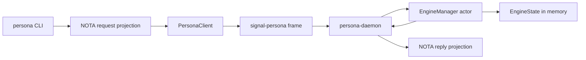
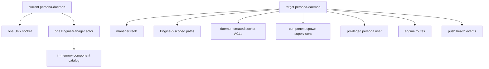
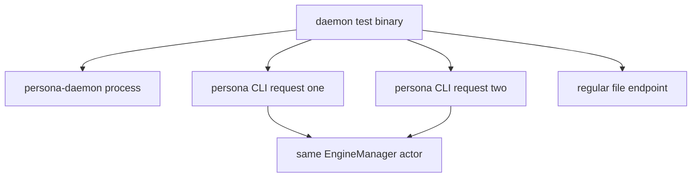

# 111 - Persona daemon implementation review

*Operator report. Scope: the `persona` repo work I landed in
commits `5a9769b3` (`persona daemon client slice`) and
`7a3676f1` (`rename persona daemon binary`). Purpose: explain
the current architecture, show representative code patterns,
and name the shortcomings without treating the scaffold as
finished architecture.*

---

## 0 - Short Read

The `persona` repo now has a real daemon-client slice:

- `persona` is a thin command-line client.
- `persona-daemon` is the long-lived process.
- The client sends one length-prefixed `signal-persona` frame over a Unix
  socket.
- `persona-daemon` owns one live Kameo `EngineManager` actor.
- The actor owns an in-memory `EngineState`.
- Replies are projected back to one NOTA record on stdout.

This is useful, but it is still a scaffold. It is not yet the real host
engine manager described by `reports/designer/116-persona-apex-development-plan.md`
and `reports/designer/115-persona-engine-manager-architecture.md`. There is
no manager redb, no component process supervision, no per-engine resource
catalog, no `EngineId`-scoped socket/state layout, no daemon-created socket
ACLs, no privileged-user mode, and no spawn envelope.

> **Update after designer/125 and designer/126.** The next `persona`
> implementation track is no longer an open decision table. It is
> `reports/designer/126-implementation-tracks-operator-handoff.md` T3:
> persona daemon socket setup, privileged-user mode, manager redb,
> engine catalog, spawn envelope, and `EngineId`-scoped paths. The
> trust model is settled in
> `reports/designer/125-channel-choreography-and-trust-model.md`: the
> daemon creates sockets correctly at spawn time; components own and
> accept their own sockets; filesystem ACLs are the engine boundary;
> `ConnectionClass`/`MessageOrigin` are provenance records in
> `signal-persona-auth`, not in-band runtime gates. Wherever
> `reports/designer/124-synthesis-drift-audit-plus-development-plans.md`
> still says "ConnectionClass minting", "AuthProof signing",
> "class-aware delivery", or "class-aware input gate", designer/125 wins.

---

## 1 - Current Implemented Shape



The important boundary is that `persona` no longer constructs and starts the
manager actor in-process. The CLI decodes text, lowers it into the
`signal-persona` management contract, sends a frame to the daemon, waits for
one reply frame, renders one NOTA record, and exits.

The daemon is the first production-shaped noun, but not yet production
complete. It binds one Unix socket, starts one `EngineManager`, and dispatches
one request per accepted connection.



---

## 2 - Files Touched

Current code map in `/git/github.com/LiGoldragon/persona`:

| File | What it does |
|---|---|
| `src/main.rs` | Thin `persona` CLI client. |
| `src/bin/persona_daemon.rs` | Long-lived daemon binary entry point. |
| `src/transport.rs` | Unix socket endpoint, caller, frame codec, client, daemon loop. |
| `src/manager.rs` | Kameo `EngineManager` actor and message handlers. |
| `src/state.rs` | In-memory engine/component status reducer. |
| `src/request.rs` | NOTA CLI request/reply projection to and from `signal-persona`. |
| `tests/daemon.rs` | Process-level daemon/client tests. |
| `tests/manager.rs` | Actor-path and state-persistence tests. |
| `Cargo.toml` | Adds `persona-daemon` binary. |
| `flake.nix` | Adds `nix run .#persona-daemon`. |
| `ARCHITECTURE.md` / `TESTS.md` | Documents current slice and witnesses. |

---

## 3 - Representative Code

### 3.1 Thin CLI

This is the style I have been trying to use for command-line surfaces:
decode the process boundary, hand off to an object, and render exactly one
reply.

```rust
let request = match CommandLine::from_env().decode_request() {
    Ok(request) => request,
    Err(error) => {
        eprintln!("error: {error}");
        return ExitCode::from(2);
    }
};
let engine_request = request.into_engine_request();

let reply = match PersonaClient::from_environment()
    .submit(engine_request)
    .await
{
    Ok(reply) => reply,
    Err(error) => {
        eprintln!("error: {error}");
        return ExitCode::from(2);
    }
};
```

What this gets right:

- The CLI does not own engine state.
- The CLI calls a daemon.
- The CLI uses a typed projection into `signal-persona`.

What is still wrong:

- Error output is plain stderr, not a typed NOTA failure record.
- There is no daemon auto-discovery beyond `PERSONA_SOCKET` or the scaffold
  `/tmp/persona.sock`.
- The target socket layout is `/var/run/persona/<engine-id>/...`, with the
  manager and component sockets created by the daemon during engine setup.
- Caller identity still comes from environment fallback. The current
  `AuthProof::LocalOperator` path should be retired, not hardened.

### 3.2 Daemon Transport Objects

Most behavior is attached to data-bearing types:

```rust
#[derive(Debug, Clone, PartialEq, Eq)]
pub struct PersonaEndpoint {
    path: PathBuf,
}

impl PersonaEndpoint {
    pub fn from_environment() -> Self {
        match std::env::var_os("PERSONA_SOCKET") {
            Some(path) => Self::from_path(path),
            None => Self::from_path("/tmp/persona.sock"),
        }
    }

    fn unlink_existing_socket(&self) -> Result<()> {
        match std::fs::symlink_metadata(&self.path) {
            Ok(metadata) if metadata.file_type().is_socket() => {
                std::fs::remove_file(&self.path)?;
                Ok(())
            }
            Ok(_) => Err(Error::SocketPathOccupied {
                path: self.path.clone(),
            }),
            Err(error) if error.kind() == std::io::ErrorKind::NotFound => Ok(()),
            Err(error) => Err(error.into()),
        }
    }
}
```

This is representative of the code style: a small object owns a concrete
piece of state and the behavior that belongs to that state. It is not a
free helper function.

The socket unlink check was added after reviewing the first cut: the daemon
may remove a stale socket, but it must not delete an arbitrary regular file
at the endpoint path.

### 3.3 Signal Frame Codec

The wire path is explicit and small:

```rust
pub async fn read_frame(&self, stream: &mut UnixStream) -> Result<Frame> {
    let mut prefix = [0_u8; 4];
    stream.read_exact(&mut prefix).await?;
    let length = u32::from_be_bytes(prefix) as usize;
    if length > self.maximum_frame_bytes {
        return Err(Error::DaemonFrameTooLarge { bytes: length });
    }

    let mut bytes = Vec::with_capacity(4 + length);
    bytes.extend_from_slice(&prefix);
    bytes.resize(4 + length, 0);
    stream.read_exact(&mut bytes[4..]).await?;

    Ok(Frame::decode_length_prefixed(&bytes)?)
}
```

The useful part is that the daemon boundary is already Signal-shaped. The
weak part is that this is a generic connection codec that still carries the
old `AuthProof` shape. After designer/125, that is not the target inside the
engine. Internal trust comes from filesystem ACLs on daemon-created sockets;
external message provenance becomes `MessageOrigin` in the
`signal-persona-auth` vocabulary. Operators should not implement a new record
named `AuthProof`, even if it is described as a slim tag. The safer name is
`IngressContext`, because it describes where the request entered without
implying a cryptographic proof or a runtime admission gate.

### 3.4 Current Kameo Actor

The manager actor is data-bearing:

```rust
#[derive(Debug)]
pub struct EngineManager {
    state: EngineState,
    events: Vec<ManagerEvent>,
}

impl EngineManager {
    pub async fn start() -> ActorRef<Self> {
        let reference = Self::spawn(Self::new(EngineState::default_catalog()));
        reference.wait_for_startup().await;
        reference
    }

    fn handle_request(&mut self, request: EngineRequest) -> EngineReply {
        self.events.push(ManagerEvent::EngineRequestAccepted);
        let reply = match request {
            EngineRequest::EngineStatusQuery(EngineStatusQuery { .. }) => {
                self.state.engine_status()
            }
            EngineRequest::ComponentStatusQuery(query) => self.state.component_status(query),
            EngineRequest::ComponentStartup(startup) => self.state.start_component(startup),
            EngineRequest::ComponentShutdown(shutdown) => self.state.stop_component(shutdown),
        };
        self.events.push(ManagerEvent::EngineReplyCreated);
        reply
    }
}
```

This follows the Kameo rule that `Self` is the actor: the actor noun owns
state and receives messages.

The weak part is that `events: Vec<ManagerEvent>` is a witness trace, not a
production event log. The production form should be a manager Sema table plus
after-commit push events. This trace exists mainly to prove a request flowed
through the actor path.

### 3.5 Current Daemon Loop

```rust
pub async fn serve(self) -> Result<()> {
    self.endpoint.unlink_existing_socket()?;
    let listener = UnixListener::bind(self.endpoint.as_path())?;
    let manager = EngineManager::start().await;

    println!(
        "persona-daemon socket={}",
        self.endpoint.as_path().display()
    );

    loop {
        let (stream, _) = listener.accept().await?;
        if let Err(error) = self.handle_stream(stream, &manager).await {
            eprintln!("persona-daemon connection error: {error}");
        }
    }
}
```

This is deliberately simple. It proves the daemon-client slice without
pretending to be the final engine boundary.

Shortcomings:

- It handles streams serially.
- It has no graceful shutdown message.
- It does not supervise child component daemons.
- It does not persist manager state.
- It does not create `EngineId`-scoped socket/state directories.
- It does not set socket owners or modes.
- It does not run in privileged-user mode.

### 3.6 Current In-Memory Reducer

```rust
pub fn default_catalog() -> Self {
    Self {
        status: EngineStatus {
            generation: EngineGeneration::new(0),
            phase: EnginePhase::Starting,
            components: vec![
                ComponentStatus {
                    name: ComponentName::new("persona-mind"),
                    kind: ComponentKind::Mind,
                    desired_state: ComponentDesiredState::Running,
                    health: ComponentHealth::Starting,
                },
                // ...
            ],
        },
    }
}
```

This is one of the more scaffold-looking pieces. It is useful as a default
catalog for tests, but the component catalog should move into manager-owned
configuration and durable state. Right now, adding a component means editing
code. That is wrong for the target architecture.

---

## 4 - Tests I Added



Current process-level witnesses:

| Test | What it proves |
|---|---|
| `constraint_persona_cli_talks_to_persona_daemon_over_socket` | Two separate `persona` CLI invocations talk to one daemon and observe state preserved in the daemon-owned actor. |
| `constraint_persona_daemon_does_not_delete_non_socket_endpoint_path` | Startup refuses a regular file at the socket path and preserves it. |

Current actor-level witnesses:

| Test | What it proves |
|---|---|
| `constraint_engine_request_reply_is_created_by_kameo_manager_path` | A management request goes through the Kameo actor and records a witness trace. |
| `constraint_engine_manager_keeps_component_state_between_messages` | The actor keeps changed component state across two messages. |
| `constraint_engine_manager_is_not_a_zst_actor` | The public actor is data-bearing, not a zero-sized behavior marker. |

Nix checks currently exercised:

```sh
nix develop -c cargo test
nix flake check -L
nix run .#dev-stack-smoke -L
nix eval .#apps.x86_64-linux.persona-daemon.program
```

---

## 5 - Tests That Are Still Missing

The tests are useful but not enough.

| Missing witness | Why it matters |
|---|---|
| Old auth-proof path is retired | Current `PersonaCaller` uses `PERSONA_OPERATOR` or `operator`. That path should disappear rather than become stronger. |
| Too-large frame rejection | `DaemonFrameTooLarge` is implemented but not tested. |
| Malformed frame rejection | The daemon should return/log a clear error without corrupting state. |
| Concurrent clients | The daemon currently handles connections serially. We do not know the real behavior under multiple clients. |
| Graceful daemon shutdown | Tests kill the child process. There is no typed shutdown request yet. |
| Durable manager state | State disappears when the daemon exits. The target needs manager redb. |
| Component spawn supervision | Startup/shutdown only mutates desired state; no component process is actually started or stopped. |
| Per-engine socket paths | Current default is scaffold `/tmp/persona.sock`, not `/var/run/persona/<engine-id>/...`. |
| Daemon-created socket ACLs | No test proves internal sockets are mode `0600` owned by `persona`, or that the message-proxy socket is mode `0660`. |
| Privileged-user mode | No process-table witness proves `persona-daemon` runs as the dedicated `persona` system user. |
| Spawn envelope | No witness proves component daemons receive socket/state paths through a typed spawn envelope. |
| CLI error replies as NOTA | Successful output is NOTA. Error output is not yet a typed NOTA reply. |

---

## 6 - Honest Shortcomings

### 6.1 This Is Not Yet A Real Engine Manager

The architecture says `persona-daemon` owns the host-level engine manager.
The implementation owns only an in-memory list of components. There is no
engine catalog, no redb, no route table, no lifecycle observations, no
`EngineId`-scoped paths, no socket ACL setup, and no spawn supervisor.

The code is correct only for the first slice: "can a CLI send a typed Signal
request to a long-lived daemon-owned actor?"

### 6.2 The Identity Path Is Provisional

This is the current code:

```rust
pub fn from_environment() -> Self {
    match std::env::var("PERSONA_OPERATOR") {
        Ok(name) => Self::new(name),
        Err(_) => Self::new("operator"),
    }
}

pub fn auth_proof(&self) -> AuthProof {
    AuthProof::LocalOperator(LocalOperatorProof::new(self.as_str()))
}
```

This is not good enough. After designer/125, this path should be retired,
not hardened. Internal engine traffic is admitted by filesystem ACLs on
daemon-created sockets. External message submission enters through the
user-writable message-proxy socket and becomes provenance:
`MessageOrigin::External(ConnectionClass::Owner)` or another typed origin
from `signal-persona-auth`.

### 6.3 The Event Trace Is A Test Crutch

This code is suspicious:

```rust
fn read_events(&mut self, probe: TraceProbe) -> Vec<ManagerEvent> {
    let _satisfied = self.events.len() >= probe.minimum_events;
    self.events.push(ManagerEvent::TraceRead);
    self.events.clone()
}
```

It exists to make the actor-path test observable, but it is not a good domain
model. `_satisfied` is a tell: the probe is half-real. A real event log should
be durable, sequence-numbered, and queryable through a real projection, not a
mutable vector used by tests.

### 6.4 The Default Component Catalog Is Embedded In Code

`EngineState::default_catalog()` hard-codes `persona-mind`,
`persona-router`, `persona-system`, `persona-harness`, and
`persona-terminal`. That is acceptable only as a bootstrap fixture. The target
needs component definitions from manager-owned configuration/state, with
per-engine resource paths assigned by the daemon.

### 6.5 Error Surface Is Not Clean Yet

The success path is "one NOTA record out." The failure path is currently
`eprintln!("error: {error}")` and exit code 2. That is normal CLI hygiene, but
it is not the final Persona CLI shape if we want every machine-consumed
surface to be typed and parseable.

### 6.6 The Daemon Loop Is Too Sequential

The daemon currently awaits each accepted stream through decode, actor ask,
and reply before accepting another stream. That is enough for the tests. It is
not the final runtime shape. Once there are multiple CLIs, harnesses, and
component daemons, connection handling should spawn per-stream tasks or use a
named acceptor actor pattern that preserves backpressure deliberately.

---

## 7 - Patterns I Have Been Using

### 7.1 Data-Bearing Boundary Objects

Examples: `PersonaEndpoint`, `PersonaCaller`, `PersonaFrameCodec`,
`PersonaClient`, `PersonaDaemon`, `CommandLine`, `RequestFile`.

The pattern is:

1. Put state in a noun.
2. Put behavior on that noun.
3. Keep top-level binaries thin.
4. Avoid free helper functions for domain behavior.

This aligns with `skills/rust-discipline.md`, but it can become too many thin
types if not watched. The line I am trying to hold is: create a type when it
has state, policy, or a boundary role. Do not create a type just to name one
function.

### 7.2 Projection Types Around Contract Types

The CLI text surface uses local NOTA records, then lowers to the
`signal-persona` contract:

```rust
pub enum PersonaRequest {
    EngineStatusQuery(EngineStatusQuery),
    ComponentStatusQuery(ComponentStatusQuery),
    ComponentStartup(ComponentStartup),
    ComponentShutdown(ComponentShutdown),
}

impl PersonaRequest {
    pub fn into_engine_request(self) -> contract::EngineRequest {
        match self {
            Self::ComponentShutdown(request) => {
                contract::EngineRequest::ComponentShutdown(contract::ComponentShutdown {
                    component: request.component.into_contract(),
                })
            }
            // ...
        }
    }
}
```

This makes the CLI surface explicit, but it also duplicates shape. That is
acceptable while the user-facing NOTA projection is not identical to the wire
contract. If the projection becomes identical, we should remove the duplicate
layer.

### 7.3 Constraint-Named Tests

I have been naming tests after the architectural constraint they witness:

```rust
#[test]
fn constraint_persona_cli_talks_to_persona_daemon_over_socket() { ... }

#[tokio::test]
async fn constraint_engine_manager_keeps_component_state_between_messages() { ... }
```

This is one of the better patterns. It makes the test suite read like a list
of promises the code must keep. The next step is to make the tests stranger
and stricter: prove that the implementation cannot satisfy the test without
using the intended component boundary.

### 7.4 Nix-Named Surfaces

The repo exposes named apps/checks:

```nix
apps = forSystems (system: {
  default = {
    type = "app";
    program = "${self.packages.${system}.default}/bin/persona";
  };
  persona-daemon = {
    type = "app";
    program = "${self.packages.${system}.default}/bin/persona-daemon";
  };
});
```

This is good for repeatable work and documentation. It is also where the
rename from `personad` to `persona-daemon` paid off: the Nix app now exposes
the full noun instead of a shorthand.

---

## 8 - Settled Decisions That Change The Next Work

`reports/designer/125-channel-choreography-and-trust-model.md` and
`reports/designer/126-implementation-tracks-operator-handoff.md` supersede
the old open-decision table below. The old report text treated socket
boundary and provenance naming as unsettled; that is stale.

| Settled point | Consequence for this implementation |
|---|---|
| Filesystem ACLs are the engine boundary | `persona-daemon` creates sockets with correct owner/mode at spawn time. It does not become a runtime `ConnectionAcceptor` for every component stream. |
| Components own and accept their own sockets | The daemon gap is socket creation, path layout, ownership, and spawn envelope, not in-band auth delegation. |
| `ConnectionClass` is provenance | `AuthProof::LocalOperator` should be retired. Provenance moves to `MessageOrigin` / `ConnectionClass` in `signal-persona-auth`. |
| The hand-off's `AuthProof` name is rejected | T1 should use `IngressContext` or another origin/context noun before implementation. Do not carry an `AuthProof` record name forward. |
| Component hot-swap is rejected | The later upgrade path is engine-level typed migration over channels, not component v2 sharing v1's redb. |
| Router/mind channel choreography is the policy layer | `persona-daemon` should not grow per-message policy logic; it creates the engine substrate. |

---

## 9 - Next Persona Work Now

The next `persona` repo work should follow
`reports/designer/126-implementation-tracks-operator-handoff.md` T3.
The practical sequence is:

1. Add a manager-owned Sema/redb layer with one explicit writer actor.
2. Replace `EngineState::default_catalog()` with manager catalog records.
3. Add a typed event log for manager lifecycle events.
4. Add the first spawn envelope type and test that engine socket/state paths
   include `EngineId`.
5. Replace scaffold `/tmp/persona.sock` with
   `/var/run/persona/<engine-id>/...` paths for engine/component sockets.
6. Add daemon-created socket ACL setup: internal sockets `0600`, owned by
   `persona`; message-proxy socket `0660`, owned by `persona`, group set to
   the engine owner's group.
7. Add privileged-user mode and a process-table witness that
   `persona-daemon` runs as the `persona` system user.
8. Retire `AuthProof::LocalOperator` on this path instead of hardening it.
9. Add a typed shutdown/control request for `persona-daemon`.
10. Make daemon stream handling concurrent or actorized, with a test that two
   CLI clients can hit the daemon without corrupting state.
11. Convert CLI error output into typed NOTA replies where the surface is
   machine-facing.

Useful scaffold tests still remain, but they are not the main T3 track:

- oversized-frame rejection;
- malformed-frame rejection;
- stale socket vs non-socket endpoint behavior;
- no direct in-process manager use from `persona` CLI.

---

## 10 - Bottom Line

The code I generated is best described as **a real daemon-client proof slice**
with a conservative Rust shape:

- data-bearing nouns;
- methods on nouns;
- Kameo actor owns its state;
- Signal frame at daemon boundary;
- NOTA projection at CLI boundary;
- Nix-named test and app surfaces;
- constraint-named witnesses.

The risk is that the scaffold looks more complete than it is. It proves the
right first question, but not the final architecture. The most suspicious
code today is the environment-derived auth proof, the in-memory hard-coded
catalog, and the trace vector used as an actor-path witness. Those should not
survive into the real engine manager.
