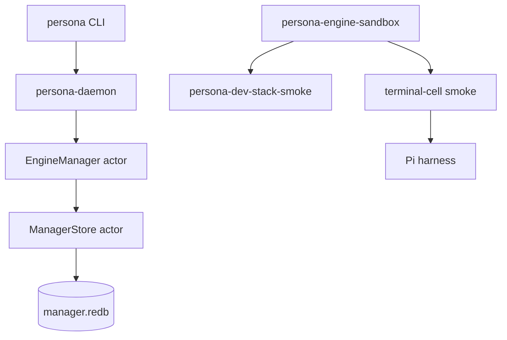
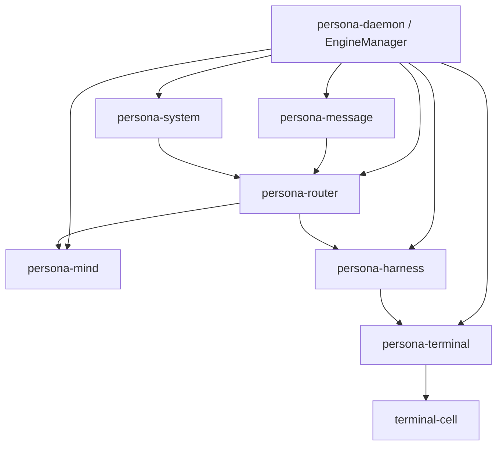
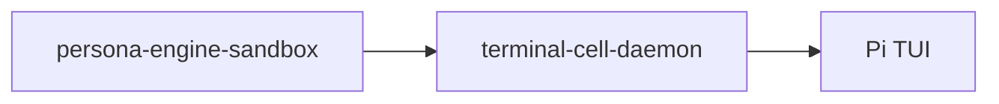
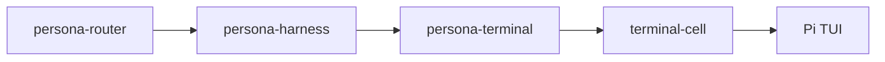
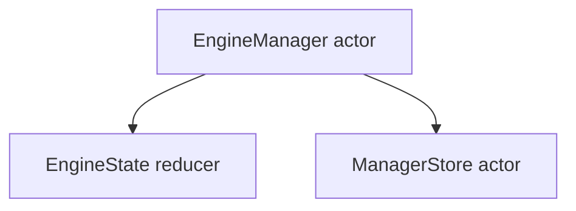
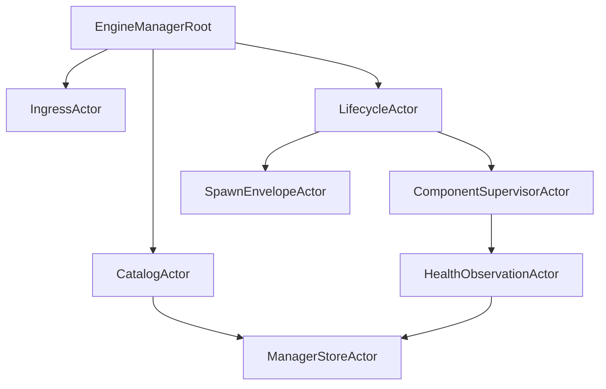
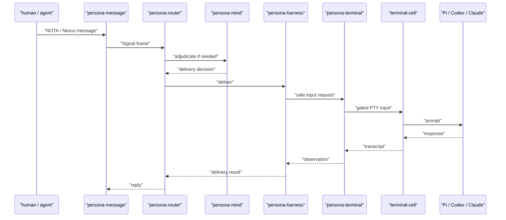

# 112 - Persona engine work state

*Operator report. Scope: the Persona Engine work I have been doing in
`/git/github.com/LiGoldragon/persona`, especially the daemon/client slice,
engine-layout scaffolding, dev-stack sandbox witness, terminal-cell sandbox
witness, and the architecture/test documentation around them.*

---

## 0 - Short Read

The `persona` meta repo now has useful engineering scaffolding, but it is not
yet a working Persona Engine.

What is real:

- `persona` is a thin CLI client for `persona-daemon`.
- `persona-daemon` binds a Unix socket and dispatches typed `signal-persona`
  frames into a Kameo `EngineManager` actor.
- Manager writes go through a Kameo `ManagerStore` actor backed by `sema` /
  redb.
- Engine layout code can derive engine-scoped state files, component sockets,
  socket modes, and spawn envelopes.
- The meta flake wires the first stack together and exposes stateful Nix apps.
- `persona-engine-sandbox` can run a real `persona-dev-stack-smoke` under a
  systemd user unit.
- The separate terminal-cell sandbox lane starts a real `terminal-cell-daemon`
  at `run/cell.sock`, drives a deterministic fixture, and drives a real Pi TUI
  using the local Prometheus-backed model path.

What is not real yet:

- No production `persona` system user / NixOS module deployment.
- No real component process supervisor in `persona-daemon`.
- No full engine federation where router, mind, harness, terminal, and system
  talk through the intended contracts.
- No router-to-mind adjudication.
- No router-to-harness-to-terminal delivery path.
- No prompt/input gate in the actual terminal delivery path.
- No Codex/Claude dedicated-auth live sandbox smoke.
- No long-lived terminal-cell attach session kept open for a human to inspect
  while the rest of the engine runs.

The work is valuable because it replaces hand-wavy architecture with runnable
witnesses. The main risk is that too much of the current evidence still lives
in shell scaffolding rather than component-owned actors and contracts.

---

## 1 - Current Shape

The current `persona` repo is best described as an apex integration shell plus
a first daemon slice.



The architecture we are aiming at is wider:



Only the first diagram is substantially implemented in `persona`. The second
diagram is still mostly contract and architecture pressure.

---

## 2 - What I Think Is Good

### 2.1 Daemon-first CLI direction

The `persona` CLI no longer owns runtime state. It decodes a NOTA request,
lowers it into `signal-persona`, sends one Signal frame over a Unix socket,
waits for one typed reply, and renders one NOTA reply.

Representative files:

- `/git/github.com/LiGoldragon/persona/src/main.rs`
- `/git/github.com/LiGoldragon/persona/src/request.rs`
- `/git/github.com/LiGoldragon/persona/src/transport.rs`

This is aligned with the current rule: CLIs are daemon clients, not runtimes.

### 2.2 Manager state now has a real writer actor

`ManagerStore` is a real data-bearing Kameo actor. The manager does not write
`manager.redb` directly during request decoding. It sends typed messages to the
store actor.

Representative code in
`/git/github.com/LiGoldragon/persona/src/manager_store.rs`:

```rust
pub struct ManagerStore {
    tables: ManagerTables,
    write_count: u64,
}

impl Message<PersistEngineRecord> for ManagerStore {
    type Reply = Result<ManagerStoreReceipt>;

    async fn handle(
        &mut self,
        message: PersistEngineRecord,
        _context: &mut Context<Self, Self::Reply>,
    ) -> Self::Reply {
        self.persist_engine_record(message.record)
    }
}
```

This is the right basic shape: the database is behind an actor with state, not
a free helper API.

### 2.3 Engine layout is typed enough to be testable

`/git/github.com/LiGoldragon/persona/src/engine.rs` has explicit objects for:

- daemon state/run roots;
- engine layout;
- component layout;
- socket modes;
- spawn envelopes.

That gives tests something concrete to assert. It also forces future component
startup to receive paths from the manager rather than discovering peers by
filesystem scanning.

Representative code:

```rust
pub fn spawn_envelope(&self, component: EngineComponent) -> Option<ComponentSpawnEnvelope> {
    let layout = self.component(component)?;
    let peers = self
        .components
        .iter()
        .filter(|peer| peer.component != component)
        .map(ComponentPeerSocket::from_layout)
        .collect();
    Some(ComponentSpawnEnvelope {
        engine: self.engine.clone(),
        component,
        state_path: layout.state_path.clone(),
        socket_path: layout.socket.path.clone(),
        socket_mode: layout.socket.mode,
        peers,
    })
}
```

### 2.4 The sandbox witnesses are real enough to catch lies

The latest useful work is commit `f1f808fdc38b` in
`/git/github.com/LiGoldragon/persona`: `Add terminal-cell sandbox smoke`.

The important part is not that a shell script exists. The important part is
that the Nix apps now run real binaries and leave artifacts:

- `terminal-cell-daemon`;
- `terminal-cell-send`;
- `terminal-cell-wait`;
- `terminal-cell-capture`;
- `terminal-cell-view`;
- Pi running as a real TUI child process in the PTY.

Verified commands:

```sh
nix flake check --option substituters '' -L
nix run .#persona-engine-sandbox-terminal-cell-fixture-smoke --option substituters '' -- --sandbox-dir /tmp/persona-terminal-cell-fixture-test
nix run .#persona-engine-sandbox-terminal-cell-pi-smoke --option substituters '' -- --sandbox-dir /tmp/persona-terminal-cell-pi-test
```

The Pi test originally passed falsely because the expected marker appeared in
the injected prompt. I changed the prompt so the expected marker only appears
if Pi transforms the instruction and outputs the marker itself. That is exactly
the kind of architectural-truth testing we want: the test catches the agent or
script lying by accident.

### 2.5 Auth isolation direction is good

The sandbox runner treats prompt-bearing Codex/Claude auth as dedicated sandbox
credential work. It does not copy live host `~/.codex` or `~/.claude` auth into
the sandbox. The Pi smoke snapshots only `settings.json` and `models.json`,
then writes an empty Pi auth file.

This is the right safety posture. The implementation is not complete, but the
direction is correct.

---

## 3 - What Is Lacking

### 3.1 The sandbox is still mostly shell

The sandbox layer is useful but not beautiful yet.

The shell scripts:

- render NOTA by hand;
- perform lifecycle management with `setsid`, `kill`, and traps;
- contain harness-specific Pi knowledge;
- know about terminal-cell command names directly;
- know about host attach artifacts directly.

Representative file:

- `/git/github.com/LiGoldragon/persona/scripts/persona-engine-sandbox-terminal-cell-smoke`

This is acceptable as a witness runner, but it should not become the runtime
architecture. The component-owned implementations need to move the behavior
into actors and typed contracts.

### 3.2 The terminal-cell lane bypasses `persona-terminal`

The terminal-cell smoke intentionally drives terminal-cell directly:



The target is:



The current lane proves the raw terminal primitive can run in the sandbox. It
does not prove the Persona delivery path.

### 3.3 `ManagerStore` persists too little

The store currently persists a `StoredEngineRecord` containing:

- `EngineId`;
- `EngineStatus`.

That is useful as a first proof that manager mutations can go through a writer
actor into redb. It is not a real manager catalog.

Missing manager catalog state includes:

- engine definitions;
- component desired state;
- actual process identity;
- socket paths and modes;
- spawn envelope history;
- lifecycle observations;
- health checks;
- route declarations;
- restart/shutdown activity.

### 3.4 The Kameo actor tree is too small

Current real actors in `persona` are mainly:

- `EngineManager`;
- `ManagerStore`.

That is not the actor-heavy architecture we have been converging on. The
current manager handles too much inside one actor:



The target should split logical planes:



The exact names can change. The point is that the current code is still a
minimal actor scaffold, not an Erlang-style internal runtime.

### 3.5 The text projection is still narrow

The `persona` CLI supports a small set of management records:

- `EngineStatusQuery`;
- `ComponentStatusQuery`;
- `ComponentStartup`;
- `ComponentShutdown`.

This is enough to test daemon persistence. It is not enough to manage a real
engine. It also still renders typed failures as process stderr in several
places rather than always returning a typed NOTA reply.

### 3.6 Flake composition is practical but still too forgiving

The flake is good at wiring current components and exposing tests. But it also
lets the meta repo compensate for missing component maturity. Example:
`terminal-cell` is pulled source-only and built with `doCheck = false` because
the current terminal-cell default package/test path was not clean enough to use
directly.

That is a pragmatic unblocker, not a healthy final dependency shape.

---

## 4 - What Is Not Implemented

This list is deliberately blunt.

| Area | Current reality |
|---|---|
| Production `persona` daemon deployment | Not implemented. No NixOS module, no dedicated `persona` user service, no production socket ACL setup. |
| Multi-engine supervisor | Not implemented. The daemon starts one default manager actor. |
| Component process supervision | Not implemented. The manager does not spawn/monitor `persona-mind`, `persona-router`, `persona-terminal`, `persona-harness`, or `persona-system`. |
| Real engine catalog | Not implemented. `manager.redb` stores a minimal status record, not a full catalog. |
| Router persistence witness | Not implemented. Planned in `TESTS.md`, but no router-owned Sema/redb commit chain exists in the meta witness yet. |
| Router to mind adjudication | Not implemented. |
| Router to harness delivery | Not implemented. |
| Harness daemon | Not implemented in the integrated engine path. |
| Terminal prompt/input guard | Not implemented in the integrated delivery path. Terminal-cell can receive input; Persona safety policy does not yet govern that input. |
| Host-visible long-lived attach session | Partially implemented. The helper plans/opens a viewer, and the smoke produces `run/cell.sock`, but the smoke exits quickly and does not keep a durable human inspection session alive by default. |
| Codex/Claude sandbox auth smoke | Not implemented. Bootstrap/dry-run surfaces exist, but live prompt-bearing provider runs are not done. |
| Persona message proxy in full flow | Not implemented. The architecture says `persona-message` is a proxy; the full proxy-to-router-to-terminal path is not running here. |
| System/focus integration | Not implemented. `persona-system` exists as a component, but the sandbox work does not exercise focus or prompt safety facts. |
| Inter-engine routes | Not implemented. |
| Push subscriptions | Not implemented in the integrated engine. |

---

## 5 - Good Tests vs Thin Tests

The best tests are the ones that prove a boundary by making it impossible to
cheat in-process.

Good:

- `persona-daemon` process tests prove state survives separate CLI
  invocations through a socket.
- Manager-store tests prove writes go through the Kameo store actor.
- Engine-layout tests prove engine id scoping and spawn envelope construction.
- `persona-engine-sandbox-dev-stack-smoke` proves real daemons start inside a
  systemd-run sandbox.
- `persona-engine-sandbox-terminal-cell-pi-smoke` proves real terminal-cell
  can drive a real prompt-bearing local harness inside the sandbox.

Thin:

- Some checks only prove a wrapper script is executable.
- Some checks only inspect dry-run artifacts.
- The terminal-cell smoke does not prove Persona routing or delivery policy.
- The Pi smoke proves terminal-cell input/output, not agent messaging.
- The dev-stack smoke proves router ingress and terminal Signal separately,
  not end-to-end message delivery.

The test posture is improving, but the engine still lacks the load-bearing
end-to-end witness:



This sequence does not exist yet.

---

## 6 - Representative Patterns I Have Used

### Pattern A - small data object owns behavior

`PersonaEndpoint`, `PersonaFrameCodec`, `PersonaClient`,
`PersonaDaemonPaths`, and `EngineLayout` follow the local discipline well:
state and methods stay together.

### Pattern B - architecture-truth test as weird witness

The Pi marker bug was a useful example. A weaker test accepted its own prompt
as success. The corrected test requires the harness to derive the marker:

```text
prompt: lowercase spelling is terminal-cell-pi-smoke-ok; replace hyphens
expected: TERMINAL_CELL_PI_SMOKE_OK
```

That makes the test prove at least one model response, not merely terminal
echo.

### Pattern C - shell artifacts as temporary visibility

The sandbox scripts leave NOTA/text artifacts because other agents need to
debug without rerunning:

- `terminal-cell-run.nota`;
- `terminal-cell-processes.nota`;
- `terminal-cell-sockets.nota`;
- `terminal-cell-transcript.txt`;
- `terminal-cell-prompt.nota`;
- `harness-environment.nota`;
- `host-attach.nota`.

This is good for test visibility. It is not a reason to keep shell as runtime
implementation.

---

## 7 - The Most Concerning Pieces

### 7.1 Hand-written NOTA in shell

The scripts now escape simple quoted command parts, but this is still fragile.
Any report that relies on these artifacts should treat them as test artifacts,
not durable protocol output.

The correct long-term version is typed Rust records rendered by `nota-codec`.

### 7.2 `ManagerEvent` is too synthetic

`ManagerEvent` currently exists mostly to prove actor-path traces:

```rust
#[derive(Debug, Clone, Copy, PartialEq, Eq)]
pub enum ManagerEvent {
    Started,
    EngineRequestAccepted,
    EngineReplyCreated,
    TraceRead,
    Stopping,
}
```

This is not yet a real event model. It is a trace scaffold. A real manager
event stream should carry typed lifecycle facts: component requested,
component spawned, socket bound, health update observed, component exited,
restart scheduled, etc.

### 7.3 The sandbox knows too much about Pi

`persona-engine-sandbox` resolves Pi package roots and snapshots Pi model
config. That was necessary to get a real local-model smoke working, but the
runtime architecture should push harness-specific knowledge into
`persona-harness` or harness-specific adapters.

### 7.4 The current terminal-cell witness is not an input-safety witness

It proves input can be sent. It does not prove input can be sent safely. The
danger that originally motivated the router/terminal work remains: prompt text
must not be injected into a human's partially typed input.

---

## 8 - Next Work I Would Do

Priority order:

1. `persona-daemon` should start and supervise a named engine with component
   spawn envelopes, even if the first component set is small.
2. `persona-terminal` should own the terminal-cell daemon and expose the
   typed control surface; the sandbox should stop driving terminal-cell
   directly except as a low-level fixture.
3. `persona-harness` should become the adapter boundary for Pi first:
   harness identity, transcript pointer, lifecycle, and delivery surface.
4. `persona-router` should commit messages durably through router-owned
   Sema/redb before delivery.
5. The first full delivery witness should route a message through
   `persona-message -> persona-router -> persona-harness -> persona-terminal
   -> terminal-cell -> Pi`, then return a typed delivery result.
6. Add the prompt/input guard after the terminal component owns delivery,
   because guarding direct sandbox shell injection is the wrong layer.
7. Add dedicated Codex/Claude provider-auth smokes after Pi proves the local
   lane and after credential-root binding is fixed.

The open BEADS that match this reading are:

- `primary-a18`: bind credential root and add provider auth smoke.
- `primary-8n8`: persona-terminal supervisor socket and gate/cache delivery.
- `primary-hj4`: persona-mind choreography and subscriptions.
- `primary-2y5`: persona daemon EngineId socket setup, manager redb, spawn
  envelope.
- `primary-es9`: persona-harness daemon and transcript pointers.

---

## 9 - Bottom Line

The strongest part of the work is the testing posture: we now have runnable
Nix apps and flake checks that prove real process, socket, PTY, and local-model
behavior. That is much better than architecture-only progress.

The weakest part is that the working path is still scaffolding-heavy. The
terminal-cell smoke is useful, but it bypasses the actual Persona components
that must own delivery safety. The daemon slice is useful, but it does not yet
supervise real component processes. The manager store is useful, but it is not
yet a full engine catalog.

So: this is a good foundation, not a working Persona Engine. The next step is
to move the same witness discipline into the component-owned actor paths until
the full message-delivery sequence exists and can no longer be faked by shell
glue.
