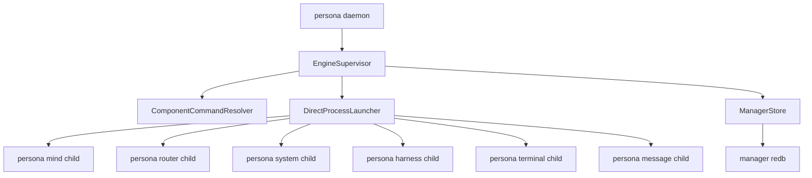
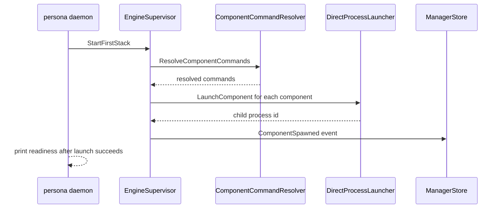
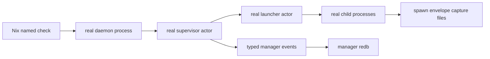
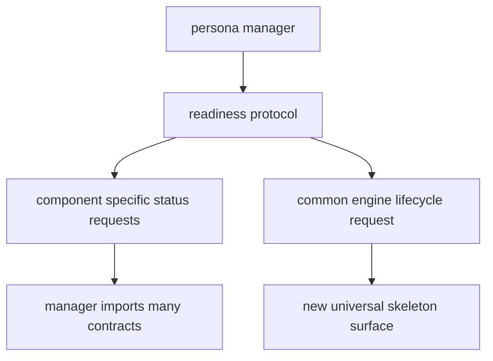
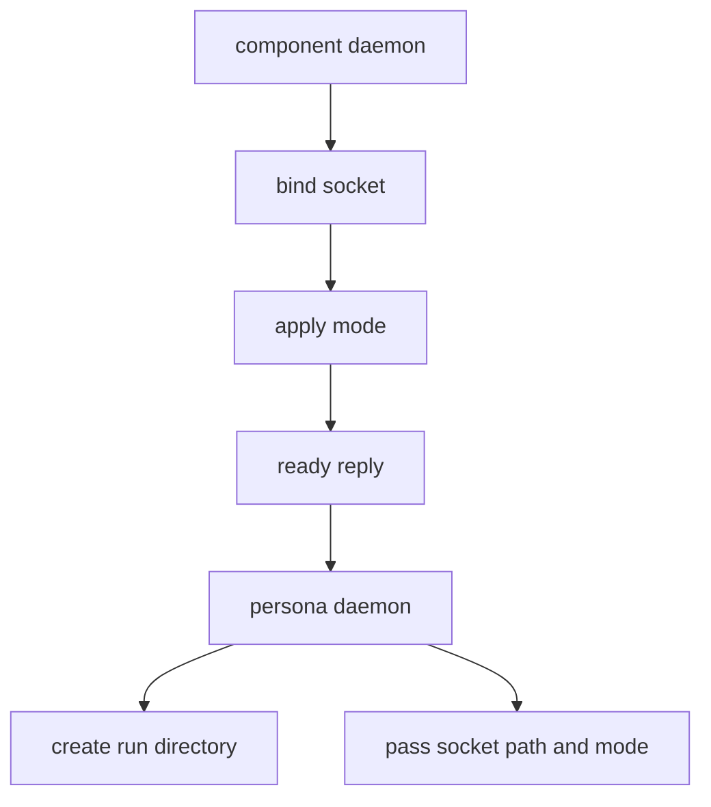
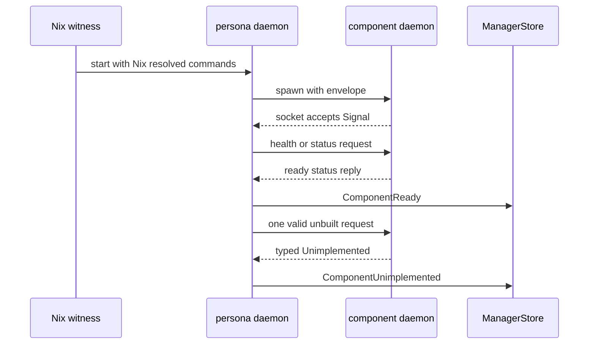

# Persona Engine Supervision Slice And Gaps

Date: 2026-05-12
Role: operator
Scope: `persona` commit `980a9023` and the architecture gaps blocking the
next clear implementation step.

## Summary

I implemented the first real `persona-daemon` supervision slice in
[`persona`](/git/github.com/LiGoldragon/persona/ARCHITECTURE.md). The daemon
can now start a first-stack launch plan, route each component through a
data-bearing Kameo supervisor actor, launch real child processes through a
data-bearing launcher actor, pass resolved spawn-envelope environment to each
child, and write typed lifecycle events through `ManagerStore`.

This is not the full engine witness yet. It proves process launch and manager
event writes. It does not yet prove component sockets, component readiness,
health replies, typed unfinished-operation replies, restart policy, or
production ACLs.



## What Landed

The main implementation is
[`src/supervisor.rs`](/git/github.com/LiGoldragon/persona/src/supervisor.rs).
`EngineSupervisor` is a real state-bearing Kameo actor. It owns:

- the `EngineLayout`;
- the launch configuration;
- a `ComponentCommandResolver` actor;
- a `DirectProcessLauncher` actor;
- an optional `ManagerStore` actor;
- start/stop counters.

The daemon path in
[`src/transport.rs`](/git/github.com/LiGoldragon/persona/src/transport.rs)
now starts that supervisor before printing daemon readiness when a launch plan
is configured.

The resolved shape is:

```rust
pub struct EngineSupervisor {
    layout: EngineLayout,
    launch_configuration: EngineLaunchConfiguration,
    resolver: ActorRef<ComponentCommandResolver>,
    launcher: ActorRef<DirectProcessLauncher>,
    store: Option<ActorRef<ManagerStore>>,
    started_stack_count: u64,
    stopped_stack_count: u64,
}
```

The execution path is:



The tests added two witnesses:

- [`tests/supervisor.rs`](/git/github.com/LiGoldragon/persona/tests/supervisor.rs)
  proves the supervisor actor path launches all first-stack children through
  `DirectProcessLauncher`, passes spawn-envelope data, and appends typed
  spawn/stop events.
- [`tests/daemon.rs`](/git/github.com/LiGoldragon/persona/tests/daemon.rs)
  starts the real `persona-daemon`, configures a first-stack launch plan, and
  proves child processes receive the envelope from the live daemon path.

The Nix checks added in
[`flake.nix`](/git/github.com/LiGoldragon/persona/flake.nix) are:

- `persona-engine-supervisor-launches-first-stack-through-process-launcher`;
- `persona-daemon-launches-first-stack-through-engine-supervisor`.

Verification passed with:

- `nix develop -c cargo fmt`;
- `nix develop -c cargo test --locked`;
- both named Nix checks;
- full `nix flake check -L`.

## What The Slice Actually Proves



It proves these constraints:

| Constraint | Current status |
|---|---|
| The daemon can start a first-stack launch plan before readiness. | Proven. |
| Process launch is behind a Kameo actor, not directly in a request handler. | Proven. |
| Commands are resolved before spawn envelopes are built. | Proven. |
| Child processes receive engine id, component name, state path, socket path, socket mode, and peer sockets. | Proven by envelope capture. |
| Manager lifecycle observations go through `ManagerStore`. | Proven for `ComponentSpawned` and `ComponentStopped`. |

It does not prove these constraints yet:

| Constraint | Current status |
|---|---|
| Child sockets exist and are usable. | Not proven. |
| Socket modes and owners are actually applied to bound sockets. | Not implemented. |
| `ComponentReady` means a successful component health/status round-trip. | Not implemented. |
| A valid but unbuilt component operation returns a typed `Unimplemented` reply and is logged. | Not implemented. |
| The launcher observes child exit and emits `ComponentExited`. | Not implemented. |
| Restart scheduling/exhaustion is durable and typed. | Not implemented. |
| Manager state restores from `manager.redb` on daemon restart. | Not implemented. |

## Architecture Gaps Blocking The Next Clean Step

### 1. There Is No Uniform Component Readiness Contract

The architecture says `ComponentReady` is emitted only after a successful
health/status round-trip. That is correct, but the manager currently has no
single contract it can use for every component.

Some components have status requests in their own contracts:

- `signal-persona-system` has `SystemStatusQuery`;
- `signal-persona-harness` has `HarnessStatusQuery`;
- `signal-persona-mind` has mind queries, but not an engine-level generic
  readiness surface;
- `signal-persona-terminal` is richer and session-oriented;
- `persona-message` is intentionally a stateless proxy and has no daemon;
- `persona-router` mostly speaks message ingress, not engine lifecycle.

The blocking question is: does `persona-daemon` learn each component-specific
status contract, or do we introduce a small engine-lifecycle relation that
every first-stack daemon implements?



My current preference is a common engine-lifecycle surface, because readiness,
health, shutdown, and unfinished-operation honesty are manager concerns. But
that creates a new contract and must not duplicate the domain contracts.

### 2. `persona-message` Is Not A Daemon But The First Stack Treats It Like One

Current architecture says `persona-message` is a stateless NOTA to Signal proxy
with no daemon. The first-stack supervision witness says every first-stack
component daemon/proxy should be started and observed.

Those two statements are not yet reconciled.

The code currently models `MessageProxy` as an `EngineComponent` and launches
it like the others during skeleton tests. That is acceptable as a temporary
witness, but it is not a settled production design.

Decision needed:

| Option | Meaning |
|---|---|
| Keep `MessageProxy` as a supervised engine component. | Then `persona-message` needs a long-lived proxy daemon or wrapper process. |
| Remove it from first-stack supervision. | Then message ingress is router-owned, and `persona-message` remains just a CLI client. |
| Rename the component. | If what is supervised is actually router ingress socket setup, it should not be called `persona-message`. |

Until this is settled, the exact final topology witness cannot be made honest.

### 3. Socket Ownership Is Still Half Architectural And Half Assumed

The architecture says `persona-daemon` creates socket paths, ownership, modes,
and spawn envelopes, while components own and accept their own sockets. That
leaves an implementation seam:

- a Unix socket file is created by the component when it binds;
- the manager can prepare directories and pass desired mode;
- the manager cannot chmod a socket before it exists unless it supervises a
  bind handshake;
- a component can apply the mode itself, but then the manager is trusting the
  child to enforce the manager boundary.

The next implementation needs a concrete rule:



The missing decision is who applies and verifies socket mode and owner after
bind. My recommended narrow path is: component binds and applies mode from the
spawn envelope; manager checks the socket metadata before emitting
`ComponentReady`. That keeps components owning their sockets while making the
manager observation real.

### 4. Health And Restart Semantics Are Not Yet Typed Enough

`DirectProcessLauncher` currently owns child processes and can stop them. It
does not yet own an exit-observation loop, restart policy, restart counters, or
failure classification.

The architecture names the events:

- `ComponentExited`;
- `RestartScheduled`;
- `RestartExhausted`;
- `ComponentStopped`.

But the policy is not yet defined:

| Missing policy | Why it blocks implementation |
|---|---|
| Which exits are expected during shutdown? | Avoid logging a clean shutdown as a crash. |
| How many restart attempts? | Needed before `RestartExhausted` can be meaningful. |
| What backoff schedule? | Needed before a restart actor can be tested. |
| Is restart per component or per engine generation? | Changes event keys and manager state. |
| Does a component support restart if its state may be corrupt? | Affects terminal/harness behavior especially. |

Without this, I can implement raw child waiting, but not a correct supervisor.

### 5. Manager State Restore Is Still A Hole

`ManagerStore` persists engine records and events. `EngineManager` still starts
from the default catalog unless explicitly initialized otherwise. That means a
daemon restart can lose the live reduced state even though `manager.redb`
contains facts.

The architecture needs to say whether restore comes from:

- latest reduced `StoredEngineRecord`;
- replaying `EngineEvent`;
- both, with record as snapshot and events as audit;
- a future schema version.

The practical next step is probably: load the latest `StoredEngineRecord` for
the default engine when the daemon starts. Event replay can follow later. But
that should be named as the intended first restore rule.

### 6. The Final Witness Needs A Precise Shape

`primary-2y5.7` asks for a check named
`persona-daemon-spawns-first-stack-skeletons`. The current tests are close but
do not meet the acceptance criteria.

The final witness should be specified as a sequence, not a phrase:



This exact shape is implementable if the readiness contract question is
answered.

## Recommended Next Step

I would not start by adding restart policy. The next load-bearing step is the
readiness boundary:

1. Decide whether readiness is component-specific or a common lifecycle
   contract.
2. Make every supervised first-stack child expose that boundary.
3. Teach `EngineSupervisor` to wait for socket readiness, send the status
   request, verify the reply, inspect socket metadata, and append
   `ComponentReady`.
4. Add one typed unfinished-operation probe per component and append
   `ComponentUnimplemented`.

Only after that should the launcher grow exit observation and restart policy.
Otherwise the supervisor will restart processes it cannot yet prove are
correctly serving their component boundary.

## Honest State

The slice is useful and correct as far as it goes: it changed the live
`persona-daemon` from manager-only to first-stack process supervisor scaffold.
The testing improved because the witness now crosses a real daemon process,
real actors, child process spawning, filesystem artifacts, and durable redb
events.

The architecture is still not crisp enough for the next phase because the
component readiness protocol, the status of `persona-message` as a supervised
component, and the socket-mode verification rule are unresolved. Those are the
three decisions I need before I can implement the full topology witness without
inventing policy in code.
