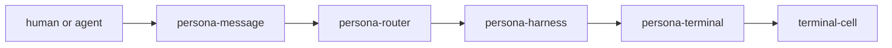
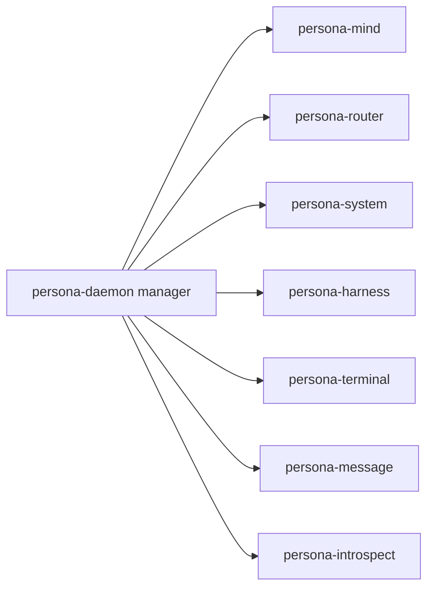
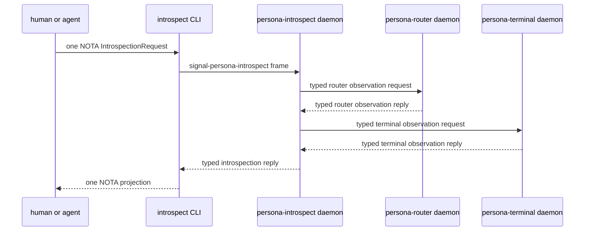
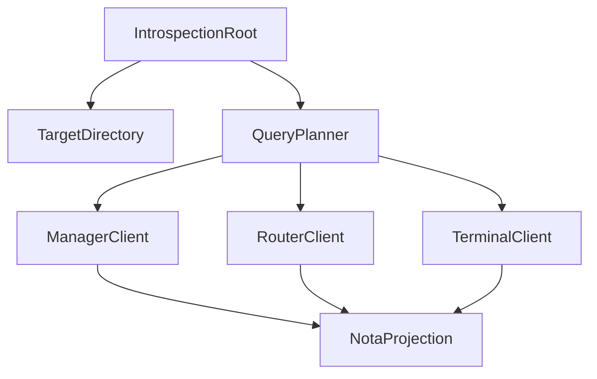

# 114 - Persona-introspect prototype impact survey

*Operator report. Scope: survey the implementation impact of moving
`persona-introspect` from a post-prototype component into the prototype
acceptance surface, after the user's correction that introspection is one of
the most important early components.*

---

## 0. Position

`persona-introspect` should be included in the prototype.

The reason is not that it is another hop in the message-delivery path. The
reason is that it gives the prototype a live proof surface. Without
introspection, a green prototype can still be a set of scripts, logs, and
local assertions that say "delivery happened." With introspection, the engine
itself can answer:

- Which components are alive?
- Which sockets were created by the manager?
- Which typed request entered the engine?
- Which actor or component accepted it?
- Which state transition did the router commit?
- Which terminal session received the delivery attempt?
- Which parts are unimplemented by contract, rather than silently missing?

That makes `persona-introspect` a correctness tool, not only an operator UI.
It should be part of prototype acceptance as the engine witness.

This supersedes the "not first stack" posture in
`reports/designer/146-introspection-component-and-contract-layer.md` and the
current `persona/ARCHITECTURE.md` section 0.6. The operational delivery path
can still remain six components, but the prototype engine should supervise and
test a seventh component: `persona-introspect`.

---

## 1. Revised prototype shape

The delivery path does not become more complicated:



The supervised engine becomes more inspectable:



The acceptance witness changes from two witnesses to three:

| Witness | Current shape | With introspection included |
|---|---|---|
| Supervision | Manager starts six operational components. | Manager starts six operational components plus `persona-introspect`; all report readiness over typed Signal. |
| Delivery | `message -> router -> harness -> terminal -> cell` fixture path lands bytes. | Same path. Introspection must not become a delivery hop. |
| Inspection | Mostly logs, redb checks, test-local assertions. | `persona-introspect` queries manager/router/terminal over Signal and projects one NOTA proof that the delivery witness happened. |

This gives the prototype a clean split:

- **Operational engine:** six components that move the message.
- **Inspection plane:** `persona-introspect`, supervised by the same manager,
  used to prove the engine state through component-owned typed observations.

---

## 2. What `persona-introspect` is

`persona-introspect` is a high-privilege read/projection component.

It owns:

- The `persona-introspect-daemon` binary.
- An internal socket, probably
  `/var/run/persona/<engine-id>/introspect.sock`.
- A CLI edge, likely `introspect`, that accepts one NOTA request and prints one
  NOTA reply.
- Fan-out to component daemons using typed Signal relations.
- Fan-in of typed component observations.
- NOTA projection for humans, agents, and future UIs.

It does not own:

- Other components' redb files.
- Snapshot consistency for other components.
- Router policy, terminal delivery policy, message ingress policy, or manager
  lifecycle policy.
- A shared "persona Sema" layer. Each component owns its own Sema/redb state.

Live introspection must ask component daemons. It must not open their
databases directly.



The daemon can be stateless for the first prototype slice. If query audit or
subscription cursors become durable, it gets its own component-local
`introspect.redb` later. That database would store introspection state only;
it would not mirror or own other component tables.

---

## 3. Contract impact

The design in `reports/designer/146-introspection-component-and-contract-layer.md`
is still mostly right. The change is priority: it moves from "planned
follow-up" to "prototype witness."

### 3.1 New central envelope contract

Create `signal-persona-introspect`.

Its job is not to become a giant bucket of every component's state. Its job is
to define the request/reply envelope used by `introspect` clients:

```rust
signal_channel! {
    request IntrospectionRequest {
        EngineSnapshot(EngineSnapshotQuery),
        ComponentSnapshot(ComponentSnapshotQuery),
        DeliveryTrace(DeliveryTraceQuery),
        PrototypeWitness(PrototypeWitnessQuery),
    }

    reply IntrospectionReply {
        EngineSnapshot(EngineSnapshot),
        ComponentSnapshot(ComponentSnapshot),
        DeliveryTrace(DeliveryTrace),
        PrototypeWitness(PrototypeWitness),
        Unimplemented(IntrospectionUnimplemented),
        Denied(IntrospectionDenied),
    }
}
```

This contract owns:

- Selectors: engine id, component principal, observation scope, optional cursor.
- Query/reply envelopes.
- Projection-ready wrapper records.
- Subscription handles later.

It should not own router table rows, terminal session rows, or manager event
records unless those are generic cross-component envelope records.

### 3.2 Component observation records

Component-specific observations should live with the component's contract.

| Component | Contract home | Prototype observation |
|---|---|---|
| Manager | `signal-persona` | Engine catalog, component lifecycle, socket paths, readiness, process state. |
| Router | likely new `signal-persona-router` | Accepted message, route decision, delivery status, adjudication status. |
| Terminal | `signal-persona-terminal` | Session status, prompt state, gate state, last delivery attempt summary. |
| Message | `signal-persona-message` or supervision only | Forwarded request count, last accepted ingress, socket status. |
| Harness | `signal-persona-harness` | Harness identity and delivery adapter status. |
| System | `signal-persona-system` | System observation status when present. |
| Mind | `signal-persona-mind` | Work graph and adjudication observations when the mind path is live. |

The router line is the only immediate design pressure. `persona-router` is a
real component but there is not currently a dedicated `signal-persona-router`
contract in the active stack. For introspection, that absence becomes costly:
putting router-owned observation records into `signal-persona-introspect`
would make the central envelope contract a schema bucket. Putting them into
`signal-persona-message` would pretend router state is message-ingress state.

Recommendation: create `signal-persona-router` when router observation records
are needed. Start with only the introspection relation if operational router
relations are still carried by other contracts.

### 3.3 No second text format

The CLI accepts and prints NOTA. Nexus is typed semantic content in NOTA
syntax. No new inspection text format should appear.

Internally, `persona-introspect` speaks Signal/rkyv. Component state on disk is
rkyv-archived typed records in the owning component's Sema/redb. NOTA is an
edge projection, not the live daemon protocol and not the disk format.

---

## 4. Manager and spawn impact

Including `persona-introspect` in the prototype changes `persona` manager
topology.

Current target resource shapes mention:

```text
/var/run/persona/<engine-id>/{mind,router,system,harness,terminal,message}.sock
```

Prototype-included introspection makes that:

```text
/var/run/persona/<engine-id>/{mind,router,system,harness,terminal,message,introspect}.sock
```

If `persona-introspect` is stateless at first, there is no new redb path. If it
gets durable query/subscription audit later:

```text
/var/lib/persona/<engine-id>/introspect.redb
```

Manager changes implied:

- Add an `Introspect` component principal/kind in the management contract once
  the component enum naming is stabilized.
- Allocate `introspect.sock` with internal-only permissions.
- Spawn `persona-introspect-daemon` with a manager-created spawn envelope.
- Pass peer socket locations to `persona-introspect` through the spawn
  envelope; components do not discover peers by scanning the filesystem.
- Include `persona-introspect` in lifecycle/readiness/health checks.
- Add it to engine status snapshots.

It should be an internal/high-privilege component. The socket should not be the
same trust surface as `message.sock`, because `message` is an external
engine-owner ingress component while `introspect` can expose sensitive engine
state.

---

## 5. Actor impact

The implementation should be actor-heavy, but not actor-theater. The minimum
prototype daemon can have these Kameo actors:



Actor responsibilities:

| Actor | State it owns | Why it exists |
|---|---|---|
| `IntrospectionRoot` | Root configuration, auth posture, child actor refs. | Owns daemon lifetime and supervision. |
| `TargetDirectory` | Engine id and peer socket map from the spawn envelope. | Keeps peer discovery explicit and testable. |
| `QueryPlanner` | Request decomposition and correlation ids. | Turns one user query into component-specific typed queries. |
| `ManagerClient` | Manager socket connection state. | Isolates manager relation failures. |
| `RouterClient` | Router socket connection state. | Isolates router relation failures. |
| `TerminalClient` | Terminal socket connection state. | Isolates terminal relation failures. |
| `NotaProjection` | Projection policy and formatting options. | Ensures NOTA rendering happens at the edge. |

For prototype acceptance, the root can start only the clients needed by the
witness. If the first introspection query is "prove fixture delivery," the
needed targets are manager, router, and terminal.

---

## 6. Prototype acceptance impact

The current prototype witness should be upgraded, not replaced.

Proposed Nix checks:

| Check name | Constraint |
|---|---|
| `persona-daemon-spawns-first-stack-with-introspection` | Manager starts the six operational components plus `persona-introspect`; all answer typed readiness. |
| `persona-introspect-does-not-open-peer-redb` | Source/test witness rejects live introspection code that opens `mind.redb`, `router.redb`, `terminal.redb`, etc. |
| `persona-introspect-projects-nota-at-edge` | Component daemons return typed records; only introspect CLI renders NOTA. |
| `persona-introspect-uses-signal-target-relations` | Trace proves the introspection path crossed component sockets using Signal frames, not in-process shortcuts. |
| `persona-prototype-delivery-is-introspectable` | After fixture delivery, `introspect` returns a coherent NOTA proof: accepted message, router status, terminal delivery attempt, component health. |
| `introspect-socket-is-internal-only` | Manager creates `introspect.sock` with internal-only ownership/mode. |

The most important one is:

```text
persona-prototype-delivery-is-introspectable
```

That check turns introspection into the acceptance oracle. The engine cannot
claim delivery is done unless the engine can explain the delivery through the
same component boundaries it will use in production.

---

## 7. Implementation cost

Including `persona-introspect` early adds work, but it should reduce debugging
time.

### Adds

- New repo: `signal-persona-introspect`.
- New repo: `persona-introspect`.
- Likely new repo: `signal-persona-router`, unless router observation records
  find a better existing home.
- Manager topology update: seventh supervised component.
- New socket path and spawn envelope entry.
- Minimal observation records in manager, router, and terminal contracts.
- New Nix witness that queries the engine after the fixture delivery path.

### Avoids

- Reading redb directly from tests as the primary proof.
- Treating terminal logs or process output as the system of record.
- Test-only shortcuts that bypass daemon sockets.
- "Marked done" implementations that do not fulfill their main function.
- A future UI being built on unstable logs instead of typed observations.

### Risk

The biggest risk is schema sprawl. If `signal-persona-introspect` becomes a
bucket for every component's internal rows, it will recreate the shared-store
mistake at the contract layer.

The guardrail is simple:

```text
signal-persona-introspect asks and wraps.
component contracts define component observations.
component daemons own reads, consistency, and redaction.
```

---

## 8. Recommended landing order

1. Update architecture truth: `persona-introspect` is prototype-included as
   the inspection plane. The operational delivery path is still the six
   existing components.
2. Create `signal-persona-introspect` with one-shot query/reply envelopes and
   no component-domain row types.
3. Add manager observation records to `signal-persona`: engine status,
   component lifecycle, socket readiness, process state.
4. Decide router observation home. Recommendation: create
   `signal-persona-router` and start with introspection relation records.
5. Add minimal terminal observation records to `signal-persona-terminal`:
   session status, prompt state, gate state, last delivery attempt summary.
6. Create `persona-introspect` daemon and CLI with Kameo actors:
   root, target directory, planner, manager client, router client, terminal
   client, NOTA projection.
7. Update `persona` manager to spawn `persona-introspect-daemon`, pass peer
   sockets, include readiness/health in engine status, and expose
   `introspect.sock`.
8. Add Nix prototype witness:
   delivery happens first; introspection query proves it after the fact.

This order keeps the delivery path moving while making introspection the proof
surface as soon as possible.

---

## 9. Decisions to surface

### D1. Per-engine or host-level introspection?

Recommendation: **per-engine for prototype**.

Evidence: the current engine resources are scoped by engine id under
`/var/run/persona/<engine-id>/` and `/var/lib/persona/<engine-id>/`.
Per-engine `persona-introspect` receives the exact peer sockets for that engine
in its spawn envelope. A host-level singleton can fan into multiple engines
later, but it would complicate the first witness.

### D2. CLI name?

Recommendation: **`introspect` CLI, `persona-introspect-daemon` binary,
`persona-introspect` component/repo**.

Evidence: `reports/designer/145-component-vs-binary-naming-correction.md`
settled that component names stay bare and `-daemon` is binary/file-level
only. The CLI can be the human surface, like `message` and `mind`.

### D3. Router observation contract home?

Recommendation: **create `signal-persona-router` when router observations
land**.

Evidence: router owns routing state. Putting router observation rows inside
`signal-persona-introspect` turns the central envelope into a bucket. Putting
them inside `signal-persona-message` conflates ingress with routing.

### D4. Raw transcript visibility in prototype?

Recommendation: **not required for the first introspection witness**.

The first witness should expose terminal session status and last delivery
attempt summary, not raw transcript ranges. Raw transcript inspection is useful
and probably inevitable, but it has size and sensitivity implications. Add it
after the typed inspection path works.

---

## 10. Bottom line

Prototype inclusion is justified.

The minimal correct version is not a broad UI and not an offline database
reader. It is a supervised component that asks the running engine for typed
observations and projects one NOTA answer. That makes `persona-introspect` the
prototype's own witness:

```text
The engine does not merely run.
The engine can explain itself.
```

