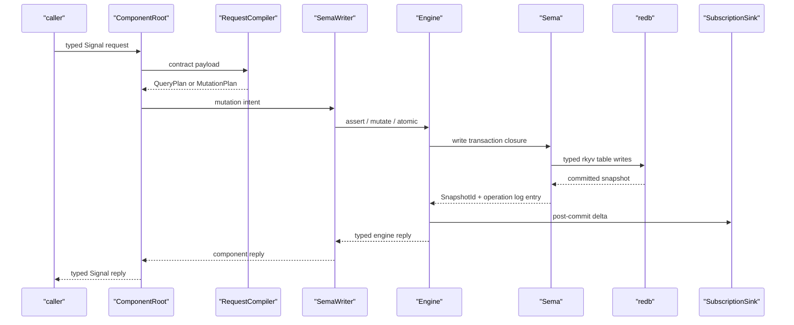

# 115 - Sema engine split implementation investigation

*Operator report. Scope: implementation consequences of
`reports/designer-assistant/45-sema-and-sema-engine-interface-split.md`
and `reports/designer/158-sema-kernel-and-sema-engine-two-interfaces.md`.*

## 0 - Bottom line

The split is implementable and cleaner than growing `sema` into a
mixed kernel/engine crate.

The implementation should create a new `sema-engine` repository and
keep `sema` as a smaller storage kernel. `sema-engine` is a Rust
library, not a daemon and not an actor runtime. Component daemons own
their Kameo actor trees and hold an `Engine` inside their state-owning
actors when they need full verb execution.

One correction from the current code scan and the user’s follow-up:
the reports say Criome should absorb `Slot`, the legacy raw-byte slot
store, and `reader_count`; the better target is that Criome uses
`sema-engine`, not the thin `sema` kernel. Current `criome` no longer
uses those legacy surfaces and already models attestation slots as
typed tables in `criome/src/tables.rs`. So the first cleanup should
delete the legacy surfaces from `sema` rather than add dead
slot-store code to today’s Criome. Criome’s durable identity,
attestation, revocation, audit, and subscription paths become an
engine-consumer migration after the engine exists.

The first real consumer can still be `persona-mind` because its graph
path is the most complete hand-rolled engine facsimile in the current
Persona stack. But Criome is no longer classified as a thin-kernel
consumer in the target architecture; it is another early engine
consumer, not the home of the deleted legacy slot store.

Update after designer-assistant review and user decisions:

- Schema-less `Sema::open` should not remain public after legacy slot
  deletion. The schema-guarded path becomes the canonical
  `Sema::open(path, schema)`. If a header-only kernel open is needed
  later, add it with a specific name and a test witness.
- `persona-introspect` has its own database. It should inspect peers
  through their daemon sockets and component contracts, but its own
  observation/index state uses `sema-engine`.
- First real engine migration order is `persona-mind`, then Criome.

## 1 - What I read

Required operator context:

- `ESSENCE.md`: clarity, correctness, introspection, beauty;
  backward compatibility is not a constraint; constraints become
  tests.
- `skills/rust-discipline.md`, `skills/rust/storage-and-wire.md`,
  `skills/rust/methods.md`: behavior on types, redb+rkyv, no string
  typification, errors as typed enums.
- `skills/beauty.md`: ugliness means the missing structure has not
  been found.
- `skills/actor-systems.md` and `skills/kameo.md`: actors are for
  runtime/state/failure planes; no public ZST actors; Kameo `Self` is
  the actor.
- Operator-required skills at least at checkpoint level:
  reporting, jj, BEADS, architecture editing, testing,
  architectural-truth tests, contract repos, micro-components, naming,
  Nix discipline, push-not-pull, language design.

Design/code context:

- `reports/designer-assistant/45-sema-and-sema-engine-interface-split.md`:
  DA’s recommendation to split storage kernel from full engine.
- `reports/designer/158-sema-kernel-and-sema-engine-two-interfaces.md`:
  designer’s converged two-repo design.
- `reports/designer/157-sema-db-full-engine-direction.md`: the parent
  engine design that names QueryPlan, MutationPlan, Subscribe,
  Validate, operation log, and the Signal verb spine.
- `/git/github.com/LiGoldragon/sema/src/lib.rs`,
  `/git/github.com/LiGoldragon/sema/ARCHITECTURE.md`,
  `/git/github.com/LiGoldragon/sema/skills.md`.
- `/git/github.com/LiGoldragon/criome/src/tables.rs` and
  `/git/github.com/LiGoldragon/criome/ARCHITECTURE.md`.
- `/git/github.com/LiGoldragon/persona-mind/src/tables.rs` and
  `/git/github.com/LiGoldragon/persona-mind/ARCHITECTURE.md`.
- `/git/github.com/LiGoldragon/signal-core/src/request.rs`.

## 2 - Current evidence

| Area | Current fact | Consequence |
|---|---|---|
| `sema-engine` repo | No local clone and `gh repo view LiGoldragon/sema-engine` returned nothing. | Repo creation is the first engine step. |
| `sema` dependencies | `sema/Cargo.toml` has redb, rkyv, thiserror only. | Kernel dependency direction is already mostly right. |
| `sema` surface | `Slot`, `Sema::store`, `Sema::get(Slot)`, `Sema::iter()`, `reader_count`, `set_reader_count`, `DEFAULT_READER_COUNT` are still exported. | Kernel cleanup is real work. |
| `sema` docs | `AGENTS.md`, `ARCHITECTURE.md`, and `skills.md` still describe slot utility and some stale Criome-record-database framing. | Docs must change with the cleanup. |
| Current `criome` | No current use of `sema::Slot`, `Sema::store`, or reader-count API. It has its own typed `ATTESTATION_NEXT_SLOT` table over `sema`. | Do not move legacy slot store into current Criome. Target Criome at `sema-engine` once the engine can execute its identity/attestation store verbs. |
| `persona-mind` | Hand-rolls counters, graph IDs, graph table CRUD, relation validation calls, subscription registration tables, and eager query scans. | It is the right first `sema-engine` consumer. |
| Signal verb spine | `signal_core::SemaVerb` exists with twelve verbs and `Request::Operation { verb, payload }`. | Engine can depend on `signal-core`, but contract-level verb mapping is incomplete. |
| `signal-persona-*` contracts | A scan found no `SemaVerb` mapping in the sampled Persona contract repos. | Package 1 from designer/157 is still needed before real verb execution is trustworthy. |

## 3 - Boundary shape

```mermaid
flowchart TD
    "signal-core"["signal-core<br/>SemaVerb, Frame, Request envelope"]
    "sema"["sema<br/>typed redb/rkyv storage kernel"]
    "sema-engine"["sema-engine<br/>Signal verb execution library"]
    "signal-contracts"["signal-persona-* contracts<br/>typed records + verb mapping"]
    "component"["component daemon<br/>Kameo actor tree"]
    "database"["component.redb"]

    "sema-engine" --> "sema"
    "sema-engine" --> "signal-core"
    "component" --> "sema-engine"
    "component" --> "signal-contracts"
    "signal-contracts" --> "signal-core"
    "sema" --> "database"
```

`sema` does not know about Signal verbs, Persona, Kameo, NOTA, or
Nexus. It opens files, guards schema/format, and reads/writes typed
tables.

`sema-engine` knows the Signal verb spine and maps typed plans onto
`sema` transactions. It does not own process sockets, auth decisions,
actors, component-specific records, or human-facing text.

The component daemon compiles its domain request into an engine plan,
performs domain validation, owns the actor ordering, and wires
subscription sinks to its own actors.

## 4 - Runtime shape inside a component



The actor rule remains intact. `sema-engine` is not an actor library;
the component’s `SemaWriter`, `SemaReader`, subscription dispatcher,
and request compiler are the actor planes. `Engine` is the data-bearing
library object those actors hold.

## 5 - First implementation packages

### Package A - Clean `sema` into the kernel

Edits:

- Remove `Slot` from `sema`.
- Remove `Sema::store`, `Sema::get(Slot)`, and legacy `Sema::iter`.
- Remove `DEFAULT_READER_COUNT`, `reader_count`, `set_reader_count`,
  `MissingSlotCounter`, and raw slot-store internal tables.
- Delete schema-less `Sema::open(path)` and rename
  `open_with_schema(path, schema)` to the canonical
  `Sema::open(path, schema)`.
- Keep `read`, `write`, `Table`, `Table::ensure`, `get`, `insert`,
  `remove`, `iter`, `range`, `Schema`,
  `SchemaVersion`, and the database header guard.
- Update `sema/ARCHITECTURE.md`, `sema/AGENTS.md`, and `sema/skills.md`
  so they no longer describe sema as Criome’s records database or
  slot-store home.

Tests/witnesses:

- `sema_does_not_export_slot`.
- `sema_does_not_export_legacy_slot_store`.
- `sema_does_not_export_reader_count`.
- `sema_does_not_depend_on_signal_core`.
- `sema_does_not_depend_on_persona`.
- Existing typed table round trips continue to pass.
- Existing schema/header hard-fail tests continue to pass.

Current `criome` should not receive a copied slot store. Its typed
attestation slot table is a temporary direct-kernel implementation,
not the target. In the target architecture Criome compiles its
identity, revocation, attestation, audit, and lookup requests into
`sema-engine` plans.

### Package B - Create `sema-engine`

Repository skeleton:

```text
sema-engine/
  AGENTS.md
  ARCHITECTURE.md
  CLAUDE.md
  Cargo.toml
  flake.nix
  skills.md
  src/
    lib.rs
    catalog.rs
    engine.rs
    error.rs
    log.rs
    mutation.rs
    query.rs
    record.rs
    snapshot.rs
    subscribe.rs
  tests/
    catalog.rs
    dependencies.rs
    operation_log.rs
    query.rs
    subscribe.rs
```

Cargo dependencies:

- `sema` through git/Cargo.lock pinning, not `path = "../sema"`.
- `signal-core`.
- `rkyv` with the workspace feature set.
- `thiserror`.

No `kameo`, no `tokio`, no `nota-codec`, no `signal-persona-*`, and
no daemon binary.

Initial Rust surface sketch:

```rust
pub struct Engine {
    storage: sema::Sema,
    catalog: Catalog,
    subscriptions: Subscriptions,
}

impl Engine {
    pub fn open(request: EngineOpen) -> Result<Self> {
        todo!("open sema, load catalog, validate schema")
    }

    pub fn register_table<RecordValue>(
        &mut self,
        descriptor: TableDescriptor<RecordValue>,
    ) -> Result<TableReference<RecordValue>>
    where
        RecordValue: EngineRecord,
    {
        todo!("persist descriptor and return typed table reference")
    }

    pub fn match_query<RecordValue>(
        &self,
        query: QueryPlan<RecordValue>,
    ) -> Result<QuerySnapshot<RecordValue>>
    where
        RecordValue: EngineRecord,
    {
        todo!("execute query through sema read closure")
    }

    pub fn assert<RecordValue>(
        &self,
        assertion: Assertion<RecordValue>,
    ) -> Result<MutationReceipt>
    where
        RecordValue: EngineRecord,
    {
        todo!("execute assert through sema write closure")
    }
}
```

The important shape is not these exact names. The important shape is
that `Engine` owns the catalog and sema handle; query and mutation are
methods on `Engine`; records implement an engine trait; and all
failures are the crate’s typed `Error`.

### Package C - Contract verb mapping witnesses

Before `sema-engine` can be trusted against Persona requests, each
contract repo needs a typed mapping from request variant to
`SemaVerb`. The current `Request::assert(payload)` constructors in
`signal-core` do not prevent wrong payload/verb pairings by
themselves.

The likely contract-side shape:

```rust
impl MindRequest {
    pub const fn sema_verb(&self) -> signal_core::SemaVerb {
        match self {
            Self::RoleClaim(_) => signal_core::SemaVerb::Assert,
            Self::RoleObservation(_) => signal_core::SemaVerb::Match,
            Self::SubmitThought(_) => signal_core::SemaVerb::Assert,
            Self::QueryThoughts(_) => signal_core::SemaVerb::Match,
            Self::SubscribeThoughts(_) => signal_core::SemaVerb::Subscribe,
            // ...
        }
    }
}
```

This method belongs on the contract request type because the contract
owns the request vocabulary. `sema-engine` should not depend on the
contract crates to learn that mapping.

Witnesses:

- `mind_request_variants_have_expected_sema_verbs`.
- `message_inbox_query_is_match_not_assert`.
- `subscription_request_is_subscribe`.
- `contract_frame_round_trip_preserves_verb_and_payload`.

### Package D - Migrate `persona-mind` first

`persona-mind/src/tables.rs` is the clearest proof point. Today it
owns the patterns the engine should absorb:

- monotone slot/counter tables;
- direct table inserts for thoughts and relations;
- eager `iter()` then Rust filtering;
- subscription registration tables;
- ad hoc compact ID construction;
- hand-written commit path before any subscription delta path exists.

The first migration should target typed graph operations:

| Current operation | Engine-shaped operation |
|---|---|
| `append_thought` | domain validation, then `Engine::assert(ThoughtRecord)` |
| `append_relation` | relation endpoint validation, then `Engine::assert(RelationRecord)` |
| `thought_records` | `Engine::match_query(QueryPlan<ThoughtRecord>)` |
| `relation_records` | `Engine::match_query(QueryPlan<RelationRecord>)` |
| `append_thought_subscription` | `Engine::subscribe(QueryPlan<ThoughtRecord>, sink)` |
| `append_relation_subscription` | `Engine::subscribe(QueryPlan<RelationRecord>, sink)` |

Domain validation stays outside the engine:

- `SubmitThought.kind == SubmitThought.body.kind()` remains a
  `signal-persona-mind` / `persona-mind` domain rule.
- `RelationKind::validate_endpoints` remains a
  `signal-persona-mind` domain rule.
- Auth/caller identity stays in the component daemon.

Engine-owned mechanics:

- typed table/index catalog;
- mutation plan execution;
- query plan execution;
- operation log;
- snapshot identity;
- subscription registration;
- commit-then-emit delta dispatch through a consumer-provided sink.

### Package E - Migrate `criome` to `sema-engine`

Criome should not remain a direct thin-kernel consumer in the target
system. Its current `CriomeTables` module is useful evidence of what
the first Criome migration needs, not the final shape.

| Current operation | Engine-shaped operation |
|---|---|
| `put_identity` | `Engine::assert(IdentityRecord)` or `Engine::mutate(IdentityRecord)` depending on identity lifecycle semantics. |
| `identity` | `Engine::match_query(QueryPlan<IdentityRecord>)` by typed identity key. |
| `identities` | `Engine::match_query(QueryPlan<IdentityRecord>)` over all active identities or a status index. |
| `put_revocation` | `Engine::assert(RevocationRecord)` plus identity status mutation under `AtomicScope`. |
| `put_attestation` | `Engine::assert(AttestationRecord)` with engine-owned sequence / operation-log cursor. |
| `attestations` | `Engine::match_query(QueryPlan<AttestationRecord>)`, eventually by issuer, referent, time, or status indexes. |

Domain validation stays in Criome:

- BLS signature verification and signing policy.
- Identity vocabulary and grant semantics from `signal-criome`.
- Attestation payload validation.
- Root-key loading and protected key material handling.

Engine-owned mechanics:

- typed table/index catalog for identity, revocation, attestation,
  and audit records;
- atomic identity+revocation transitions;
- operation log and snapshot identity;
- query plans for lookup/list paths;
- subscription/delta delivery for identity updates when the
  `signal-criome` subscription surface lands.

## 6 - Tests that should drive the work

The tests should be weird enough to catch architectural lies.

| Constraint | Witness test |
|---|---|
| `sema` is only a storage kernel. | `sema_does_not_depend_on_signal_core`, `sema_does_not_depend_on_persona`, `sema_does_not_export_legacy_slot_store`. |
| `sema-engine` is a library, not a daemon. | `sema_engine_ships_no_daemon_binary`. |
| `sema-engine` composes `sema` rather than replacing it. | `sema_engine_engine_struct_wraps_sema`. |
| Engine catalog is durable. | First Nix derivation registers a table and emits `engine.redb`; second derivation reopens through `Engine::open` and `list_tables`. |
| `Assert` writes through engine, not direct table insert. | `engine_executes_assert_through_registered_record_family`; forbid direct component table insert in migrated path. |
| `Match` reads through engine plans. | `engine_match_query_uses_registered_table_or_index`. |
| Atomic writes roll back together. | `engine_atomic_rolls_back_all_record_families`. |
| Subscription is push, not poll. | `engine_subscribe_pushes_after_commit`; no sleeps/timers as witnesses. |
| `persona-mind` graph path uses engine after migration. | `persona_mind_uses_engine_assert_not_table_insert`; a source scan plus an actor trace from request to `SemaWriter` to `Engine`. |
| `criome` identity and attestation state uses engine after migration. | `criome_uses_engine_assert_not_direct_table_insert`; source scan plus Kameo trace from `CriomeRoot` to store plane to `Engine`. |

Nix shape:

```mermaid
flowchart LR
    "writer derivation"["writer derivation<br/>runs engine operation"]
    "artifact"["engine.redb"]
    "reader derivation"["reader derivation<br/>authoritative Engine reader"]
    "result"["pass or fail"]

    "writer derivation" --> "artifact"
    "artifact" --> "reader derivation"
    "reader derivation" --> "result"
```

The artifact is the boundary. If the writer only updates memory, the
reader has no durable state to inspect.

## 7 - Implementation order I would use

1. **Create one coordination bead for the split** and sub-beads for
   `sema` cleanup, `sema-engine` skeleton, contract verb mapping, and
   `persona-mind` migration.
2. **Clean `sema` first** because the engine should be built on the
   right substrate, not on legacy-slot ambiguity.
3. **Create `sema-engine` repo** with architecture, skills, flake,
   Cargo, empty modules, and dependency-witness tests before filling in
   bodies.
4. **Land catalog + registered table API** with persistence witness.
5. **Land Assert + Match** over one toy record family.
6. **Add operation log + snapshot identity** before migrating a real
   component, so replies have a stable cursor from the start.
7. **Migrate `persona-mind` graph Assert/Match** as the first real
   consumer.
8. **Land Subscribe and migrate `persona-mind` graph subscriptions**.
9. **Migrate `criome`** from direct `sema` table calls to
   `sema-engine` for identity, revocation, attestation, and audit
   records.
10. **Migrate `persona-introspect` local state** to `sema-engine`.
   Introspection of peers still happens through daemon sockets and
   contracts; the engine dependency is for introspect's own database.
11. **Then move outward** to `persona-terminal`, `persona-router`,
   `persona-harness`, and `persona-message`.

## 8 - Closed decisions from review

### Decision 1 - What does `Sema::open` mean after legacy slot deletion?

`reports/designer/158` keeps `Sema::open` in the kernel surface, but
schema discipline says component state should hard-fail on schema
mismatch. Current `Sema::open` means “legacy slot store, no schema
guard.” After deletion, we need one precise meaning:

Delete schema-less `Sema::open(path)`. Rename
`open_with_schema(path, schema)` to the canonical
`Sema::open(path, schema)`. If a low-level header-only open is needed
later, it should be added under a name that says that precisely and
with a witness test proving no component durable-state path uses it
accidentally.

### Decision 2 - Delete legacy slot store, or preserve it somewhere?

The reports recommend moving the slot store into Criome. The user has
now clarified that Criome needs the engine, not the thin `sema` lib as
its target state. The current Criome code does not use the legacy
slot-store surface and already models attestation slots as typed
tables. Adding a copied raw-byte slot store to current Criome would be
new dead code.

Decision: delete it from `sema` and do not add it anywhere. If the
engine needs append-only sequence allocation, implement that as an
engine primitive with typed records and witnesses, not as resurrected
raw-byte slot storage.

### Decision 3 - `persona-introspect` and `sema-engine`

`persona-introspect` has its own database. It should therefore use
`sema-engine` for its own observation, index, and query state. It
should not use direct peer database reads as its introspection model:
peer component state is reached through daemon sockets and component
contracts.

### Decision 4 - First real consumers

The migration order is `persona-mind` first, then Criome. `persona-mind`
is the strongest graph/subscription pressure test. Criome follows as an
early engine consumer for identity, revocation, attestation, audit,
lookup, and subscription state.

### Decision 5 - Exact dependency pin wording

The reports say `sema-engine` should depend on `sema` by tag/version.
Workspace Cargo practice currently uses git dependencies with
`Cargo.lock` pinning the exact rev. The committed manifest should
never use `path = "../sema"`; the lockfile is the exact pin. Tags can
come once the kernel release cadence is ready.

Designer-owned report `reports/designer/158-sema-kernel-and-sema-engine-two-interfaces.md`
has now absorbed the key corrections per `reports/designer/159-reply-to-operator-115-sema-engine-split.md`:
schema-guarded `Sema::open(path, schema)`, legacy slot-store
deletion, HTTPS revision pinning, and Criome as an engine consumer.
Operator implementation should follow `/158` + `/159` wherever older
copies conflict.

## 9 - Gaps before code starts

- `sema-engine` repo does not exist.
- `sema` architecture docs still carry stale slot-store/Criome
  language.
- `sema` tests currently assert the legacy surface exists; those tests
  must invert into absence witnesses.
- `signal-persona-*` contracts do not yet expose obvious request
  variant to `SemaVerb` witnesses.
- `persona-mind` depends directly on `sema` and has a large direct
  `MindTables` implementation. That is acceptable now, but it becomes
  the first migration target once `sema-engine` can execute real plans.
- `criome` depends directly on `sema` and has a direct `CriomeTables`
  implementation. That is current scaffold, not target architecture;
  Criome should migrate to `sema-engine` for its stateful identity and
  attestation paths.
- `persona-introspect` has its own database by design; if it exists as
  direct `sema` or ad hoc file state, that local state should migrate
  to `sema-engine`. Peer inspection still goes through daemon sockets
  and component contracts.
- The report lineage still uses both `sema` and `sema-db` language.
  The current implementation should keep the repo name `sema` per
  designer/158 Q2 unless the user reopens the rename.

## 10 - Recommendation

Implement the split, but with the current-code correction:

```text
sema
  storage kernel only
  no legacy raw-byte slot store
  no Criome reader-count config
  no Signal / Persona dependency

sema-engine
  library-only full engine
  depends on sema + signal-core
  owns catalog, plans, mutation/query execution, operation log,
  snapshots, subscriptions, validation, introspection

component daemon
  owns Kameo actors, auth, domain validation, request compilation,
  sinks, and its own redb file

criome
  engine consumer, not thin-kernel consumer
  owns BLS/domain policy and compiles identity/attestation state
  operations into sema-engine plans
```

This gives the workspace the engine shape without making `sema` a
mixed monolith and without adding dead compatibility scaffolding to
the new Criome.
