# Universal Message Implementation

Status: operator feedback report
Author: Codex (operator)

This report responds to `reports/designer/25-what-database-languages-are-really-for.md`.
It translates the language-design direction into implementation consequences for
`nexus`, `signal`, and Persona as they exist right now.

---

## 1 · Implementation Reading

Report 25 reframes Nexus/Signal as the universal message layer:

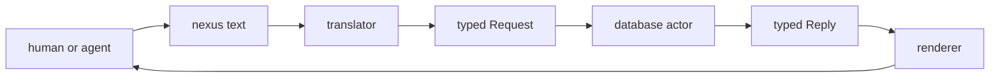

The key implementation point is that the database protocol and actor protocol
become the same thing. A database is a stateful actor. Its messages are typed
requests. Its replies are typed extensions, diagnostics, or subscription
events.

That means the immediate task is not "add syntax." It is to make the Rust
contract model support:

- universal verbs;
- domain-specific record kinds;
- exact text-to-type translation;
- rkyv frames for every Rust-to-Rust boundary;
- no stringly command dispatch.

---

## 2 · Current Code Shape

Current `signal` is already close in spirit but narrow in scope:

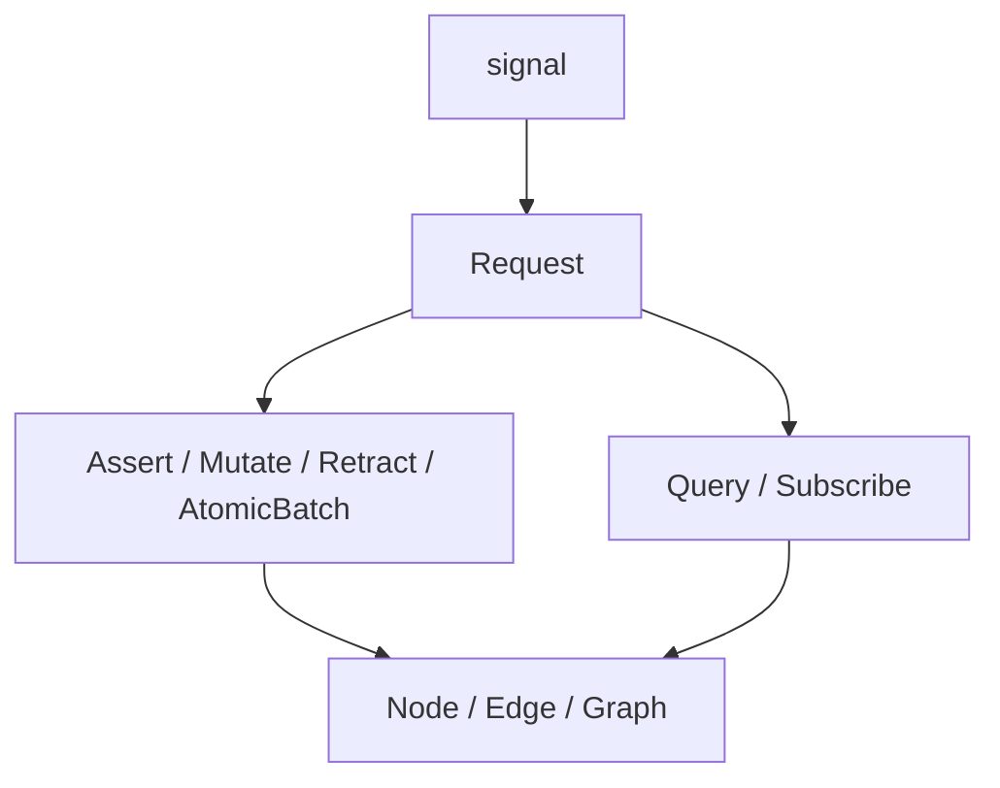

The current concrete state:

| Area | Current implementation | Pressure from report 25 |
|---|---|---|
| `signal::Request` | `Handshake`, `Assert`, `Mutate`, `Retract`, `AtomicBatch`, `Query`, `Subscribe`, `Validate` | Needs universal verb vocabulary and likely `Query` → `Match` naming |
| `signal::QueryOperation` | closed enum of `NodeQuery`, `EdgeQuery`, `GraphQuery` | Needs `Match`, `Project`, `Aggregate`, `Constrain`, `Recurse`, `Infer` shapes |
| `signal` record kinds | sema flow graph: `Node`, `Edge`, `Graph` | Needs either domain layering or a generated domain vocabulary |
| `nexus::Parser` | parses text directly to `signal::Request` | Needs parser over a domain's typed vocabulary, not only sema |
| `nexus::Renderer` | renders `signal::Reply` | Needs renderer over the same domain vocabulary |
| Persona | has `signal-persona` scaffold | Should stop inventing Persona request verbs and become a domain record vocabulary |

The good news: the current code already proves the core pattern works. The bad
news: `signal` is not yet factored as a reusable universal protocol kernel. It
is both the universal envelope and the sema record vocabulary.

---

## 3 · The Main Refactor

The core implementation seam is this:

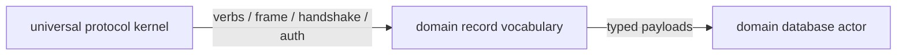

Right now, `signal` owns both boxes. For universal messaging, it needs to split
conceptually even if the code stays in one repo at first.

The target shape:

| Layer | Owns |
|---|---|
| `signal` kernel | `Frame`, handshake, auth, protocol version, generic request/reply envelope, universal verb names |
| domain contract | record kinds, query kinds, per-verb operation enums, records reply enum |
| database actor | validation, redb storage, subscription fanout, inference/reduction implementation |
| nexus translator | text parser/renderer for a domain's contract |

The design question is whether `signal` becomes generic in Rust terms or
whether it remains a sema contract while a new `signal-core`/`signal-kernel`
crate appears.

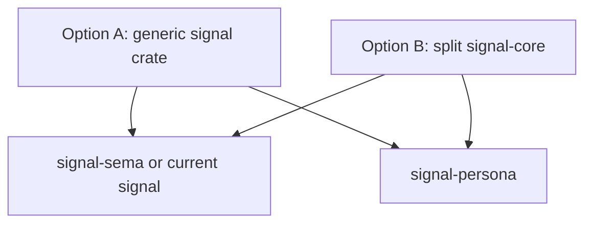

My implementation preference is Option B if the current `signal` API is already
used by Criome: create or extract a kernel layer, then let sema and Persona
depend on it. Option A is elegant but can make rkyv bounds and derive ergonomics
noisy across every type.

---

## 4 · Do Not Implement Generic Records First

Report 25 includes pseudocode with `KindName` and `TypedFields`. That is useful
as explanatory compression, but it should not become the first Rust
implementation.

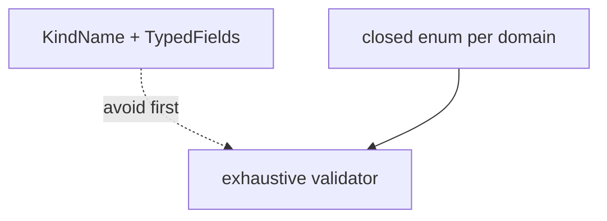

The current `signal` discipline is still right: each domain gets closed enums:

| Universal verb | Domain-specific payload shape |
|---|---|
| `Assert` | `SemaAssert::Node(Node)` or `PersonaAssert::Message(Message)` |
| `Mutate` | `SemaMutate::Node { slot, new, expected_rev }` |
| `Match` | `SemaMatch::Node(NodeQuery)` |
| `Records` | `SemaRecords::Node(Vec<(Slot<Node>, Node)>)` |

The universal layer names the verb. The domain layer names the record kinds.
This preserves perfect specificity and gives Rust exhaustive matches. A generic
`KindName` representation can exist later as schema-as-data or introspection,
but it should not be the primary execution wire before `prism`/schema tooling
can prove it is typed enough.

---

## 5 · Twelve Verbs As An Implementation Ladder

Report 25's 12 verbs should not all land as one large patch. They form an
ordered implementation ladder:

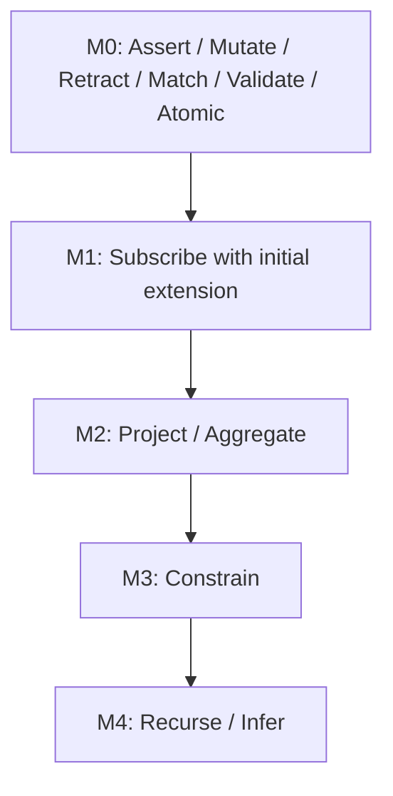

| Milestone | Why here |
|---|---|
| M0 | Current code mostly has it; rename/reshape `Query` as `Match` after design settles |
| M1 | Push-not-pull requires subscription correctness early; default initial snapshot must be resolved |
| M2 | Projection and aggregation are common enough to shape storage APIs |
| M3 | Constrain introduces multi-pattern joins and binding scopes |
| M4 | Recurse and Infer require rule engines and termination policy |

Do not wire `Infer` or `Recurse` before the database actor has a clean typed
storage/query core. They are engine features, not parser features.

---

## 6 · Immediate Contradictions To Resolve

There are concrete mismatches between current code/docs and report 25:

| Issue | Current state | Needed decision |
|---|---|---|
| `Query` vs `Match` | `signal::Request::Query(QueryOperation)` and Nexus spec uses Query | Report 25 names `Match`; decide whether to rename or keep `Query` as user-facing term |
| Subscribe initial state | Current `signal` docs say no initial snapshot; report 25 says `ImmediateExtension` should default | Decide now; Persona needs initial extension to avoid poll-like reconciliation |
| Curly syntax | older Nexus spec has `{ }` and `{\| \|}`; report 25 says Project/Constrain are records | Update spec before implementation to avoid two surfaces |
| Current `signal` scope | sema-specific and universal mixed | Extract kernel or accept a breaking refactor |
| Layered crates | `signal-forge` is skeleton design, not proof of code mechanics | Confirm how a layered domain reuses frame/handshake/auth in real Rust/rkyv |

My recommendation:

- Use `Match` in the universal model, but allow a short compatibility window if
  current code/tests are easier to update incrementally.
- Make `Subscribe` carry `InitialMode`, with `ImmediateExtension` as the
  default policy for new code.
- Remove syntax-level Project/Constrain from the live spec once record-shaped
  verbs are accepted.
- Do the kernel/domain split before Persona implements more messaging code.

---

## 7 · Persona Translation

Persona becomes a domain vocabulary and effect system on the universal message
format.

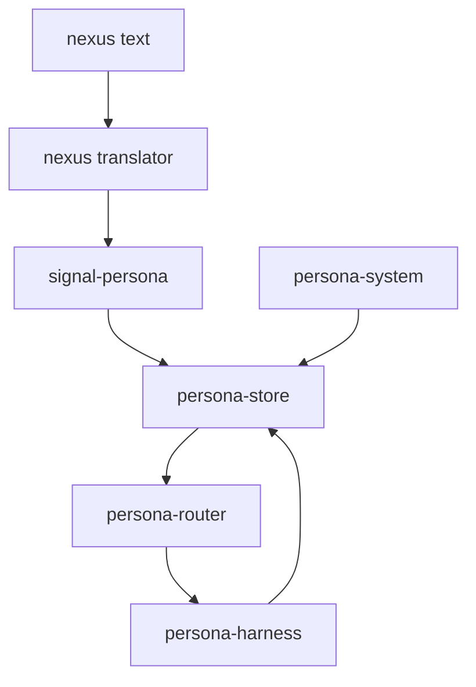

`signal-persona` should define records, not a custom protocol:

| Record | Implementation role |
|---|---|
| `Message` | asserted by human/agent clients |
| `Delivery` | router state machine record |
| `Binding` | harness target to endpoint |
| `FocusObservation` | asserted by system backend |
| `InputBufferObservation` | asserted by harness recognizer |
| `WindowClosed` | asserted by system backend |
| `Deadline` / `DeadlineExpired` | deadline actor state and event |

Then Persona behavior is subscription-driven:

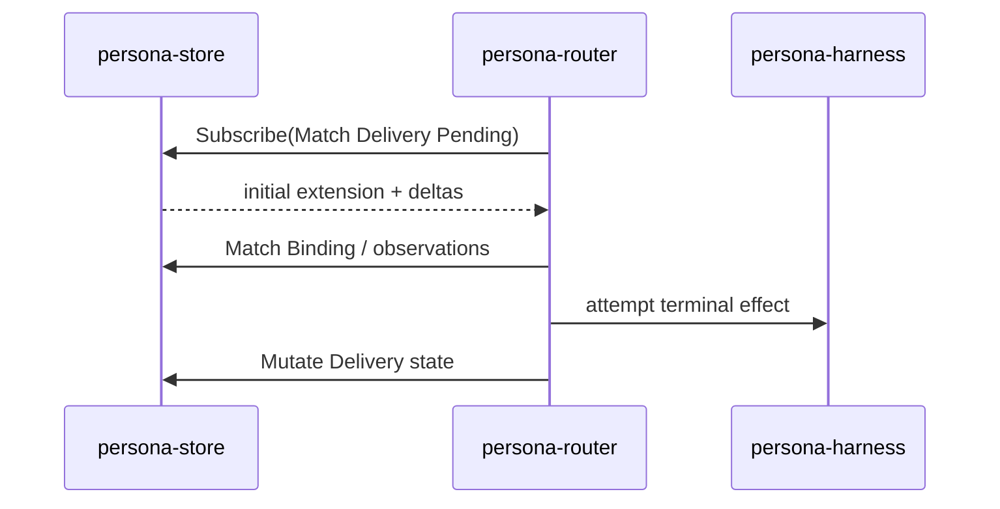

The message CLI becomes a thin Nexus client, not its own language.

---

## 8 · Nexus Implementation Shape

Nexus should become less sema-specific in the library boundary:

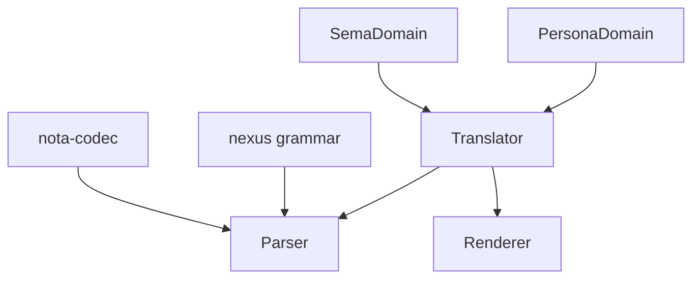

The exact Rust shape needs care, but the ownership is clear:

| Type | Owns |
|---|---|
| `Parser` | token stream and top-level verb dispatch |
| `Domain` trait or generated module | map record heads to typed domain payloads |
| `Renderer` | canonical text for typed replies/events |
| daemon `Connection` actor | per-connection version/subscription state |

The parser should not become a registry of runtime strings. The domain map
should be generated or statically dispatched so adding a record kind updates:

1. the domain contract enum;
2. the parser arm for that record head;
3. the renderer arm for that record/reply shape;
4. round-trip tests.

---

## 9 · Store Implementation Shape

Each database actor follows the same skeleton:

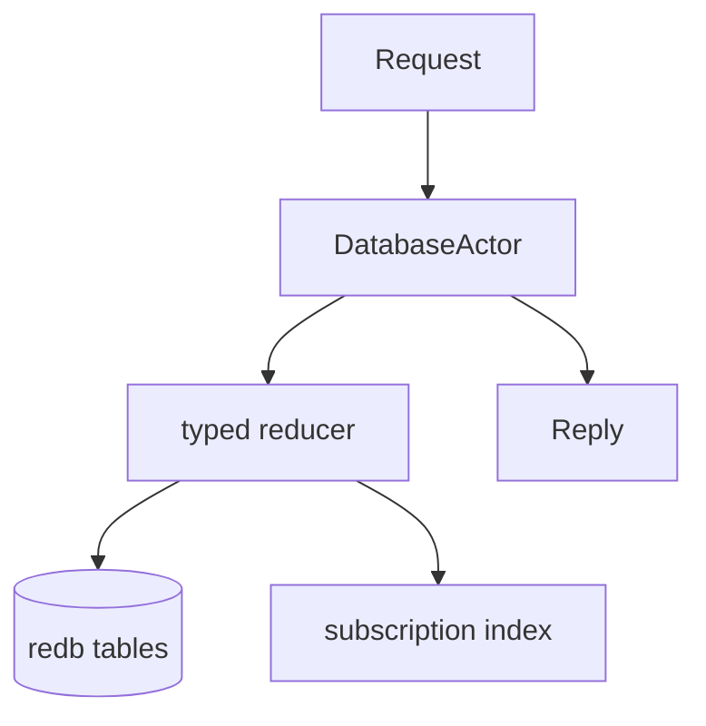

For the first implementation, keep the engine deliberately small:

| Capability | First implementation |
|---|---|
| storage | one redb table per record kind, rkyv archives |
| identity | typed `Slot<Record>` and `Revision` |
| match | table scan plus typed field matching |
| subscribe | connection-local subscription list, immediate extension, pushed deltas |
| validate | run reducer without commit |
| atomic | one redb write transaction, ordered outcomes |
| project / aggregate | defer until match core is correct |

Indexes can wait. Correct typed semantics matter first.

---

## 10 · Concrete Next Steps

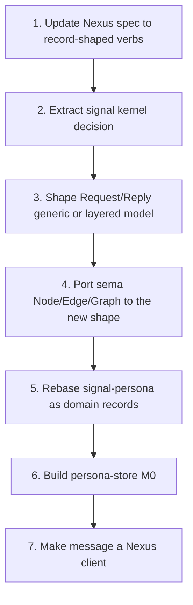

Implementation order I would use now:

| Step | Repository | Output |
|---|---|---|
| 1 | `nexus` | spec report/update that commits to record-shaped Project/Aggregate/Constrain and `Subscribe` initial mode |
| 2 | `signal` | design/code spike for a reusable frame/request kernel without sema records |
| 3 | `signal` + `nexus` | rename or alias `Query`/`Match` consistently |
| 4 | `signal` | add `SubscribeQuery { pattern, initial, buffering }` or equivalent |
| 5 | `signal-persona` | replace invented request protocol with record kinds and per-verb payload enums |
| 6 | `persona-store` | M0 actor: assert/match/subscribe on `Message` and `Delivery` |
| 7 | `persona-message` | CLI sends Nexus text to the translator/store path |

This keeps Persona from building on a soon-obsolete message language while
still giving it a concrete path.

---

## 11 · Decisions Needed

The implementation can move once these are settled:

| Decision | Operator recommendation |
|---|---|
| Is `Match` the new verb name, replacing `Query`? | Yes, if report 25's vocabulary is accepted; it is more precise. |
| Does `Subscribe` always send initial extension? | Yes by default, with an explicit `DeltasOnly` mode only when requested. |
| Is `signal` the universal kernel repo or does it split? | Split conceptually now; extract a crate if code pressure gets ugly. |
| Are domain records closed enums or generic `KindName` records? | Closed enums now; schema-as-data later. |
| Does Persona wait for the universal refactor? | It should pause custom protocol work and implement only record vocabulary that fits the new kernel. |

---

## 12 · Bottom Line

Report 25 is implementable, but not as a parser expansion. The correct first
move is a contract refactor:

- preserve the current perfect-specificity pattern;
- make universal verbs independent from sema-specific records;
- let each domain provide closed record vocabularies;
- make Nexus the text projection for those typed vocabularies;
- make database actors receive the same typed messages they persist and
  publish.

For Persona, this means `signal-persona` becomes a record-kind crate and
`persona-store` becomes the first Persona database actor. The old bespoke
`message` protocol should not advance.

