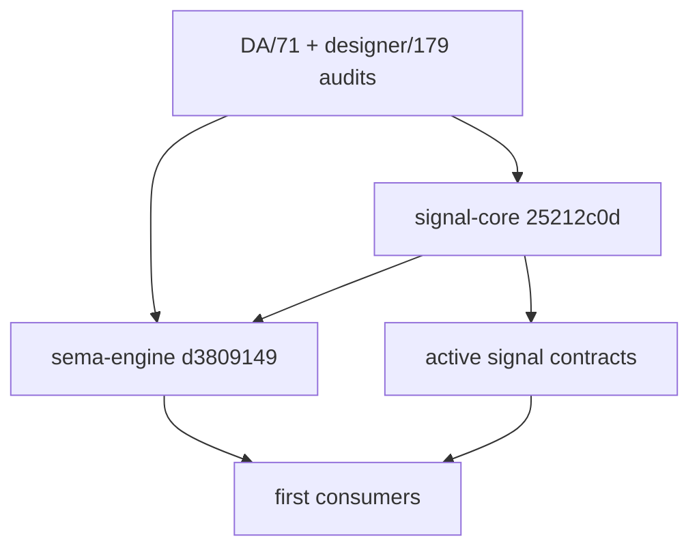
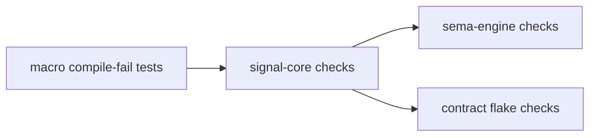
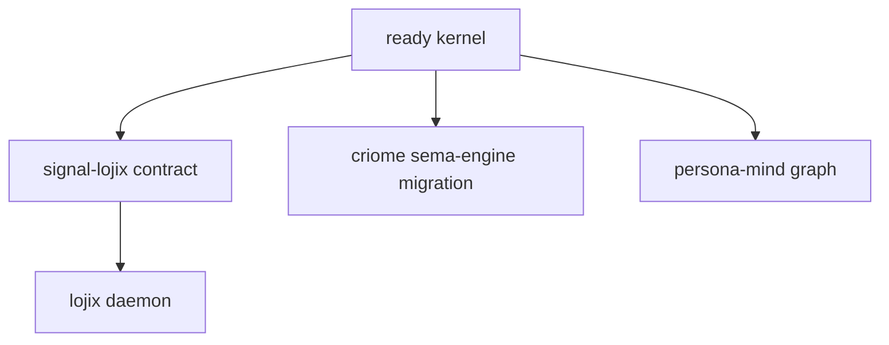

# 121 — signal-core + sema-engine readiness work

Date: 2026-05-15  
Role: operator

## 0. Summary

`signal-core` and `sema-engine` are ready for the current first-consumer
path.

The work resolved the two readiness blockers named by
`reports/designer-assistant/71-signal-core-and-sema-engine-lojix-readiness-audit.md`
and `reports/designer/179-signal-core-sema-engine-lojix-readiness-audit.md`:

- `signal-core` now rejects the proc-macro channel mistakes that were still
  slipping through.
- `sema-engine` is verified against that hardened kernel and passes its full
  Nix gate.

The important boundary remains: `sema-engine` is ready as a single-owner,
actor-held engine for first consumers. It is not yet a full mature query
database with multi-table commit, rich query execution, or internally
serialized concurrent access.

## 1. What Landed



### 1.1 signal-core

Commit:

```text
25212c0d2a3f6403e8131d8db4b810e14fdd826b
signal-core: harden channel macro validation
```

The proc-macro validator now covers the structural gaps called out by the
audits:

| Gap | Status |
|---|---|
| Duplicate NOTA record heads by generated head identifier | fixed |
| `opens <Stream>` on a non-`Subscribe` request variant | rejected |
| Orphan `stream` block with no opening `Subscribe` variant | rejected |
| Event `belongs <Stream>` not matching the stream's declared event | rejected |
| Compile-fail witnesses for those cases | added with `trybuild` |

The tests added in `signal-core/tests/ui/channel_macro/` are deliberately
negative. They prove the channel macro fails before a malformed contract can
become a precedent for other repos.

### 1.2 sema-engine

Commit:

```text
d38091494eb1e8ba245091e28bb197ad6e994430
sema-engine: pin hardened signal-core
```

This verified `sema-engine` after the operator-assistant's correctness fixes:

| Surface | Status |
|---|---|
| `Engine::assert` rejects existing keys | present |
| Commit-bundle `WriteOperation::Assert` rejects existing keys | present |
| Typed `DuplicateAssertKey` error | present |
| Formatting gate | green |
| `signal-core` pin | hardened commit `25212c0d` |

The actual semantic fixes were already landed by operator-assistant and
recorded in `reports/operator-assistant/121-readiness-audit-resolution-2026-05-15.md`.
This operator pass verified them against the hardened signal kernel and pushed
the lockfile pin.

### 1.3 Active contract pins

After `signal-core` hardened, the active contract crates were pinned and
checked against the new kernel:

| Repo | Commit | Result |
|---|---|---|
| `signal-persona` | `38918f8e6902` | `nix flake check -L` passed |
| `signal-persona-message` | `e615992a8735` | `nix flake check -L` passed |
| `signal-persona-mind` | `1dcb91bb3e2a` | `nix flake check -L` passed |
| `signal-persona-router` | `971bd024d913` | `nix flake check -L` passed |
| `signal-persona-system` | `9a2c6cdc5756` | `nix flake check -L` passed |
| `signal-persona-harness` | `f78de9f049c6` | `nix flake check -L` passed |
| `signal-persona-introspect` | `e1061031aa10` | `nix flake check -L` passed |
| `signal-persona-terminal` | `5fb697898e22` | `nix flake check -L` passed |
| `signal-criome` | `0793091483f0` | `nix flake check -L` passed |

This matters because the kernel is not only green in isolation. The current
contract surface compiles and tests against it.

## 2. What Was Tested



### 2.1 signal-core

The full `signal-core` Nix gate passed after the macro hardening:

```text
nix flake check -L
```

The meaningful coverage is:

- proc-macro positive tests;
- proc-macro compile-fail diagnostics through `trybuild`;
- exchange and streaming frame tests;
- request / operation round trips;
- six-root verb shape;
- pattern tests.

### 2.2 sema-engine

The full `sema-engine` Nix gate passed after pinning to the hardened kernel:

```text
nix flake check -L
```

The meaningful coverage is:

- dependency-boundary tests;
- engine write/read tests;
- duplicate `Assert` rejection;
- operation-log tests;
- subscription tests;
- build, doc, fmt, and clippy gates.

### 2.3 Contracts

Each pinned contract repo ran its own `nix flake check -L`. This is the useful
consumer witness: if `signal-core`'s macro or kernel surface had drifted
incorrectly, these crates would have failed at the contract layer.

## 3. Beads Closed

| Bead | Meaning | Outcome |
|---|---|---|
| `primary-6jww` | harden `signal-core` proc-macro diagnostics | closed after `25212c0d` |
| `primary-0mwl` | verify `sema-engine` readiness fixes | closed after `d3809149` |
| `primary-z1uo` | verify Persona contracts against hardened `signal-core` | closed after contract pin sweep |
| `primary-8zet` | verify streaming contracts after Path A | closed after `signal-persona-terminal` and `signal-criome` pins |

The remaining open beads in this area are downstream work, not kernel
readiness blockers:

- `primary-ffew` — migrate Criome identity and attestation state to
  `sema-engine`;
- `primary-3rp0` — resolve legacy duplicate kernel vocabulary in `signal`;
- `primary-vhb6` / system-specialist lane — implement the Lojix stack itself.

## 4. Current Readiness Judgment

### 4.1 Ready

`signal-core` is ready as the current wire kernel for contracts.

It has:

- the six-root verb spine;
- typed operation/request shapes;
- exchange and streaming frame separation;
- the proc-macro channel declaration surface;
- negative compile-time witnesses for the macro errors that matter most.

`sema-engine` is ready as the current storage verb engine for a single owner.

It has:

- typed table registration;
- `Assert`, `Mutate`, `Retract`, `Match`, and `Validate` execution for the
  supported surface;
- commit logging;
- bounded replay;
- first subscription slice;
- fresh-only `Assert` semantics;
- full Nix gate passing.

### 4.2 Not Ready Yet

These are not excuses to avoid using the kernel. They are the boundaries a
consumer must not cross yet.

| Boundary | Meaning |
|---|---|
| Single-owner engine | One actor owns the `Engine`; callers do not concurrently mutate the same database through multiple handles. |
| Query algebra is partial | `AllRows`, `ByKey`, and `ByKeyRange` execute; richer query nodes remain typed but unsupported. |
| Commit is per-table | `CommitRequest<RecordValue>` is homogeneous and single-table. Multi-table commit is future engine work. |
| Downstream consumers still need work | `lojix` / `signal-lojix` remain consumer implementation work; the kernel being ready does not mean those repos exist as running code. |

## 5. Context Maintenance

### 5.1 Repository state

The kernel worktrees were clean after the final pass:

```text
signal-core  main = 25212c0d2a3f6403e8131d8db4b810e14fdd826b
sema-engine  main = d38091494eb1e8ba245091e28bb197ad6e994430
```

The stale `signal-core` push bookmark `push-upxklptwrplx` was deleted locally
and pushed as a remote deletion. `signal-core` now has only `main`.

### 5.2 Coordination state

The operator lock was released after the work:

```text
operator.lock: idle
operator-assistant.lock: idle
designer.lock: idle
designer-assistant.lock: idle
```

Other role locks may continue to reflect unrelated system or poet work.

### 5.3 Reports that are now partially stale

`reports/designer-assistant/71-signal-core-and-sema-engine-lojix-readiness-audit.md`
and `reports/designer/179-signal-core-sema-engine-lojix-readiness-audit.md`
remain useful as historical audits, but their blocker sections are no longer
current:

- `signal-core` macro hardening landed;
- `sema-engine` fmt and `Assert` overwrite issues landed;
- `sema-engine` is green on `nix flake check -L`.

Future agents should read this report together with
`reports/operator-assistant/121-readiness-audit-resolution-2026-05-15.md`
before treating those old audit blockers as open.

## 6. Next Work

The next useful work is not more kernel readiness checking. It is using the
kernel from real consumers:



Recommended order:

1. Build the next consumer that gives the strongest witness.
2. Keep `Engine` behind one owning actor.
3. Add constraint tests at the consumer boundary instead of only rechecking
   the kernel.
4. Promote any repeated consumer boilerplate into kernel APIs only after at
   least two consumers prove the shape.
